# pay-system 流程图（状态机、泳道图、控制流图）

> 版本：v2.5　最后修改：2026-10-20　状态：与需求 v3.0 一致（R15、R16 已按建议写入需求），2026-10-13 随需求确认为基线。2026-10-15 按 ACC-03 口径改正 CF-13。2026-10-19 按 ACC-04 口径改正 CF-14。2026-10-20 按 ACC-05 口径改正 CF-15。2026-10-20 按 ACC-06 口径改正 CF-16
> 依据：`docs/02-requirements.md` v3.0、`docs/03-conventions.md` v2.0、`docs/01-tech-decisions.md` D17–D21；`docs/05-api.md`、`docs/database.md` 尚未同步 v3.0，冲突处以需求文档为准
> 用途：以图的形式确认全部功能性设计。图是需求的视图，规则冲突时以需求文档为准；需求变更后同步修改对应的图。

## 0. 阅读说明

### 0.1 图的种类与编号

| 编号 | 图类型 | Mermaid 语法 | 回答的问题 |
|---|---|---|---|
| `SM-nn` | 状态机 | `stateDiagram-v2` | 一个对象有哪些状态，谁在什么条件下推进 |
| `SL-nn` | 泳道图 | `sequenceDiagram`，每个参与者一条泳道，步骤自动编号 | 一个业务场景跨了哪些进程，先后顺序和同步/异步边界 |
| `CF-nn` | 控制流图 | `flowchart` | 一个函数或任务内部的分支、事务边界、错误出口 |
| `Rn` | 绘图中发现的问题 | — | 需求中原本未定义或有歧义的点，见 §5 |

讨论时可以直接引用编号，例如“SL-05 第 12 步”“CF-10 的 40004 分支”。编号不复用：被砍掉的图保留编号和一行 `CUT` 说明。

### 0.2 控制流图图例

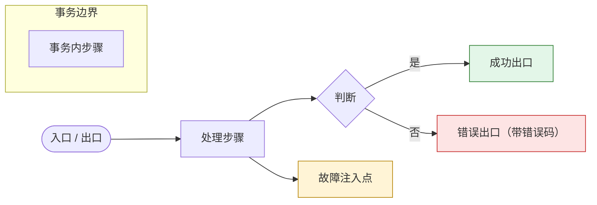
```mermaid
flowchart LR
    A(["入口 / 出口"]) --> B["处理步骤"]
    B --> C{"判断"}
    C -->|"是"| D["成功出口"]:::ok
    C -->|"否"| E["错误出口（带错误码）"]:::err
    B --> F["故障注入点"]:::fault
    subgraph TX["事务边界"]
        H["事务内步骤"]
    end
    classDef ok fill:#e3f6e8,stroke:#2e7d32
    classDef err fill:#fde4e4,stroke:#c62828
    classDef fault fill:#fff4d6,stroke:#b8860b
```

- 泳道图中 `Note` 内的“事务：……”表示一个数据库事务内完成的步骤；“故障点 xxx”为 QA-01 的故障注入点。
- “分片 s”指商户所属账户分片（`shard.Of(merchant_id)`，ACC-13）；“子账户 k”指 `crc32(biz_no) % PLATFORM_SUB_ACCOUNTS` 选中的平台子账户（OPT-03）。

### 0.3 渲染

GitHub、GitLab、IDEA/GoLand（Markdown 插件）、VS Code（Markdown Preview Mermaid Support）可直接渲染。本文全部图已用 `@mermaid-js/mermaid-cli` 12.0.0 渲染校验。

## 1. 覆盖矩阵

业务功能点与图的对应关系。BASE（公共包）、OPS-02、OPS-03、OPS-05、OPT-01（分阶段埋点）、TL、QA-02~04、DOC 属于工程与交付类功能点，没有业务流程，不画图；QA-01 的故障点标注在各图中，§4.10 汇总。删除线为 v3.0 砍掉的功能点。

| 功能点 | 状态机 | 泳道图 | 控制流图 |
|---|---|---|---|
| ACC-13 账户分片路由 | — | SL-01、SL-12、SL-15 | CF-14、CF-19、CF-37 |
| ACC-01 开户、ACC-02 查询 | — | SL-10（开户只由 seed 调用） | — |
| ACC-03 记账、ACC-08 冲正（P1） | — | SL-01、SL-11 | CF-13 |
| ACC-04 冻结（REFUND / TRANSFER） | SM-04 | SL-05、SL-06、SL-12、SL-13 | CF-14 |
| ACC-05 解冻（空回滚、防悬挂） | SM-04 | SL-06、SL-13、SL-14 | CF-15 |
| ACC-06 确认扣款 | SM-04 | SL-05、SL-12、SL-14 | CF-16 |
| ACC-07 同分片转账（含失败墓碑） | SM-11 | SL-11 | CF-32 |
| ACC-14 收款方转账分支 | SM-11 | SL-12、SL-13、SL-14 | CF-33 |
| ~~ACC-09 流水查询~~（CUT） | — | — | — |
| ACC-10 余额核对（分片与在途守恒） | — | SL-10 | CF-17 |
| ACC-11 RPC 服务 | — | 各泳道中的 account 调用 | — |
| ~~ACC-12 热点账户~~（CUT，拆为 OPT-03、OPT-05） | — | — | — |
| CH-01 受理与自动完成、CH-04 退款受理 | SM-09 | SL-01、SL-05 | CF-22 |
| CH-02 查单 | — | SL-02 | CF-07 |
| CH-03 关单 | SM-09 | SL-04 | CF-23 |
| CH-05 回调、CH-06 故障场景、CH-07 全局配置 | — | SL-01、SL-02、SL-03 | CF-24 |
| CH-08 账单下载、CH-09 账单注入 | — | SL-09 | CF-25 |
| PAY-01 商户与密钥 | — | SL-01 | CF-01 |
| PAY-02 创建支付单 | SM-01 | SL-01 | CF-04 |
| PAY-03 发起支付 | SM-01、SM-03 | SL-01、SL-03 | CF-05 |
| PAY-04 支付结果推进 | SM-01、SM-03 | SL-01 | CF-06 |
| PAY-05 查单补偿 | SM-03 | SL-02 | CF-07 |
| PAY-06 商户关单、PAY-07 超时关单 | SM-01 | SL-04 | CF-08 |
| PAY-08 查询 | — | — | CF-01（网关管线后直接读库） |
| PAY-09 立即同步渠道状态 | — | SL-09 | CF-09 |
| REF-01 创建退款、REF-02 冻结与提交 | SM-02 | SL-05、SL-06 | CF-10 |
| REF-03 退款结果推进 | SM-02 | SL-05、SL-06 | CF-11 |
| REF-04 卡单恢复 | SM-02 | SL-06 | CF-12 |
| REF-05 查询 | — | — | CF-01 |
| TRF-01 创建转账单 | SM-10 | SL-11、SL-12 | CF-34 |
| TRF-02 同分片转账执行 | SM-10 | SL-11 | CF-34 |
| TRF-03 跨分片 TCC 协调 | SM-10 | SL-12、SL-13 | CF-35 |
| TRF-04 转账恢复任务 | SM-10 | SL-14 | CF-36 |
| TRF-05 转账查询 | — | — | CF-01（只有付款商户可查，其余 30001） |
| MQ-01 outbox 写入、MQ-02 投递 | SM-05 | SL-07 | CF-18 |
| MQ-03 消费框架、MQ-04 account 消费（逐条） | — | SL-07 | CF-19 |
| MQ-05 死信与重放、MQ-06 清理 | SM-05 | SL-07、SL-10 | CF-20 |
| NTF-01 生成、NTF-02 发送与固定间隔重试 | SM-06 | SL-08、SL-11、SL-12 | CF-21 |
| GW-01 骨架、GW-02 路由、GW-03 验签、GW-04 防重放、GW-05 进程内限流、GW-08 密钥缓存 | — | SL-01 | CF-01 |
| GW-06 渠道回调入口 | — | SL-01 | CF-02 |
| GW-07 管理接口（重放、核对、触发对账） | — | SL-10 | CF-03 |
| REC-01 批次调度、REC-02 账单导入 | SM-07 | SL-09 | CF-26 |
| REC-03 外部比对 | SM-08 | SL-09 | CF-27 |
| ~~REC-04 跨日处理~~（CUT） | — | — | — |
| REC-05 内部对账（支付、退款、转账） | SM-08 | SL-09 | CF-28 |
| REC-06 自动处理 | SM-08 | SL-09 | CF-29 |
| ~~REC-07 人工处理与挂账~~（CUT，CF-30 只保留编号） | — | — | — |
| REC-08 报告 | — | SL-09、SL-10 | CF-26 |
| OPS-01 健康检查与优雅退出 | — | — | CF-31 |
| ~~OPS-04 监控面板与告警规则~~（CUT） | — | — | — |
| OPT-02 批量记账合并提交 | — | SL-15 | CF-37 |
| OPT-03 平台子账户拆分 | — | SL-01、SL-15 | CF-16、CF-19、CF-37 |
| OPT-04 链路延迟优化 | — | SL-12（并行分支） | CF-35（`TRANSFER_PARALLEL_BRANCH`）、CF-01（GW-08 缓存） |
| OPT-05 平台账户缓冲入账（P2） | — | — | 方案未定，不画 |

## 2. 状态机

### SM-01 支付单 `payment_order`

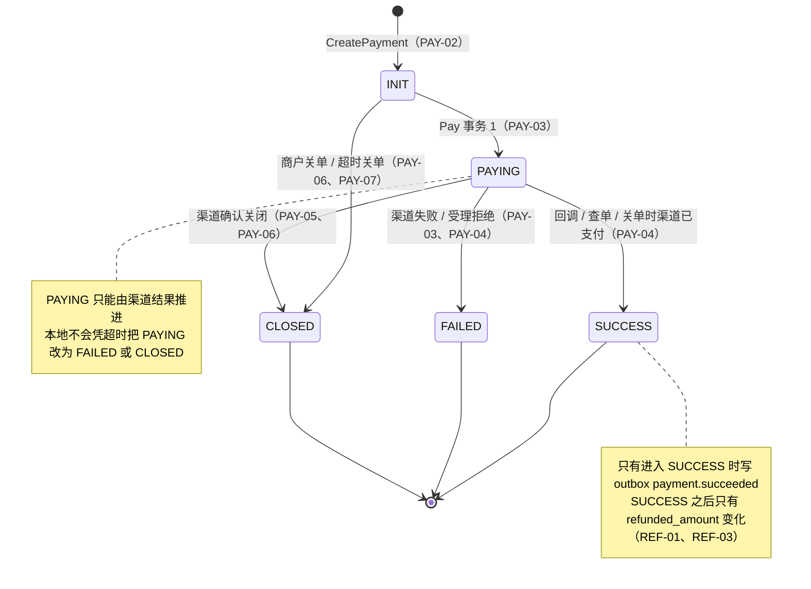
```mermaid
stateDiagram-v2
    [*] --> INIT: CreatePayment（PAY-02）
    INIT --> PAYING: Pay 事务 1（PAY-03）
    INIT --> CLOSED: 商户关单 / 超时关单（PAY-06、PAY-07）
    PAYING --> SUCCESS: 回调 / 查单 / 关单时渠道已支付（PAY-04）
    PAYING --> FAILED: 渠道失败 / 受理拒绝（PAY-03、PAY-04）
    PAYING --> CLOSED: 渠道确认关闭（PAY-05、PAY-06）
    SUCCESS --> [*]
    FAILED --> [*]
    CLOSED --> [*]
    note right of SUCCESS
        只有进入 SUCCESS 时写 outbox payment.succeeded
        SUCCESS 之后只有 refunded_amount 变化（REF-01、REF-03）
    end note
    note right of PAYING
        PAYING 只能由渠道结果推进
        本地不会凭超时把 PAYING 改为 FAILED 或 CLOSED
    end note
```

### SM-02 退款单 `refund_order`

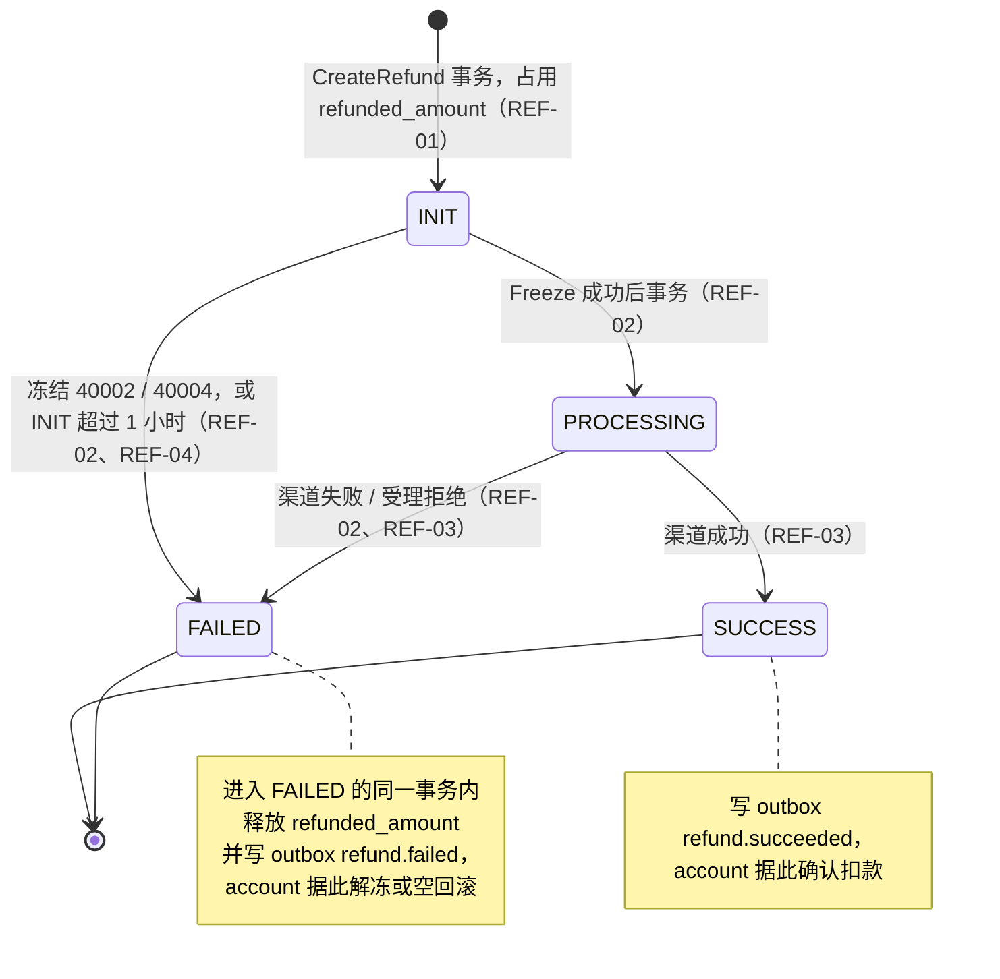
```mermaid
stateDiagram-v2
    [*] --> INIT: CreateRefund 事务，占用 refunded_amount（REF-01）
    INIT --> PROCESSING: Freeze 成功后事务（REF-02）
    INIT --> FAILED: 冻结 40002 / 40004，或 INIT 超过 1 小时（REF-02、REF-04）
    PROCESSING --> SUCCESS: 渠道成功（REF-03）
    PROCESSING --> FAILED: 渠道失败 / 受理拒绝（REF-02、REF-03）
    SUCCESS --> [*]
    FAILED --> [*]
    note right of FAILED
        进入 FAILED 的同一事务内释放 refunded_amount
        并写 outbox refund.failed，account 据此解冻或空回滚
    end note
    note right of SUCCESS
        写 outbox refund.succeeded，account 据此确认扣款
    end note
```

### SM-03 渠道交易 `channel_txn`

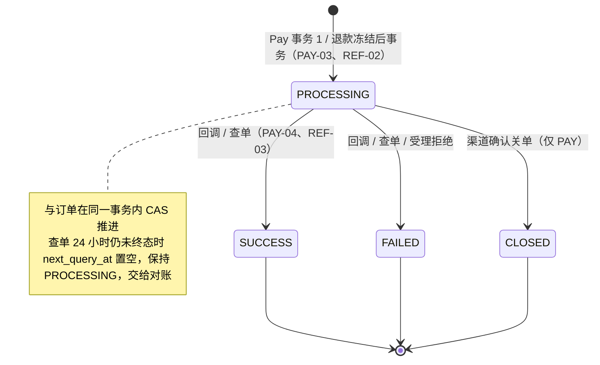
```mermaid
stateDiagram-v2
    [*] --> PROCESSING: Pay 事务 1 / 退款冻结后事务（PAY-03、REF-02）
    PROCESSING --> SUCCESS: 回调 / 查单（PAY-04、REF-03）
    PROCESSING --> FAILED: 回调 / 查单 / 受理拒绝
    PROCESSING --> CLOSED: 渠道确认关单（仅 PAY）
    SUCCESS --> [*]
    FAILED --> [*]
    CLOSED --> [*]
    note right of PROCESSING
        与订单在同一事务内 CAS 推进
        查单 24 小时仍未终态时 next_query_at 置空，保持 PROCESSING，交给对账
    end note
```

### SM-04 冻结单 `account_freeze`

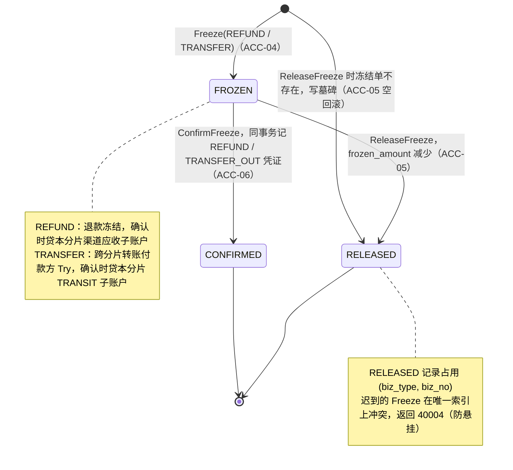
```mermaid
stateDiagram-v2
    [*] --> FROZEN: Freeze(REFUND / TRANSFER)（ACC-04）
    [*] --> RELEASED: ReleaseFreeze 时冻结单不存在，写墓碑（ACC-05 空回滚）
    FROZEN --> CONFIRMED: ConfirmFreeze，同事务记 REFUND / TRANSFER_OUT 凭证（ACC-06）
    FROZEN --> RELEASED: ReleaseFreeze，frozen_amount 减少（ACC-05）
    CONFIRMED --> [*]
    RELEASED --> [*]
    note right of FROZEN
        REFUND：退款冻结，确认时贷本分片渠道应收子账户
        TRANSFER：跨分片转账付款方 Try，确认时贷本分片 TRANSIT 子账户
    end note
    note right of RELEASED
        RELEASED 记录占用 (biz_type, biz_no)
        迟到的 Freeze 在唯一索引上冲突，返回 40004（防悬挂）
    end note
```

### SM-05 本地消息 `outbox`

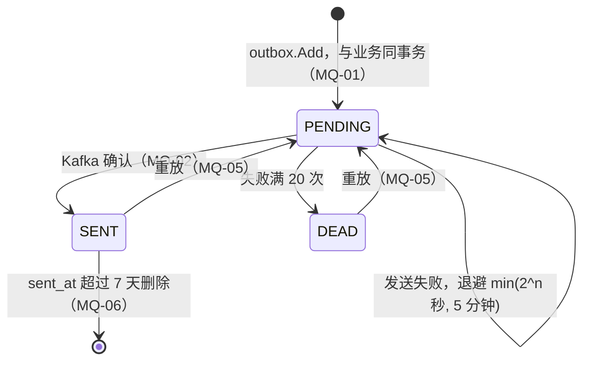
```mermaid
stateDiagram-v2
    [*] --> PENDING: outbox.Add，与业务同事务（MQ-01）
    PENDING --> SENT: Kafka 确认（MQ-02）
    PENDING --> PENDING: 发送失败，退避 min(2^n 秒, 5 分钟)
    PENDING --> DEAD: 失败满 20 次
    SENT --> PENDING: 重放（MQ-05）
    DEAD --> PENDING: 重放（MQ-05）
    SENT --> [*]: sent_at 超过 7 天删除（MQ-06）
```

### SM-06 商户通知 `merchant_notify`

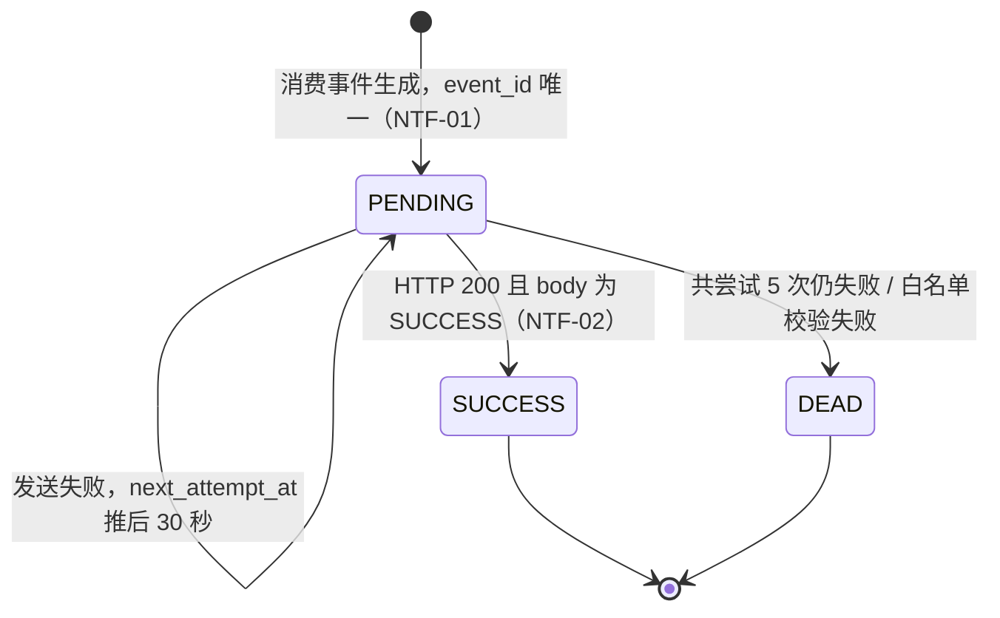
```mermaid
stateDiagram-v2
    [*] --> PENDING: 消费事件生成，event_id 唯一（NTF-01）
    PENDING --> PENDING: 发送失败，next_attempt_at 推后 30 秒
    PENDING --> SUCCESS: HTTP 200 且 body 为 SUCCESS（NTF-02）
    PENDING --> DEAD: 共尝试 5 次仍失败 / 白名单校验失败
    SUCCESS --> [*]
    DEAD --> [*]
```

### SM-07 对账批次 `recon_batch`

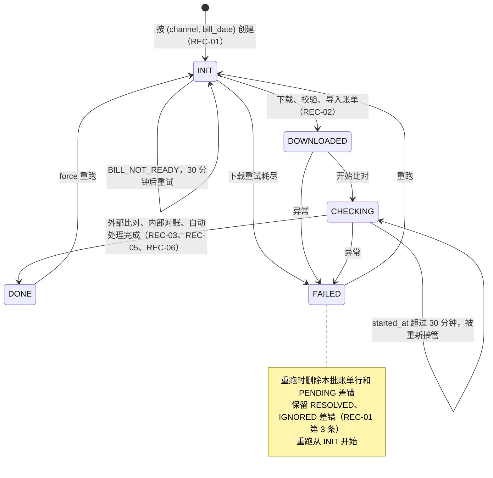
```mermaid
stateDiagram-v2
    [*] --> INIT: 按 (channel, bill_date) 创建（REC-01）
    INIT --> INIT: BILL_NOT_READY，30 分钟后重试
    INIT --> DOWNLOADED: 下载、校验、导入账单（REC-02）
    DOWNLOADED --> CHECKING: 开始比对
    CHECKING --> DONE: 外部比对、内部对账、自动处理完成（REC-03、REC-05、REC-06）
    INIT --> FAILED: 下载重试耗尽
    DOWNLOADED --> FAILED: 异常
    CHECKING --> FAILED: 异常
    CHECKING --> CHECKING: started_at 超过 30 分钟，被重新接管
    FAILED --> INIT: 重跑
    DONE --> INIT: force 重跑
    note right of FAILED
        重跑时删除本批账单行和 PENDING 差错
        保留 RESOLVED、IGNORED 差错（REC-01 第 3 条）
        重跑从 INIT 开始
    end note
```

### SM-08 对账差错 `recon_diff`

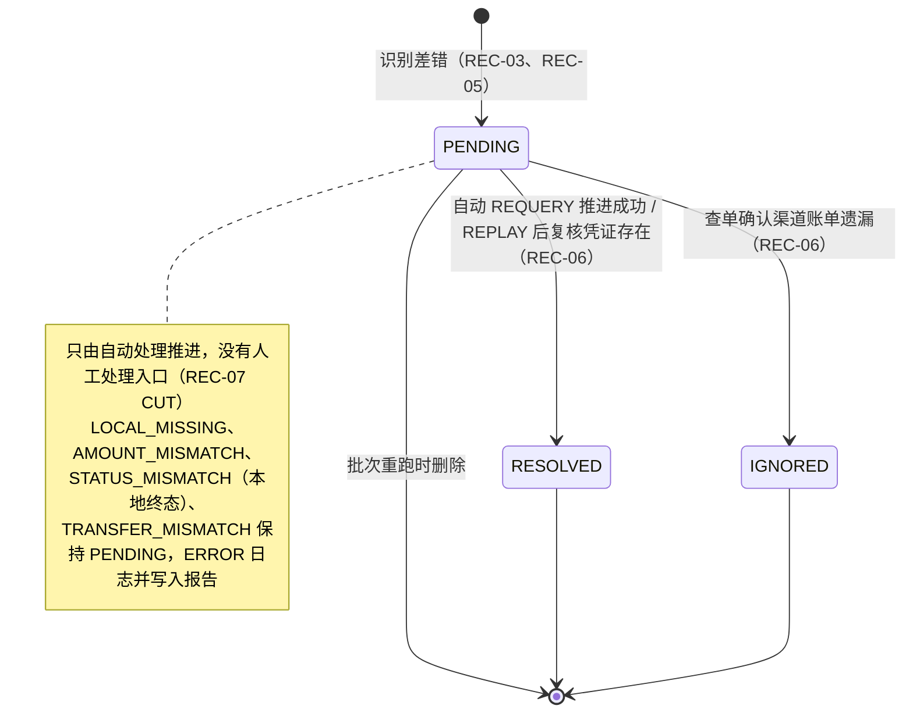
```mermaid
stateDiagram-v2
    [*] --> PENDING: 识别差错（REC-03、REC-05）
    PENDING --> RESOLVED: 自动 REQUERY 推进成功 / REPLAY 后复核凭证存在（REC-06）
    PENDING --> IGNORED: 查单确认渠道账单遗漏（REC-06）
    PENDING --> [*]: 批次重跑时删除
    RESOLVED --> [*]
    IGNORED --> [*]
    note right of PENDING
        只由自动处理推进，没有人工处理入口（REC-07 CUT）
        LOCAL_MISSING、AMOUNT_MISMATCH、STATUS_MISMATCH（本地终态）、
        TRANSFER_MISMATCH 保持 PENDING，ERROR 日志并写入报告
    end note
```

### SM-09 模拟渠道交易 `mock_txn`

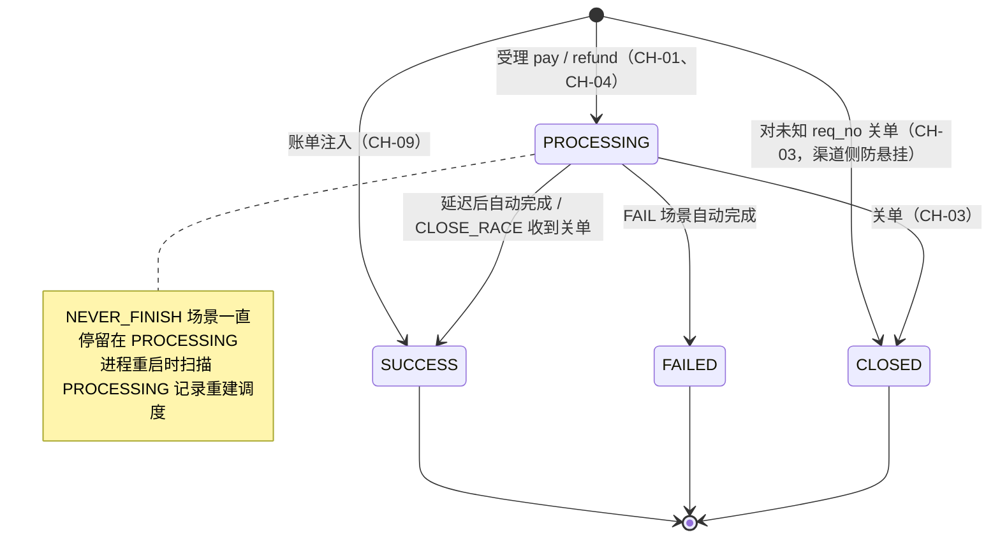
```mermaid
stateDiagram-v2
    [*] --> PROCESSING: 受理 pay / refund（CH-01、CH-04）
    [*] --> CLOSED: 对未知 req_no 关单（CH-03，渠道侧防悬挂）
    [*] --> SUCCESS: 账单注入（CH-09）
    PROCESSING --> SUCCESS: 延迟后自动完成 / CLOSE_RACE 收到关单
    PROCESSING --> FAILED: FAIL 场景自动完成
    PROCESSING --> CLOSED: 关单（CH-03）
    SUCCESS --> [*]
    FAILED --> [*]
    CLOSED --> [*]
    note right of PROCESSING
        NEVER_FINISH 场景一直停留在 PROCESSING
        进程重启时扫描 PROCESSING 记录重建调度
    end note
```

### SM-10 转账单 `transfer_order`

覆盖：TRF-01~04。触发方“请求线程”指 CreateTransfer 同一请求内的执行（TRF-02、TRF-03），“TRF-04”指恢复任务。

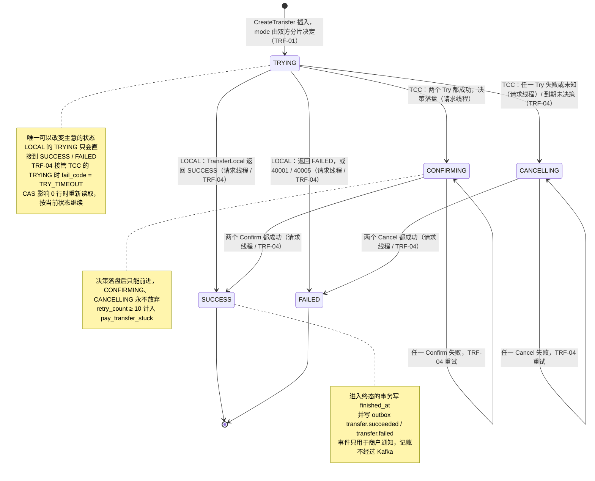
```mermaid
stateDiagram-v2
    [*] --> TRYING: CreateTransfer 插入，mode 由双方分片决定（TRF-01）
    TRYING --> SUCCESS: LOCAL：TransferLocal 返回 SUCCESS（请求线程 / TRF-04）
    TRYING --> FAILED: LOCAL：返回 FAILED，或 40001 / 40005（请求线程 / TRF-04）
    TRYING --> CONFIRMING: TCC：两个 Try 都成功，决策落盘（请求线程）
    TRYING --> CANCELLING: TCC：任一 Try 失败或未知（请求线程）/ 到期未决策（TRF-04）
    CONFIRMING --> SUCCESS: 两个 Confirm 都成功（请求线程 / TRF-04）
    CONFIRMING --> CONFIRMING: 任一 Confirm 失败，TRF-04 重试
    CANCELLING --> FAILED: 两个 Cancel 都成功（请求线程 / TRF-04）
    CANCELLING --> CANCELLING: 任一 Cancel 失败，TRF-04 重试
    SUCCESS --> [*]
    FAILED --> [*]
    note right of TRYING
        唯一可以改变主意的状态
        LOCAL 的 TRYING 只会直接到 SUCCESS / FAILED
        TRF-04 接管 TCC 的 TRYING 时 fail_code = TRY_TIMEOUT
        CAS 影响 0 行时重新读取，按当前状态继续
    end note
    note right of CONFIRMING
        决策落盘后只能前进，CONFIRMING、CANCELLING 永不放弃
        retry_count ≥ 10 计入 pay_transfer_stuck
    end note
    note right of SUCCESS
        进入终态的事务写 finished_at
        并写 outbox transfer.succeeded / transfer.failed
        事件只用于商户通知，记账不经过 Kafka
    end note
```

### SM-11 转账分支 `transfer_branch`

覆盖：ACC-07、ACC-14。分支按 `(transfer_no, role)` 在所在分片唯一。

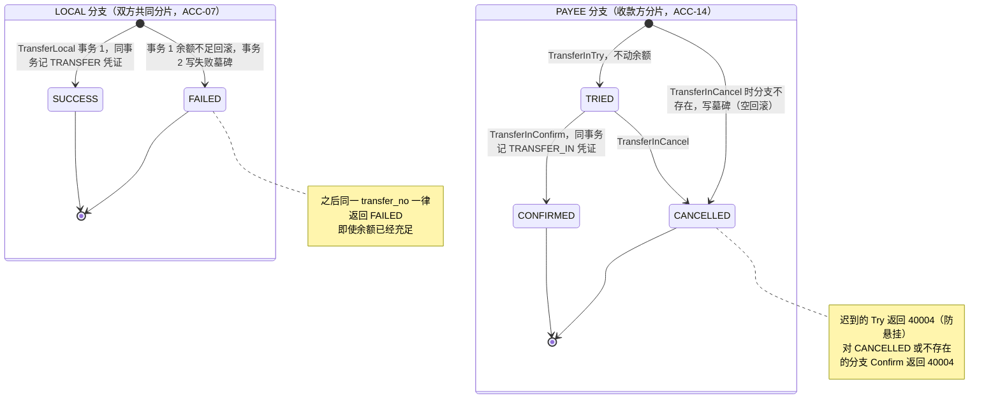
```mermaid
stateDiagram-v2
    state "LOCAL 分支（双方共同分片，ACC-07）" as LOCAL {
        [*] --> SUCCESS: TransferLocal 事务 1，同事务记 TRANSFER 凭证
        [*] --> FAILED: 事务 1 余额不足回滚，事务 2 写失败墓碑
        SUCCESS --> [*]
        FAILED --> [*]
        note right of FAILED
            之后同一 transfer_no 一律返回 FAILED
            即使余额已经充足
        end note
    }
    state "PAYEE 分支（收款方分片，ACC-14）" as PAYEE {
        [*] --> TRIED: TransferInTry，不动余额
        [*] --> CANCELLED: TransferInCancel 时分支不存在，写墓碑（空回滚）
        TRIED --> CONFIRMED: TransferInConfirm，同事务记 TRANSFER_IN 凭证
        TRIED --> CANCELLED: TransferInCancel
        CONFIRMED --> [*]
        CANCELLED --> [*]
        note right of CANCELLED
            迟到的 Try 返回 40004（防悬挂）
            对 CANCELLED 或不存在的分支 Confirm 返回 40004
        end note
    }
```

付款方分支就是 `biz_type = TRANSFER` 的冻结单，状态见 SM-04。

## 3. 泳道图

泳道：商户（paycli、merchant-demo）、gateway、Redis、payment、account、Kafka、channel_mock、recon、运营。payment 泳道包含其进程内的投递器、补偿任务、转账恢复任务和 `payment-notify` 消费者。转账图中 account 按分片拆为两条泳道（同一进程的两个连接池）。

### SL-01 支付主链路（NORMAL 场景）

覆盖：GW-01~05、GW-08、PAY-01~04、CH-01、CH-05、MQ-01~04、NTF-01~02、ACC-03、ACC-13、OPT-02、OPT-03。

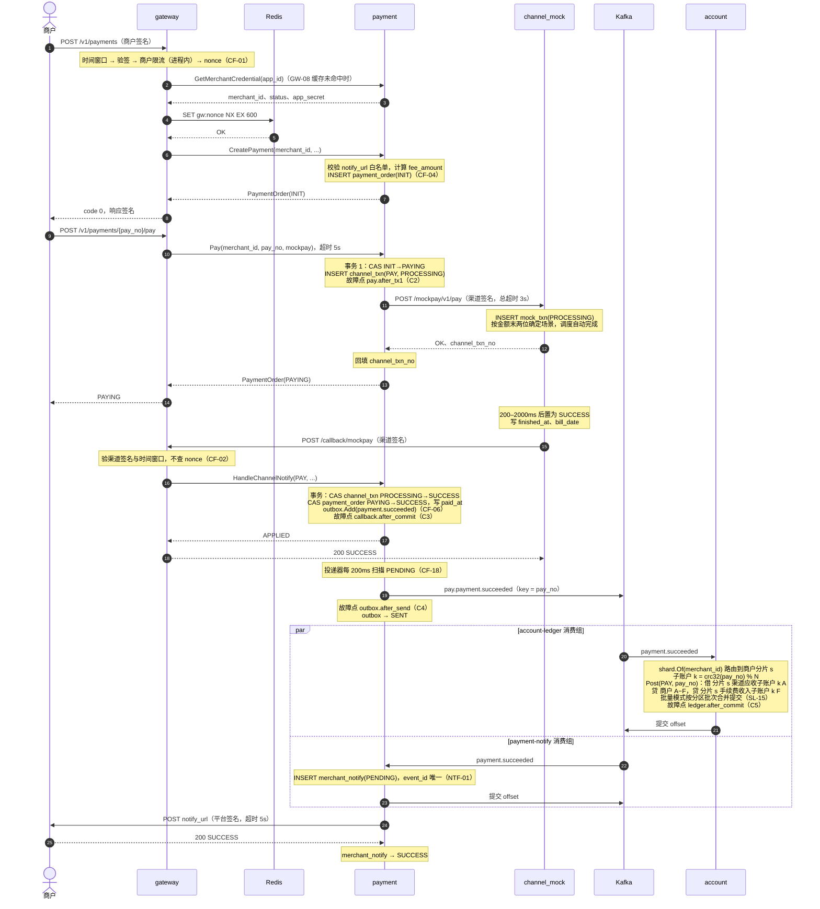
```mermaid
sequenceDiagram
    autonumber
    actor M as 商户
    participant GW as gateway
    participant R as Redis
    participant P as payment
    participant CH as channel_mock
    participant K as Kafka
    participant A as account

    M->>GW: POST /v1/payments（商户签名）
    Note over GW: 时间窗口 → 验签 → 商户限流（进程内）→ nonce（CF-01）
    GW->>P: GetMerchantCredential(app_id)（GW-08 缓存未命中时）
    P-->>GW: merchant_id、status、app_secret
    GW->>R: SET gw:nonce NX EX 600
    R-->>GW: OK
    GW->>P: CreatePayment(merchant_id, ...)
    Note over P: 校验 notify_url 白名单，计算 fee_amount<br/>INSERT payment_order(INIT)（CF-04）
    P-->>GW: PaymentOrder(INIT)
    GW-->>M: code 0，响应签名

    M->>GW: POST /v1/payments/{pay_no}/pay
    GW->>P: Pay(merchant_id, pay_no, mockpay)，超时 5s
    Note over P: 事务 1：CAS INIT→PAYING<br/>INSERT channel_txn(PAY, PROCESSING)<br/>故障点 pay.after_tx1（C2）
    P->>CH: POST /mockpay/v1/pay（渠道签名，总超时 3s）
    Note over CH: INSERT mock_txn(PROCESSING)<br/>按金额末两位确定场景，调度自动完成
    CH-->>P: OK、channel_txn_no
    Note over P: 回填 channel_txn_no
    P-->>GW: PaymentOrder(PAYING)
    GW-->>M: PAYING

    Note over CH: 200–2000ms 后置为 SUCCESS<br/>写 finished_at、bill_date
    CH->>GW: POST /callback/mockpay（渠道签名）
    Note over GW: 验渠道签名与时间窗口，不查 nonce（CF-02）
    GW->>P: HandleChannelNotify(PAY, ...)
    Note over P: 事务：CAS channel_txn PROCESSING→SUCCESS<br/>CAS payment_order PAYING→SUCCESS，写 paid_at<br/>outbox.Add(payment.succeeded)（CF-06）<br/>故障点 callback.after_commit（C3）
    P-->>GW: APPLIED
    GW-->>CH: 200 SUCCESS

    Note over P: 投递器每 200ms 扫描 PENDING（CF-18）
    P->>K: pay.payment.succeeded（key = pay_no）
    Note over P: 故障点 outbox.after_send（C4）<br/>outbox → SENT

    par account-ledger 消费组
        K->>A: payment.succeeded
        Note over A: shard.Of(merchant_id) 路由到商户分片 s<br/>子账户 k = crc32(pay_no) % N<br/>Post(PAY, pay_no)：借 分片 s 渠道应收子账户 k A<br/>贷 商户 A−F，贷 分片 s 手续费收入子账户 k F<br/>批量模式按分区批次合并提交（SL-15）<br/>故障点 ledger.after_commit（C5）
        A->>K: 提交 offset
    and payment-notify 消费组
        K->>P: payment.succeeded
        Note over P: INSERT merchant_notify(PENDING)，event_id 唯一（NTF-01）
        P->>K: 提交 offset
    end

    P->>M: POST notify_url（平台签名，超时 5s）
    M-->>P: 200 SUCCESS
    Note over P: merchant_notify → SUCCESS
```

### SL-02 回调丢失与查单补偿

覆盖：PAY-05、CH-02、CH-03、CH-06（DROP_NOTIFY、SLOW）、C1、C2。

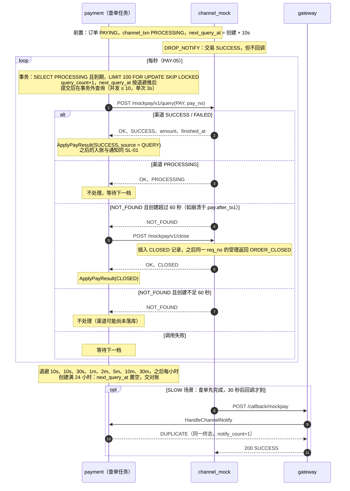
```mermaid
sequenceDiagram
    autonumber
    participant P as payment（查单任务）
    participant CH as channel_mock
    participant GW as gateway

    Note over P,CH: 前置：订单 PAYING，channel_txn PROCESSING，next_query_at = 创建 + 10s
    Note over CH: DROP_NOTIFY：交易 SUCCESS，但不回调

    loop 每秒（PAY-05）
        Note over P: 事务：SELECT PROCESSING 且到期，LIMIT 100 FOR UPDATE SKIP LOCKED<br/>query_count+1，next_query_at 按退避推后<br/>提交后在事务外查询（并发 ≤ 10，单次 3s）
        P->>CH: POST /mockpay/v1/query(PAY, pay_no)
        alt 渠道 SUCCESS / FAILED
            CH-->>P: OK、SUCCESS、amount、finished_at
            Note over P: ApplyPayResult(SUCCESS, source = QUERY)<br/>之后的入账与通知同 SL-01
        else 渠道 PROCESSING
            CH-->>P: OK、PROCESSING
            Note over P: 不处理，等待下一档
        else NOT_FOUND 且创建超过 60 秒（如崩溃于 pay.after_tx1）
            CH-->>P: NOT_FOUND
            P->>CH: POST /mockpay/v1/close
            Note over CH: 插入 CLOSED 记录，之后同一 req_no 的受理返回 ORDER_CLOSED
            CH-->>P: OK、CLOSED
            Note over P: ApplyPayResult(CLOSED)
        else NOT_FOUND 且创建不足 60 秒
            CH-->>P: NOT_FOUND
            Note over P: 不处理（渠道可能尚未落库）
        else 调用失败
            Note over P: 等待下一档
        end
    end

    Note over P: 退避 10s、10s、30s、1m、2m、5m、10m、30m，之后每小时<br/>创建满 24 小时：next_query_at 置空，交对账
    opt SLOW 场景：查单先完成，30 秒后回调才到
        CH->>GW: POST /callback/mockpay
        GW->>P: HandleChannelNotify
        P-->>GW: DUPLICATE（同一终态，notify_count+1）
        GW-->>CH: 200 SUCCESS
    end
```

### SL-03 发起支付结果未知（ACCEPT_TIMEOUT）

覆盖：PAY-03 第 6 条、CH-06（05）。

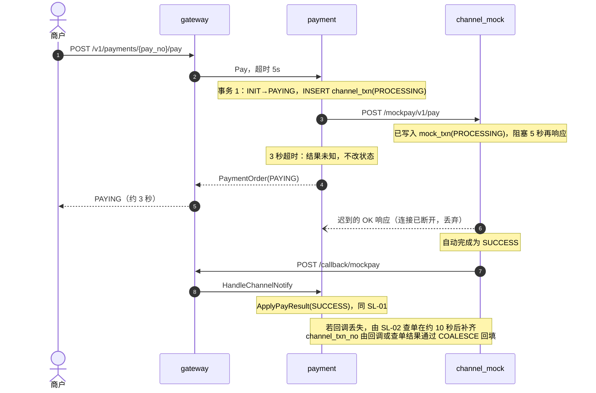
```mermaid
sequenceDiagram
    autonumber
    actor M as 商户
    participant GW as gateway
    participant P as payment
    participant CH as channel_mock

    M->>GW: POST /v1/payments/{pay_no}/pay
    GW->>P: Pay，超时 5s
    Note over P: 事务 1：INIT→PAYING，INSERT channel_txn(PROCESSING)
    P->>CH: POST /mockpay/v1/pay
    Note over CH: 已写入 mock_txn(PROCESSING)，阻塞 5 秒再响应
    Note over P: 3 秒超时：结果未知，不改状态
    P-->>GW: PaymentOrder(PAYING)
    GW-->>M: PAYING（约 3 秒）
    CH--)P: 迟到的 OK 响应（连接已断开，丢弃）
    Note over CH: 自动完成为 SUCCESS
    CH->>GW: POST /callback/mockpay
    GW->>P: HandleChannelNotify
    Note over P: ApplyPayResult(SUCCESS)，同 SL-01
    Note over P,CH: 若回调丢失，由 SL-02 查单在约 10 秒后补齐<br/>channel_txn_no 由回调或查单结果通过 COALESCE 回填
```

### SL-04 商户关单与超时关单

覆盖：PAY-06、PAY-07、CH-03、CH-06（NEVER_FINISH、CLOSE_RACE）。

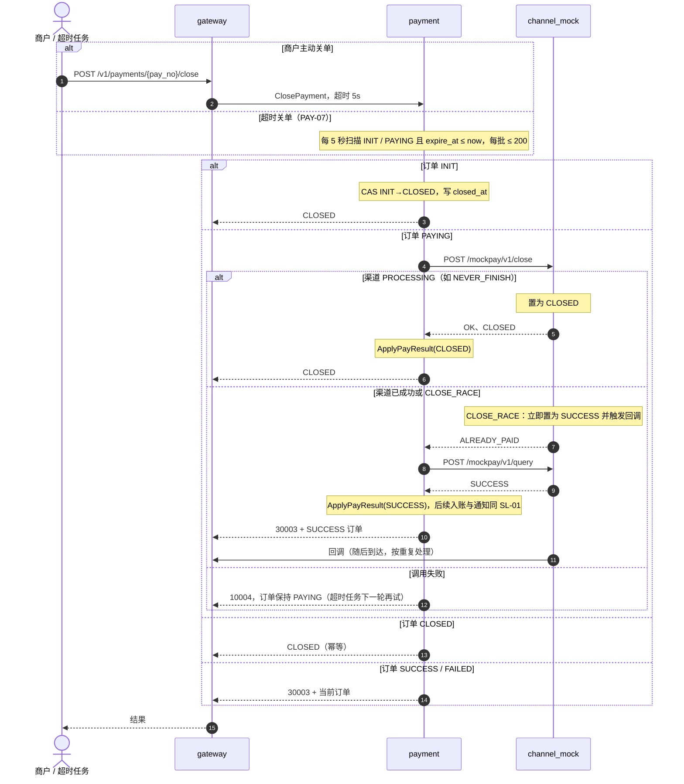
```mermaid
sequenceDiagram
    autonumber
    actor M as 商户 / 超时任务
    participant GW as gateway
    participant P as payment
    participant CH as channel_mock

    alt 商户主动关单
        M->>GW: POST /v1/payments/{pay_no}/close
        GW->>P: ClosePayment，超时 5s
    else 超时关单（PAY-07）
        Note over P: 每 5 秒扫描 INIT / PAYING 且 expire_at ≤ now，每批 ≤ 200
    end

    alt 订单 INIT
        Note over P: CAS INIT→CLOSED，写 closed_at
        P-->>GW: CLOSED
    else 订单 PAYING
        P->>CH: POST /mockpay/v1/close
        alt 渠道 PROCESSING（如 NEVER_FINISH）
            Note over CH: 置为 CLOSED
            CH-->>P: OK、CLOSED
            Note over P: ApplyPayResult(CLOSED)
            P-->>GW: CLOSED
        else 渠道已成功或 CLOSE_RACE
            Note over CH: CLOSE_RACE：立即置为 SUCCESS 并触发回调
            CH-->>P: ALREADY_PAID
            P->>CH: POST /mockpay/v1/query
            CH-->>P: SUCCESS
            Note over P: ApplyPayResult(SUCCESS)，后续入账与通知同 SL-01
            P-->>GW: 30003 + SUCCESS 订单
            CH->>GW: 回调（随后到达，按重复处理）
        else 调用失败
            P-->>GW: 10004，订单保持 PAYING（超时任务下一轮再试）
        end
    else 订单 CLOSED
        P-->>GW: CLOSED（幂等）
    else 订单 SUCCESS / FAILED
        P-->>GW: 30003 + 当前订单
    end
    GW-->>M: 结果
```

### SL-05 退款成功链路

覆盖：REF-01~03、ACC-04、ACC-06、ACC-13、CH-04、MQ-04、NTF-01~02。

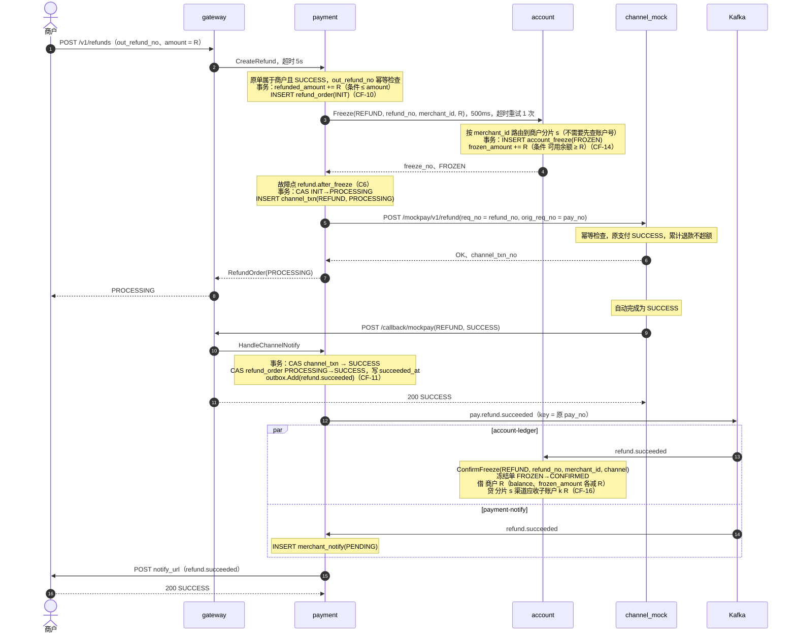
```mermaid
sequenceDiagram
    autonumber
    actor M as 商户
    participant GW as gateway
    participant P as payment
    participant A as account
    participant CH as channel_mock
    participant K as Kafka

    M->>GW: POST /v1/refunds（out_refund_no、amount = R）
    GW->>P: CreateRefund，超时 5s
    Note over P: 原单属于商户且 SUCCESS，out_refund_no 幂等检查<br/>事务：refunded_amount += R（条件 ≤ amount）<br/>INSERT refund_order(INIT)（CF-10）
    P->>A: Freeze(REFUND, refund_no, merchant_id, R)，500ms，超时重试 1 次
    Note over A: 按 merchant_id 路由到商户分片 s（不需要先查账户号）<br/>事务：INSERT account_freeze(FROZEN)<br/>frozen_amount += R（条件 可用余额 ≥ R）（CF-14）
    A-->>P: freeze_no、FROZEN
    Note over P: 故障点 refund.after_freeze（C6）<br/>事务：CAS INIT→PROCESSING<br/>INSERT channel_txn(REFUND, PROCESSING)
    P->>CH: POST /mockpay/v1/refund(req_no = refund_no, orig_req_no = pay_no)
    Note over CH: 幂等检查，原支付 SUCCESS，累计退款不超额
    CH-->>P: OK、channel_txn_no
    P-->>GW: RefundOrder(PROCESSING)
    GW-->>M: PROCESSING

    Note over CH: 自动完成为 SUCCESS
    CH->>GW: POST /callback/mockpay(REFUND, SUCCESS)
    GW->>P: HandleChannelNotify
    Note over P: 事务：CAS channel_txn → SUCCESS<br/>CAS refund_order PROCESSING→SUCCESS，写 succeeded_at<br/>outbox.Add(refund.succeeded)（CF-11）
    GW-->>CH: 200 SUCCESS
    P->>K: pay.refund.succeeded（key = 原 pay_no）

    par account-ledger
        K->>A: refund.succeeded
        Note over A: ConfirmFreeze(REFUND, refund_no, merchant_id, channel)<br/>冻结单 FROZEN→CONFIRMED<br/>借 商户 R（balance、frozen_amount 各减 R）<br/>贷 分片 s 渠道应收子账户 k R（CF-16）
    and payment-notify
        K->>P: refund.succeeded
        Note over P: INSERT merchant_notify(PENDING)
    end
    P->>M: POST notify_url（refund.succeeded）
    M-->>P: 200 SUCCESS
```

### SL-06 退款失败与卡单恢复

覆盖：REF-02~04、ACC-05（空回滚、防悬挂）、MQ-04。

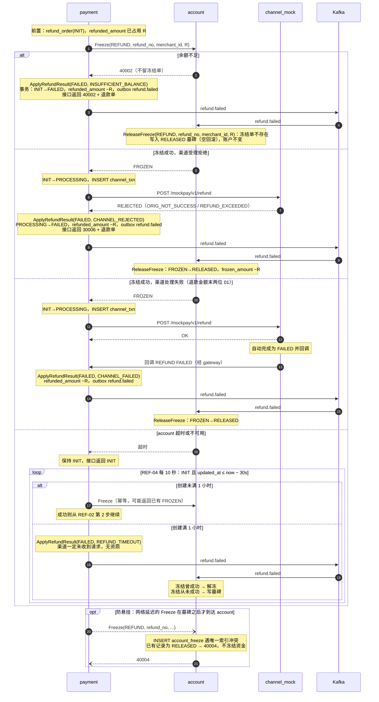
```mermaid
sequenceDiagram
    autonumber
    participant P as payment
    participant A as account
    participant CH as channel_mock
    participant K as Kafka

    Note over P: 前置：refund_order(INIT)，refunded_amount 已占用 R
    P->>A: Freeze(REFUND, refund_no, merchant_id, R)

    alt 余额不足
        A-->>P: 40002（不留冻结单）
        Note over P: ApplyRefundResult(FAILED, INSUFFICIENT_BALANCE)<br/>事务：INIT→FAILED，refunded_amount −R，outbox refund.failed<br/>接口返回 40002 + 退款单
        P->>K: refund.failed
        K->>A: refund.failed
        Note over A: ReleaseFreeze(REFUND, refund_no, merchant_id, R)：冻结单不存在<br/>写入 RELEASED 墓碑（空回滚），账户不变
    else 冻结成功，渠道受理拒绝
        A-->>P: FROZEN
        Note over P: INIT→PROCESSING，INSERT channel_txn
        P->>CH: POST /mockpay/v1/refund
        CH-->>P: REJECTED（ORIG_NOT_SUCCESS / REFUND_EXCEEDED）
        Note over P: ApplyRefundResult(FAILED, CHANNEL_REJECTED)<br/>PROCESSING→FAILED，refunded_amount −R，outbox refund.failed<br/>接口返回 30006 + 退款单
        P->>K: refund.failed
        K->>A: refund.failed
        Note over A: ReleaseFreeze：FROZEN→RELEASED，frozen_amount −R
    else 冻结成功，渠道处理失败（退款金额末两位 01）
        A-->>P: FROZEN
        Note over P: INIT→PROCESSING，INSERT channel_txn
        P->>CH: POST /mockpay/v1/refund
        CH-->>P: OK
        Note over CH: 自动完成为 FAILED 并回调
        CH->>P: 回调 REFUND FAILED（经 gateway）
        Note over P: ApplyRefundResult(FAILED, CHANNEL_FAILED)<br/>refunded_amount −R，outbox refund.failed
        P->>K: refund.failed
        K->>A: refund.failed
        Note over A: ReleaseFreeze：FROZEN→RELEASED
    else account 超时或不可用
        A--xP: 超时
        Note over P: 保持 INIT，接口返回 INIT
        loop REF-04 每 10 秒：INIT 且 updated_at ≤ now − 30s
            alt 创建未满 1 小时
                P->>A: Freeze（幂等，可能返回已有 FROZEN）
                Note over P: 成功则从 REF-02 第 2 步继续
            else 创建满 1 小时
                Note over P: ApplyRefundResult(FAILED, REFUND_TIMEOUT)<br/>渠道一定未收到请求，无资损
                P->>K: refund.failed
                K->>A: refund.failed
                Note over A: 冻结曾成功 → 解冻<br/>冻结从未成功 → 写墓碑
            end
        end
    end

    opt 防悬挂：网络延迟的 Freeze 在墓碑之后才到达 account
        P--)A: Freeze(REFUND, refund_no, ...)
        Note over A: INSERT account_freeze 遇唯一索引冲突<br/>已有记录为 RELEASED → 40004，不冻结资金
        A--)P: 40004
    end
```

### SL-07 事件投递、消费、死信与重放

覆盖：MQ-01~06。

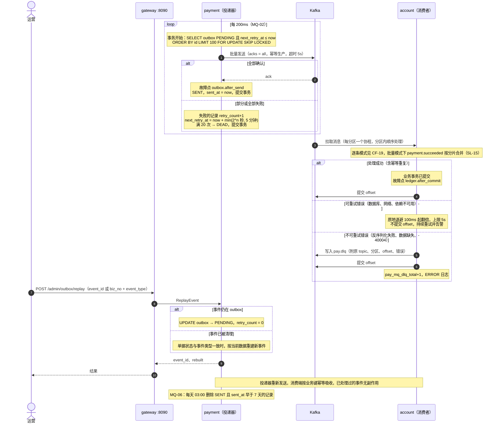
```mermaid
sequenceDiagram
    autonumber
    actor O as 运营
    participant GW as gateway :8090
    participant P as payment（投递器）
    participant K as Kafka
    participant A as account（消费者）

    loop 每 200ms（MQ-02）
        Note over P: 事务开始：SELECT outbox PENDING 且 next_retry_at ≤ now<br/>ORDER BY id LIMIT 100 FOR UPDATE SKIP LOCKED
        P->>K: 批量发送（acks = all，幂等生产，超时 5s）
        alt 全部确认
            K-->>P: ack
            Note over P: 故障点 outbox.after_send<br/>SENT，sent_at = now，提交事务
        else 部分或全部失败
            Note over P: 失败的记录 retry_count+1<br/>next_retry_at = now + min(2^n 秒, 5 分钟)<br/>满 20 次 → DEAD，提交事务
        end
    end

    K->>A: 拉取消息（每分区一个协程，分区内顺序处理）
    Note over A: 逐条模式见 CF-19，批量模式下 payment.succeeded 按分片合并（SL-15）
    alt 处理成功（含幂等重复）
        Note over A: 业务事务已提交<br/>故障点 ledger.after_commit
        A->>K: 提交 offset
    else 可重试错误（数据库、网络、依赖不可用）
        Note over A: 原地退避 100ms 起翻倍，上限 5s<br/>不提交 offset，持续重试并告警
    else 不可重试错误（反序列化失败、数据缺失、40004）
        A->>K: 写入 pay.dlq（附原 topic、分区、offset、错误）
        A->>K: 提交 offset
        Note over A: pay_mq_dlq_total+1，ERROR 日志
    end

    O->>GW: POST /admin/outbox/replay（event_id 或 biz_no + event_type）
    GW->>P: ReplayEvent
    alt 事件仍在 outbox
        Note over P: UPDATE outbox → PENDING，retry_count = 0
    else 事件已被清理
        Note over P: 单据状态与事件类型一致时，按当前数据重建新事件
    end
    P-->>GW: event_id、rebuilt
    GW-->>O: 结果
    Note over P,A: 投递器重新发送，消费端按业务键幂等吸收，已处理过的事件无副作用
    Note over P: MQ-06：每天 03:00 删除 SENT 且 sent_at 早于 7 天的记录
```

“告警”统一指对应指标加一并输出 ERROR 日志（OPS-04 CUT，不配置告警规则）。

### SL-08 商户通知重试

覆盖：NTF-02、TL-02。

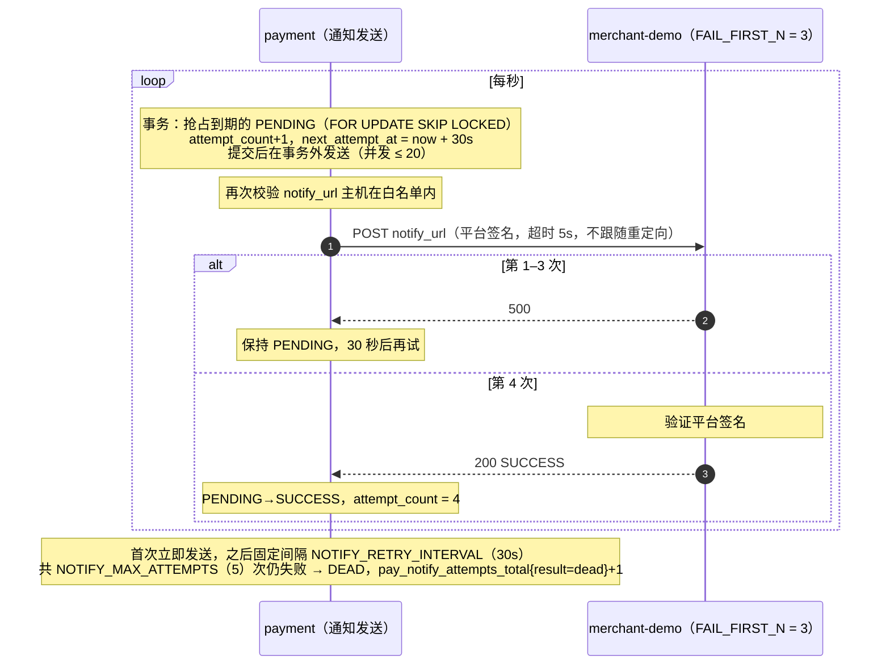
```mermaid
sequenceDiagram
    autonumber
    participant P as payment（通知发送）
    participant MD as merchant-demo（FAIL_FIRST_N = 3）

    loop 每秒
        Note over P: 事务：抢占到期的 PENDING（FOR UPDATE SKIP LOCKED）<br/>attempt_count+1，next_attempt_at = now + 30s<br/>提交后在事务外发送（并发 ≤ 20）
        Note over P: 再次校验 notify_url 主机在白名单内
        P->>MD: POST notify_url（平台签名，超时 5s，不跟随重定向）
        alt 第 1–3 次
            MD-->>P: 500
            Note over P: 保持 PENDING，30 秒后再试
        else 第 4 次
            Note over MD: 验证平台签名
            MD-->>P: 200 SUCCESS
            Note over P: PENDING→SUCCESS，attempt_count = 4
        end
    end
    Note over P: 首次立即发送，之后固定间隔 NOTIFY_RETRY_INTERVAL（30s）<br/>共 NOTIFY_MAX_ATTEMPTS（5）次仍失败 → DEAD，pay_notify_attempts_total{result=dead}+1
```

### SL-09 日终对账与自动处理

覆盖：REC-01~03、REC-05、REC-06、REC-08、CH-08、PAY-09、MQ-05。

```mermaid
sequenceDiagram
    autonumber
    participant T as 调度 / CLI / 管理接口
    participant RC as recon
    participant CH as channel_mock
    participant PD as pay_payment（只读）
    participant AD as pay_account_0 / 1（只读）
    participant P as payment

    T->>RC: RunBatch(mockpay, D)（每天 10:00 对 D−1）
    Note over RC: 按 uk_channel_bill_date 创建或取得批次，CAS 抢占（CF-26）
    RC->>CH: GET /mockpay/v1/bills?date=D（超时 30s，失败重试 3 次）
    alt BILL_NOT_READY
        CH-->>RC: BILL_NOT_READY
        Note over RC: 批次保持 INIT，30 分钟后重试
    else 账单就绪
        CH-->>RC: CSV + X-Bill-Sha256 + X-Bill-Count
        Note over RC: 校验哈希与行数，严格解析，每 1000 行批量插入<br/>批次 → DOWNLOADED → CHECKING
        RC->>PD: 读 channel_txn（D 日 SUCCESS，及账单行按匹配键回查）
        Note over RC: 外部比对（REC-03，CF-27）：LOCAL_MISSING、STATUS_MISMATCH、<br/>AMOUNT_MISMATCH、CHANNEL_MISSING，不做跨日处理
        RC->>PD: 读 D 日成功支付单、成功退款单、终态转账单
        RC->>AD: 按分片读 ledger_txn、account_freeze、transfer_branch
        Note over RC: 内部对账（REC-05，CF-28）：LEDGER_MISSING、TRANSFER_MISMATCH<br/>内存比对，不跨 schema JOIN<br/>复核历史 REPLAY 的 LEDGER_MISSING 差错（不限账期）

        Note over RC: 自动处理（REC-06，CF-29）
        RC->>P: SyncChannelTxn(biz_no)（STATUS_MISMATCH 本地 PROCESSING、CHANNEL_MISSING）
        P->>CH: POST /mockpay/v1/query
        CH-->>P: 渠道状态
        Note over P: 本地 PROCESSING 时按查单规则推进（CF-09）
        P-->>RC: local_status、channel_status、changed
        RC->>P: ReplayEvent(biz_no, event_type)（LEDGER_MISSING）
        Note over P: outbox 重新投递，account 补入账
        P-->>RC: event_id
        Note over RC: handle_action = REPLAY，保持 PENDING 等待复核<br/>其余差错保持 PENDING，ERROR 日志并写入报告<br/>批次 → DONE，指标 pay_recon_diffs_total、pay_recon_pending_diffs
    end
    RC-->>T: 批次统计与前 100 条差错（REC-08）
```

### SL-10 运营操作

覆盖：GW-07、MQ-05、ACC-10、REC-01、REC-08。

```mermaid
sequenceDiagram
    autonumber
    actor O as 运营（paycli admin）
    participant GW as gateway :8090
    participant RC as recon
    participant P as payment
    participant A as account

    O->>GW: 请求（X-Admin-Token，写操作带 X-Admin-Operator）
    Note over GW: 常量时间比较 Token，失败 401 / 20005<br/>写操作缺 Operator → 10001，写审计日志（CF-03）
    alt 事件重放 POST /admin/outbox/replay
        GW->>P: ReplayEvent(event_id 或 biz_no + event_type)（CF-20）
        P-->>GW: event_id、rebuilt
    else 余额核对 POST /admin/accounts/check
        GW->>A: CheckBalance(merchant_id 或全量, expect_quiescent)（CF-17）
        Note over A: 每个分片一个一致性快照，全量时含在途守恒
        A-->>GW: passed、failures
    else 执行对账 POST /admin/recon/run
        GW->>RC: RunBatch(channel, bill_date, force)（SL-09）
        RC-->>GW: 批次统计与前 100 条差错（REC-08）
    end
    GW-->>O: 统一响应（不签名）
    Note over GW,A: 管理接口只有以上三个（GW-07）<br/>开户 OpenAccount 只由 seed 调用（BASE-03），不对运营开放
```

### SL-11 同分片转账

覆盖：TRF-01、TRF-02、ACC-07、ACC-13、NTF-01~02。示例 `M100001 → M100003`，双方都在分片 1。

```mermaid
sequenceDiagram
    autonumber
    actor M as 商户 M100001
    participant GW as gateway
    participant P as payment
    participant A as account（分片 1）
    participant K as Kafka

    M->>GW: POST /v1/transfers（payee_merchant_id = M100003，amount = T）
    Note over GW: 管线同 SL-01（CF-01），CreateTransfer 调用超时 3s
    GW->>P: CreateTransfer(merchant_id, out_transfer_no, payee, T)
    Note over P: 收款方存在、ACTIVE、不是自己，否则 30008<br/>(merchant_id, out_transfer_no) 幂等检查<br/>双方 shard.Of 都为 1 → mode = LOCAL<br/>INSERT transfer_order(TRYING, next_retry_at = now + 10s)（CF-34）
    P->>A: TransferLocal(transfer_no, M100001, M100003, T)，500ms，超时重试 1 次
    alt 余额充足
        Note over A: 事务 1：INSERT transfer_branch(LOCAL, SUCCESS)<br/>Post(TRANSFER)：借 付款商户 T，贷 收款商户 T<br/>账户按 id 升序加锁，回写 txn_no（CF-32）
        A-->>P: SUCCESS、txn_no
        Note over P: 事务：CAS TRYING→SUCCESS，写 txn_no、finished_at<br/>outbox.Add(transfer.succeeded)
        P-->>GW: TransferOrder(SUCCESS)
        GW-->>M: code 0
    else 余额不足
        Note over A: 事务 1 中 Post 返回 40002，ROLLBACK<br/>事务 2：INSERT transfer_branch(LOCAL, FAILED, INSUFFICIENT_BALANCE) 失败墓碑
        A-->>P: FAILED、INSUFFICIENT_BALANCE（业务结果，不是错误码）
        Note over P: 事务：CAS TRYING→FAILED，写 fail_code、finished_at<br/>outbox.Add(transfer.failed)
        P-->>GW: TransferOrder(FAILED)
        GW-->>M: 40002 + 转账单
    else 超时、10003、10004
        A--xP: 超时
        Note over P: 保持 TRYING，由 TRF-04 重新调用 TransferLocal<br/>分支记录保证重试拿到同一结果
        P-->>GW: TransferOrder(TRYING)
        GW-->>M: code 0（处理中）
    end

    opt 进入终态后
        P->>K: pay.transfer.succeeded / failed（key = transfer_no）
        K->>P: payment-notify 消费组
        Note over P: INSERT merchant_notify(PENDING)，只通知付款商户<br/>notify_url 取转账单，为空取付款商户默认地址（CF-21）
        P->>M: POST notify_url
    end
    Note over P,A: 转账事件不被 account 消费，记账已由 TransferLocal 同步完成
```

### SL-12 跨分片转账成功

覆盖：TRF-01、TRF-03、ACC-04、ACC-06、ACC-14、OPT-04（并行分支）。示例 `M100001`（分片 1）`→ M100002`（分片 0）。

```mermaid
sequenceDiagram
    autonumber
    actor M as 商户 M100001
    participant GW as gateway
    participant P as payment（协调者）
    participant A1 as account 分片 1（付款方）
    participant A0 as account 分片 0（收款方）
    participant K as Kafka

    M->>GW: POST /v1/transfers（payee_merchant_id = M100002，amount = T）
    GW->>P: CreateTransfer，超时 3s
    Note over P: 校验与幂等同 SL-11<br/>payer_shard = 1，payee_shard = 0 → mode = TCC<br/>INSERT transfer_order(TRYING)（CF-34）
    par Try 付款方
        P->>A1: Freeze(TRANSFER, transfer_no, M100001, T)
        Note over A1: 事务：INSERT account_freeze(FROZEN)<br/>frozen_amount += T（条件 可用余额 ≥ T）（CF-14）
        A1-->>P: FROZEN
    and Try 收款方
        P->>A0: TransferInTry(transfer_no, M100002, T)
        Note over A0: 校验收款账户存在且 ACTIVE<br/>INSERT transfer_branch(PAYEE, TRIED)，不动余额（CF-33）
        A0-->>P: TRIED
    end
    Note over P: 两个调用都等待结束，一个失败不取消另一个<br/>故障点 transfer.after_try（C9）
    Note over P: 事务：CAS TRYING→CONFIRMING（决策落盘）<br/>故障点 transfer.after_decision（C10）
    par Confirm 付款方
        P->>A1: ConfirmFreeze(TRANSFER, transfer_no, M100001, channel 为空)
        Note over A1: 事务：冻结单 FROZEN→CONFIRMED<br/>Post(TRANSFER_OUT)：借 付款商户 T，贷 分片 1 TRANSIT 子账户 k T（CF-16）
        A1-->>P: txn_no
    and Confirm 收款方
        P->>A0: TransferInConfirm(transfer_no, M100002)
        Note over A0: 事务：分支 TRIED→CONFIRMED<br/>Post(TRANSFER_IN)：借 分片 0 TRANSIT 子账户 k T，贷 收款商户 T
        A0-->>P: txn_no
    end
    Note over P: 事务：CAS CONFIRMING→SUCCESS，写 finished_at<br/>outbox.Add(transfer.succeeded)
    P-->>GW: TransferOrder(SUCCESS)
    GW-->>M: code 0
    Note over A1,A0: 分片 1 在途 +T，分片 0 在途 −T，两个分片合计 0（不变量 11）
    P->>K: pay.transfer.succeeded
    K->>P: payment-notify 消费组
    Note over P: 只通知付款商户（CF-21）
    Note over P,A0: TRANSFER_PARALLEL_BRANCH = false 时先付款方后收款方，<br/>付款方 Confirm 之后经过故障点 transfer.after_payer_confirm（C11）<br/>任一 Confirm 失败：保持 CONFIRMING，接口返回 CONFIRMING，由 TRF-04 重试
```

### SL-13 跨分片转账取消

覆盖：TRF-03 第 3、6 步、ACC-05、ACC-14（空回滚、防悬挂）。

```mermaid
sequenceDiagram
    autonumber
    participant P as payment（协调者）
    participant A1 as account 分片 1（付款方）
    participant A0 as account 分片 0（收款方）
    participant K as Kafka

    Note over P: 前置：transfer_order(TCC, TRYING)
    par Try 付款方
        P->>A1: Freeze(TRANSFER, transfer_no, payer, T)
    and Try 收款方
        P->>A0: TransferInTry(transfer_no, payee, T)
    end
    alt 付款方余额不足
        A1-->>P: 40002（不留冻结单）
        A0-->>P: TRIED
        Note over P: CAS TRYING→CANCELLING，fail_code = INSUFFICIENT_BALANCE
    else 收款方 Try 超时（重试 1 次仍超时）
        A1-->>P: FROZEN
        A0--xP: 超时
        Note over P: CAS TRYING→CANCELLING，fail_code = TRY_TIMEOUT
    else 账户不存在或非 ACTIVE
        A0-->>P: 40001 / 40005
        Note over P: fail_code = ACCOUNT_INVALID<br/>两个分支都失败时取付款方的原因
    end
    par Cancel 付款方
        P->>A1: ReleaseFreeze(TRANSFER, transfer_no, payer, T)
        Note over A1: FROZEN→RELEASED，frozen_amount −T<br/>冻结单不存在时写 RELEASED 墓碑（空回滚，CF-15）
        A1-->>P: RELEASED
    and Cancel 收款方
        P->>A0: TransferInCancel(transfer_no, payee, T)
        Note over A0: TRIED→CANCELLED<br/>分支不存在时写 CANCELLED 墓碑（空回滚，CF-33）
        A0-->>P: CANCELLED
    end
    Note over P: 事务：CAS CANCELLING→FAILED，写 finished_at<br/>outbox.Add(transfer.failed)<br/>任一 Cancel 失败：保持 CANCELLING，由 TRF-04 重试
    P->>K: pay.transfer.failed（只用于通知付款商户）
    Note over P: 接口：INSUFFICIENT_BALANCE 返回 40002 + 转账单，其余返回 code 0

    opt 防悬挂：超时的 Try 在墓碑之后才到达收款方
        P--)A0: TransferInTry(transfer_no, ...)
        Note over A0: 唯一索引冲突，已有分支 CANCELLED → 40004，不占位
        A0--)P: 40004（协调者已不再等待，丢弃）
    end
```

### SL-14 转账崩溃恢复

覆盖：TRF-04、QA-01 C9、C10、C11、C13。

```mermaid
sequenceDiagram
    autonumber
    participant P as payment（请求线程）
    participant RT as payment（TRF-04 恢复任务）
    participant A1 as account 分片 1（付款方）
    participant A0 as account 分片 0（收款方）

    Note over RT: 每 1 秒：事务内 SELECT TRYING / CONFIRMING / CANCELLING 且 next_retry_at ≤ now<br/>LIMIT 100 FOR UPDATE SKIP LOCKED，retry_count+1<br/>next_retry_at = now + min(2^retry_count 秒, 60 秒)，提交后并发 ≤ 20 处理（CF-36）
    alt C9：两个 Try 成功、决策落盘前崩溃
        P->>A1: Freeze(TRANSFER)，返回 FROZEN
        P->>A0: TransferInTry，返回 TRIED
        Note over P: 故障点 transfer.after_try，payment 被 kill
        Note over RT: 重启后接管 TRYING + TCC<br/>CAS TRYING→CANCELLING，fail_code = TRY_TIMEOUT
        RT->>A1: ReleaseFreeze，返回 RELEASED
        RT->>A0: TransferInCancel，返回 CANCELLED
        Note over RT: CANCELLING→FAILED，没有任何转账凭证
    else C10：CONFIRMING 落盘后、Confirm 前崩溃
        Note over P: CAS TRYING→CONFIRMING 已提交<br/>故障点 transfer.after_decision，payment 被 kill
        Note over RT: 重启后接管 CONFIRMING
        RT->>A1: ConfirmFreeze，记 TRANSFER_OUT
        RT->>A0: TransferInConfirm，记 TRANSFER_IN
        Note over RT: CONFIRMING→SUCCESS，两种凭证各 1 张
    else C11：串行模式付款方已确认、收款方未确认
        P->>A1: ConfirmFreeze，记 TRANSFER_OUT
        Note over P: 故障点 transfer.after_payer_confirm，payment 被 kill
        Note over A1,A0: 崩溃期间两个分片在途合计 = T<br/>CheckBalance 按分支状态计算预期在途，仍然通过
        RT->>A1: ConfirmFreeze（已 CONFIRMED，返回已有 txn_no）
        RT->>A0: TransferInConfirm，记 TRANSFER_IN
        Note over RT: CONFIRMING→SUCCESS，在途合计回到 0
    else 请求线程卡顿超过 TRANSFER_RECOVER_DELAY（10 秒）
        Note over RT: 接管 TRYING + TCC：CAS TRYING→CANCELLING（TRY_TIMEOUT），执行 Cancel
        Note over P: Try 返回后 CAS TRYING→CONFIRMING 影响 0 行<br/>重新读取，按 CANCELLING 继续执行 Cancel（CF-35）<br/>迟到的 Try 被墓碑拦截，返回 40004
    end

    opt C13：转账压测中 kill account，20 秒后启动
        Note over P,A0: 进行中的分支调用超时：TCC 的 TRYING 转为 CANCELLING，<br/>LOCAL 的 TRYING、CONFIRMING、CANCELLING 保持原状态
        Note over RT,A0: TRF-04 按退避持续重试，永不放弃，retry_count ≥ 10 计入 pay_transfer_stuck<br/>account 恢复后全部转账终态，在途合计 0，CheckBalance 通过
    end
```

### SL-15 批量记账

覆盖：OPT-02、OPT-03、ACC-13、MQ-03、QA-01 C12。

```mermaid
sequenceDiagram
    autonumber
    participant K as Kafka（pay.payment.succeeded 分区 p）
    participant C as account 消费协程（分区 p）
    participant DB as pay_account_s（分组所在分片）

    K->>C: 一次拉取的记录
    Note over C: LEDGER_BATCH_ENABLED = true<br/>取 ≤ 100 条 payment.succeeded，按 shard.Of(merchant_id) 分组<br/>其他事件在批量部分提交后按原顺序逐条处理（CF-19）
    loop 每个分片组一个分片事务（CF-37）
        C->>DB: SELECT biz_no FROM ledger_txn WHERE biz_type = PAY AND biz_no IN (…)
        DB-->>C: 已入账的 biz_no（跳过）
        C->>DB: 批量 INSERT ledger_txn（剩余事件）
        alt 1062（并发消费者或重放抢先入账）
            C->>DB: ROLLBACK
            Note over C: 本组退化为逐条处理（MQ-04）
        else 插入成功
            Note over C: 按账户聚合增量：同一商户、同一平台子账户 k 的多笔合并<br/>k = crc32(pay_no) % PLATFORM_SUB_ACCOUNTS
            C->>DB: 按 account_id 升序 SELECT FOR UPDATE，UPDATE balance += Σ
            Note over C: 从加锁时读到的余额按事件顺序累加 balance_after
            C->>DB: 批量 INSERT ledger_entry，COMMIT
            Note over C: 故障点 ledger.after_batch_commit（C12）
        end
    end
    alt 所有分组提交成功
        C->>K: 提交本批 offset
    else 部分分组提交后崩溃
        Note over C,K: offset 未提交，重启后重新消费<br/>预查跳过已入账事件，每笔支付只入账一次
    end
    Note over C: 不可重试事件（商户账户不存在）：本组回滚，退化为逐条处理<br/>坏消息按 MQ-03 进入 DLQ，其余事件正常入账，pay_ledger_batch_fallback_total+1<br/>反序列化失败的消息无法分组，处理方式见 R16
```

## 4. 控制流图

每张图对应一个函数或一个后台任务。图中的错误码见 `docs/03-conventions.md` §5。

### 4.1 网关

#### CF-01 商户请求管线

覆盖：GW-01~05、GW-08、PAY-08、REF-05、TRF-05。

```mermaid
flowchart TD
    S(["商户请求 :8080"]) --> SZ{"请求体 ≤ 64KB"}
    SZ -->|"否"| E413["413 / 10001，不签名"]:::err
    SZ -->|"是"| MW["Recovery → RequestID → Trace → AccessLog"]
    MW --> HD{"X-App-Id、X-Timestamp、X-Nonce、X-Signature 齐全<br/>nonce 为 16–32 位字母数字"}
    HD -->|"否"| E20001a["20001，不签名"]:::err
    HD -->|"是"| TS{"X-Timestamp 与服务器时间相差 ≤ 300 秒"}
    TS -->|"否"| E20002["20002，不签名"]:::err
    TS -->|"是"| CC{"GW-08 凭证缓存命中<br/>TTL 60s，不存在的 app_id 负缓存 10s"}
    CC -->|"未命中"| SF["singleflight 回源<br/>GetMerchantCredential(app_id)"]
    SF -->|"调用失败"| E10004a["503 / 10004，不缓存失败结果，不签名"]:::err
    SF -->|"成功"| ST{"商户存在且 ACTIVE"}
    CC -->|"命中"| ST
    ST -->|"否"| E20004["20004，不签名"]:::err
    ST -->|"是"| SG{"BASE-13 签名常量时间比较一致"}
    SG -->|"否"| E20001b["20001，不签名"]:::err
    SG -->|"是"| CTX["merchant_id 写入请求上下文<br/>之后的响应都带平台签名"]
    CTX --> RL{"进程内令牌桶 rate.Limiter[app_id]<br/>默认 100/s、突发 200，RATE_LIMIT_OVERRIDES 可覆盖"}
    RL -->|"超限"| E429["429 / 10005 + Retry-After<br/>不占用 nonce"]:::err
    RL -->|"通过"| NC["SET gw:nonce:app_id:nonce 1 NX EX 600<br/>超时 50ms"]
    NC -->|"已存在"| E20003["20003"]:::err
    NC -->|"超时或不可用"| E10004b["503 / 10004（fail-closed）<br/>pay_nonce_unavailable_total+1"]:::err
    NC -->|"OK"| PV{"参数校验（GW-02）<br/>merchant_id 只取验签结果"}
    PV -->|"不合法"| E10001["10001"]:::err
    PV -->|"合法"| RPC["调用 payment，连接 100ms<br/>普通 1s，Pay / ClosePayment / CreateRefund 5s，CreateTransfer 3s<br/>网关不重试写请求"]
    RPC --> RESP(["统一响应 + 平台签名"]):::ok
    RPC -.- QN["查询接口直接读库：非本商户单据返回 30001<br/>转账只有付款商户可查，收款商户同样 30001"]
    classDef ok fill:#e3f6e8,stroke:#2e7d32
    classDef err fill:#fde4e4,stroke:#c62828
    classDef fault fill:#fff4d6,stroke:#b8860b
```

不做全局限流和 Redis 分布式限流；网关多实例时实际配额为“单实例配额 × 实例数”（GW-05 第 4 条）。

#### CF-02 渠道回调入口

覆盖：GW-06。

```mermaid
flowchart TD
    S(["POST /callback/mockpay"]) --> SG{"渠道签名正确<br/>且时间窗口 ±300 秒"}
    SG -->|"否"| E401["401 / 50001，不调用 payment"]:::err
    SG -->|"是"| NN["不做 nonce 检查<br/>Redis 故障不影响回调"]
    NN --> TT{"txn_type"}
    TT -->|"PAY"| AP["ApplyPayResult(source = NOTIFY)（CF-06）"]
    TT -->|"REFUND"| AR["ApplyRefundResult(source = NOTIFY)（CF-11）"]
    AP --> RC{"payment 返回"}
    AR --> RC
    RC -->|"成功 / 幂等 / 冲突（已告警）"| OK200(["200 SUCCESS"]):::ok
    RC -->|"30001 未知单号 / 50002 金额不一致"| R200(["200 SUCCESS<br/>ERROR 日志，pay_callback_rejected_total+1<br/>差异交给对账"]):::ok
    RC -->|"10003 / 10004"| E500["HTTP 500，渠道按 5s、15s、30s、60s 重试"]:::err
    AP -.- F["故障点 callback.after_commit（C3）"]:::fault
    classDef ok fill:#e3f6e8,stroke:#2e7d32
    classDef err fill:#fde4e4,stroke:#c62828
    classDef fault fill:#fff4d6,stroke:#b8860b
```

#### CF-03 管理接口

覆盖：GW-07。

```mermaid
flowchart TD
    S(["请求 :8090（宿主机只绑定 127.0.0.1）"]) --> TK{"X-Admin-Token 与 ADMIN_TOKEN<br/>常量时间比较一致"}
    TK -->|"否"| E401["401 / 20005"]:::err
    TK -->|"是"| WR{"写操作"}
    WR -->|"是"| OP{"带 X-Admin-Operator"}
    OP -->|"否"| E10001["10001"]:::err
    OP -->|"是"| RT
    WR -->|"否"| RT{"路由（只有三个接口）"}
    RT -->|"POST /admin/outbox/replay"| RP["PaymentService.ReplayEvent（CF-20）"]
    RT -->|"POST /admin/accounts/check"| CB["AccountService.CheckBalance（CF-17）"]
    RT -->|"POST /admin/recon/run"| RR["ReconService.RunBatch（CF-26）<br/>响应中返回批次统计与前 100 条差错"]
    RP --> AU["写操作记审计日志：操作人、接口、参数摘要、结果"]
    CB --> AU
    RR --> AU
    AU --> RESP(["统一响应，不签名"]):::ok
    classDef ok fill:#e3f6e8,stroke:#2e7d32
    classDef err fill:#fde4e4,stroke:#c62828
    classDef fault fill:#fff4d6,stroke:#b8860b
```

### 4.2 支付

#### CF-04 创建支付单

覆盖：PAY-02。

```mermaid
flowchart TD
    S(["CreatePayment(merchant_id, out_trade_no, amount, subject, ...)"]) --> V{"参数合法<br/>expire_minutes 1–120，currency 默认 CNY"}
    V -->|"否"| E10001["10001"]:::err
    V -->|"是"| NU{"传了 notify_url"}
    NU -->|"是"| WL{"http/https 且主机在 NOTIFY_URL_ALLOW_HOSTS 内"}
    WL -->|"否"| E10001b["10001"]:::err
    WL -->|"是"| FEE
    NU -->|"否，存空串，通知时取商户默认地址"| FEE["读商户配置（进程内缓存 60s）<br/>fee_amount 按当前费率计算并固化<br/>生成 pay_no，expire_at = now + expire_minutes"]
    FEE --> INS["INSERT payment_order(INIT)"]
    INS -->|"成功"| OK(["返回 INIT 订单"]):::ok
    INS -->|"1062 uk_merchant_out_trade_no"| RD{"已有订单的 amount、currency、<br/>subject、notify_url 全部一致"}
    RD -->|"是"| OK2(["返回已有订单（不论当前状态）"]):::ok
    RD -->|"否"| E10006["10006"]:::err
    classDef ok fill:#e3f6e8,stroke:#2e7d32
    classDef err fill:#fde4e4,stroke:#c62828
    classDef fault fill:#fff4d6,stroke:#b8860b
```

#### CF-05 发起支付

覆盖：PAY-03。

```mermaid
flowchart TD
    S(["Pay(merchant_id, pay_no, channel)"]) --> CHN{"channel = mockpay"}
    CHN -->|"否"| E30007["30007"]:::err
    CHN -->|"是"| OWN{"订单存在且属于当前商户"}
    OWN -->|"否"| E30001["30001"]:::err
    OWN -->|"是"| STS{"当前状态"}
    STS -->|"PAYING / SUCCESS"| IDEM(["返回当前订单（幂等）"]):::ok
    STS -->|"FAILED / CLOSED"| E30003["30003"]:::err
    STS -->|"INIT"| EXP{"expire_at ≤ now + 30s"}
    EXP -->|"是"| E30004["30004"]:::err
    EXP -->|"否"| C1
    subgraph TX1["事务 1"]
        C1["CAS INIT→PAYING，写 channel"] -->|"影响 1 行"| C2["INSERT channel_txn(PAY, PROCESSING, next_query_at = now + 10s)"]
    end
    C1 -->|"影响 0 行（并发 Pay 或 Close）"| RR["回滚，重新读取，按当前状态返回"]
    C2 --> F1["故障点 pay.after_tx1（C2）"]:::fault
    F1 --> CALL["事务外调用 POST /mockpay/v1/pay<br/>req_no = pay_no，连接 500ms、总超时 3s，不重试"]
    CALL -->|"OK"| BF["回填 channel_txn_no（WHERE channel_txn_no IS NULL）"]
    BF --> PAYING(["返回 PAYING"]):::ok
    CALL -->|"REJECTED"| REJ["ApplyPayResult(FAILED, CHANNEL_REJECTED)（CF-06）<br/>fail_msg 记录渠道 reason"]
    REJ --> E30006["30006 + FAILED 订单"]:::err
    CALL -->|"超时 / 网络错误 / 5xx"| UNK["结果未知，不改状态<br/>由回调或查单得到最终结果（SL-03）"]
    UNK --> PAYING
    classDef ok fill:#e3f6e8,stroke:#2e7d32
    classDef err fill:#fde4e4,stroke:#c62828
    classDef fault fill:#fff4d6,stroke:#b8860b
```

#### CF-06 支付结果推进

覆盖：PAY-04。回调、查单、关单、受理拒绝共用。

```mermaid
flowchart TD
    S(["ApplyPayResult(biz_no, result, source)"]) --> U1
    subgraph TX["事务"]
        U1["UPDATE channel_txn SET status = result, channel_txn_no = COALESCE(...),<br/>channel_finished_at, next_query_at = NULL，NOTIFY 时 notify_count+1<br/>WHERE biz_no = ? AND status = PROCESSING [AND amount = ?]"]
        U1 -->|"影响 1 行"| U2["UPDATE payment_order SET status、paid_at / closed_at / fail_code<br/>WHERE pay_no = ? AND status = PAYING"]
        U2 -->|"影响 1 行，SUCCESS"| OB["outbox.Add(payment.succeeded)"]
        U2 -->|"影响 1 行，FAILED / CLOSED"| CM["COMMIT"]
        OB --> CM
    end
    U2 -->|"影响 0 行"| RB["ROLLBACK，告警"]
    RB --> E10003["10003"]:::err
    CM --> F["故障点 callback.after_commit（C3，source = NOTIFY）"]:::fault
    F --> APPLIED(["推进成功"]):::ok
    U1 -->|"影响 0 行"| RR{"重新读取 channel_txn"}
    RR -->|"不存在"| E30001["30001"]:::err
    RR -->|"金额与本地不一致"| E50002["50002，不改状态，告警"]:::err
    RR -->|"已是同一终态"| DUP(["幂等成功，NOTIFY 时 notify_count+1"]):::ok
    RR -->|"是不同终态"| CON["不改状态，pay_callback_conflicts_total+1<br/>错误日志，等待对账"]:::err
    classDef ok fill:#e3f6e8,stroke:#2e7d32
    classDef err fill:#fde4e4,stroke:#c62828
    classDef fault fill:#fff4d6,stroke:#b8860b
```

`paid_at` 取渠道完成时间；渠道结果 FAILED 时 `fail_code = CHANNEL_FAILED`。回调只携带终态，乱序回调不会导致状态倒退。

#### CF-07 查单补偿

覆盖：PAY-05、CH-02。

```mermaid
flowchart TD
    S(["每秒"]) --> Q
    subgraph TX["抢占事务"]
        Q["SELECT channel_txn WHERE status = PROCESSING AND next_query_at ≤ now<br/>ORDER BY next_query_at LIMIT 100 FOR UPDATE SKIP LOCKED"]
        Q --> UP["query_count+1，last_query_at = now<br/>next_query_at = now + backoff(query_count)<br/>超过创建后 24 小时：置 NULL，pay_channel_query_exhausted_total+1"]
    end
    UP --> QR["提交后在事务外并发 ≤ 10 查询，单次 3s<br/>POST /mockpay/v1/query(txn_type, req_no)"]
    QR --> R{"渠道结果"}
    R -->|"SUCCESS / FAILED"| T1{"txn_type"}
    T1 -->|"PAY"| AP["ApplyPayResult(source = QUERY)（CF-06）"]:::ok
    T1 -->|"REFUND"| AR["ApplyRefundResult（CF-11）"]:::ok
    R -->|"PROCESSING / 调用失败"| W["不处理，等待下一档"]
    R -->|"NOT_FOUND"| AGE{"创建超过 60 秒"}
    AGE -->|"否"| W
    AGE -->|"是"| T2{"txn_type"}
    T2 -->|"PAY"| CL["调用渠道关单 POST /mockpay/v1/close"]
    CL -->|"CLOSED"| C1["ApplyPayResult(CLOSED)"]:::ok
    CL -->|"ALREADY_PAID"| C2["立即查单，ApplyPayResult(SUCCESS)"]:::ok
    CL -->|"FAILED"| C3["ApplyPayResult(FAILED, CHANNEL_FAILED)"]:::ok
    CL -->|"调用失败"| W
    T2 -->|"REFUND"| RS["重新提交渠道退款（渠道按 req_no 幂等）"]
    RS -->|"OK"| RF1["回填 channel_txn_no"]:::ok
    RS -->|"REJECTED"| RF2["ApplyRefundResult(FAILED, CHANNEL_REJECTED)"]:::ok
    RS -->|"结果未知"| W
    classDef ok fill:#e3f6e8,stroke:#2e7d32
    classDef err fill:#fde4e4,stroke:#c62828
    classDef fault fill:#fff4d6,stroke:#b8860b
```

退避：10s、10s、30s、1m、2m、5m、10m、30m，之后每小时一次；测试配置下所有间隔为 2 秒。

#### CF-08 商户关单与超时关单

覆盖：PAY-06、PAY-07、CH-03。

```mermaid
flowchart TD
    S1(["ClosePayment(merchant_id, pay_no)"]) --> OWN{"订单存在且属于当前商户"}
    OWN -->|"否"| E30001["30001"]:::err
    OWN -->|"是"| ST
    S2(["PAY-07 每 5 秒：INIT / PAYING 且 expire_at ≤ now<br/>每批 ≤ 200，逐条执行"]) --> ST{"当前状态"}
    ST -->|"INIT"| C1["CAS INIT→CLOSED，写 closed_at"]
    C1 -->|"影响 1 行"| CLOSED(["CLOSED"]):::ok
    C1 -->|"影响 0 行（并发 Pay）"| RR["重新读取"]
    RR --> ST
    ST -->|"CLOSED"| CLOSED
    ST -->|"SUCCESS / FAILED"| E30003["30003 + 当前订单"]:::err
    ST -->|"PAYING"| CC["事务外调用 POST /mockpay/v1/close"]
    CC -->|"OK / CLOSED"| A1["ApplyPayResult(CLOSED)"]
    A1 --> CLOSED
    CC -->|"ALREADY_PAID（含 CLOSE_RACE）"| A2["立即查单，ApplyPayResult(SUCCESS)"]
    A2 --> E30003s["30003 + SUCCESS 订单"]:::err
    CC -->|"OK / FAILED"| A3["ApplyPayResult(FAILED, CHANNEL_FAILED)"]
    A3 --> E30003f["30003 + FAILED 订单"]:::err
    CC -->|"调用失败"| E10004["10004，订单保持 PAYING<br/>超时任务下一轮再试"]:::err
    classDef ok fill:#e3f6e8,stroke:#2e7d32
    classDef err fill:#fde4e4,stroke:#c62828
    classDef fault fill:#fff4d6,stroke:#b8860b
```

PAYING 必须等渠道确认关闭后才能 CLOSED，避免“本地已关、渠道扣款成功”。

#### CF-09 立即同步渠道状态

覆盖：PAY-09（仅对账自动处理 REC-06 使用）。

```mermaid
flowchart TD
    S(["SyncChannelTxn(biz_no)"]) --> RD{"channel_txn 存在"}
    RD -->|"否"| E30001["30001"]:::err
    RD -->|"是"| Q["立即查单一次 POST /mockpay/v1/query"]
    Q -->|"调用失败"| E10004["10004，差错保持 PENDING，下次批次再试"]:::err
    Q -->|"成功"| L{"本地状态"}
    L -->|"PROCESSING"| D["按 PAY-05 的分发规则推进（CF-07）"]
    D --> R1(["返回 local_status、channel_status、changed"]):::ok
    L -->|"终态"| R2(["只返回双方状态，changed = false，不做修改"]):::ok
    classDef ok fill:#e3f6e8,stroke:#2e7d32
    classDef err fill:#fde4e4,stroke:#c62828
    classDef fault fill:#fff4d6,stroke:#b8860b
```

### 4.3 退款

#### CF-10 创建退款、冻结与渠道提交

覆盖：REF-01、REF-02。

```mermaid
flowchart TD
    S(["CreateRefund(merchant_id, pay_no 或 out_trade_no, out_refund_no, amount = R)"]) --> OWN{"原订单属于当前商户"}
    OWN -->|"否"| E30001["30001"]:::err
    OWN -->|"是"| SU{"原订单 SUCCESS"}
    SU -->|"否"| E30003["30003"]:::err
    SU -->|"是"| IDM{"(merchant_id, out_refund_no) 已存在"}
    IDM -->|"是，pay_no 与 amount 一致"| EX(["返回已有退款单"]):::ok
    IDM -->|"是，不一致"| E10006["10006"]:::err
    IDM -->|"否"| Q1
    subgraph TX1["额度事务"]
        Q1["UPDATE payment_order SET refunded_amount += R<br/>WHERE status = SUCCESS AND refunded_amount + R ≤ amount"]
        Q1 -->|"影响 1 行"| Q2["INSERT refund_order(INIT, channel = 原订单渠道)"]
    end
    Q1 -->|"影响 0 行"| E30005["30005"]:::err
    Q2 -->|"1062"| RB["回滚，按幂等规则处理"]
    RB --> IDM
    Q2 -->|"提交"| FZ["Freeze(REFUND, refund_no, merchant_id, R)（CF-14）<br/>account 按商户号路由分片，不需要先查账户号<br/>500ms，超时重试 1 次"]
    FZ -->|"40002"| AF1["ApplyRefundResult(FAILED, INSUFFICIENT_BALANCE)（CF-11）"]
    AF1 --> E40002["40002 + 退款单"]:::err
    FZ -->|"40004"| AF2["ApplyRefundResult(FAILED, FREEZE_CONFLICT)"]
    AF2 --> OKF(["code 0 + FAILED 退款单"]):::ok
    FZ -->|"超时 / 不可用"| KEEP(["保持 INIT，返回 INIT，由 REF-04 继续（CF-12）"]):::ok
    FZ -->|"40001 / 40005"| E10003["保持 INIT，返回 10003，ERROR 日志<br/>REF-04 满 1 小时后 REFUND_TIMEOUT"]:::err
    FZ -->|"FROZEN"| F1["故障点 refund.after_freeze（C6）"]:::fault
    F1 --> P1
    subgraph TX2["事务"]
        P1["CAS INIT→PROCESSING"] -->|"影响 1 行"| P2["INSERT channel_txn(REFUND, PROCESSING, next_query_at = now + 10s)"]
    end
    P1 -->|"影响 0 行"| RR(["重新读取，返回当前退款单"]):::ok
    P2 --> CALL["事务外调用 POST /mockpay/v1/refund<br/>req_no = refund_no，orig_req_no = pay_no，超时规则同 PAY-03"]
    CALL -->|"OK"| BF["回填 channel_txn_no"]
    BF --> PR(["返回 PROCESSING"]):::ok
    CALL -->|"REJECTED"| AF3["ApplyRefundResult(FAILED, CHANNEL_REJECTED)<br/>fail_msg 记录渠道 reason"]
    AF3 --> E30006["30006 + FAILED 退款单"]:::err
    CALL -->|"结果未知"| PR
    classDef ok fill:#e3f6e8,stroke:#2e7d32
    classDef err fill:#fde4e4,stroke:#c62828
    classDef fault fill:#fff4d6,stroke:#b8860b
```

#### CF-11 退款结果推进

覆盖：REF-03。

```mermaid
flowchart TD
    S(["ApplyRefundResult(refund_no, result, source)"]) --> K{"退款单当前状态"}
    K -->|"PROCESSING（渠道结果）"| A1
    subgraph TXA["事务：渠道结果"]
        A1["CAS channel_txn PROCESSING→result（规则同 CF-06）"]
        A1 -->|"影响 1 行"| A2["CAS refund_order PROCESSING→result"]
        A2 -->|"SUCCESS"| A3["写 succeeded_at（渠道完成时间）<br/>outbox.Add(refund.succeeded)"]
        A2 -->|"FAILED"| A4["fail_code = CHANNEL_FAILED / CHANNEL_REJECTED<br/>refunded_amount −R（WHERE refunded_amount ≥ R）<br/>outbox.Add(refund.failed)"]
    end
    A1 -->|"影响 0 行"| DUP["重复、冲突处理同 CF-06"]
    K -->|"INIT（冻结失败或超时）"| B1
    subgraph TXB["事务：INIT 失败"]
        B1["CAS refund_order INIT→FAILED，写 fail_code"] --> B2["释放 refunded_amount −R"]
        B2 --> B3["outbox.Add(refund.failed)"]
    end
    B1 -->|"影响 0 行"| DUP
    A3 --> EV1["account 消费 refund.succeeded<br/>ConfirmFreeze(REFUND, refund_no, merchant_id, channel)<br/>贷本分片渠道应收子账户 k（CF-16）"]:::ok
    A4 --> EV2["account 消费 refund.failed<br/>ReleaseFreeze(REFUND, refund_no, merchant_id, R)<br/>冻结不存在时空回滚（CF-15）"]:::ok
    B3 --> EV2
    classDef ok fill:#e3f6e8,stroke:#2e7d32
    classDef err fill:#fde4e4,stroke:#c62828
    classDef fault fill:#fff4d6,stroke:#b8860b
```

#### CF-12 退款卡单恢复

覆盖：REF-04。

```mermaid
flowchart TD
    S(["每 10 秒"]) --> Q["SELECT refund_order WHERE status = INIT AND updated_at ≤ now − 30s<br/>使用 idx_status_updated_at"]
    Q --> AGE{"创建满 1 小时"}
    AGE -->|"否"| RE["从 REF-02 第 1 步（Freeze）重新执行（CF-10）<br/>Freeze 幂等、CAS 互斥、channel_txn.uk_biz_no 唯一"]:::ok
    AGE -->|"是"| TO["ApplyRefundResult(FAILED, REFUND_TIMEOUT)（CF-11 INIT 分支）<br/>渠道一定未收到请求，无资损"]:::ok
    TO --> EV["refund.failed：冻结曾成功则解冻，否则写墓碑"]
    classDef ok fill:#e3f6e8,stroke:#2e7d32
    classDef err fill:#fde4e4,stroke:#c62828
    classDef fault fill:#fff4d6,stroke:#b8860b
```

### 4.4 账户

#### CF-13 通用记账 Post 与冲正

覆盖：ACC-03、ACC-08（P1）。调用方：ACC-06、ACC-07、ACC-14、MQ-04 逐条模式。

```mermaid
flowchart TD
    S(["Post(tx, biz_type, biz_no, memo, entries)<br/>account 进程内方法，在调用方的分片事务中执行<br/>Post 自己不 BEGIN / COMMIT / ROLLBACK"]) --> V{"分录 2–10 条，每条 amount > 0<br/>借贷平衡，同一账户只出现一次<br/>direction 为 DEBIT / CREDIT<br/>biz_type 为 PAY、REFUND、TRANSFER、<br/>TRANSFER_OUT、TRANSFER_IN<br/>biz_no、memo 长度合法"}
    V -->|"否，含 REVERSAL"| E40003["40003，不发号、不 INSERT"]:::err
    V -->|"是"| ID["NewNo(TX)，在行锁之前"]
    ID --> I["INSERT ledger_txn"]
    I -->|"1062"| SEL{"同一事务 SELECT (biz_type, biz_no)"}
    SEL -->|"查到"| DUP(["不回滚调用方事务<br/>返回已有 txn_no，duplicated = true<br/>不插分录、不改余额"]):::ok
    SEL -->|"查不到"| E10003["10003，调用方回滚<br/>不插分录、不改余额"]:::err
    I -->|"成功"| LK["按 account_id 升序<br/>SELECT ... FOR UPDATE"]
    LK -->|"本连接缺行，含另一分片"| E40003b["40003，调用方回滚"]:::err
    LK -->|"都在"| ST{"币种均为 CNY 且 status = ACTIVE"}
    ST -->|"币种不是"| E40003c["40003，调用方回滚"]:::err
    ST -->|"非 ACTIVE"| E40005["40005，调用方回滚"]:::err
    ST -->|"是"| BAL{"减少余额且 allow_overdraft = 0 时<br/>可用余额足够"}
    BAL -->|"否"| E40002["40002，调用方回滚"]:::err
    BAL -->|"是"| UP["按 id 升序 UPDATE balance ± amount, version + 1<br/>WHERE status = ACTIVE<br/>减少且不允许透支时再加可用余额条件"]
    UP -->|"影响 0 行"| RD{"重新读取"}
    RD -->|"非 ACTIVE"| E40005b["40005，调用方回滚"]:::err
    RD -->|"余额不足"| E40002b["40002，调用方回滚"]:::err
    RD -->|"查不到"| E40003d["40003，调用方回滚"]:::err
    UP -->|"影响 1 行"| BA["仍持有行锁时 SELECT balance 作为 balance_after"]
    BA --> EN["批量 INSERT ledger_entry"]
    EN --> OK(["返回 txn_no、duplicated = false<br/>由调用方提交事务"]):::ok
    RV(["Reverse（ACC-08，P1，本方法不做）"]) -.-> RVN["REVERSAL 在 Post 的校验里返回 40003<br/>冲正要另带 reversal_of，不从这里进入"]
    classDef ok fill:#e3f6e8,stroke:#2e7d32
    classDef err fill:#fde4e4,stroke:#c62828
    classDef fault fill:#fff4d6,stroke:#b8860b
```

Post 不提交也不回滚。校验失败不发号、不写行。其后的失败把错误交给调用方回滚，因此提交之后不会留下凭证、分录或余额变化。1062 时 Post 仍不回滚：同一事务按 `(biz_type, biz_no)` 查到凭证就返回第一次的 `txn_no`，`duplicated = true`；查不到返回 `10003`，由调用方回滚。重复请求即使参数不同也返回首次结果，参数一致性由调用方业务层保证。`REVERSAL` 不在本方法写入（ACC-08）。

#### CF-14 冻结

覆盖：ACC-04、ACC-13。

```mermaid
flowchart TD
    S(["Freeze(biz_type, biz_no, merchant_id, amount)"]) --> V{"biz_type 为 REFUND / TRANSFER<br/>biz_no 非空且不超过 64 个码点<br/>amount 为正的 int64 分<br/>shard.Of(merchant_id) 合法"}
    V -->|"否"| E10001a["10001，不发号、不写行"]:::err
    V -->|"是"| AC
    subgraph TX["分片 s 事务；freeze_no 在事务外 NewNo FZ；成功才 COMMIT"]
        AC{"MERCHANT_SETTLE"}
        AC -->|"不存在"| E40001["40001，ROLLBACK"]:::err
        AC -->|"allow_overdraft 不是 0"| E10001b["10001，ROLLBACK"]:::err
        AC -->|"allow_overdraft = 0"| I["INSERT account_freeze(FROZEN)"]
        I -->|"成功"| U["UPDATE frozen_amount += amount, version += 1<br/>WHERE ACTIVE 且 balance − frozen_amount ≥ amount"]
        I -->|"1062"| EX{"已有冻结单"}
    end
    U -->|"影响 1 行"| OK(["COMMIT，返回 freeze_no、FROZEN"]):::ok
    U -->|"影响 0 行"| RD{"同一事务重读账户"}
    RD -->|"非 ACTIVE"| E40005["ROLLBACK，40005，不留冻结单"]:::err
    RD -->|"可用余额不足"| E40002["ROLLBACK，40002，不留冻结单"]:::err
    RD -->|"仍 ACTIVE 且可用余额足够"| E10003a["ROLLBACK，10003，不空转"]:::err
    EX -->|"FROZEN / CONFIRMED，金额与账户一致"| OK2(["返回已有 freeze_no 与状态，不增加冻结"]):::ok
    EX -->|"RELEASED"| E40004["40004，不冻结"]:::err
    EX -->|"金额或账户不一致"| E10006["10006，旧行不变"]:::err
    EX -->|"读不到"| E10003b["10003"]:::err
    classDef ok fill:#e3f6e8,stroke:#2e7d32
    classDef err fill:#fde4e4,stroke:#c62828
    classDef fault fill:#fff4d6,stroke:#b8860b
```

参数不合法不发号、不写行。`freeze_no` 在 `BEGIN` 之前生成，时钟回拨超过 5ms 映射为已有的 `10004`。账户是否存在、是否允许透支，都在同一个分片事务里、插入之前判断。`UPDATE` 把 `version` 加 1，不改 `balance`。影响 0 行时非 ACTIVE 优先于余额不足；重读后仍然够冻结则 `10003`，不在事务里重试。1062 不结束 InnoDB 事务，同一事务按 `(biz_type, biz_no)` 读取。幂等成功由 Freeze 提交，这次没有新行，也没有增加冻结金额。`RELEASED` 一律 `40004`。金额或账户不一致只用于仍是 FROZEN 或 CONFIRMED 的行。错误分支由 `dbx.WithTx` 回滚，已经提交的旧行不受影响。

#### CF-15 解冻

覆盖：ACC-05（空回滚、防悬挂）。退款失败与跨分片转账付款方 Cancel 共用。

```mermaid
flowchart TD
    S(["ReleaseFreeze(biz_type, biz_no, merchant_id, amount)"]) --> V{"biz_type 为 REFUND / TRANSFER<br/>biz_no 为 1–64 个码点<br/>amount 为正的 int64 分<br/>shard.Of(merchant_id) 合法"}
    V -->|"否"| E10001a["10001，不发号、不写行"]:::err
    V -->|"是"| R
    subgraph TX["分片 s 事务；freeze_no 在事务外 NewNo FZ，只给墓碑；成功才 COMMIT"]
        R{"冻结单 (biz_type, biz_no)<br/>读到就 FOR UPDATE"}
        R -->|"不存在"| AC{"MERCHANT_SETTLE<br/>sub_no = 0，CNY"}
        AC -->|"不存在"| E40001["40001，ROLLBACK，不插入"]:::err
        AC -->|"allow_overdraft 不是 0"| E10001b["10001，ROLLBACK，不插入"]:::err
        AC -->|"有账户"| INS["INSERT account_freeze(RELEASED)<br/>version = 0，txn_no 空<br/>不改 balance，不改 frozen_amount"]
        INS -->|"1062"| EX{"同一事务再读"}
        R -->|"RELEASED"| OKIDEM(["幂等成功，duplicated = true<br/>返回已有 freeze_no，不改账户"]):::ok
        R -->|"CONFIRMED"| E40004["40004，不再比较金额和账户"]:::err
        R -->|"FROZEN"| MATCH{"金额等于冻结单<br/>且 account_id 是该商户结算账户"}
        MATCH -->|"否"| E10006["10006，旧行不变，frozen_amount 不变"]:::err
        MATCH -->|"是"| CAS["CAS status = RELEASED，version + 1<br/>WHERE status = FROZEN AND amount AND account_id<br/>不要求账户 ACTIVE"]
        CAS -->|"影响 0 行"| RD{"同一事务重读冻结单"}
        CAS -->|"影响 1 行"| UP["UPDATE frozen_amount −= amount，version + 1<br/>WHERE frozen_amount ≥ amount<br/>不改 balance，不看 ACTIVE"]
        R -->|"其他状态"| E10003d["10003"]:::err
    end
    INS -->|"成功"| OKNEW(["COMMIT，duplicated = false<br/>RELEASED，freeze_no 用新号"]):::ok
    EX -->|"RELEASED"| OKIDEM
    EX -->|"CONFIRMED"| E40004
    EX -->|"FROZEN 且一致"| CAS
    EX -->|"FROZEN 不一致"| E10006
    EX -->|"读不到或其他"| E10003a["10003，包住 1062"]:::err
    UP -->|"影响 1 行"| OKOLD(["COMMIT，duplicated = false<br/>RELEASED，freeze_no 用已有的<br/>冻结单和账户 version 各加 1"]):::ok
    UP -->|"影响 0 行"| E10003b["ROLLBACK，10003<br/>冻结单保持 FROZEN，不改成 40002"]:::err
    RD -->|"变成 RELEASED"| OKIDEM
    RD -->|"变成 CONFIRMED"| E40004
    RD -->|"仍是 FROZEN 或读不到"| E10003c["10003"]:::err
    INS -.- N["墓碑占住 uk_biz<br/>迟到的 Freeze 看到 RELEASED 返回 40004，不增加冻结"]
    classDef ok fill:#e3f6e8,stroke:#2e7d32
    classDef err fill:#fde4e4,stroke:#c62828
    classDef fault fill:#fff4d6,stroke:#b8860b
```

参数不合法不发号、不写行；上下文已经取消时也先返回 `10001`。`freeze_no` 在 `BEGIN` 之前生成，只在插入墓碑时使用；时钟回拨超过 5ms 映射为已有的 `10004`。已有 FROZEN 解冻成功时返回原来的 `freeze_no`，不用这次新生成的号。`RELEASED` 幂等成功，不再比较金额和账户。`CONFIRMED` 一律 `40004`，不再比较金额和账户。FROZEN 的金额或结算账户不一致才是 `10006`。解冻不要求账户 `ACTIVE`，停用账户也减 `frozen_amount`，不返回 `40005`，不改 `balance`。账户更新影响 0 行则 `10003` 并回滚，冻结单保持 `FROZEN`，不改写成 `40002`，也不在事务里重试。1062 不结束 InnoDB 事务。先锁冻结单再更新账户，与 Freeze 相同。错误分支由 `dbx.WithTx` 回滚，已经提交的旧行不受影响。

#### CF-16 确认扣款

覆盖：ACC-06、OPT-03。

```mermaid
flowchart TD
    S(["ConfirmFreeze(biz_type, biz_no, merchant_id, channel)<br/>请求没有金额，R 取冻结单 amount"]) --> V{"参数合法<br/>REFUND 或 TRANSFER<br/>biz_no 1 到 64 个码点<br/>shard.Of 成功<br/>REFUND：channel 非空且不超过 32 个码点<br/>TRANSFER：channel 恰好空串"}
    V -->|"否，即使 service 为 nil 或 ctx 已取消"| E10001["10001，不进事务，不发号，不写行"]:::err
    V -->|"是"| NIL{"service、ctx、发号器、pools 可用<br/>subCount 大于等于 1，ShardDB 成功"}
    NIL -->|"否"| E10003n["10003。subCount 小于 1 也是 10003"]:::err
    NIL -->|"ctx 已取消或已过截止"| ECANCEL["原样返回，不进事务，不改写成 10003"]:::err
    NIL -->|"是"| L
    subgraph TX["分片 s 事务。ConfirmFreeze 自己 WithTx。Post 不提交。不新发 FZ"]
        L["先 SELECT 冻结单 FOR UPDATE，多读 txn_no<br/>不插入墓碑"]
        L --> ST{"状态"}
        ST -->|"不存在或 RELEASED"| E40004["40004，ROLLBACK<br/>不插入，不记账，不改余额和冻结"]:::err
        ST -->|"CONFIRMED 且 txn_no 非空"| OKDUP(["duplicated = true<br/>返回已有 freeze_no 和 txn_no<br/>不再比较 channel，不再记账"]):::ok
        ST -->|"CONFIRMED 但 txn_no 为空"| E10003t["10003，不写"]:::err
        ST -->|"其他状态"| E10003u["10003，不写"]:::err
        ST -->|"FROZEN"| AC{"本分片 MERCHANT_SETTLE<br/>sub_no = 0，CNY"}
        AC -->|"没有，或 account_id 不是这张结算账户"| E10006["10006，不写，不返回 40001"]:::err
        AC -->|"allow_overdraft 不是 0"| E10001b["10001，不写"]:::err
        AC -->|"是"| SUB{"k = shard.Sub(biz_no, subCount)"}
        SUB -->|"失败"| E10003s["10003，不写"]:::err
        SUB -->|"成功"| PL{"本分片平台贷方<br/>REFUND：channel 的 CHANNEL_RECEIVABLE，sub_no = k<br/>TRANSFER：owner PLATFORM 的 TRANSIT，sub_no = k"}
        PL -->|"没有这行"| E40001["40001，不调用 Post，不改冻结单<br/>不是按所有者查不到的 40003"]:::err
        PL -->|"id 与商户账户相同"| E10003i["10003"]:::err
        PL -->|"有"| POST["同一事务记账。TX 号在锁账户之前生成<br/>先按账户 id 升序锁账户<br/>借商户结算 R，贷平台子账户 R，memo 空<br/>商户腿：balance 加有符号 delta，frozen_amount 减 R<br/>WHERE frozen_amount 大于等于 R<br/>不要求 ACTIVE，不看可用余额，version 加 1<br/>平台腿仍走普通余额更新，version 再加 1"]
        POST -->|"平台不是 ACTIVE"| E40005["40005，ROLLBACK，冻结单保持 FROZEN"]:::err
        POST -->|"平台币种不是 CNY"| E40003["40003，ROLLBACK，冻结单保持 FROZEN"]:::err
        POST -->|"冻结更新影响 0 行"| E10003f["同一事务重读。行没了或冻结仍小于 R：10003<br/>ROLLBACK，不改成 40002 或 40005"]:::err
        POST -->|"凭证已存在，duplicated = true"| E10003d["10003，不 CAS，不减冻结<br/>ROLLBACK 这次事务。已提交的旧凭证不动"]:::err
        POST -->|"其他业务错误"| EPOST["原样交给 WithTx 回滚，冻结单保持 FROZEN"]:::err
        POST -->|"成功且 duplicated = false"| CAS["CAS status = CONFIRMED，同时写入 txn_no，version 加 1<br/>WHERE status = FROZEN AND amount AND account_id"]
    end
    CAS -->|"影响 1 行"| OK(["COMMIT，duplicated = false<br/>返回已有 freeze_no 和这次 txn_no"]):::ok
    CAS -->|"影响 0 行"| E10003c["10003，ROLLBACK<br/>不当成幂等成功，否则会提交刚插入的凭证"]:::err
    classDef ok fill:#e3f6e8,stroke:#2e7d32
    classDef err fill:#fde4e4,stroke:#c62828
    classDef fault fill:#fff4d6,stroke:#b8860b
```

参数不合法在事务前返回 `10001`，即使 service 为 nil 或上下文已取消。先锁冻结单，再按账户 id 升序锁账户，避免和普通记账死锁。`REFUND` 贷渠道应收，凭证 `REFUND`，渠道应收余额减少 R。`TRANSFER` 贷在途，凭证 `TRANSFER_OUT`，冻结单自己的 `biz_type` 仍是 `TRANSFER`，在途余额增加 R。商户腿不走普通借方的可用余额条件。平台非 `ACTIVE` 为 `40005`，回滚后冻结单保持 `FROZEN`。冻结不够减是 `10003`，不是 `40002`。凭证已经存在而冻结单仍是 `FROZEN`，或确认 CAS 影响 0 行，都是 `10003` 并回滚，不当成幂等成功。`CONFIRMED` 重放忽略 `channel`。`RELEASED` 或不存在是 `40004`，不插入。不改资金流向。

#### CF-17 余额核对

覆盖：ACC-10（分片与在途守恒）。

```mermaid
flowchart TD
    S(["CheckBalance(merchant_id 或 all, expect_quiescent)<br/>只由管理接口、测试、verify.sh 手动触发"]) --> SN
    subgraph LP["对每个分片 s 一个只读快照（单商户模式只查其所属分片）"]
        SN["START TRANSACTION WITH CONSISTENT SNAPSHOT<br/>该事务单独用 REPEATABLE READ"]
        SN --> A1["账户余额 = 按余额方向汇总的分录金额"]
        A1 --> A2["最后一条分录 balance_after = 当前余额<br/>无分录时余额为 0"]
        A2 --> A3["frozen_amount = 该账户 FROZEN 冻结单金额合计"]
        A3 --> A4["allow_overdraft = 0 的账户可用余额 ≥ 0"]
        A4 --> M{"全量模式"}
        M -->|"是"| G1["每张凭证借贷平衡，分录数 = entry_count<br/>全部分录借方总额 = 贷方总额<br/>每张凭证的分录账户都属于本分片"]
        G1 --> G2["在途守恒：预期在途 = 本分片 TRANSFER 冻结单 CONFIRMED 合计<br/>减 本分片 PAYEE 分支 CONFIRMED 合计<br/>与本分片 TRANSIT 子账户余额合计比较"]
        M -->|"否"| DONE["结束快照"]
        G2 --> DONE
    end
    DONE --> Q{"全量且 expect_quiescent = true"}
    Q -->|"是"| Z["额外校验两个分片 TRANSIT 余额合计 = 0"]
    Q -->|"否"| RES
    Z --> RES{"failures 为空"}
    RES -->|"是"| OK(["passed = true"]):::ok
    RES -->|"否"| NG["passed = false，failures 带 shard、account_no、check、expected、actual<br/>pay_ledger_check_failures_total+1，ERROR 日志"]:::err
    classDef ok fill:#e3f6e8,stroke:#2e7d32
    classDef err fill:#fde4e4,stroke:#c62828
    classDef fault fill:#fff4d6,stroke:#b8860b
```

不直接比较“两个分片在途合计 = 0”：两个快照不是同一时刻，进行中的转账会造成误报；`expect_quiescent = true` 只在全部转账终结后使用（`verify.sh`）。

#### CF-32 同分片转账 TransferLocal

覆盖：ACC-07。

```mermaid
flowchart TD
    S(["TransferLocal(transfer_no, payer, payee, T)"]) --> V{"双方同一分片 s，且不是同一商户"}
    V -->|"否"| E10001["10001"]:::err
    V -->|"是"| AC{"双方商户账户"}
    AC -->|"不存在"| E40001["40001"]:::err
    AC -->|"非 ACTIVE"| E40005["40005"]:::err
    AC -->|"存在且 ACTIVE"| B1
    subgraph TX1["分片 s 事务 1"]
        B1["INSERT transfer_branch(LOCAL, SUCCESS, amount, 双方)"]
        B1 -->|"成功"| P1["Post(TRANSFER, transfer_no)（CF-13）<br/>借 付款商户 T，贷 收款商户 T，账户按 id 升序加锁"]
        P1 -->|"成功"| W1["回写 transfer_branch.txn_no"]
    end
    W1 --> OK1(["COMMIT，返回 SUCCESS、txn_no"]):::ok
    P1 -->|"40002"| RB["ROLLBACK"]
    RB --> B2
    subgraph TX2["分片 s 事务 2"]
        B2["INSERT transfer_branch(LOCAL, FAILED, fail_code = INSUFFICIENT_BALANCE)<br/>失败墓碑"]
    end
    B2 -->|"成功"| OK2(["返回 FAILED、INSUFFICIENT_BALANCE<br/>业务结果，不返回 40002 错误码"]):::ok
    B1 -->|"1062"| EX
    B2 -->|"1062（并发请求已写入结果）"| EX{"已有分支"}
    EX -->|"金额或双方不一致"| E10006["10006"]:::err
    EX -->|"SUCCESS"| OK3(["返回 SUCCESS、txn_no"]):::ok
    EX -->|"FAILED"| OK4(["返回 FAILED、fail_code<br/>即使余额已经充足"]):::ok
    classDef ok fill:#e3f6e8,stroke:#2e7d32
    classDef err fill:#fde4e4,stroke:#c62828
    classDef fault fill:#fff4d6,stroke:#b8860b
```

#### CF-33 收款方转账分支

覆盖：ACC-14。三个方法都在收款商户所属分片执行。

```mermaid
flowchart TD
    T0(["TransferInTry(transfer_no, payee, T)"]) --> TA{"收款商户账户"}
    TA -->|"不存在"| TE1["40001"]:::err
    TA -->|"非 ACTIVE"| TE2["40005"]:::err
    TA -->|"存在且 ACTIVE"| TI["INSERT transfer_branch(PAYEE, TRIED, amount)<br/>不动余额"]
    TI -->|"成功"| TOK(["TRIED"]):::ok
    TI -->|"1062"| TX{"已有分支"}
    TX -->|"TRIED / CONFIRMED，金额一致"| TOK2(["幂等成功"]):::ok
    TX -->|"CANCELLED"| TE3["40004（防悬挂）"]:::err
    TX -->|"金额不一致"| TE4["10006"]:::err

    C0(["TransferInConfirm(transfer_no, payee)"]) --> CS{"分支状态"}
    CS -->|"TRIED"| CT
    subgraph CTX["收款方分片事务"]
        CT["CAS TRIED→CONFIRMED"] --> CP["Post(TRANSFER_IN)（CF-13）<br/>借 本分片 TRANSIT 子账户 k T，贷 收款商户 T<br/>在途允许透支，不会余额不足"]
        CP -->|"成功"| CW["回写 txn_no"]
    end
    CW --> COK(["CONFIRMED、txn_no"]):::ok
    CP -->|"40005（Try 之后被停用）"| CE2["ROLLBACK，严重不一致"]:::err
    CS -->|"CONFIRMED"| COK2(["返回已有 txn_no"]):::ok
    CS -->|"CANCELLED / 不存在"| CE1["40004，严重不一致<br/>调用方计入 pay_transfer_inconsistent_total"]:::err

    X0(["TransferInCancel(transfer_no, payee, T)"]) --> XS{"分支状态"}
    XS -->|"TRIED"| XC["CAS TRIED→CANCELLED"]
    XC --> XOK(["CANCELLED"]):::ok
    XS -->|"CANCELLED"| XOK2(["幂等成功"]):::ok
    XS -->|"不存在"| XT["INSERT transfer_branch(PAYEE, CANCELLED) 墓碑<br/>空回滚，之后迟到的 Try 返回 40004"]
    XT --> XOK
    XS -->|"CONFIRMED"| XE["40004"]:::err
    classDef ok fill:#e3f6e8,stroke:#2e7d32
    classDef err fill:#fde4e4,stroke:#c62828
    classDef fault fill:#fff4d6,stroke:#b8860b
```

### 4.5 转账

#### CF-34 创建转账单与同分片执行

覆盖：TRF-01、TRF-02。

```mermaid
flowchart TD
    S(["CreateTransfer(merchant_id, out_transfer_no, payee_merchant_id, amount, remark, notify_url)"]) --> V{"参数合法<br/>notify_url 白名单校验同 PAY-02，未传存空串"}
    V -->|"否"| E10001["10001"]:::err
    V -->|"是"| PY{"收款商户存在、ACTIVE，且不是付款商户本身"}
    PY -->|"否"| E30008["30008"]:::err
    PY -->|"是"| IDM{"(merchant_id, out_transfer_no) 已存在"}
    IDM -->|"是，payee、amount、notify_url 一致"| EX(["code 0 + 已有转账单<br/>不论状态，不在本次请求中重新执行"]):::ok
    IDM -->|"是，不一致"| E10006["10006"]:::err
    IDM -->|"否"| INS["INSERT transfer_order(TRYING)<br/>transfer_no（TF 前缀），payer_shard、payee_shard 由 shard.Of 计算<br/>next_retry_at = now + TRANSFER_RECOVER_DELAY（10s）"]
    INS -->|"1062"| IDM
    INS -->|"提交"| MD{"payer_shard = payee_shard"}
    MD -->|"否，mode = TCC"| TCC["TRF-03 协调（CF-35）"]
    MD -->|"是，mode = LOCAL"| TL["TransferLocal(transfer_no, payer, payee, amount)（CF-32）<br/>500ms，超时重试 1 次"]
    TL -->|"SUCCESS"| S1
    subgraph TXS["事务"]
        S1["CAS TRYING→SUCCESS，写 txn_no、finished_at"] --> S2["outbox.Add(transfer.succeeded)"]
    end
    TL -->|"FAILED"| F1
    TL -->|"40001 / 40005"| F0["内部数据错误，ERROR 日志<br/>fail_code = ACCOUNT_INVALID"]
    F0 --> F1
    subgraph TXF["事务"]
        F1["CAS TRYING→FAILED，写 fail_code、finished_at"] --> F2["outbox.Add(transfer.failed)"]
    end
    TL -->|"超时 / 10003 / 10004"| KEEP(["保持 TRYING，返回 TRYING<br/>由 TRF-04 重新调用"]):::ok
    TL -->|"10001 / 10006"| R15["需求未定义（R15 建议：保持 TRYING，ERROR 日志）"]:::err
    S1 -->|"影响 0 行"| RR(["重新读取，按当前状态返回"]):::ok
    F1 -->|"影响 0 行"| RR
    S2 --> RSP{"本次执行结束时的转账单"}
    F2 --> RSP
    TCC --> RSP
    RSP -->|"FAILED 且 INSUFFICIENT_BALANCE"| E40002["40002 + 转账单"]:::err
    RSP -->|"其他（含 TRYING、CONFIRMING、CANCELLING）"| OK(["code 0 + 转账单"]):::ok
    classDef ok fill:#e3f6e8,stroke:#2e7d32
    classDef err fill:#fde4e4,stroke:#c62828
    classDef fault fill:#fff4d6,stroke:#b8860b
```

#### CF-35 跨分片 TCC 协调

覆盖：TRF-03、OPT-04（`TRANSFER_PARALLEL_BRANCH`）。请求线程与 TRF-04 共用第 5、6 步。

```mermaid
flowchart TD
    S(["TRF-03 协调，转账单 TRYING + TCC"]) --> TRY["Try：TRANSFER_PARALLEL_BRANCH = true 时 errgroup 并行，否则先付款方后收款方<br/>付款方 Freeze(TRANSFER, transfer_no, payer, T)<br/>收款方 TransferInTry(transfer_no, payee, T)<br/>两个都等待结束，各按 ACC-11 超时重试 1 次"]
    TRY --> F1["故障点 transfer.after_try（C9）"]:::fault
    F1 --> D{"两个 Try 都成功"}
    D -->|"是"| C1["CAS TRYING→CONFIRMING"]
    D -->|"否"| FC["fail_code 按失败分支映射，都失败时取付款方：<br/>40002 → INSUFFICIENT_BALANCE<br/>40001 / 40005 → ACCOUNT_INVALID<br/>超时、10003、10004、40004 → TRY_TIMEOUT<br/>10001、10006 未定义，见 R15"]
    FC --> C2["CAS TRYING→CANCELLING，写 fail_code"]
    C1 -->|"影响 0 行"| RR{"重新读取（决策已被 TRF-04 做出）"}
    C2 -->|"影响 0 行"| RR
    C1 -->|"影响 1 行"| F2["故障点 transfer.after_decision（C10）"]:::fault
    C2 -->|"影响 1 行"| F3["故障点 transfer.after_decision"]:::fault
    RR -->|"CONFIRMING"| CFM
    RR -->|"CANCELLING"| CNL
    RR -->|"终态"| FIN(["返回当前转账单"]):::ok
    F2 --> CFM["第 5 步 Confirm：ConfirmFreeze(TRANSFER, transfer_no, payer, 空 channel)<br/>与 TransferInConfirm(transfer_no, payee)<br/>串行模式先付款方，之后经过故障点 transfer.after_payer_confirm（C11）"]
    F3 --> CNL["第 6 步 Cancel：ReleaseFreeze(TRANSFER, transfer_no, payer, T)<br/>与 TransferInCancel(transfer_no, payee, T)<br/>分支不存在时两者都写墓碑（空回滚）"]
    CFM -->|"都成功"| CS["事务：CAS CONFIRMING→SUCCESS，写 finished_at<br/>outbox.Add(transfer.succeeded)"]:::ok
    CFM -->|"任一失败"| CK(["保持 CONFIRMING，接口返回 CONFIRMING<br/>由 TRF-04 重试"]):::ok
    CFM -->|"返回 40004（已被取消）"| INC["严重不一致：pay_transfer_inconsistent_total+1<br/>ERROR 日志，保持当前状态"]:::err
    CNL -->|"都成功"| CX["事务：CAS CANCELLING→FAILED，写 finished_at<br/>outbox.Add(transfer.failed)"]:::ok
    CNL -->|"任一失败"| CK2(["保持 CANCELLING，由 TRF-04 重试"]):::ok
    CNL -->|"返回 40004（已确认）"| INC
    classDef ok fill:#e3f6e8,stroke:#2e7d32
    classDef err fill:#fde4e4,stroke:#c62828
    classDef fault fill:#fff4d6,stroke:#b8860b
```

各阶段耗时上报 `pay_stage_duration_seconds{chain="transfer_tcc", stage}`（OPT-01）。按设计 40004 不可能出现，由 ACC-14 验收与 C9–C11 证明。

#### CF-36 转账恢复任务

覆盖：TRF-04。

```mermaid
flowchart TD
    S(["每 TRANSFER_RECOVER_INTERVAL（1 秒）"]) --> Q
    subgraph TX["抢占事务"]
        Q["SELECT transfer_order WHERE status IN (TRYING, CONFIRMING, CANCELLING)<br/>AND next_retry_at ≤ now ORDER BY next_retry_at LIMIT 100 FOR UPDATE SKIP LOCKED"]
        Q --> UP["retry_count+1<br/>next_retry_at = now + min(2^retry_count 秒, 60 秒)"]
    end
    UP --> PAR["提交后事务外并发 ≤ 20 逐单处理"]
    PAR --> ST{"status、mode"}
    ST -->|"TRYING + LOCAL"| L["重新执行 TRF-02（CF-34 的 LOCAL 分支）<br/>TransferLocal 幂等且结果确定"]
    ST -->|"TRYING + TCC"| T["CAS TRYING→CANCELLING，fail_code = TRY_TIMEOUT"]
    T -->|"影响 1 行"| CNL["执行 TRF-03 第 6 步 Cancel（CF-35）"]
    T -->|"影响 0 行"| RR["重新读取，按当前状态处理"]
    RR --> ST
    ST -->|"CONFIRMING"| CFM["执行 TRF-03 第 5 步 Confirm（CF-35）"]
    ST -->|"CANCELLING"| CNL
    L --> R{"处理结果"}
    CFM --> R
    CNL --> R
    R -->|"进入终态"| OK(["结束"]):::ok
    R -->|"失败"| ER["ERROR 日志，等待下一次到期<br/>CONFIRMING、CANCELLING 永不放弃"]:::err
    ER -.- G["retry_count ≥ 10 计入 gauge pay_transfer_stuck"]
    classDef ok fill:#e3f6e8,stroke:#2e7d32
    classDef err fill:#fde4e4,stroke:#c62828
    classDef fault fill:#fff4d6,stroke:#b8860b
```

原请求线程即使还活着，也会在 CF-35 的决策 CAS 上失败；它发出的迟到 Try 被墓碑拦截。所有分支操作幂等、状态推进为 CAS，多实例并发运行安全。

### 4.6 事件

#### CF-18 outbox 写入与投递

覆盖：MQ-01、MQ-02。

```mermaid
flowchart TD
    W(["业务事务"]) --> ADD["outbox.Add(tx, evt)：只接受事务参数<br/>生成 event_id，信封带 trace_context<br/>msg_key：支付、退款为 pay_no，转账为 transfer_no<br/>biz_no 为事件对应单号，PENDING，next_retry_at = now"]
    ADD --> CM0(["与业务数据同事务提交"]):::ok
    S(["投递器每 200ms"]) --> Q
    subgraph TX["投递事务（发送期间持有行锁，最长约 5 秒）"]
        Q["SELECT outbox WHERE status = PENDING AND next_retry_at ≤ now<br/>ORDER BY id LIMIT 100 FOR UPDATE SKIP LOCKED"]
        Q --> SEND["批量同步发送，acks = all，幂等生产<br/>等待全部确认，超时 5s"]
        SEND --> F["故障点 outbox.after_send（C4）"]:::fault
        F --> RES{"每条结果"}
        RES -->|"成功"| SENT["status = SENT，sent_at = now"]:::ok
        RES -->|"失败"| RT["retry_count+1，next_retry_at = now + min(2^retry_count 秒, 5 分钟)<br/>last_error 截断到 512 字符"]
        RT --> D{"retry_count 达到 20"}
        D -->|"是"| DEAD["status = DEAD"]:::err
        D -->|"否"| P["保持 PENDING"]
        SENT --> C["COMMIT"]
        DEAD --> C
        P --> C
    end
    classDef ok fill:#e3f6e8,stroke:#2e7d32
    classDef err fill:#fde4e4,stroke:#c62828
    classDef fault fill:#fff4d6,stroke:#b8860b
```

Kafka 确认后、COMMIT 前崩溃会重复发送，由消费端幂等吸收。每 10 秒更新 `pay_outbox_pending`、`pay_outbox_dead`。

#### CF-19 account 事件消费

覆盖：MQ-03、MQ-04、ACC-13、OPT-03。

```mermaid
flowchart TD
    S(["account-ledger 消费组<br/>每个分区一个协程，分区内顺序处理，关闭自动提交"]) --> BT{"LEDGER_BATCH_ENABLED"}
    BT -->|"true"| BATCH["本批 payment.succeeded 走批量记账（CF-37）"]
    BATCH -->|"其他事件，按原顺序"| DS
    BT -->|"false，逐条模式"| DS{"反序列化成功"}
    DS -->|"否"| DLQ
    DS -->|"是"| RT["shard.Of(merchant_id) 路由到分片 s<br/>子账户 k = crc32(biz_no) % PLATFORM_SUB_ACCOUNTS"]
    RT --> ET{"event_type"}
    ET -->|"payment.succeeded"| PY["分片 s 事务：Post(PAY, pay_no)（CF-13）<br/>借 渠道应收子账户 k A，贷 商户 A−F，贷 手续费收入子账户 k F"]
    ET -->|"refund.succeeded"| RS["ConfirmFreeze(REFUND, refund_no, merchant_id, channel)（CF-16）"]
    ET -->|"refund.failed"| RF["ReleaseFreeze(REFUND, refund_no, merchant_id, amount)（CF-15）"]
    PY --> RES{"结果"}
    RS --> RES
    RF --> RES
    RES -->|"成功 / 幂等重复"| F["故障点 ledger.after_commit（C5）"]:::fault
    F --> CO(["提交 offset"]):::ok
    RES -->|"可重试：数据库、网络、依赖不可用"| BO["原地退避 100ms 起翻倍、上限 5s<br/>不提交 offset，持续重试并告警"]
    BO --> ET
    RES -->|"不可重试：商户账户不存在、40004"| DLQ["写入 pay.dlq（附原 topic、分区、offset、错误）<br/>pay_mq_dlq_total+1，ERROR 日志<br/>refund.succeeded 的 40004 属于严重不一致"]:::err
    DLQ --> CO2(["提交 offset，继续后续消息"]):::ok
    S -.- N["account 不消费转账事件：转账记账由协调者同步驱动"]
    classDef ok fill:#e3f6e8,stroke:#2e7d32
    classDef err fill:#fde4e4,stroke:#c62828
    classDef fault fill:#fff4d6,stroke:#b8860b
```

#### CF-20 事件重放与清理

覆盖：MQ-05、MQ-06。

```mermaid
flowchart TD
    S(["ReplayEvent(event_id 或 biz_no + event_type)"]) --> BY{"入参"}
    BY -->|"event_id"| U
    BY -->|"biz_no + event_type"| FIND{"按 idx_biz_no_event_type 查找事件"}
    FIND -->|"找到"| U["UPDATE outbox SET status = PENDING, retry_count = 0, next_retry_at = now<br/>WHERE event_id = ? AND status IN (SENT, DEAD)"]
    U -->|"影响 1 行"| OK1(["返回 event_id，rebuilt = false"]):::ok
    U -->|"影响 0 行"| E{"事件状态"}
    E -->|"不存在"| E10002["10002"]:::err
    E -->|"已是 PENDING"| OK2(["code 0，不做修改，rebuilt = false"]):::ok
    FIND -->|"已被清理"| ST{"单据当前状态与事件类型一致<br/>如 SUCCESS 才能重建 payment.succeeded"}
    ST -->|"否"| E30003["30003"]:::err
    ST -->|"是"| RB["按当前数据重建新事件（新 event_id），PENDING"]
    RB --> OK3(["返回新 event_id，rebuilt = true"]):::ok
    CL(["MQ-06 每天 03:00"]) --> DEL["删除 status = SENT 且 sent_at 早于 7 天的记录<br/>每批 1000 条，批间休眠 100ms，PENDING、DEAD 保留"]
    classDef ok fill:#e3f6e8,stroke:#2e7d32
    classDef err fill:#fde4e4,stroke:#c62828
    classDef fault fill:#fff4d6,stroke:#b8860b
```

DLQ 消息不自动消费；`pay_mq_dlq_total` 大于 0 时告警，人工排查后通过重放修复。

#### CF-37 批量记账

覆盖：OPT-02、OPT-03、ACC-13。

```mermaid
flowchart TD
    S(["一次拉取的记录（单个分区）"]) --> PK["取 ≤ LEDGER_BATCH_SIZE（100）条 payment.succeeded"]
    PK --> GP["按 shard.Of(merchant_id) 分组"]
    GP -.- N["反序列化失败的消息无法分组，处理方式见 R16"]
    GP --> LP{"还有未处理的分片组"}
    LP -->|"是"| PQ
    subgraph TX["分片 s 事务"]
        PQ["SELECT biz_no FROM ledger_txn WHERE biz_type = PAY AND biz_no IN (...)<br/>已入账的跳过"]
        PQ --> BI["批量 INSERT ledger_txn（剩余事件）"]
        BI -->|"成功"| AG["按账户聚合增量：同一商户、同一平台子账户 k 的多笔合并<br/>k = crc32(biz_no) % PLATFORM_SUB_ACCOUNTS"]
        AG --> LK["按 account_id 升序 SELECT ... FOR UPDATE<br/>UPDATE account SET balance = balance + Σ, version + 1"]
        LK --> BA["从加锁时读到的余额按事件顺序累加 balance_after"]
        BA --> BE["批量 INSERT ledger_entry"]
        BE --> CM["COMMIT"]
    end
    CM --> F["故障点 ledger.after_batch_commit（C12）"]:::fault
    F --> LP
    BI -->|"1062（并发消费者或重放抢先入账）"| FB1["ROLLBACK，本组退化为逐条处理（CF-19）"]
    LK -->|"商户账户不存在"| FB2["ROLLBACK，本组退化为逐条处理<br/>坏消息按 MQ-03 进入 DLQ，其余正常入账<br/>pay_ledger_batch_fallback_total+1"]:::err
    FB1 --> LP
    FB2 --> LP
    LP -->|"否"| REST["批内其他事件按原顺序逐条处理（CF-19）"]
    REST --> CO(["所有分组成功后提交本批 offset"]):::ok
    classDef ok fill:#e3f6e8,stroke:#2e7d32
    classDef err fill:#fde4e4,stroke:#c62828
    classDef fault fill:#fff4d6,stroke:#b8860b
```

部分分组已提交时崩溃，重新消费时预查跳过已入账事件。入账事件不依赖顺序，`balance_after` 仍逐条正确，ACC-10 核对不需要特殊处理。

### 4.7 通知

#### CF-21 商户通知生成与发送

覆盖：NTF-01、NTF-02。

```mermaid
flowchart TD
    S(["payment-notify 消费组<br/>payment.succeeded、refund.succeeded、refund.failed、<br/>transfer.succeeded、transfer.failed"]) --> TY{"事件类型"}
    TY -->|"支付 / 退款"| U1["notify_url 取原支付单"]
    TY -->|"转账"| U2["notify_url 取转账单，只通知付款商户"]
    U1 --> DF{"notify_url 为空"}
    U2 --> DF
    DF -->|"是"| U3["取商户默认通知地址"]
    DF -->|"否"| INS
    U3 --> INS["INSERT merchant_notify(PENDING)，payload 按 05-api §6"]
    INS -->|"1062 event_id"| DUP(["视为已处理，提交 offset"]):::ok
    INS -->|"成功"| CO(["提交 offset"]):::ok
    T(["发送任务每秒"]) --> Q
    subgraph TX["抢占事务"]
        Q["抢占到期的 PENDING，FOR UPDATE SKIP LOCKED"] --> UP["attempt_count+1<br/>next_attempt_at = now + NOTIFY_RETRY_INTERVAL（30s）"]
    end
    UP --> WL{"事务外并发 ≤ 20<br/>再次校验 notify_url 主机在白名单内"}
    WL -->|"否"| DEAD1["不发送，置 DEAD，last_error 记录原因<br/>pay_notify_attempts_total result=dead +1，告警"]:::err
    WL -->|"是"| SEND["POST notify_url，平台签名，超时 5s<br/>不跟随重定向，响应体最多读 1KB"]
    SEND --> R{"HTTP 200 且 body 去除首尾空白后为 SUCCESS"}
    R -->|"是"| SUC(["SUCCESS"]):::ok
    R -->|"否"| MX{"attempt_count 达到 NOTIFY_MAX_ATTEMPTS（5）"}
    MX -->|"是"| DEAD2["DEAD，pay_notify_attempts_total result=dead +1"]:::err
    MX -->|"否"| KP["保持 PENDING，30 秒后再试"]
    classDef ok fill:#e3f6e8,stroke:#2e7d32
    classDef err fill:#fde4e4,stroke:#c62828
    classDef fault fill:#fff4d6,stroke:#b8860b
```

首次立即发送，之后固定间隔。商户必须按 `pay_no` / `refund_no` / `transfer_no` 幂等处理，平台不保证只通知一次。

### 4.8 模拟渠道

#### CF-22 渠道受理与自动完成

覆盖：CH-01、CH-04、CH-06。

```mermaid
flowchart TD
    S(["POST /mockpay/v1/pay 或 /mockpay/v1/refund"]) --> SG{"渠道签名正确"}
    SG -->|"否"| E401["HTTP 401"]:::err
    SG -->|"是"| ID{"(txn_type, req_no) 已存在"}
    ID -->|"是，金额一致"| EX(["返回已有结果，不再校验额度"]):::ok
    ID -->|"是，金额不一致"| RJ1["REJECTED / PARAM_CONFLICT"]:::err
    ID -->|"是，已 CLOSED"| RJ2["REJECTED / ORDER_CLOSED"]:::err
    ID -->|"否"| TY{"txn_type"}
    TY -->|"PAY"| SC
    TY -->|"REFUND"| ORG{"原支付 orig_req_no 为 SUCCESS"}
    ORG -->|"否"| RJ3["REJECTED / ORIG_NOT_SUCCESS"]:::err
    ORG -->|"是"| QT{"非 FAILED 退款合计 + 本次 ≤ 原支付金额"}
    QT -->|"否"| RJ4["REJECTED / REFUND_EXCEEDED"]:::err
    QT -->|"是"| SC["按金额末两位确定 scenario（CH-06）<br/>退款只有 01、02 生效"]
    SC --> INS["INSERT mock_txn(PROCESSING)，生成 channel_txn_no"]
    INS --> AT{"scenario = ACCEPT_TIMEOUT"}
    AT -->|"是"| BL["阻塞 5 秒再响应"]
    AT -->|"否"| RSP(["OK、channel_txn_no"]):::ok
    BL --> RSP
    INS --> SCH["进程内调度自动完成<br/>delay = MIN + hash(req_no) % (MAX − MIN)，默认 200–2000ms<br/>重启时扫描 PROCESSING 重建调度"]
    SCH --> NF{"scenario"}
    NF -->|"NEVER_FINISH"| PR["保持 PROCESSING，可被关单"]
    NF -->|"FAIL"| FL["置 FAILED，写 finished_at"]
    NF -->|"其他"| SU["置 SUCCESS，写 finished_at<br/>BILL_MISSING 之外写 bill_date = finished_at 的日期"]
    FL --> CB["回调（CF-24）"]
    SU --> CB
    classDef ok fill:#e3f6e8,stroke:#2e7d32
    classDef err fill:#fde4e4,stroke:#c62828
    classDef fault fill:#fff4d6,stroke:#b8860b
```

#### CF-23 渠道关单

覆盖：CH-03。

```mermaid
flowchart TD
    S(["POST /mockpay/v1/close(req_no)"]) --> ST{"mock_txn 当前状态"}
    ST -->|"PROCESSING"| CR{"scenario = CLOSE_RACE"}
    CR -->|"否"| CL["置为 CLOSED"]
    CL --> R1(["OK / CLOSED"]):::ok
    CR -->|"是"| SU["立即置为 SUCCESS 并触发回调"]
    SU --> R2(["ALREADY_PAID"]):::ok
    ST -->|"SUCCESS"| R2
    ST -->|"CLOSED"| R1
    ST -->|"FAILED"| R3(["OK / FAILED"]):::ok
    ST -->|"不存在"| TB["插入 CLOSED 记录（渠道侧防悬挂）<br/>之后同一 req_no 的受理返回 ORDER_CLOSED"]
    TB --> R1
    classDef ok fill:#e3f6e8,stroke:#2e7d32
    classDef err fill:#fde4e4,stroke:#c62828
    classDef fault fill:#fff4d6,stroke:#b8860b
```

#### CF-24 渠道回调发送

覆盖：CH-05、CH-06、CH-07。

```mermaid
flowchart TD
    S(["交易进入终态"]) --> SC{"scenario"}
    SC -->|"DROP_NOTIFY"| NN(["不回调"]):::ok
    SC -->|"SLOW"| DL["30 秒后再回调"]
    DL --> SEND
    SC -->|"DUP_NOTIFY"| DUP(["并发回调 5 次，之后每秒 1 次再发 5 次<br/>不论平台响应"]):::ok
    SC -->|"其他"| SEND["POST notify_url（渠道签名，每次独立 notify_id）<br/>notify_sent_count+1"]
    SEND --> R{"HTTP 200 且 body 为 SUCCESS"}
    R -->|"是"| OK(["送达，停止重试"]):::ok
    R -->|"否"| RT{"已发送 5 次"}
    RT -->|"否"| WT["按 5s、15s、30s、60s 间隔重试"]
    WT --> SEND
    RT -->|"是"| STOP(["停止发送"]):::err
    SC -.- G["CH-07 全局配置可调完成延迟、回调重复概率、丢回调概率、<br/>受理错误率与超时概率，作用于 NORMAL 场景，重启后恢复默认"]
    classDef ok fill:#e3f6e8,stroke:#2e7d32
    classDef err fill:#fde4e4,stroke:#c62828
    classDef fault fill:#fff4d6,stroke:#b8860b
```

#### CF-25 账单下载与注入

覆盖：CH-08、CH-09。

```mermaid
flowchart TD
    S(["GET /mockpay/v1/bills?date=D"]) --> RD{"D 早于今天"}
    RD -->|"否"| TOD{"D 为今天且 MOCK_ALLOW_PARTIAL_BILL = true"}
    TOD -->|"否"| NR["BILL_NOT_READY"]:::err
    TOD -->|"是"| Q
    RD -->|"是"| Q["查询 bill_date = D 的 SUCCESS 交易（支付与退款）<br/>按 finished_at、channel_txn_no 排序"]
    Q --> AD["BILL_AMOUNT_DIFF 场景金额 +1"]
    AD --> CSV["生成 CSV（05-api §9.6）<br/>内容不变时多次下载字节一致"]
    CSV --> H(["响应头 X-Bill-Sha256、X-Bill-Count"]):::ok
    IJ(["POST /mockpay/admin/bill-inject"]) --> IN["插入 SUCCESS mock_txn<br/>req_no 默认为平台不存在的单号，bill_date = date"]
    IN -.-> Q
    classDef ok fill:#e3f6e8,stroke:#2e7d32
    classDef err fill:#fde4e4,stroke:#c62828
    classDef fault fill:#fff4d6,stroke:#b8860b
```

### 4.9 对账与运维

#### CF-26 对账批次

覆盖：REC-01、REC-02、REC-08。

```mermaid
flowchart TD
    S(["RunBatch(channel, bill_date, force)<br/>每天 10:00 对 D−1 / CLI / 管理接口"]) --> GB["按 uk_channel_bill_date 创建或读取批次"]
    GB --> ST{"批次状态"}
    ST -->|"DONE 且未 force"| RET(["返回已有结果"]):::ok
    ST -->|"已存在的 INIT / DOWNLOADED / 未超时的 CHECKING"| CUR(["返回当前批次，不重复执行"]):::ok
    ST -->|"新建"| DL
    ST -->|"FAILED，或 DONE 且 force"| RR["删除本批 recon_channel_bill 和 PENDING 差错<br/>保留 RESOLVED、IGNORED 差错<br/>CAS 重置为 INIT"]
    ST -->|"CHECKING 且 started_at 超过 30 分钟"| TK["视为卡死，CAS 接管"]
    RR --> DL["下载账单：超时 30s，失败重试 3 次，间隔 10s"]
    DL -->|"BILL_NOT_READY"| NR(["保持 INIT，30 分钟后重试"]):::ok
    DL -->|"重试耗尽"| FD["FAILED，记录 error_msg"]:::err
    DL -->|"成功"| VF{"X-Bill-Sha256、X-Bill-Count 一致<br/>严格解析：表头、整数金额、时间格式"}
    VF -->|"否"| FD2["FAILED，错误信息带行号"]:::err
    VF -->|"是"| IM["一个事务内每 1000 行批量插入 recon_channel_bill<br/>写 bill_file_hash，CAS → DOWNLOADED"]
    IM --> CK["CAS → CHECKING，写 started_at"]
    TK --> CK
    CK --> EXT["外部比对（CF-27）"]
    EXT --> INT["内部对账（CF-28）"]
    INT --> AUTO["自动处理与复核（CF-29）"]
    AUTO --> FIN["CAS → DONE"]
    FIN --> RPT(["报告（REC-08）：账期、渠道、双方笔数与金额、匹配数、差错数<br/>按 recon_diff 实时聚合的各类差错数与自动处理数，前 100 条差错<br/>指标 pay_recon_diffs_total、pay_recon_pending_diffs"]):::ok
    CK -.- EX2["任一步异常 → FAILED，记录 error_msg"]:::err
    classDef ok fill:#e3f6e8,stroke:#2e7d32
    classDef err fill:#fde4e4,stroke:#c62828
    classDef fault fill:#fff4d6,stroke:#b8860b
```

#### CF-27 外部比对

覆盖：REC-03。

```mermaid
flowchart TD
    S(["外部比对"]) --> B["B = 本批账单行"]
    S --> L["L = channel_txn 中本渠道 SUCCESS 且<br/>channel_finished_at 属于 D 日的记录"]
    B --> EACH["对 B 的每一行按 (txn_type, biz_no) 查本地记录<br/>不限日期和状态"]
    EACH --> M{"本地记录"}
    M -->|"不存在"| D1["LOCAL_MISSING（长款）"]:::err
    M -->|"状态不是 SUCCESS"| D2["STATUS_MISMATCH"]:::err
    M -->|"SUCCESS，金额不同"| D3["AMOUNT_MISMATCH"]:::err
    M -->|"SUCCESS，金额相同（不论归属哪天）"| MT["匹配"]:::ok
    L --> UN["L 中未被匹配的记录"]
    UN --> D4["CHANNEL_MISSING（短款）"]:::err
    D1 --> W["更新账单行 match_status<br/>差错按 uk_batch_type_biz_no 插入<br/>批次写入双方笔数、金额、匹配数、差错数"]
    D2 --> W
    D3 --> W
    D4 --> W
    MT --> W
    classDef ok fill:#e3f6e8,stroke:#2e7d32
    classDef err fill:#fde4e4,stroke:#c62828
    classDef fault fill:#fff4d6,stroke:#b8860b
```

不做跨日处理（REC-04 CUT）：模拟渠道账单的账期与本地 `channel_finished_at` 都取自渠道完成时间，两边不会归入不同账期。

#### CF-28 内部对账

覆盖：REC-05。

```mermaid
flowchart TD
    S(["内部对账：各 schema 分别读取，内存比对，不跨 schema JOIN"]) --> P["D 日 paid_at 的 SUCCESS 支付单"]
    S --> R["D 日 succeeded_at 的 SUCCESS 退款单"]
    S --> T["D 日 finished_at 的转账单"]
    P --> PC{"商户分片存在 ledger_txn(PAY, pay_no)<br/>且金额等于订单金额"}
    R --> RC{"商户分片存在 ledger_txn(REFUND, refund_no)<br/>且金额相等"}
    PC -->|"否"| LM["LEDGER_MISSING<br/>金额不等时 handle_note 注明双方金额"]:::err
    RC -->|"否"| LM
    PC -->|"是"| OK(["一致"]):::ok
    RC -->|"是"| OK
    T --> TM{"status、mode（不变量 12）"}
    TM -->|"SUCCESS + LOCAL"| T1{"分片内恰好 1 张 TRANSFER 凭证"}
    TM -->|"SUCCESS + TCC"| T2{"付款方分片 TRANSFER_OUT、收款方分片 TRANSFER_IN 各 1 张<br/>冻结单 CONFIRMED，收款方分支 CONFIRMED"}
    TM -->|"FAILED"| T3{"两个分片都没有该 transfer_no 的转账凭证<br/>冻结单不存在或 RELEASED<br/>收款方分支不存在或 CANCELLED"}
    T1 -->|"是"| OK
    T2 -->|"是"| OK
    T3 -->|"是"| OK
    T1 -->|"否"| TMM["TRANSFER_MISMATCH，txn_type = TRANSFER<br/>local_amount / local_status 取转账单，渠道字段为空<br/>handle_note 记录各分片实际情况"]:::err
    T2 -->|"否"| TMM
    T3 -->|"否"| TMM
    classDef ok fill:#e3f6e8,stroke:#2e7d32
    classDef err fill:#fde4e4,stroke:#c62828
    classDef fault fill:#fff4d6,stroke:#b8860b
```

转账不经过渠道，转账检查挂在该账期的 mockpay 批次中执行，差错归入该批次，批次重跑时一并重算。

#### CF-29 差错自动处理与复核

覆盖：REC-06。

```mermaid
flowchart TD
    S(["本批 PENDING 差错"]) --> DT{"diff_type"}
    DT -->|"STATUS_MISMATCH，本地 PROCESSING"| SY1["SyncChannelTxn(biz_no)（CF-09），handle_action = REQUERY"]
    SY1 -->|"推进成功"| RS["RESOLVED，handler = system"]:::ok
    DT -->|"CHANNEL_MISSING"| SY2["SyncChannelTxn 查单，handle_action = REQUERY"]
    SY2 -->|"渠道确认 SUCCESS"| IG["IGNORED，说明“渠道账单遗漏，查单确认成功”"]:::ok
    DT -->|"LEDGER_MISSING"| RP["ReplayEvent(biz_no, event_type)（CF-20）<br/>handle_action = REPLAY，保持 PENDING 等待复核"]
    DT -->|"LOCAL_MISSING、AMOUNT_MISMATCH、<br/>STATUS_MISMATCH（本地终态）、TRANSFER_MISMATCH"| KP["无自动处理，保持 PENDING<br/>ERROR 日志，写入对账报告"]:::err
    SY1 -->|"失败"| FL["保持 PENDING，下次批次再试"]
    SY2 -->|"失败或渠道不是 SUCCESS"| FL
    RP -->|"失败"| FL
    RC(["每次批次运行（任意账期）"]) --> Q["查询全部 LEDGER_MISSING、PENDING、handle_action = REPLAY 的差错<br/>不限批次"]
    Q --> V{"对应账户分片凭证存在且金额一致"}
    V -->|"是"| RS2["CAS PENDING→RESOLVED，handler = system<br/>说明“重放后复核通过”"]:::ok
    V -->|"否"| FL2["保持 PENDING"]
    classDef ok fill:#e3f6e8,stroke:#2e7d32
    classDef err fill:#fde4e4,stroke:#c62828
    classDef fault fill:#fff4d6,stroke:#b8860b
```

没有人工处理入口：真实系统需要人工处理与挂账，本项目不实现（REC-07 CUT）。

#### CF-30 差错人工处理

`CUT`：REC-07 已砍掉，未自动解决的差错保持 PENDING，出现在对账报告和 ERROR 日志中。编号保留。

#### CF-31 健康检查与优雅退出

覆盖：OPS-01。

```mermaid
flowchart TD
    H(["/healthz"]) --> H1(["进程存活即 200"]):::ok
    R(["/readyz"]) --> R1{"依赖检查，单项超时 1 秒<br/>数据库必检，account 检查两个分片<br/>gateway 检查 Redis，payment、account 检查 Kafka"}
    R1 -->|"全部通过"| R2(["200"]):::ok
    R1 -->|"任一失败或正在退出"| R3["503"]:::err
    S(["SIGTERM"]) --> G1["/readyz 立即返回 503"]
    G1 --> G2["停止接收新请求和新消息"]
    G2 --> G3["等待在途请求、消息处理和任务批次完成，上限 10 秒"]
    G3 --> G4["刷新生产者"]
    G4 --> G5(["关闭连接退出<br/>docker-compose stop_grace_period 15s"]):::ok
    classDef ok fill:#e3f6e8,stroke:#2e7d32
    classDef err fill:#fde4e4,stroke:#c62828
    classDef fault fill:#fff4d6,stroke:#b8860b
```

### 4.10 故障点汇总

| 故障点 | 位置 | 演练 | 图 |
|---|---|---|---|
| `pay.after_tx1` | Pay 事务 1 提交后、调用渠道前 | C2 | SL-01、SL-02、CF-05 |
| `callback.after_commit` | 回调事务提交后、返回响应前 | C3 | SL-01、CF-02、CF-06 |
| `outbox.after_send` | Kafka 确认后、outbox 事务提交前 | C4 | SL-01、SL-07、CF-18 |
| `ledger.after_commit` | 逐条入账提交后、offset 提交前 | C5 | SL-01、SL-07、CF-19 |
| `ledger.after_batch_commit` | 批量入账某分片组提交后、offset 提交前 | C12 | SL-15、CF-37 |
| `refund.after_freeze` | 冻结成功后、置为 PROCESSING 前 | C6 | SL-05、CF-10 |
| `transfer.after_try` | 两个 Try 结束后、决策落盘前 | C9 | SL-12、SL-14、CF-35 |
| `transfer.after_decision` | 决策落盘后、发起 Confirm / Cancel 前 | C10 | SL-12、SL-14、CF-35 |
| `transfer.after_payer_confirm` | 串行模式付款方 Confirm 后、收款方 Confirm 前 | C11 | SL-12、SL-14、CF-35 |
| 进程级：kill payment | SLOW 场景下单 5 秒后 | C1 | SL-02 |
| 进程级：停止 Kafka 2 分钟 | 压测中 | C7 | SL-07、CF-18 |
| 进程级：重启 MySQL、停止 Redis | — | C8 | CF-01（nonce fail-closed）、CF-02 |
| 进程级：kill account 20 秒 | 跨分片转账压测中 | C13 | SL-14、CF-36 |

## 5. 绘图中发现的问题

R1–R14 来自 v1.x 绘图，已落入需求文档 v2.2；R15 起来自 v2.0 绘图。“待确认”的条目在图中已按建议标注，确认后改需求文档再改图。

| 编号 | 问题 | 结论 / 建议 | 状态 |
|---|---|---|---|
| R1 | 网关调用 payment 的超时与 §5.4.1 不一致 | GW-01 第 5 条与 §5.4.1 对齐 | 已确认 |
| R2 | 渠道回调遇未知单号、金额不一致时网关如何响应 | 返回 200 SUCCESS 并告警，新增 `pay_callback_rejected_total`，差异交给对账（GW-06） | 已确认 |
| R3 | 查单 NOT_FOUND 后关单返回 ALREADY_PAID / FAILED 如何处理 | ALREADY_PAID 立即查单推进 SUCCESS；FAILED 推进为 FAILED（PAY-05） | 已确认 |
| R4 | 退款查单 NOT_FOUND 重新提交时渠道 REJECTED | `ApplyRefundResult(FAILED, CHANNEL_REJECTED)`（PAY-05） | 已确认 |
| R5 | 商户关单时渠道交易已失败 | 推进为 FAILED，返回 `30003` + FAILED 订单（PAY-06） | 已确认 |
| R6 | 退款渠道受理拒绝的返回码 | `30006` + FAILED 退款单（REF-02） | 已确认 |
| R7 | 退款冻结返回 `40001` / `40005` | 按内部数据错误处理：保持 INIT，返回 `10003` 并告警（REF-02） | 已确认 |
| R8 | 渠道退款重新提交可能被误判为超额 | CH-04 先幂等再校验额度 | 已确认 |
| R9 | 按业务单号重放缺少可用索引 | outbox 新增 `biz_no` 与 `idx_biz_no_event_type`（MQ-01、MQ-05） | 已确认 |
| R10 | LEDGER_MISSING 重放后由谁置为 RESOLVED | 跨批次复核保留（REC-06）；原“人工 FIX_ORDER 不直接 RESOLVED”随 REC-07 移除，`handle_action` 改名 REPLAY | 部分被 v3.0 取代 |
| R11 | 人工挂账与记账的并发 | 原结论为 `recon_diff` 新增 HANDLING、先占位再记账；v3.0 砍掉 REC-07，HANDLING 一并移除 | 已被 v3.0 取代 |
| R12 | 通知发送时白名单校验失败 | 直接置为 DEAD（NTF-02 第 5 条） | 已确认 |
| R13 | GW-03 凭证回源失败 | 503 / `10004`，不缓存失败结果 | 已确认 |
| R14 | 边界补充：请求体超限、透支账户冻结、ReplayEvent 遇 PENDING、批次重跑起点 | 413 / `10001`；`10001`；返回成功不修改；从 INIT 开始（GW-01、ACC-04、MQ-05、REC-01） | 已确认 |
| R15 | TRF-02 第 4、5 条与 TRF-03 第 3 条没有覆盖分支调用返回 `10001`（参数错误）和 `10006`（幂等冲突）。两者都说明协调者与 account 数据不一致，重试不会自愈 | 建议：LOCAL 按 `10003` 处理，保持 TRYING 并输出 ERROR 日志，由 `pay_transfer_stuck` 暴露给人工排查（不能直接置 FAILED，`10006` 时 account 可能已有 SUCCESS 分支）；TCC 的 Try 归入 `TRY_TIMEOUT` 取消。CF-34、CF-35 已按此标注 | 已确认，写入需求 v3.0（TRF-02、TRF-03 / OPT-02） |
| R16 | OPT-02 第 5 条把“反序列化失败”列为本组回滚并退化的原因，但无法反序列化的消息取不到 `merchant_id`，无法归入任何分片组 | 建议：分组前识别，坏消息直接按 MQ-03 进入 DLQ，不影响任何分组；只有“商户账户不存在”触发本组回滚退化。SL-15、CF-37 已按此标注 | 已确认，写入需求 v3.0（TRF-02、TRF-03 / OPT-02） |

## 6. 变更记录

| 日期 | 版本 | 变更 |
|---|---|---|
| 2026-10-12 | v1.0 | 初版：SM-01~09、SL-01~10、CF-01~31，记录绘图中发现的问题 R1–R14 |
| 2026-10-12 | v1.1 | R1–R14 落入需求文档 v2.2 后同步更新相关图 |
| 2026-10-12 | v2.0 | 对齐需求文档 v3.0。新增：SM-10 转账单、SM-11 转账分支、SL-11~15（同分片转账、跨分片成功、跨分片取消、崩溃恢复、批量记账）、CF-32~37（TransferLocal、收款方分支、创建转账单、TCC 协调、恢复任务、批量记账）。修改：覆盖矩阵；SM-04、SM-06、SM-07、SM-08；SL-01、SL-05~10（分片路由、子账户、冻结以商户号为入参、固定间隔通知、管理接口精简）；CF-01（进程内商户限流、去掉全局限流与降级）、CF-03、CF-09~11、CF-13~17（Post 进程内、ACC-10 分片与在途守恒）、CF-19~21、CF-26~29（差错只有 PENDING / RESOLVED / IGNORED、REPLAY、TRANSFER_MISMATCH）、§4.10。砍掉：CF-30（REC-07）、CF-27 中的跨日处理（REC-04）。§5 增加状态列，R10 部分、R11 整体被 v3.0 取代；新增 R15、R16（待确认） |
| 2026-10-15 | v2.1 | ACC-03：CF-13 改为本连接缺账户（含另一分片）返回 40003，不再画 40001；1062 在同一事务读取已有凭证，Post 不回滚；`txn_no` 在行锁之前生成；`REVERSAL` 在校验阶段拒绝，不进入记账。不改资金流向 |
| 2026-10-15 | v2.2 | ACC-03：CF-13 的 1062 补上同一事务按 `(biz_type, biz_no)` SELECT 不到时返回 10003、由调用方回滚的出口。不改资金流向 |
| 2026-10-19 | v2.3 | ACC-04：CF-14 补上参数 10001、事务内先判断账户与透支、`version + 1`、更新 0 行且重读仍够冻结时 10003、1062 读不到行时 10003。RELEASED 一律 40004。不改资金流向 |
| 2026-10-20 | v2.4 | ACC-05：CF-15 补上参数 10001、账户不存在 40001、FROZEN 金额或账户不一致 10006、CONFIRMED 一律 40004、RELEASED 幂等、账户更新 0 行则 10003 且回滚、停用账户仍解冻。不改资金流向 |
| 2026-10-20 | v2.5 | ACC-06：CF-16 补上事务前 10001、先锁冻结单、10006、40001、商户腿特殊更新、平台 40005 回滚且保持 FROZEN、CAS 同时写 txn_no、凭证已存在但冻结单仍 FROZEN 则 10003、CONFIRMED 重放忽略 channel、RELEASED 或不存在 40004 且不插入、冻结不足 10003 回滚。不改资金流向 |
