# pay-system 流程图（状态机、泳道图、控制流图）

> 版本：v2.54　最后修改：2026-11-11　状态：与需求 v3.0 一致（R15、R16 已按建议写入需求），2026-10-13 随需求确认为基线。2026-10-15 按 ACC-03 口径改正 CF-13。2026-10-19 按 ACC-04 口径改正 CF-14。2026-10-20 按 ACC-05 口径改正 CF-15。2026-10-20 按 ACC-06 口径改正 CF-16。2026-10-21 按 ACC-07 口径改正 CF-32，CF-32 已对齐。2026-10-21 按 ACC-14 口径改正 CF-33，CF-33 已对齐。2026-10-21 按 ACC-10 口径改正 CF-17，CF-17 已对齐。2026-10-23 按 BASE-13 规则 8 补 CF-01、CF-02、CF-21 的签名配置故障出口。2026-10-23 按 CH-01 口径改正 CF-22。2026-10-26 CF-23 注明防悬挂 CLOSED 记录 amount = 0。2026-10-26 渠道查单单独画 CF-38，CH-02 的控制流改指 CF-38；SL-02 仍留给以后的补偿。2026-10-26 按 CH-03 口径补全 CF-23 的验签、参数、CAS 与再读出口，六个业务结果不变。2026-10-26 按 CH-05 在 CF-24 图下注明「其他」和 DROP_NOTIFY 不回调已实现；SLOW 与 DUP_NOTIFY 的特殊发送仍未实现，这两种场景现在不发普通回调。图本身不改。2026-10-27 按 CH-06 将 CF-24 图下改为 DUP_NOTIFY 已按「并发 5 次，之后每秒 1 次再 5 次，不论响应」实现；SLOW 仍未实现，现在不发。图本身不改。2026-10-27 文档审查修正与需求不一致的文字：SL-01 延迟范围、CF-05 未知结果分支、SL-14 C13、CF-34 与 CF-35 的 10001 / 10006、§5 R15 与 R16 状态、SL-09 与 CF-26 的定时触发写法、对 03 的版本引用；不改规则。2026-10-27 文档审查第 2 阶段按用户确认的规则修图：outbox 投递改为领取写租约、事务外发送、按租约值 CAS 回写；手续费为 0 省略分录；merchant_notify 与 recon_diff 状态 CAS；批量记账非 ACTIVE 退化逐条，Post 返回 40005 进 DLQ；退款释放额度影响 0 行回滚并返回 10003；对账批次 INIT / DOWNLOADED 超时接管与 BILL_NOT_READY 当天最多重试 6 次；SLOW 只推迟首次回调；覆盖矩阵同步 BASE-15、GW-09、QA-05。2026-10-27 文档审查第 3 阶段按需求 7d08a2c 修对账与批量记账的图：对账批次拆为 CF-26、CF-39、CF-40，差错处理拆为 CF-29、CF-41；`retry_count` 持久化；重跑与接管只删 `handle_action` 为空的 PENDING 差错；差错按 `uk_batch_type_biz_no_diff_type` 同键跳过；跨批次重试窗口与严重不一致；报告加“等待人工处理”；批量记账 F = 0 省略手续费分录。2026-10-27 BASE-15 已提供 `pkg/fault`，图中的故障点标注保持原句。2026-10-28 按 PAY-02 口径改正 CF-04。2026-10-28 按 PAY-03 改正 CF-05：故障点在事务提交之后，同步拒绝的 source 为 SYNC，Pay 服务端处理超时 5 秒。2026-10-28 按 MQ-01 在 CF-18 的 Add 节点写明 occurred_at、next_retry_at 取 Add 时的注入时钟，无有效 span 时 trace_context 为 {}；投递器半边不改。当前环境没有 mmdc，未渲染 SVG。2026-11-01 按 PAY-04 改正 CF-05、CF-06：同步拒绝已把订单推进为 FAILED，Pay 返回 30006 和该订单；ApplyPayResult 不调用 callback.after_commit，该故障点仍由 GW-06 在 CF-02 调用。当前环境没有 mmdc，未渲染 SVG。2026-11-01 按 PAY-06 核对 CF-08：图已对齐，未渲染 SVG。2026-11-01 PAY-06：CF-08 在没有渠道流水号时先查单。图已改该节点，未渲染 SVG。2026-11-01 按 PAY-08 在 CF-01 图下注明 payment 的 QueryPayment 直接读 payment_order，二选一，不缓存，不写。图的节点不改。当前环境没有 mmdc，未渲染 SVG。2026-11-01 按 OPS-01 核对 CF-31：图与实现一致。Redis、Kafka 只留注册口，未注册时不因此让 /readyz 失败；未注册生产者时刷新为空。当前环境没有 mmdc，未渲染 SVG。2026-11-01 按 OPS-05：pprof 只在管理端口，/metrics 仍不提供。CF-31 节点不改。当前环境没有 mmdc，未渲染 SVG。2026-11-02 按 CH-06 M4：SLOW 首次回调与 ACCEPT_TIMEOUT 的 5 秒阻塞已实现；受理上下文 8 秒。图的节点不改。当前环境没有 mmdc，未渲染 SVG，不新增 SVG。2026-11-04 按 REF-02：新插入的退款在额度事务提交后冻结并提交渠道；冻结超时保持 INIT 且不写 channel_txn；置 FAILED 仍是 REF-03。图的节点不改，未渲染 SVG。2026-11-05 按 REF-03 改正 CF-11：分支按结果意图选，补齐各 CAS 未命中的出口；CF-02 补 REFUND 分支的故障点与未知 txn_type 的 10001；CF-10 图下改为置 FAILED 已接通。当前环境没有 mmdc，未渲染 SVG。2026-11-05 按 PAY-05 改正 CF-07：超过 24 小时的行单独出口且不查单，抢占不改 version，补渠道 CLOSED、SUCCESS 缺字段、退款重提前检查 PROCESSING 的分支，重提 REJECTED 的 source 为 SYNC；SL-02 图下注明已实现。当前环境没有 mmdc，未渲染 SVG。2026-11-06 按 REF-05 在 CF-01 图下注明 payment 的 QueryRefund 直接读 refund_order，refund_no 与 out_refund_no 二选一，不缓存，不写。图的节点不改，未渲染 SVG。2026-11-06 PAY-05 审查修复：CF-07 补“任务启动时抢占已到期则跳过”的出口，图下改写停止语义（批次 ctx 立即取消）。当前环境没有 mmdc，未渲染 SVG。2026-11-06 按 TRF-01 改正 CF-34 与 SL-11：幂等读挪到收款方校验之前，1062 后再读不校验收款方，读不到为 10003；图下注明执行步骤是可注入的接口，TRF-02、TRF-03 接入前返回刚插入的 TRYING，1062 的输家不执行。用 mermaid-cli 11.17.1（npx）渲染 CF-34、SL-11 通过，未保存 SVG。2026-11-06 按 TRF-05 在 CF-01 图下注明 payment 的 QueryTransfer 直接读 transfer_order，只有付款商户可查，transfer_no 与 out_transfer_no 二选一，不缓存，不写。图的节点不改，未渲染 SVG。2026-11-06 按 REF-04 改正 CF-12：年龄边界改为“超过 1 小时”（按 created_at，恰好 1 小时仍重试），补扫描上限、并发、超时与各出口；SL-06、CF-10 的“满 1 小时”同步改为“超过 / 不超过”。用 mermaid-cli 11.17.1（npx）渲染 CF-12、SL-06、CF-10 通过，未保存 SVG。2026-11-06 REF-04 审查修复：CF-12 改为按 (updated_at, id) 翻页、每轮 8 秒预算，超时置失败按结果分出口（命中 WARN，另一路已到终态 INFO，10003 重读后已推进为 INFO、仍 INIT 为 ERROR），40001 / 40005 写明两次 ERROR。用 mermaid-cli 11.17.1（npx）渲染 CF-12 通过，未保存 SVG。2026-11-06 按 PAY-07 改 CF-08 的 S2 节点（INIT、PAYING 各 ≤ 100，INIT 逐条，PAYING 并发 ≤ 10），图下注明超时关单的扫描、source = JOB 与停止语义。用 mermaid-cli 11.17.1（npx）渲染 CF-08 通过，未保存 SVG。2026-11-06 按 TRF-02 只改 CF-34 图下说明：LOCAL 已执行，TCC 仍返回 TRYING。未跑 mmdc，不新增 SVG。2026-11-07 按 TRF-03 只改 CF-34 图下说明：未装协调器时 TCC 仍返回 TRYING，生产装上后本请求内按 CF-35 执行。未跑 mmdc，不新增 SVG。2026-11-08 按 TRF-04 只在 CF-36 图下加实现说明。图的节点不改。未跑 mmdc，不新增 SVG。2026-11-08 按 GW-09 将 CF-01 图下的退款与转账查询改为网关路由已实现。图的节点不改。未跑 mmdc，不新增 SVG。2026-11-10 按 MQ-03：CF-31 图下改为 payment 与 account 已注册 Kafka 检查和生产者刷新；未注册时（gateway、recon）仍不因此失败。CF-19 图下注明框架的重试、DLQ、按分区顺序和提交 offset 已由 MQ-03 提供，入账业务仍是 MQ-04。图节点不改。未跑 mmdc，不新增 SVG。同一批前一条没提交就停，世代失效不空转提交；生产错误不带地址。没提交的分区会把拉取位置退回到该 offset，更高的 offset 不处理。2026-11-10 按 MQ-02：CF-18 图下注明 payment 已注册 200ms 投递和 10 秒 gauge，account 不投递。图的节点不改。未跑 mmdc，不新增 SVG。2026-11-10 按 MQ-04：account 已启动 account-ledger 逐条消费，批量开关仍不存在。CF-19 只改图下文字，节点不改。未跑 mmdc，不新增 SVG。2026-11-10 按 MQ-05：只在 CF-20 图下加实现说明。图的节点不改。未跑 mmdc，不新增 SVG。2026-11-10 按 NTF-01 在 CF-21 图下注明生成与插入已实现，发送、抢占、白名单、签名仍是 NTF-02。图的节点不改。未跑 mmdc，不新增 SVG。2026-11-11 按 TL-02 在 SL-08 图下注明 merchant-demo 的 POST /notify 与 GET /stats 已实现。图的节点不改。未跑 mmdc，不新增 SVG。2026-11-11 按 NTF-02 在 CF-21 与 SL-08 图下注明发送、抢占、白名单和平台签名已实现。图的节点不改。未跑 mmdc，不新增 SVG。2026-11-11 按 GW-04 在 CF-01 图下注明时间窗口与 nonce 已按此图实现，限流仍是占位。图的节点不改。未跑 mmdc，不新增 SVG。2026-11-11 按 GW-05 在 CF-01 图下注明限流已按此图实现。图的节点不改。未跑 mmdc，不新增 SVG。
> 依据：`docs/02-requirements.md` v3.0、`docs/03-conventions.md` v2.23、`docs/01-tech-decisions.md` D17–D21；图与需求冲突处以需求文档为准
> 用途：以图的形式确认全部功能性设计。图是需求的视图，规则冲突时以需求文档为准；需求变更后同步修改对应的图。

## 0. 阅读说明

### 0.1 图的种类与编号

| 编号 | 图类型 | Mermaid 语法 | 回答的问题 |
|---|---|---|---|
| `SM-nn` | 状态机 | `stateDiagram-v2` | 一个对象有哪些状态，谁在什么条件下推进 |
| `SL-nn` | 泳道图 | `sequenceDiagram`，每个参与者一条泳道，步骤自动编号 | 一个业务场景跨了哪些进程，先后顺序和同步/异步边界 |
| `CF-nn` | 控制流图 | `flowchart` | 一个函数或任务内部的分支、事务边界、错误出口 |
| `Rn` | 绘图中发现的问题 | — | 需求中原本未定义或有歧义的点，见 §5 |

讨论时可以直接引用编号，例如“SL-05 第 12 步”“CF-10 的 40004 分支”。编号不复用：被砍掉的图保留编号和一行 `CUT` 说明。

### 0.2 控制流图图例

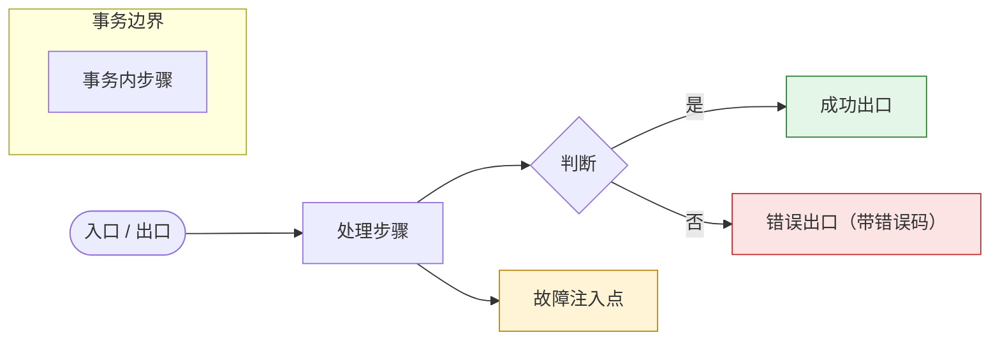
```mermaid
flowchart LR
    A(["入口 / 出口"]) --> B["处理步骤"]
    B --> C{"判断"}
    C -->|"是"| D["成功出口"]:::ok
    C -->|"否"| E["错误出口（带错误码）"]:::err
    B --> F["故障注入点"]:::fault
    subgraph TX["事务边界"]
        H["事务内步骤"]
    end
    classDef ok fill:#e3f6e8,stroke:#2e7d32
    classDef err fill:#fde4e4,stroke:#c62828
    classDef fault fill:#fff4d6,stroke:#b8860b
```

- 泳道图中 `Note` 内的“事务：……”表示一个数据库事务内完成的步骤；“故障点 xxx”为 BASE-15（`pkg/fault`）登记的故障注入点，括号里的 Cn 是 QA-01 故障演练的场景编号。
- “分片 s”指商户所属账户分片（`shard.Of(merchant_id)`，ACC-13）；“子账户 k”指 `crc32(biz_no) % PLATFORM_SUB_ACCOUNTS` 选中的平台子账户（OPT-03）。

### 0.3 渲染

GitHub、GitLab、IDEA/GoLand（Markdown 插件）、VS Code（Markdown Preview Mermaid Support）可直接渲染。截至 v2.12，图已用 `@mermaid-js/mermaid-cli` 12.0.0 渲染校验。v2.13 的 CF-23 未再渲染：当前环境没有 `mmdc`，也不新增 SVG。v2.14 只在 CF-24 图下加了文字，图本身没改，同样没有 `mmdc`，不新增 SVG。v2.16、v2.17 用 `npx -y @mermaid-js/mermaid-cli`（12.0.0）渲染全部 64 张图通过，v2.18 渲染全部 67 张图通过，都不新增 SVG。

## 1. 覆盖矩阵

业务功能点与图的对应关系。BASE（公共包，BASE-15 除外）、OPS-02、OPS-03、OPT-01（分阶段耗时埋点）、TL、QA-02（基线压测）、QA-03、QA-04、QA-05（优化后复测）、DOC 属于工程与交付类功能点，没有业务流程，不画图；BASE-15 的故障点标注在各图中，§4.10 汇总，QA-01 故障演练的场景编号写在 §4.10 的演练列。删除线为 v3.0 砍掉的功能点。

| 功能点 | 状态机 | 泳道图 | 控制流图 |
|---|---|---|---|
| ACC-13 账户分片路由 | — | SL-01、SL-12、SL-15 | CF-14、CF-19、CF-37 |
| ACC-01 开户、ACC-02 查询 | — | SL-10（开户只由 seed 调用） | — |
| ACC-03 记账、ACC-08 冲正（P1） | — | SL-01、SL-11 | CF-13 |
| ACC-04 冻结（REFUND / TRANSFER） | SM-04 | SL-05、SL-06、SL-12、SL-13 | CF-14 |
| ACC-05 解冻（空回滚、防悬挂） | SM-04 | SL-06、SL-13、SL-14 | CF-15 |
| ACC-06 确认扣款 | SM-04 | SL-05、SL-12、SL-14 | CF-16 |
| ACC-07 同分片转账（含失败墓碑） | SM-11 | SL-11 | CF-32 |
| ACC-14 收款方转账分支 | SM-11 | SL-12、SL-13、SL-14 | CF-33 |
| ~~ACC-09 流水查询~~（CUT） | — | — | — |
| ACC-10 余额核对（分片与在途守恒） | — | SL-10 | CF-17 |
| ACC-11 RPC 服务 | — | 各泳道中的 account 调用 | — |
| ~~ACC-12 热点账户~~（CUT，拆为 OPT-03、OPT-05） | — | — | — |
| CH-01 受理与自动完成、CH-04 退款受理 | SM-09 | SL-01、SL-05 | CF-22 |
| CH-02 查单 | — | SL-02 | CF-38 |
| CH-03 关单 | SM-09 | SL-04 | CF-23 |
| CH-05 回调、CH-06 故障场景、CH-07 全局配置 | — | SL-01、SL-02、SL-03 | CF-24 |
| CH-08 账单下载、CH-09 账单注入 | — | SL-09 | CF-25 |
| PAY-01 商户与密钥 | — | SL-01 | CF-01 |
| PAY-02 创建支付单 | SM-01 | SL-01 | CF-04 |
| PAY-03 发起支付 | SM-01、SM-03 | SL-01、SL-03 | CF-05 |
| PAY-04 支付结果推进 | SM-01、SM-03 | SL-01 | CF-06 |
| PAY-05 查单补偿 | SM-03 | SL-02 | CF-07 |
| PAY-06 商户关单、PAY-07 超时关单 | SM-01 | SL-04 | CF-08 |
| PAY-08 查询 | — | — | CF-01（网关管线后直接读库） |
| PAY-09 立即同步渠道状态 | — | SL-09 | CF-09 |
| REF-01 创建退款、REF-02 冻结与提交 | SM-02 | SL-05、SL-06 | CF-10 |
| REF-03 退款结果推进 | SM-02 | SL-05、SL-06 | CF-11 |
| REF-04 卡单恢复 | SM-02 | SL-06 | CF-12 |
| REF-05 查询 | — | — | CF-01 |
| TRF-01 创建转账单 | SM-10 | SL-11、SL-12 | CF-34 |
| TRF-02 同分片转账执行 | SM-10 | SL-11 | CF-34 |
| TRF-03 跨分片 TCC 协调 | SM-10 | SL-12、SL-13 | CF-35 |
| TRF-04 转账恢复任务 | SM-10 | SL-14 | CF-36 |
| TRF-05 转账查询 | — | — | CF-01（只有付款商户可查，其余 30001） |
| MQ-01 outbox 写入、MQ-02 投递 | SM-05 | SL-07 | CF-18 |
| MQ-03 消费框架、MQ-04 account 消费（逐条） | — | SL-07 | CF-19 |
| MQ-05 死信与重放、MQ-06 清理 | SM-05 | SL-07、SL-10 | CF-20 |
| NTF-01 生成、NTF-02 发送与固定间隔重试 | SM-06 | SL-08、SL-11、SL-12 | CF-21 |
| GW-01 骨架、GW-02 支付与余额路由、GW-03 验签、GW-04 防重放、GW-05 进程内限流、GW-08 密钥缓存 | — | SL-01 | CF-01 |
| GW-09 退款与转账路由 | — | SL-05、SL-11、SL-12 | CF-01 |
| GW-06 渠道回调入口 | — | SL-01 | CF-02 |
| GW-07 管理接口（重放、核对、触发对账） | — | SL-10 | CF-03 |
| REC-01 批次调度、REC-02 账单导入 | SM-07 | SL-09 | CF-26、CF-39、CF-40 |
| REC-03 外部比对 | SM-08 | SL-09 | CF-27、CF-40 |
| ~~REC-04 跨日处理~~（CUT） | — | — | — |
| REC-05 内部对账（支付、退款、转账） | SM-08 | SL-09 | CF-28 |
| REC-06 自动处理 | SM-08 | SL-09 | CF-29、CF-41 |
| ~~REC-07 人工处理与挂账~~（CUT，CF-30 只保留编号） | — | — | — |
| REC-08 报告 | — | SL-09、SL-10 | CF-40 |
| OPS-01 健康检查与优雅退出 | — | — | CF-31 |
| OPS-05 pprof 与管理端口 | — | — | CF-31 |
| BASE-15 故障注入点（`pkg/fault`） | — | 各泳道图中的“故障点 xxx” | 各控制流图中的故障点节点，§4.10 汇总 |
| QA-01 故障演练（C1–C13） | — | SL-02、SL-14、SL-15 等标注了场景编号的图 | §4.10 演练列 |
| ~~OPS-04 监控面板与告警规则~~（CUT） | — | — | — |
| OPT-02 批量记账合并提交 | — | SL-15 | CF-37 |
| OPT-03 平台子账户拆分 | — | SL-01、SL-15 | CF-16、CF-19、CF-37 |
| OPT-04 链路延迟优化 | — | SL-12（并行分支） | CF-35（`TRANSFER_PARALLEL_BRANCH`）、CF-01（GW-08 缓存） |
| OPT-05 平台账户缓冲入账（P2） | — | — | 方案未定，不画 |

## 2. 状态机

### SM-01 支付单 `payment_order`

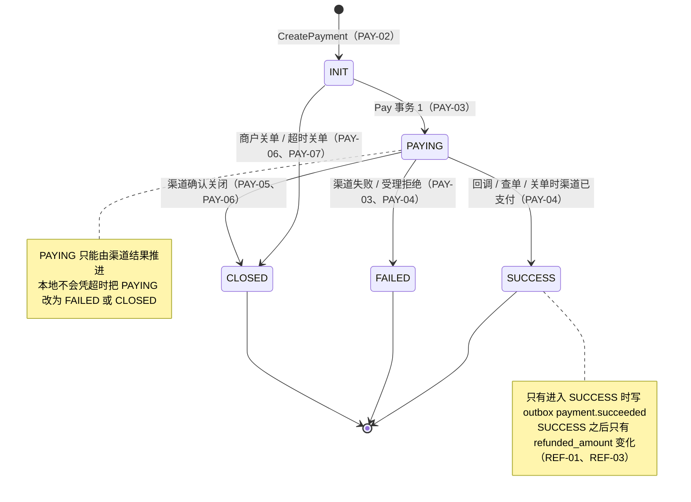
```mermaid
stateDiagram-v2
    [*] --> INIT: CreatePayment（PAY-02）
    INIT --> PAYING: Pay 事务 1（PAY-03）
    INIT --> CLOSED: 商户关单 / 超时关单（PAY-06、PAY-07）
    PAYING --> SUCCESS: 回调 / 查单 / 关单时渠道已支付（PAY-04）
    PAYING --> FAILED: 渠道失败 / 受理拒绝（PAY-03、PAY-04）
    PAYING --> CLOSED: 渠道确认关闭（PAY-05、PAY-06）
    SUCCESS --> [*]
    FAILED --> [*]
    CLOSED --> [*]
    note right of SUCCESS
        只有进入 SUCCESS 时写 outbox payment.succeeded
        SUCCESS 之后只有 refunded_amount 变化（REF-01、REF-03）
    end note
    note right of PAYING
        PAYING 只能由渠道结果推进
        本地不会凭超时把 PAYING 改为 FAILED 或 CLOSED
    end note
```

### SM-02 退款单 `refund_order`

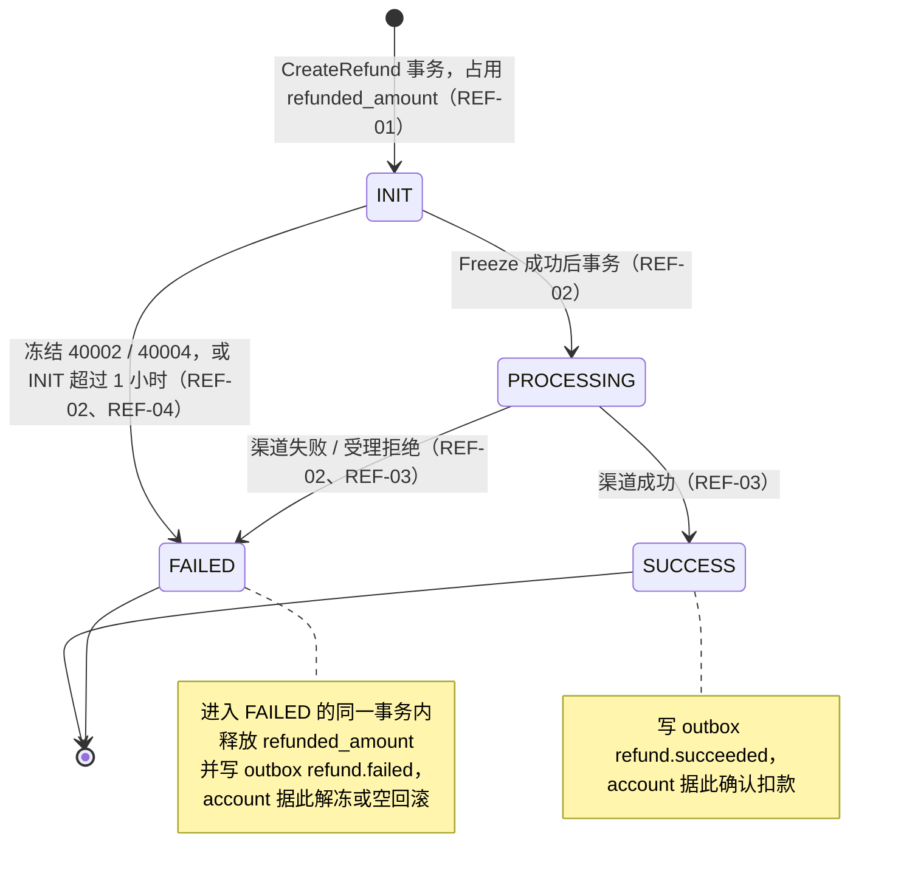
```mermaid
stateDiagram-v2
    [*] --> INIT: CreateRefund 事务，占用 refunded_amount（REF-01）
    INIT --> PROCESSING: Freeze 成功后事务（REF-02）
    INIT --> FAILED: 冻结 40002 / 40004，或 INIT 超过 1 小时（REF-02、REF-04）
    PROCESSING --> SUCCESS: 渠道成功（REF-03）
    PROCESSING --> FAILED: 渠道失败 / 受理拒绝（REF-02、REF-03）
    SUCCESS --> [*]
    FAILED --> [*]
    note right of FAILED
        进入 FAILED 的同一事务内释放 refunded_amount
        并写 outbox refund.failed，account 据此解冻或空回滚
    end note
    note right of SUCCESS
        写 outbox refund.succeeded，account 据此确认扣款
    end note
```

### SM-03 渠道交易 `channel_txn`

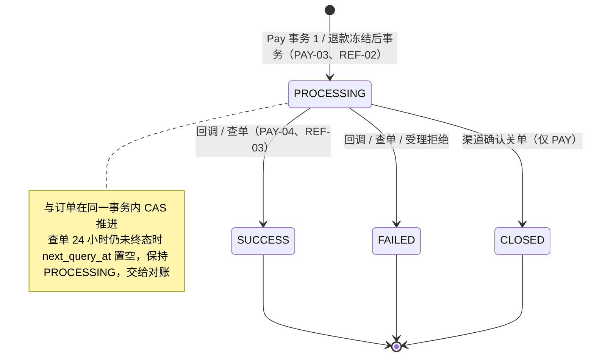
```mermaid
stateDiagram-v2
    [*] --> PROCESSING: Pay 事务 1 / 退款冻结后事务（PAY-03、REF-02）
    PROCESSING --> SUCCESS: 回调 / 查单（PAY-04、REF-03）
    PROCESSING --> FAILED: 回调 / 查单 / 受理拒绝
    PROCESSING --> CLOSED: 渠道确认关单（仅 PAY）
    SUCCESS --> [*]
    FAILED --> [*]
    CLOSED --> [*]
    note right of PROCESSING
        与订单在同一事务内 CAS 推进
        查单 24 小时仍未终态时 next_query_at 置空，保持 PROCESSING，交给对账
    end note
```

### SM-04 冻结单 `account_freeze`

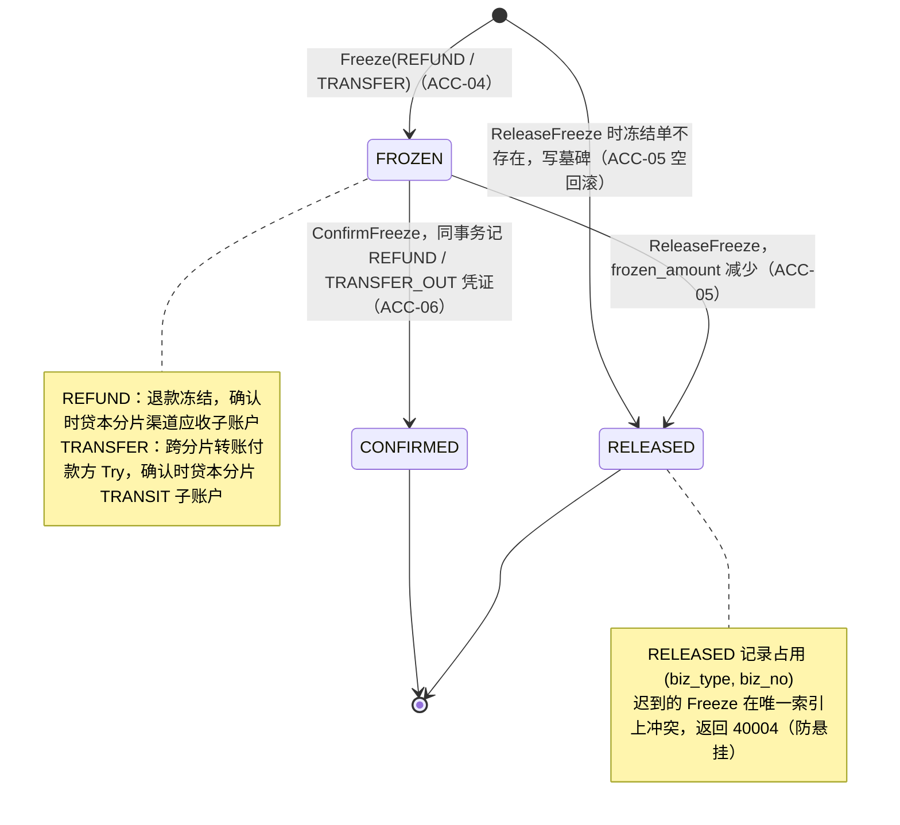
```mermaid
stateDiagram-v2
    [*] --> FROZEN: Freeze(REFUND / TRANSFER)（ACC-04）
    [*] --> RELEASED: ReleaseFreeze 时冻结单不存在，写墓碑（ACC-05 空回滚）
    FROZEN --> CONFIRMED: ConfirmFreeze，同事务记 REFUND / TRANSFER_OUT 凭证（ACC-06）
    FROZEN --> RELEASED: ReleaseFreeze，frozen_amount 减少（ACC-05）
    CONFIRMED --> [*]
    RELEASED --> [*]
    note right of FROZEN
        REFUND：退款冻结，确认时贷本分片渠道应收子账户
        TRANSFER：跨分片转账付款方 Try，确认时贷本分片 TRANSIT 子账户
    end note
    note right of RELEASED
        RELEASED 记录占用 (biz_type, biz_no)
        迟到的 Freeze 在唯一索引上冲突，返回 40004（防悬挂）
    end note
```

### SM-05 本地消息 `outbox`

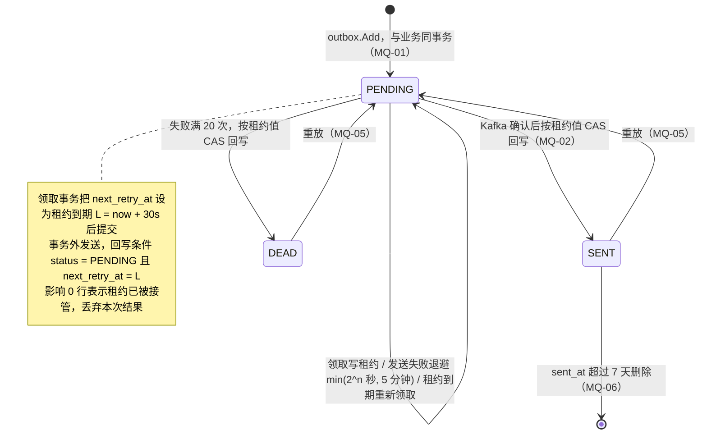
```mermaid
stateDiagram-v2
    [*] --> PENDING: outbox.Add，与业务同事务（MQ-01）
    PENDING --> PENDING: 领取写租约 / 发送失败退避 min(2^n 秒, 5 分钟) / 租约到期重新领取
    PENDING --> SENT: Kafka 确认后按租约值 CAS 回写（MQ-02）
    PENDING --> DEAD: 失败满 20 次，按租约值 CAS 回写
    SENT --> PENDING: 重放（MQ-05）
    DEAD --> PENDING: 重放（MQ-05）
    SENT --> [*]: sent_at 超过 7 天删除（MQ-06）
    note right of PENDING
        领取事务把 next_retry_at 设为租约到期 L = now + 30s 后提交
        事务外发送，回写条件 status = PENDING 且 next_retry_at = L
        影响 0 行表示租约已被接管，丢弃本次结果
    end note
```

### SM-06 商户通知 `merchant_notify`

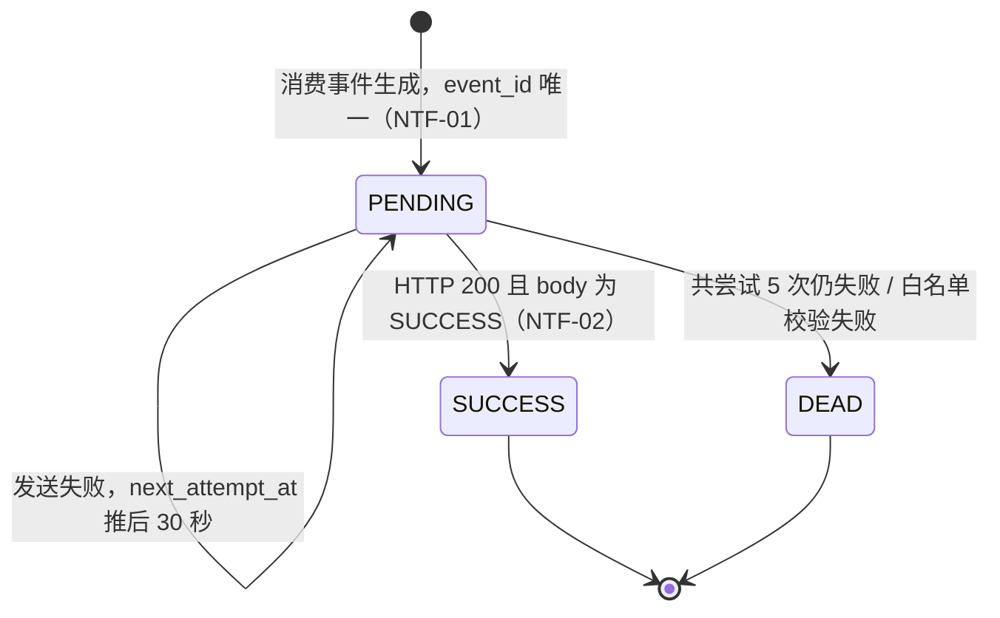
```mermaid
stateDiagram-v2
    [*] --> PENDING: 消费事件生成，event_id 唯一（NTF-01）
    PENDING --> PENDING: 发送失败，next_attempt_at 推后 30 秒
    PENDING --> SUCCESS: HTTP 200 且 body 为 SUCCESS（NTF-02）
    PENDING --> DEAD: 共尝试 5 次仍失败 / 白名单校验失败
    SUCCESS --> [*]
    DEAD --> [*]
```

### SM-07 对账批次 `recon_batch`

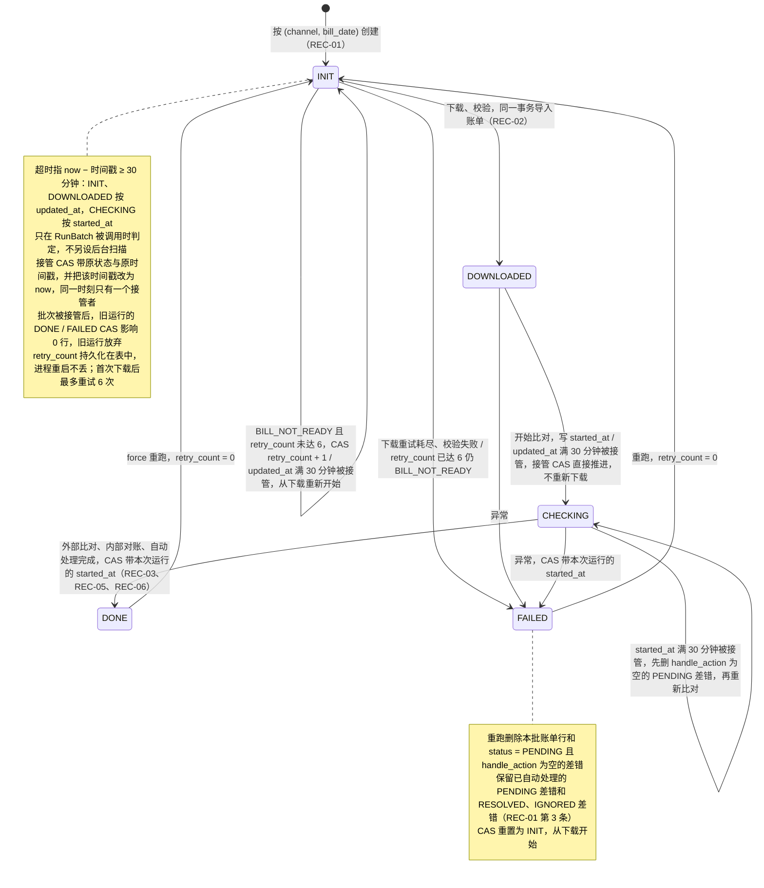
```mermaid
stateDiagram-v2
    [*] --> INIT: 按 (channel, bill_date) 创建（REC-01）
    INIT --> INIT: BILL_NOT_READY 且 retry_count 未达 6，CAS retry_count + 1 / updated_at 满 30 分钟被接管，从下载重新开始
    INIT --> DOWNLOADED: 下载、校验，同一事务导入账单（REC-02）
    DOWNLOADED --> CHECKING: 开始比对，写 started_at / updated_at 满 30 分钟被接管，接管 CAS 直接推进，不重新下载
    CHECKING --> CHECKING: started_at 满 30 分钟被接管，先删 handle_action 为空的 PENDING 差错，再重新比对
    CHECKING --> DONE: 外部比对、内部对账、自动处理完成，CAS 带本次运行的 started_at（REC-03、REC-05、REC-06）
    INIT --> FAILED: 下载重试耗尽、校验失败 / retry_count 已达 6 仍 BILL_NOT_READY
    DOWNLOADED --> FAILED: 异常
    CHECKING --> FAILED: 异常，CAS 带本次运行的 started_at
    FAILED --> INIT: 重跑，retry_count = 0
    DONE --> INIT: force 重跑，retry_count = 0
    note right of FAILED
        重跑删除本批账单行和 status = PENDING 且 handle_action 为空的差错
        保留已自动处理的 PENDING 差错和 RESOLVED、IGNORED 差错（REC-01 第 3 条）
        CAS 重置为 INIT，从下载开始
    end note
    note right of INIT
        超时指 now − 时间戳 ≥ 30 分钟：INIT、DOWNLOADED 按 updated_at，CHECKING 按 started_at
        只在 RunBatch 被调用时判定，不另设后台扫描
        接管 CAS 带原状态与原时间戳，并把该时间戳改为 now，同一时刻只有一个接管者
        批次被接管后，旧运行的 DONE / FAILED CAS 影响 0 行，旧运行放弃
        retry_count 持久化在表中，进程重启不丢；首次下载后最多重试 6 次
    end note
```

### SM-08 对账差错 `recon_diff`

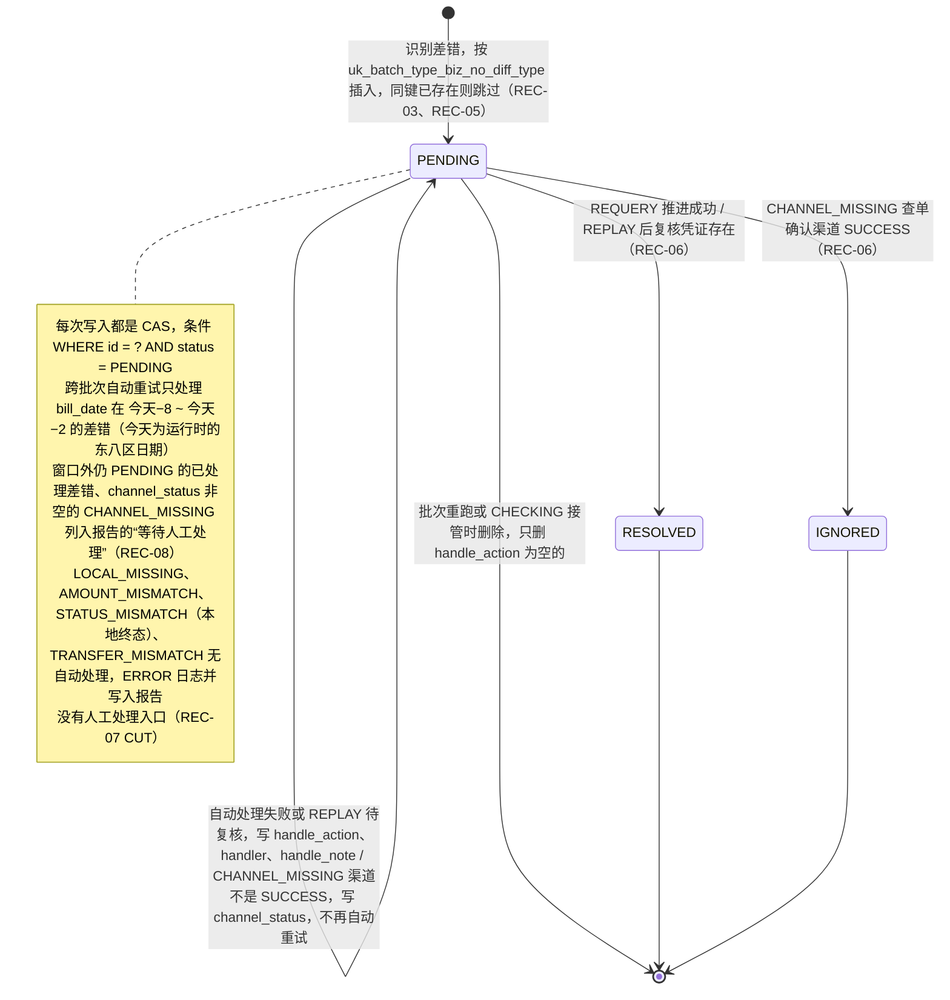
```mermaid
stateDiagram-v2
    [*] --> PENDING: 识别差错，按 uk_batch_type_biz_no_diff_type 插入，同键已存在则跳过（REC-03、REC-05）
    PENDING --> PENDING: 自动处理失败或 REPLAY 待复核，写 handle_action、handler、handle_note / CHANNEL_MISSING 渠道不是 SUCCESS，写 channel_status，不再自动重试
    PENDING --> RESOLVED: REQUERY 推进成功 / REPLAY 后复核凭证存在（REC-06）
    PENDING --> IGNORED: CHANNEL_MISSING 查单确认渠道 SUCCESS（REC-06）
    PENDING --> [*]: 批次重跑或 CHECKING 接管时删除，只删 handle_action 为空的
    RESOLVED --> [*]
    IGNORED --> [*]
    note right of PENDING
        每次写入都是 CAS，条件 WHERE id = ? AND status = PENDING
        跨批次自动重试只处理 bill_date 在 今天−8 ~ 今天−2 的差错（今天为运行时的东八区日期）
        窗口外仍 PENDING 的已处理差错、channel_status 非空的 CHANNEL_MISSING 列入报告的“等待人工处理”（REC-08）
        LOCAL_MISSING、AMOUNT_MISMATCH、STATUS_MISMATCH（本地终态）、TRANSFER_MISMATCH 无自动处理，ERROR 日志并写入报告
        没有人工处理入口（REC-07 CUT）
    end note
```

### SM-09 模拟渠道交易 `mock_txn`

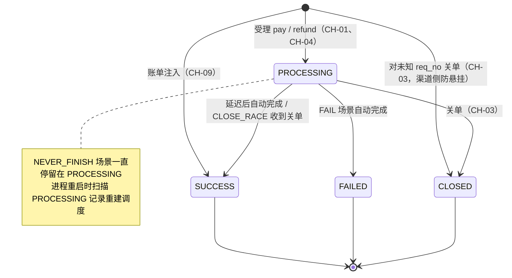
```mermaid
stateDiagram-v2
    [*] --> PROCESSING: 受理 pay / refund（CH-01、CH-04）
    [*] --> CLOSED: 对未知 req_no 关单（CH-03，渠道侧防悬挂）
    [*] --> SUCCESS: 账单注入（CH-09）
    PROCESSING --> SUCCESS: 延迟后自动完成 / CLOSE_RACE 收到关单
    PROCESSING --> FAILED: FAIL 场景自动完成
    PROCESSING --> CLOSED: 关单（CH-03）
    SUCCESS --> [*]
    FAILED --> [*]
    CLOSED --> [*]
    note right of PROCESSING
        NEVER_FINISH 场景一直停留在 PROCESSING
        进程重启时扫描 PROCESSING 记录重建调度
    end note
```

### SM-10 转账单 `transfer_order`

覆盖：TRF-01~04。触发方“请求线程”指 CreateTransfer 同一请求内的执行（TRF-02、TRF-03），“TRF-04”指恢复任务。

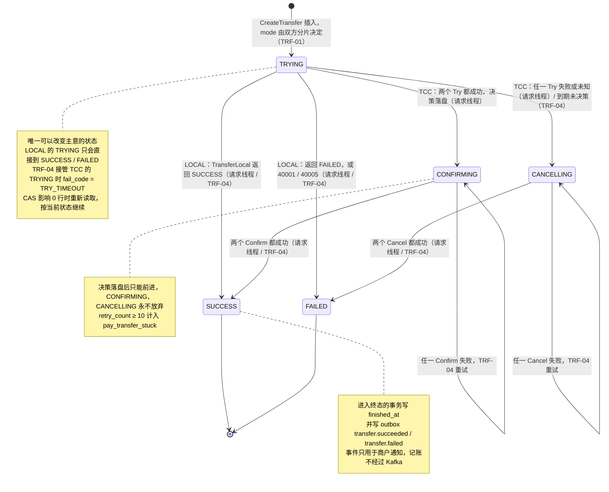
```mermaid
stateDiagram-v2
    [*] --> TRYING: CreateTransfer 插入，mode 由双方分片决定（TRF-01）
    TRYING --> SUCCESS: LOCAL：TransferLocal 返回 SUCCESS（请求线程 / TRF-04）
    TRYING --> FAILED: LOCAL：返回 FAILED，或 40001 / 40005（请求线程 / TRF-04）
    TRYING --> CONFIRMING: TCC：两个 Try 都成功，决策落盘（请求线程）
    TRYING --> CANCELLING: TCC：任一 Try 失败或未知（请求线程）/ 到期未决策（TRF-04）
    CONFIRMING --> SUCCESS: 两个 Confirm 都成功（请求线程 / TRF-04）
    CONFIRMING --> CONFIRMING: 任一 Confirm 失败，TRF-04 重试
    CANCELLING --> FAILED: 两个 Cancel 都成功（请求线程 / TRF-04）
    CANCELLING --> CANCELLING: 任一 Cancel 失败，TRF-04 重试
    SUCCESS --> [*]
    FAILED --> [*]
    note right of TRYING
        唯一可以改变主意的状态
        LOCAL 的 TRYING 只会直接到 SUCCESS / FAILED
        TRF-04 接管 TCC 的 TRYING 时 fail_code = TRY_TIMEOUT
        CAS 影响 0 行时重新读取，按当前状态继续
    end note
    note right of CONFIRMING
        决策落盘后只能前进，CONFIRMING、CANCELLING 永不放弃
        retry_count ≥ 10 计入 pay_transfer_stuck
    end note
    note right of SUCCESS
        进入终态的事务写 finished_at
        并写 outbox transfer.succeeded / transfer.failed
        事件只用于商户通知，记账不经过 Kafka
    end note
```

### SM-11 转账分支 `transfer_branch`

覆盖：ACC-07、ACC-14。分支按 `(transfer_no, role)` 在所在分片唯一。

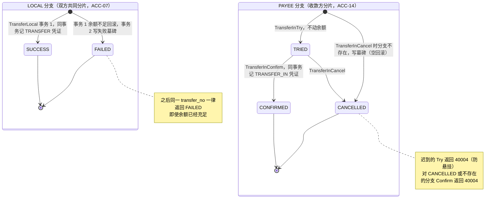
```mermaid
stateDiagram-v2
    state "LOCAL 分支（双方共同分片，ACC-07）" as LOCAL {
        [*] --> SUCCESS: TransferLocal 事务 1，同事务记 TRANSFER 凭证
        [*] --> FAILED: 事务 1 余额不足回滚，事务 2 写失败墓碑
        SUCCESS --> [*]
        FAILED --> [*]
        note right of FAILED
            之后同一 transfer_no 一律返回 FAILED
            即使余额已经充足
        end note
    }
    state "PAYEE 分支（收款方分片，ACC-14）" as PAYEE {
        [*] --> TRIED: TransferInTry，不动余额
        [*] --> CANCELLED: TransferInCancel 时分支不存在，写墓碑（空回滚）
        TRIED --> CONFIRMED: TransferInConfirm，同事务记 TRANSFER_IN 凭证
        TRIED --> CANCELLED: TransferInCancel
        CONFIRMED --> [*]
        CANCELLED --> [*]
        note right of CANCELLED
            迟到的 Try 返回 40004（防悬挂）
            对 CANCELLED 或不存在的分支 Confirm 返回 40004
        end note
    }
```

付款方分支就是 `biz_type = TRANSFER` 的冻结单，状态见 SM-04。

## 3. 泳道图

泳道：商户（paycli、merchant-demo）、gateway、Redis、payment、account、Kafka、channel_mock、recon、运营。payment 泳道包含其进程内的投递器、补偿任务、转账恢复任务和 `payment-notify` 消费者。转账图中 account 按分片拆为两条泳道（同一进程的两个连接池）。

### SL-01 支付主链路（NORMAL 场景）

覆盖：GW-01~05、GW-08、PAY-01~04、CH-01、CH-05、MQ-01~04、NTF-01~02、ACC-03、ACC-13、OPT-02、OPT-03。

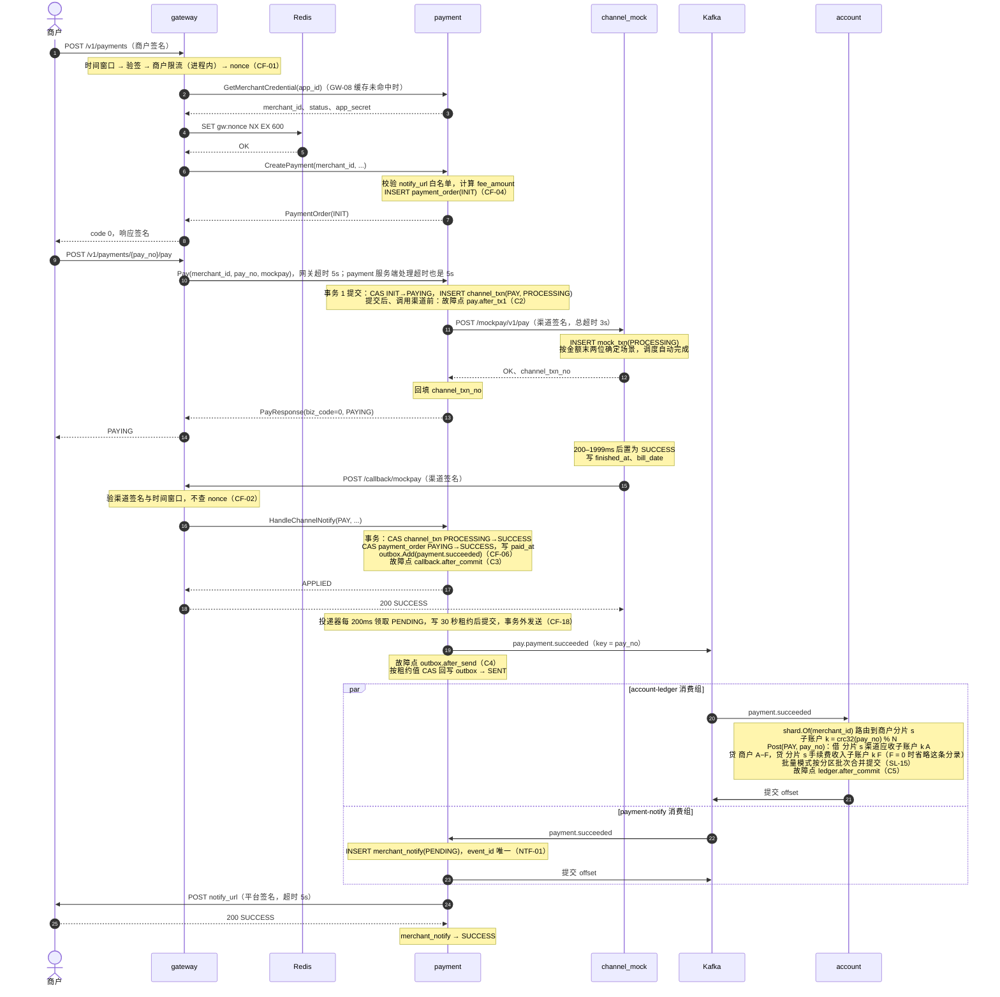
```mermaid
sequenceDiagram
    autonumber
    actor M as 商户
    participant GW as gateway
    participant R as Redis
    participant P as payment
    participant CH as channel_mock
    participant K as Kafka
    participant A as account

    M->>GW: POST /v1/payments（商户签名）
    Note over GW: 时间窗口 → 验签 → 商户限流（进程内）→ nonce（CF-01）
    GW->>P: GetMerchantCredential(app_id)（GW-08 缓存未命中时）
    P-->>GW: merchant_id、status、app_secret
    GW->>R: SET gw:nonce NX EX 600
    R-->>GW: OK
    GW->>P: CreatePayment(merchant_id, ...)
    Note over P: 校验 notify_url 白名单，计算 fee_amount<br/>INSERT payment_order(INIT)（CF-04）
    P-->>GW: PaymentOrder(INIT)
    GW-->>M: code 0，响应签名

    M->>GW: POST /v1/payments/{pay_no}/pay
    GW->>P: Pay(merchant_id, pay_no, mockpay)，网关超时 5s；payment 服务端处理超时也是 5s
    Note over P: 事务 1 提交：CAS INIT→PAYING，INSERT channel_txn(PAY, PROCESSING)<br/>提交后、调用渠道前：故障点 pay.after_tx1（C2）
    P->>CH: POST /mockpay/v1/pay（渠道签名，总超时 3s）
    Note over CH: INSERT mock_txn(PROCESSING)<br/>按金额末两位确定场景，调度自动完成
    CH-->>P: OK、channel_txn_no
    Note over P: 回填 channel_txn_no
    P-->>GW: PayResponse(biz_code=0, PAYING)
    GW-->>M: PAYING

    Note over CH: 200–1999ms 后置为 SUCCESS<br/>写 finished_at、bill_date
    CH->>GW: POST /callback/mockpay（渠道签名）
    Note over GW: 验渠道签名与时间窗口，不查 nonce（CF-02）
    GW->>P: HandleChannelNotify(PAY, ...)
    Note over P: 事务：CAS channel_txn PROCESSING→SUCCESS<br/>CAS payment_order PAYING→SUCCESS，写 paid_at<br/>outbox.Add(payment.succeeded)（CF-06）<br/>故障点 callback.after_commit（C3）
    P-->>GW: APPLIED
    GW-->>CH: 200 SUCCESS

    Note over P: 投递器每 200ms 领取 PENDING，写 30 秒租约后提交，事务外发送（CF-18）
    P->>K: pay.payment.succeeded（key = pay_no）
    Note over P: 故障点 outbox.after_send（C4）<br/>按租约值 CAS 回写 outbox → SENT

    par account-ledger 消费组
        K->>A: payment.succeeded
        Note over A: shard.Of(merchant_id) 路由到商户分片 s<br/>子账户 k = crc32(pay_no) % N<br/>Post(PAY, pay_no)：借 分片 s 渠道应收子账户 k A<br/>贷 商户 A−F，贷 分片 s 手续费收入子账户 k F（F = 0 时省略这条分录）<br/>批量模式按分区批次合并提交（SL-15）<br/>故障点 ledger.after_commit（C5）
        A->>K: 提交 offset
    and payment-notify 消费组
        K->>P: payment.succeeded
        Note over P: INSERT merchant_notify(PENDING)，event_id 唯一（NTF-01）
        P->>K: 提交 offset
    end

    P->>M: POST notify_url（平台签名，超时 5s）
    M-->>P: 200 SUCCESS
    Note over P: merchant_notify → SUCCESS
```

### SL-02 回调丢失与查单补偿

覆盖：PAY-05、CH-02、CH-03、CH-06（DROP_NOTIFY、SLOW）、C1、C2。

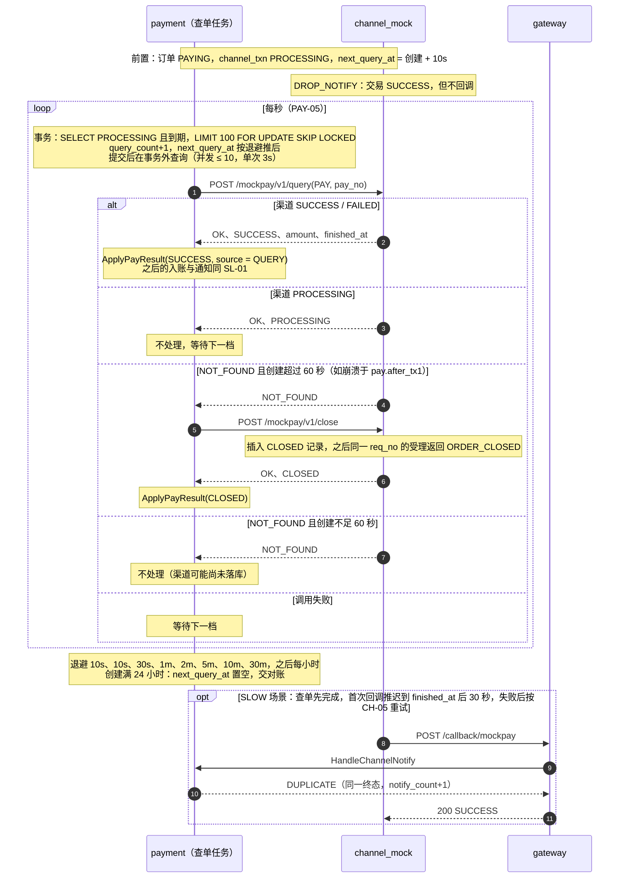
```mermaid
sequenceDiagram
    autonumber
    participant P as payment（查单任务）
    participant CH as channel_mock
    participant GW as gateway

    Note over P,CH: 前置：订单 PAYING，channel_txn PROCESSING，next_query_at = 创建 + 10s
    Note over CH: DROP_NOTIFY：交易 SUCCESS，但不回调

    loop 每秒（PAY-05）
        Note over P: 事务：SELECT PROCESSING 且到期，LIMIT 100 FOR UPDATE SKIP LOCKED<br/>query_count+1，next_query_at 按退避推后<br/>提交后在事务外查询（并发 ≤ 10，单次 3s）
        P->>CH: POST /mockpay/v1/query(PAY, pay_no)
        alt 渠道 SUCCESS / FAILED
            CH-->>P: OK、SUCCESS、amount、finished_at
            Note over P: ApplyPayResult(SUCCESS, source = QUERY)<br/>之后的入账与通知同 SL-01
        else 渠道 PROCESSING
            CH-->>P: OK、PROCESSING
            Note over P: 不处理，等待下一档
        else NOT_FOUND 且创建超过 60 秒（如崩溃于 pay.after_tx1）
            CH-->>P: NOT_FOUND
            P->>CH: POST /mockpay/v1/close
            Note over CH: 插入 CLOSED 记录，之后同一 req_no 的受理返回 ORDER_CLOSED
            CH-->>P: OK、CLOSED
            Note over P: ApplyPayResult(CLOSED)
        else NOT_FOUND 且创建不足 60 秒
            CH-->>P: NOT_FOUND
            Note over P: 不处理（渠道可能尚未落库）
        else 调用失败
            Note over P: 等待下一档
        end
    end

    Note over P: 退避 10s、10s、30s、1m、2m、5m、10m、30m，之后每小时<br/>创建满 24 小时：next_query_at 置空，交对账
    opt SLOW 场景：查单先完成，首次回调推迟到 finished_at 后 30 秒，失败后按 CH-05 重试
        CH->>GW: POST /callback/mockpay
        GW->>P: HandleChannelNotify
        P-->>GW: DUPLICATE（同一终态，notify_count+1）
        GW-->>CH: 200 SUCCESS
    end
```

PAY-05 已实现本图，分支细节（渠道 CLOSED、SUCCESS 缺字段、退款重提、超过 24 小时）见 CF-07。测试配置下 DROP_NOTIFY 在创建 10 秒后的第一次查单就变为 SUCCESS。未跑 mmdc，不新增 SVG。

### SL-03 发起支付结果未知（ACCEPT_TIMEOUT）

覆盖：PAY-03 第 6 条、CH-06（05）。

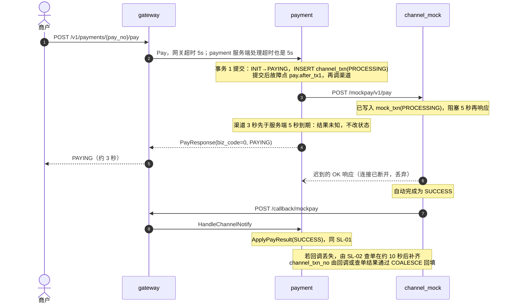
```mermaid
sequenceDiagram
    autonumber
    actor M as 商户
    participant GW as gateway
    participant P as payment
    participant CH as channel_mock

    M->>GW: POST /v1/payments/{pay_no}/pay
    GW->>P: Pay，网关超时 5s；payment 服务端处理超时也是 5s
    Note over P: 事务 1 提交：INIT→PAYING，INSERT channel_txn(PROCESSING)<br/>提交后故障点 pay.after_tx1，再调渠道
    P->>CH: POST /mockpay/v1/pay
    Note over CH: 已写入 mock_txn(PROCESSING)，阻塞 5 秒再响应
    Note over P: 渠道 3 秒先于服务端 5 秒到期：结果未知，不改状态
    P-->>GW: PayResponse(biz_code=0, PAYING)
    GW-->>M: PAYING（约 3 秒）
    CH--)P: 迟到的 OK 响应（连接已断开，丢弃）
    Note over CH: 自动完成为 SUCCESS
    CH->>GW: POST /callback/mockpay
    GW->>P: HandleChannelNotify
    Note over P: ApplyPayResult(SUCCESS)，同 SL-01
    Note over P,CH: 若回调丢失，由 SL-02 查单在约 10 秒后补齐<br/>channel_txn_no 由回调或查单结果通过 COALESCE 回填
```

### SL-04 商户关单与超时关单

覆盖：PAY-06、PAY-07、CH-03、CH-06（NEVER_FINISH、CLOSE_RACE）。

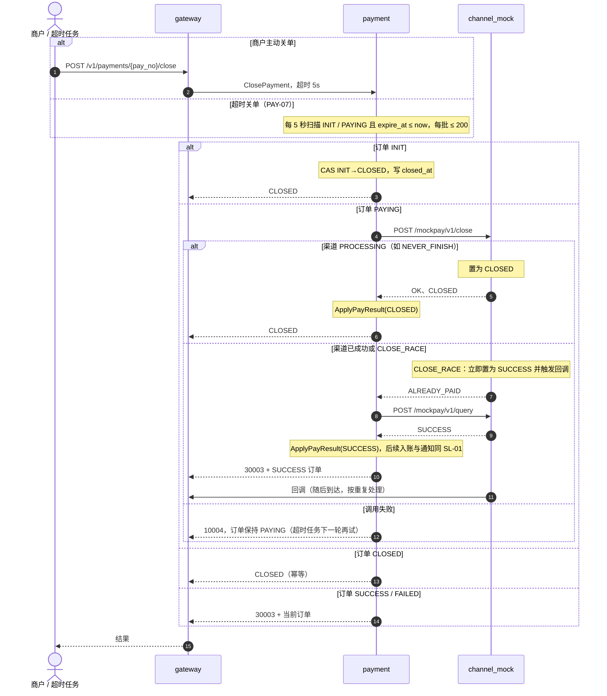
```mermaid
sequenceDiagram
    autonumber
    actor M as 商户 / 超时任务
    participant GW as gateway
    participant P as payment
    participant CH as channel_mock

    alt 商户主动关单
        M->>GW: POST /v1/payments/{pay_no}/close
        GW->>P: ClosePayment，超时 5s
    else 超时关单（PAY-07）
        Note over P: 每 5 秒扫描 INIT / PAYING 且 expire_at ≤ now，每批 ≤ 200
    end

    alt 订单 INIT
        Note over P: CAS INIT→CLOSED，写 closed_at
        P-->>GW: CLOSED
    else 订单 PAYING
        P->>CH: POST /mockpay/v1/close
        alt 渠道 PROCESSING（如 NEVER_FINISH）
            Note over CH: 置为 CLOSED
            CH-->>P: OK、CLOSED
            Note over P: ApplyPayResult(CLOSED)
            P-->>GW: CLOSED
        else 渠道已成功或 CLOSE_RACE
            Note over CH: CLOSE_RACE：立即置为 SUCCESS 并触发回调
            CH-->>P: ALREADY_PAID
            P->>CH: POST /mockpay/v1/query
            CH-->>P: SUCCESS
            Note over P: ApplyPayResult(SUCCESS)，后续入账与通知同 SL-01
            P-->>GW: 30003 + SUCCESS 订单
            CH->>GW: 回调（随后到达，按重复处理）
        else 调用失败
            P-->>GW: 10004，订单保持 PAYING（超时任务下一轮再试）
        end
    else 订单 CLOSED
        P-->>GW: CLOSED（幂等）
    else 订单 SUCCESS / FAILED
        P-->>GW: 30003 + 当前订单
    end
    GW-->>M: 结果
```

### SL-05 退款成功链路

覆盖：GW-09、REF-01~03、ACC-04、ACC-06、ACC-13、CH-04、MQ-04、NTF-01~02。

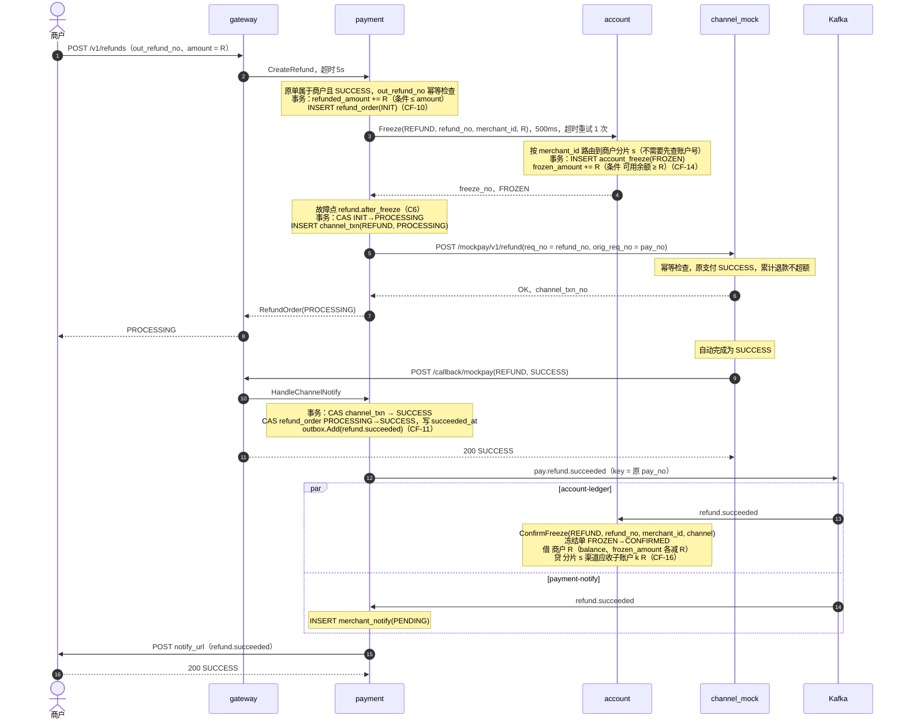
```mermaid
sequenceDiagram
    autonumber
    actor M as 商户
    participant GW as gateway
    participant P as payment
    participant A as account
    participant CH as channel_mock
    participant K as Kafka

    M->>GW: POST /v1/refunds（out_refund_no、amount = R）
    GW->>P: CreateRefund，超时 5s
    Note over P: 原单属于商户且 SUCCESS，out_refund_no 幂等检查<br/>事务：refunded_amount += R（条件 ≤ amount）<br/>INSERT refund_order(INIT)（CF-10）
    P->>A: Freeze(REFUND, refund_no, merchant_id, R)，500ms，超时重试 1 次
    Note over A: 按 merchant_id 路由到商户分片 s（不需要先查账户号）<br/>事务：INSERT account_freeze(FROZEN)<br/>frozen_amount += R（条件 可用余额 ≥ R）（CF-14）
    A-->>P: freeze_no、FROZEN
    Note over P: 故障点 refund.after_freeze（C6）<br/>事务：CAS INIT→PROCESSING<br/>INSERT channel_txn(REFUND, PROCESSING)
    P->>CH: POST /mockpay/v1/refund(req_no = refund_no, orig_req_no = pay_no)
    Note over CH: 幂等检查，原支付 SUCCESS，累计退款不超额
    CH-->>P: OK、channel_txn_no
    P-->>GW: RefundOrder(PROCESSING)
    GW-->>M: PROCESSING

    Note over CH: 自动完成为 SUCCESS
    CH->>GW: POST /callback/mockpay(REFUND, SUCCESS)
    GW->>P: HandleChannelNotify
    Note over P: 事务：CAS channel_txn → SUCCESS<br/>CAS refund_order PROCESSING→SUCCESS，写 succeeded_at<br/>outbox.Add(refund.succeeded)（CF-11）
    GW-->>CH: 200 SUCCESS
    P->>K: pay.refund.succeeded（key = 原 pay_no）

    par account-ledger
        K->>A: refund.succeeded
        Note over A: ConfirmFreeze(REFUND, refund_no, merchant_id, channel)<br/>冻结单 FROZEN→CONFIRMED<br/>借 商户 R（balance、frozen_amount 各减 R）<br/>贷 分片 s 渠道应收子账户 k R（CF-16）
    and payment-notify
        K->>P: refund.succeeded
        Note over P: INSERT merchant_notify(PENDING)
    end
    P->>M: POST notify_url（refund.succeeded）
    M-->>P: 200 SUCCESS
```

### SL-06 退款失败与卡单恢复

覆盖：REF-02~04、ACC-05（空回滚、防悬挂）、MQ-04。

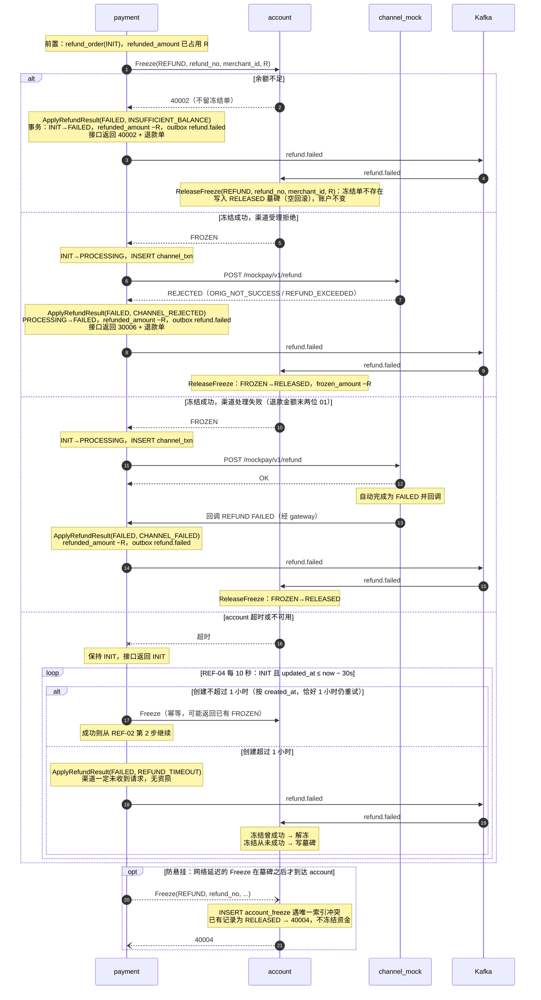
```mermaid
sequenceDiagram
    autonumber
    participant P as payment
    participant A as account
    participant CH as channel_mock
    participant K as Kafka

    Note over P: 前置：refund_order(INIT)，refunded_amount 已占用 R
    P->>A: Freeze(REFUND, refund_no, merchant_id, R)

    alt 余额不足
        A-->>P: 40002（不留冻结单）
        Note over P: ApplyRefundResult(FAILED, INSUFFICIENT_BALANCE)<br/>事务：INIT→FAILED，refunded_amount −R，outbox refund.failed<br/>接口返回 40002 + 退款单
        P->>K: refund.failed
        K->>A: refund.failed
        Note over A: ReleaseFreeze(REFUND, refund_no, merchant_id, R)：冻结单不存在<br/>写入 RELEASED 墓碑（空回滚），账户不变
    else 冻结成功，渠道受理拒绝
        A-->>P: FROZEN
        Note over P: INIT→PROCESSING，INSERT channel_txn
        P->>CH: POST /mockpay/v1/refund
        CH-->>P: REJECTED（ORIG_NOT_SUCCESS / REFUND_EXCEEDED）
        Note over P: ApplyRefundResult(FAILED, CHANNEL_REJECTED)<br/>PROCESSING→FAILED，refunded_amount −R，outbox refund.failed<br/>接口返回 30006 + 退款单
        P->>K: refund.failed
        K->>A: refund.failed
        Note over A: ReleaseFreeze：FROZEN→RELEASED，frozen_amount −R
    else 冻结成功，渠道处理失败（退款金额末两位 01）
        A-->>P: FROZEN
        Note over P: INIT→PROCESSING，INSERT channel_txn
        P->>CH: POST /mockpay/v1/refund
        CH-->>P: OK
        Note over CH: 自动完成为 FAILED 并回调
        CH->>P: 回调 REFUND FAILED（经 gateway）
        Note over P: ApplyRefundResult(FAILED, CHANNEL_FAILED)<br/>refunded_amount −R，outbox refund.failed
        P->>K: refund.failed
        K->>A: refund.failed
        Note over A: ReleaseFreeze：FROZEN→RELEASED
    else account 超时或不可用
        A--xP: 超时
        Note over P: 保持 INIT，接口返回 INIT
        loop REF-04 每 10 秒：INIT 且 updated_at ≤ now − 30s
            alt 创建不超过 1 小时（按 created_at，恰好 1 小时仍重试）
                P->>A: Freeze（幂等，可能返回已有 FROZEN）
                Note over P: 成功则从 REF-02 第 2 步继续
            else 创建超过 1 小时
                Note over P: ApplyRefundResult(FAILED, REFUND_TIMEOUT)<br/>渠道一定未收到请求，无资损
                P->>K: refund.failed
                K->>A: refund.failed
                Note over A: 冻结曾成功 → 解冻<br/>冻结从未成功 → 写墓碑
            end
        end
    end

    opt 防悬挂：网络延迟的 Freeze 在墓碑之后才到达 account
        P--)A: Freeze(REFUND, refund_no, ...)
        Note over A: INSERT account_freeze 遇唯一索引冲突<br/>已有记录为 RELEASED → 40004，不冻结资金
        A--)P: 40004
    end
```

### SL-07 事件投递、消费、死信与重放

覆盖：MQ-01~06。

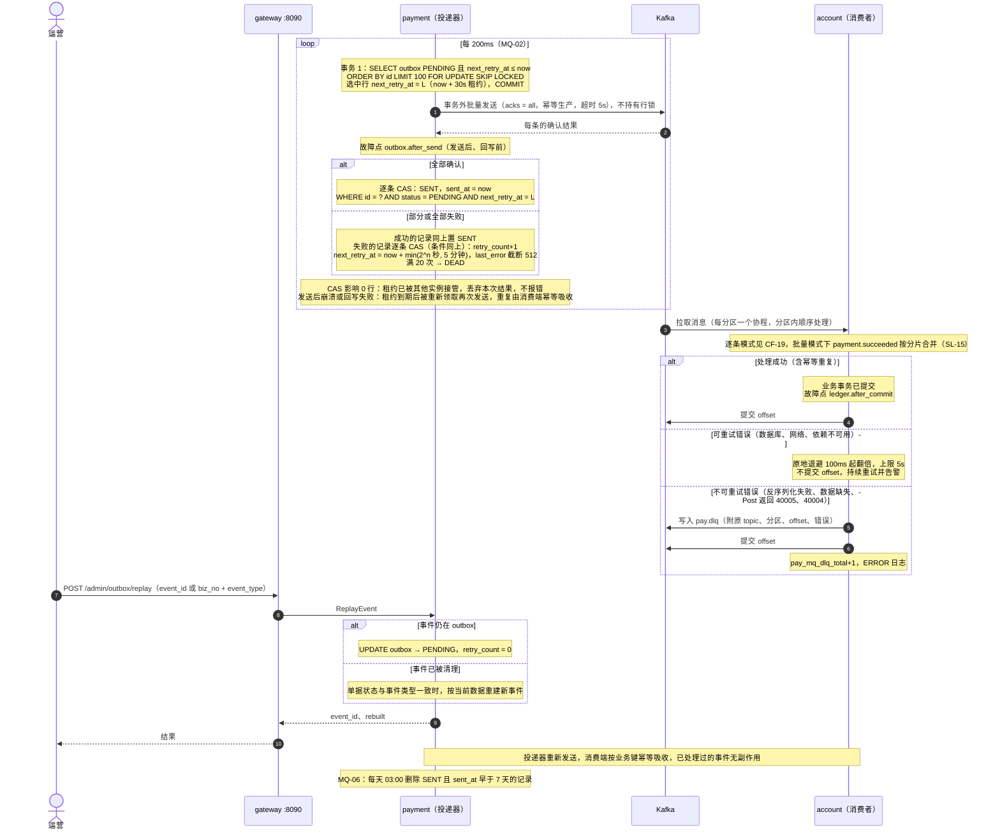
```mermaid
sequenceDiagram
    autonumber
    actor O as 运营
    participant GW as gateway :8090
    participant P as payment（投递器）
    participant K as Kafka
    participant A as account（消费者）

    loop 每 200ms（MQ-02）
        Note over P: 事务 1：SELECT outbox PENDING 且 next_retry_at ≤ now<br/>ORDER BY id LIMIT 100 FOR UPDATE SKIP LOCKED<br/>选中行 next_retry_at = L（now + 30s 租约），COMMIT
        P->>K: 事务外批量发送（acks = all，幂等生产，超时 5s），不持有行锁
        K-->>P: 每条的确认结果
        Note over P: 故障点 outbox.after_send（发送后、回写前）
        alt 全部确认
            Note over P: 逐条 CAS：SENT，sent_at = now<br/>WHERE id = ? AND status = PENDING AND next_retry_at = L
        else 部分或全部失败
            Note over P: 成功的记录同上置 SENT<br/>失败的记录逐条 CAS（条件同上）：retry_count+1<br/>next_retry_at = now + min(2^n 秒, 5 分钟)，last_error 截断 512<br/>满 20 次 → DEAD
        end
        Note over P: CAS 影响 0 行：租约已被其他实例接管，丢弃本次结果，不报错<br/>发送后崩溃或回写失败：租约到期后被重新领取再次发送，重复由消费端幂等吸收
    end

    K->>A: 拉取消息（每分区一个协程，分区内顺序处理）
    Note over A: 逐条模式见 CF-19，批量模式下 payment.succeeded 按分片合并（SL-15）
    alt 处理成功（含幂等重复）
        Note over A: 业务事务已提交<br/>故障点 ledger.after_commit
        A->>K: 提交 offset
    else 可重试错误（数据库、网络、依赖不可用）
        Note over A: 原地退避 100ms 起翻倍，上限 5s<br/>不提交 offset，持续重试并告警
    else 不可重试错误（反序列化失败、数据缺失、Post 返回 40005、40004）
        A->>K: 写入 pay.dlq（附原 topic、分区、offset、错误）
        A->>K: 提交 offset
        Note over A: pay_mq_dlq_total+1，ERROR 日志
    end

    O->>GW: POST /admin/outbox/replay（event_id 或 biz_no + event_type）
    GW->>P: ReplayEvent
    alt 事件仍在 outbox
        Note over P: UPDATE outbox → PENDING，retry_count = 0
    else 事件已被清理
        Note over P: 单据状态与事件类型一致时，按当前数据重建新事件
    end
    P-->>GW: event_id、rebuilt
    GW-->>O: 结果
    Note over P,A: 投递器重新发送，消费端按业务键幂等吸收，已处理过的事件无副作用
    Note over P: MQ-06：每天 03:00 删除 SENT 且 sent_at 早于 7 天的记录
```

“告警”统一指对应指标加一并输出 ERROR 日志（OPS-04 CUT，不配置告警规则）。

### SL-08 商户通知重试

覆盖：NTF-02、TL-02。

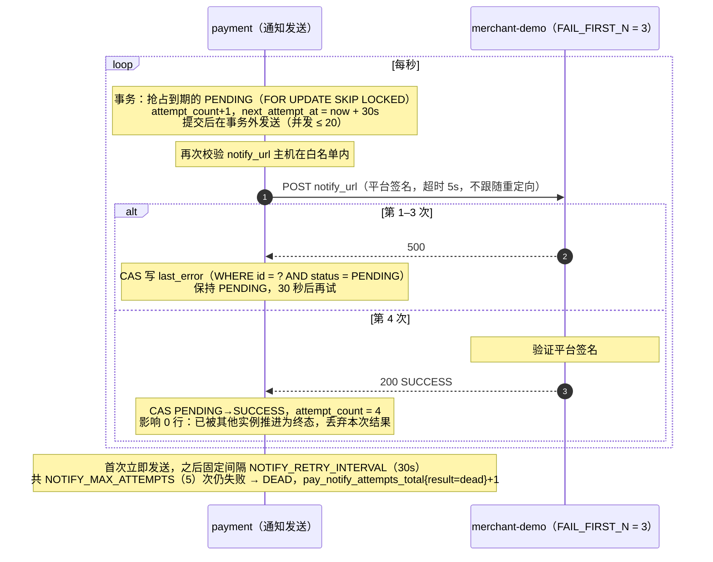
```mermaid
sequenceDiagram
    autonumber
    participant P as payment（通知发送）
    participant MD as merchant-demo（FAIL_FIRST_N = 3）

    loop 每秒
        Note over P: 事务：抢占到期的 PENDING（FOR UPDATE SKIP LOCKED）<br/>attempt_count+1，next_attempt_at = now + 30s<br/>提交后在事务外发送（并发 ≤ 20）
        Note over P: 再次校验 notify_url 主机在白名单内
        P->>MD: POST notify_url（平台签名，超时 5s，不跟随重定向）
        alt 第 1–3 次
            MD-->>P: 500
            Note over P: CAS 写 last_error（WHERE id = ? AND status = PENDING）<br/>保持 PENDING，30 秒后再试
        else 第 4 次
            Note over MD: 验证平台签名
            MD-->>P: 200 SUCCESS
            Note over P: CAS PENDING→SUCCESS，attempt_count = 4<br/>影响 0 行：已被其他实例推进为终态，丢弃本次结果
        end
    end
    Note over P: 首次立即发送，之后固定间隔 NOTIFY_RETRY_INTERVAL（30s）<br/>共 NOTIFY_MAX_ATTEMPTS（5）次仍失败 → DEAD，pay_notify_attempts_total{result=dead}+1
```

merchant-demo 的 `POST /notify` 与 `GET /stats` 已实现（TL-02）。验签用请求体里的 `merchant_id` 代入 `DEMO_APP_SECRET_FORMAT`。签名失败返回 401，不计入次数。`FAIL_FIRST_N` 只计验签通过并取到单号的通知。payment 的 `notify_send` 已按本图发送（NTF-02）：每秒扫描，事务外最多 20 并发，回写用 CAS。图的节点不改。未跑 mmdc，不新增 SVG。

### SL-09 日终对账与自动处理

覆盖：REC-01~03、REC-05、REC-06、REC-08、CH-08、PAY-09、MQ-05。

```mermaid
sequenceDiagram
    autonumber
    participant T as 调度 / CLI / 管理接口
    participant RC as recon
    participant CH as channel_mock
    participant PD as pay_payment（只读）
    participant AD as pay_account_0 / 1（只读）
    participant P as payment

    T->>RC: RunBatch(mockpay, D)，D 为账期 bill_date
    Note over T: 每日定时在 D 的次日 RECON_RUN_AT（默认 10:00）发起（REC-01 规则 1）<br/>同一次定时触发还对 bill_date 在 今天−8 ~ 今天−2 的 INIT / DOWNLOADED / CHECKING 已有批次逐个调用 RunBatch<br/>今天为运行时的东八区日期。不补建缺失账期，FAILED、DONE 不处理，CLI 与管理接口不做这一步
    Note over RC: 按 uk_channel_bill_date 创建或取得批次（CF-26）<br/>满 30 分钟视为卡死，CAS 接管：INIT、DOWNLOADED 按 updated_at，CHECKING 按 started_at<br/>INIT 接管从下载开始，DOWNLOADED 接管直接 CAS 到 CHECKING<br/>CHECKING 接管与重跑只删 status = PENDING 且 handle_action 为空的差错，重跑另删账单行、retry_count = 0
    RC->>CH: GET /mockpay/v1/bills?date=D（超时 30s，失败重试 3 次）
    alt BILL_NOT_READY
        CH-->>RC: BILL_NOT_READY
        Note over RC: retry_count 未达 6：CAS retry_count + 1，updated_at = now，批次保持 INIT<br/>注入时钟的调度器 30 分钟后对该批次再调用 RunBatch，按 INIT 超时接管重新下载<br/>retry_count 已达 6：CAS → FAILED，error_msg = BILL_NOT_READY（CF-39）
    else 账单就绪
        CH-->>RC: CSV + X-Bill-Sha256 + X-Bill-Count
        Note over RC: 校验哈希与行数，严格解析<br/>一个事务内每 1000 行批量插入并置 DOWNLOADED<br/>CAS → CHECKING，写 started_at = T0
        RC->>PD: 读 channel_txn（D 日 SUCCESS，及账单行按匹配键回查）
        Note over RC: 外部比对（REC-03，CF-27）：LOCAL_MISSING、STATUS_MISMATCH、<br/>AMOUNT_MISMATCH、CHANNEL_MISSING，不做跨日处理<br/>差错按 uk_batch_type_biz_no_diff_type 插入，同键已存在则跳过
        RC->>PD: 读 D 日成功支付单、成功退款单、终态转账单
        RC->>AD: 按分片读 ledger_txn、account_freeze、transfer_branch
        Note over RC: 内部对账（REC-05，CF-28）：LEDGER_MISSING、TRANSFER_MISMATCH<br/>内存比对，不跨 schema JOIN，插入规则同外部比对

        Note over RC: 自动处理本次新插入的差错（REC-06，CF-29）
        RC->>P: SyncChannelTxn(biz_no)（STATUS_MISMATCH 本地 PROCESSING、CHANNEL_MISSING）
        P->>CH: POST /mockpay/v1/query
        CH-->>P: 渠道状态
        Note over P: 本地 PROCESSING 时按查单规则推进（CF-09）
        P-->>RC: local_status、channel_status、changed
        Note over RC: 推进成功 → CAS RESOLVED，渠道确认 SUCCESS → CAS IGNORED<br/>CHANNEL_MISSING 渠道不是 SUCCESS → 严重不一致：写 channel_status，ERROR 日志<br/>pay_recon_channel_inconsistent_total + 1，不再自动重试<br/>调用出错或超时 → 写 handle_action、handle_note，保持 PENDING
        RC->>P: ReplayEvent(biz_no, event_type)（LEDGER_MISSING）
        Note over P: outbox 重新投递，account 补入账
        P-->>RC: event_id
        Note over RC: handle_action = REPLAY，保持 PENDING 等待复核<br/>其余差错保持 PENDING，ERROR 日志并写入报告<br/>RESOLVED、IGNORED 的 CAS 影响 0 行：重新读取按当前状态返回，读不到按“已不存在”返回
        Note over RC: 跨批次（CF-41），只处理 bill_date 在 今天−8 ~ 今天−2 的差错，不限批次<br/>handle_action = REQUERY 的再调 SyncChannelTxn，排除 channel_status 非空的 CHANNEL_MISSING<br/>REPLAY 的 LEDGER_MISSING 复核，凭证仍缺失则再次 ReplayEvent
        Note over RC: 写入本次重新计算的笔数、金额、匹配数，diff_count = 本批 recon_diff 实际行数<br/>CAS CHECKING → DONE，条件带 started_at = T0（CF-40）<br/>影响 0 行表示批次已被接管或重跑，旧运行放弃<br/>指标 pay_recon_diffs_total、pay_recon_pending_diffs
    end
    RC-->>T: 批次统计、前 100 条差错、“等待人工处理”的总数与前 100 条（REC-08）
```

### SL-10 运营操作

覆盖：GW-07、MQ-05、ACC-10、REC-01、REC-08。

```mermaid
sequenceDiagram
    autonumber
    actor O as 运营（paycli admin）
    participant GW as gateway :8090
    participant RC as recon
    participant P as payment
    participant A as account

    O->>GW: 请求（X-Admin-Token，写操作带 X-Admin-Operator）
    Note over GW: 常量时间比较 Token，失败 401 / 20005<br/>写操作缺 Operator → 10001，写审计日志（CF-03）
    alt 事件重放 POST /admin/outbox/replay
        GW->>P: ReplayEvent(event_id 或 biz_no + event_type)（CF-20）
        P-->>GW: event_id、rebuilt
    else 余额核对 POST /admin/accounts/check
        GW->>A: CheckBalance(merchant_id 或全量, expect_quiescent)（CF-17）
        Note over A: 每个分片一个一致性快照，全量时含在途守恒
        A-->>GW: passed、failures
    else 执行对账 POST /admin/recon/run
        GW->>RC: RunBatch(channel, bill_date, force)（SL-09）
        Note over RC: 只处理指定账期，不顺带处理前 7 个账期（只有每日定时做）
        RC-->>GW: 批次统计、前 100 条差错、“等待人工处理”的总数与前 100 条（REC-08）
    end
    GW-->>O: 统一响应（不签名）
    Note over GW,A: 管理接口只有以上三个（GW-07）<br/>开户 OpenAccount 只由 seed 调用（BASE-03），不对运营开放
```

### SL-11 同分片转账

覆盖：GW-09、TRF-01、TRF-02、ACC-07、ACC-13、NTF-01~02。示例 `M100001 → M100003`，双方都在分片 1。

```mermaid
sequenceDiagram
    autonumber
    actor M as 商户 M100001
    participant GW as gateway
    participant P as payment
    participant A as account（分片 1）
    participant K as Kafka

    M->>GW: POST /v1/transfers（payee_merchant_id = M100003，amount = T）
    Note over GW: 管线同 SL-01（CF-01），CreateTransfer 调用超时 3s
    GW->>P: CreateTransfer(merchant_id, out_transfer_no, payee, T)
    Note over P: (merchant_id, out_transfer_no) 幂等检查，已有单直接返回<br/>没有已有单时：收款方存在、ACTIVE、不是自己，否则 30008<br/>双方 shard.Of 都为 1 → mode = LOCAL<br/>INSERT transfer_order(TRYING, next_retry_at = now + 10s)（CF-34）
    P->>A: TransferLocal(transfer_no, M100001, M100003, T)，500ms，超时重试 1 次
    alt 余额充足
        Note over A: 事务 1：INSERT transfer_branch(LOCAL, SUCCESS)<br/>Post(TRANSFER)：借 付款商户 T，贷 收款商户 T<br/>账户按 id 升序加锁，回写 txn_no（CF-32）
        A-->>P: SUCCESS、txn_no
        Note over P: 事务：CAS TRYING→SUCCESS，写 txn_no、finished_at<br/>outbox.Add(transfer.succeeded)
        P-->>GW: TransferOrder(SUCCESS)
        GW-->>M: code 0
    else 余额不足
        Note over A: 事务 1 中 Post 返回 40002，ROLLBACK<br/>事务 2：INSERT transfer_branch(LOCAL, FAILED, INSUFFICIENT_BALANCE) 失败墓碑
        A-->>P: FAILED、INSUFFICIENT_BALANCE（业务结果，不是错误码）
        Note over P: 事务：CAS TRYING→FAILED，写 fail_code、finished_at<br/>outbox.Add(transfer.failed)
        P-->>GW: TransferOrder(FAILED)
        GW-->>M: 40002 + 转账单
    else 超时、10003、10004
        A--xP: 超时
        Note over P: 保持 TRYING，由 TRF-04 重新调用 TransferLocal<br/>分支记录保证重试拿到同一结果
        P-->>GW: TransferOrder(TRYING)
        GW-->>M: code 0（处理中）
    end

    opt 进入终态后
        P->>K: pay.transfer.succeeded / failed（key = transfer_no）
        K->>P: payment-notify 消费组
        Note over P: INSERT merchant_notify(PENDING)，只通知付款商户<br/>notify_url 取转账单，为空取付款商户默认地址（CF-21）
        P->>M: POST notify_url
    end
    Note over P,A: 转账事件不被 account 消费，记账已由 TransferLocal 同步完成
```

### SL-12 跨分片转账成功

覆盖：GW-09、TRF-01、TRF-03、ACC-04、ACC-06、ACC-14、OPT-04（并行分支）。示例 `M100001`（分片 1）`→ M100002`（分片 0）。

```mermaid
sequenceDiagram
    autonumber
    actor M as 商户 M100001
    participant GW as gateway
    participant P as payment（协调者）
    participant A1 as account 分片 1（付款方）
    participant A0 as account 分片 0（收款方）
    participant K as Kafka

    M->>GW: POST /v1/transfers（payee_merchant_id = M100002，amount = T）
    GW->>P: CreateTransfer，超时 3s
    Note over P: 校验与幂等同 SL-11<br/>payer_shard = 1，payee_shard = 0 → mode = TCC<br/>INSERT transfer_order(TRYING)（CF-34）
    par Try 付款方
        P->>A1: Freeze(TRANSFER, transfer_no, M100001, T)
        Note over A1: 事务：INSERT account_freeze(FROZEN)<br/>frozen_amount += T（条件 可用余额 ≥ T）（CF-14）
        A1-->>P: FROZEN
    and Try 收款方
        P->>A0: TransferInTry(transfer_no, M100002, T)
        Note over A0: 校验收款账户存在且 ACTIVE<br/>INSERT transfer_branch(PAYEE, TRIED)，不动余额（CF-33）
        A0-->>P: TRIED
    end
    Note over P: 两个调用都等待结束，一个失败不取消另一个<br/>故障点 transfer.after_try（C9）
    Note over P: 事务：CAS TRYING→CONFIRMING（决策落盘）<br/>故障点 transfer.after_decision（C10）
    par Confirm 付款方
        P->>A1: ConfirmFreeze(TRANSFER, transfer_no, M100001, channel 为空)
        Note over A1: 事务：冻结单 FROZEN→CONFIRMED<br/>Post(TRANSFER_OUT)：借 付款商户 T，贷 分片 1 TRANSIT 子账户 k T（CF-16）
        A1-->>P: txn_no
    and Confirm 收款方
        P->>A0: TransferInConfirm(transfer_no, M100002)
        Note over A0: 事务：分支 TRIED→CONFIRMED<br/>Post(TRANSFER_IN)：借 分片 0 TRANSIT 子账户 k T，贷 收款商户 T
        A0-->>P: txn_no
    end
    Note over P: 事务：CAS CONFIRMING→SUCCESS，写 finished_at<br/>outbox.Add(transfer.succeeded)
    P-->>GW: TransferOrder(SUCCESS)
    GW-->>M: code 0
    Note over A1,A0: 分片 1 在途 +T，分片 0 在途 −T，两个分片合计 0（不变量 11）
    P->>K: pay.transfer.succeeded
    K->>P: payment-notify 消费组
    Note over P: 只通知付款商户（CF-21）
    Note over P,A0: TRANSFER_PARALLEL_BRANCH = false 时先付款方后收款方，<br/>付款方 Confirm 之后经过故障点 transfer.after_payer_confirm（C11）<br/>任一 Confirm 失败：保持 CONFIRMING，接口返回 CONFIRMING，由 TRF-04 重试
```

### SL-13 跨分片转账取消

覆盖：TRF-03 第 3、6 步、ACC-05、ACC-14（空回滚、防悬挂）。

```mermaid
sequenceDiagram
    autonumber
    participant P as payment（协调者）
    participant A1 as account 分片 1（付款方）
    participant A0 as account 分片 0（收款方）
    participant K as Kafka

    Note over P: 前置：transfer_order(TCC, TRYING)
    par Try 付款方
        P->>A1: Freeze(TRANSFER, transfer_no, payer, T)
    and Try 收款方
        P->>A0: TransferInTry(transfer_no, payee, T)
    end
    alt 付款方余额不足
        A1-->>P: 40002（不留冻结单）
        A0-->>P: TRIED
        Note over P: CAS TRYING→CANCELLING，fail_code = INSUFFICIENT_BALANCE
    else 收款方 Try 超时（重试 1 次仍超时）
        A1-->>P: FROZEN
        A0--xP: 超时
        Note over P: CAS TRYING→CANCELLING，fail_code = TRY_TIMEOUT
    else 账户不存在或非 ACTIVE
        A0-->>P: 40001 / 40005
        Note over P: fail_code = ACCOUNT_INVALID<br/>两个分支都失败时取付款方的原因
    end
    par Cancel 付款方
        P->>A1: ReleaseFreeze(TRANSFER, transfer_no, payer, T)
        Note over A1: FROZEN→RELEASED，frozen_amount −T<br/>冻结单不存在时写 RELEASED 墓碑（空回滚，CF-15）
        A1-->>P: RELEASED
    and Cancel 收款方
        P->>A0: TransferInCancel(transfer_no, payee, T)
        Note over A0: TRIED→CANCELLED<br/>分支不存在时写 CANCELLED 墓碑（空回滚，CF-33）
        A0-->>P: CANCELLED
    end
    Note over P: 事务：CAS CANCELLING→FAILED，写 finished_at<br/>outbox.Add(transfer.failed)<br/>任一 Cancel 失败：保持 CANCELLING，由 TRF-04 重试
    P->>K: pay.transfer.failed（只用于通知付款商户）
    Note over P: 接口：INSUFFICIENT_BALANCE 返回 40002 + 转账单，其余返回 code 0

    opt 防悬挂：超时的 Try 在墓碑之后才到达收款方
        P--)A0: TransferInTry(transfer_no, ...)
        Note over A0: 唯一索引冲突，已有分支 CANCELLED → 40004，不占位
        A0--)P: 40004（协调者已不再等待，丢弃）
    end
```

### SL-14 转账崩溃恢复

覆盖：TRF-04、QA-01 C9、C10、C11、C13。

```mermaid
sequenceDiagram
    autonumber
    participant P as payment（请求线程）
    participant RT as payment（TRF-04 恢复任务）
    participant A1 as account 分片 1（付款方）
    participant A0 as account 分片 0（收款方）

    Note over RT: 每 1 秒：事务内 SELECT TRYING / CONFIRMING / CANCELLING 且 next_retry_at ≤ now<br/>LIMIT 100 FOR UPDATE SKIP LOCKED，retry_count+1<br/>next_retry_at = now + min(2^retry_count 秒, 60 秒)，提交后并发 ≤ 20 处理（CF-36）
    alt C9：两个 Try 成功、决策落盘前崩溃
        P->>A1: Freeze(TRANSFER)，返回 FROZEN
        P->>A0: TransferInTry，返回 TRIED
        Note over P: 故障点 transfer.after_try，payment 被 kill
        Note over RT: 重启后接管 TRYING + TCC<br/>CAS TRYING→CANCELLING，fail_code = TRY_TIMEOUT
        RT->>A1: ReleaseFreeze，返回 RELEASED
        RT->>A0: TransferInCancel，返回 CANCELLED
        Note over RT: CANCELLING→FAILED，没有任何转账凭证
    else C10：CONFIRMING 落盘后、Confirm 前崩溃
        Note over P: CAS TRYING→CONFIRMING 已提交<br/>故障点 transfer.after_decision，payment 被 kill
        Note over RT: 重启后接管 CONFIRMING
        RT->>A1: ConfirmFreeze，记 TRANSFER_OUT
        RT->>A0: TransferInConfirm，记 TRANSFER_IN
        Note over RT: CONFIRMING→SUCCESS，两种凭证各 1 张
    else C11：串行模式付款方已确认、收款方未确认
        P->>A1: ConfirmFreeze，记 TRANSFER_OUT
        Note over P: 故障点 transfer.after_payer_confirm，payment 被 kill
        Note over A1,A0: 崩溃期间两个分片在途合计 = T<br/>CheckBalance 按分支状态计算预期在途，仍然通过
        RT->>A1: ConfirmFreeze（已 CONFIRMED，返回已有 txn_no）
        RT->>A0: TransferInConfirm，记 TRANSFER_IN
        Note over RT: CONFIRMING→SUCCESS，在途合计回到 0
    else 请求线程卡顿超过 TRANSFER_RECOVER_DELAY（10 秒）
        Note over RT: 接管 TRYING + TCC：CAS TRYING→CANCELLING（TRY_TIMEOUT），执行 Cancel
        Note over P: Try 返回后 CAS TRYING→CONFIRMING 影响 0 行<br/>重新读取，按 CANCELLING 继续执行 Cancel（CF-35）<br/>迟到的 Try 被墓碑拦截，返回 40004
    end

    opt C13：转账压测中 kill account，20 秒后启动
        Note over P,A0: 进行中的分支调用超时：TCC 的 TRYING 转为 CANCELLING，<br/>TCC 的 CONFIRMING、CANCELLING 与 LOCAL 的 TRYING 保持原状态
        Note over RT,A0: TRF-04 按退避持续重试，永不放弃，retry_count ≥ 10 计入 pay_transfer_stuck<br/>account 恢复后全部转账终态，在途合计 0，CheckBalance 通过
    end
```

### SL-15 批量记账

覆盖：OPT-02、OPT-03、ACC-13、MQ-03、QA-01 C12。

```mermaid
sequenceDiagram
    autonumber
    participant K as Kafka（pay.payment.succeeded 分区 p）
    participant C as account 消费协程（分区 p）
    participant DB as pay_account_s（分组所在分片）

    K->>C: 一次拉取的记录
    Note over C: LEDGER_BATCH_ENABLED = true<br/>取 ≤ 100 条 payment.succeeded，按 shard.Of(merchant_id) 分组<br/>其他事件在批量部分提交后按原顺序逐条处理（CF-19）
    loop 每个分片组一个分片事务（CF-37）
        C->>DB: SELECT biz_no FROM ledger_txn WHERE biz_type = PAY AND biz_no IN (…)
        DB-->>C: 已入账的 biz_no（跳过）
        C->>DB: 批量 INSERT ledger_txn（剩余事件）
        alt 1062（并发消费者或重放抢先入账）
            C->>DB: ROLLBACK
            Note over C: 本组退化为逐条处理（MQ-04）
        else 插入成功
            Note over C: 按账户聚合增量：同一商户、同一平台子账户 k 的多笔合并<br/>k = crc32(pay_no) % PLATFORM_SUB_ACCOUNTS<br/>F = 0 的事件省略手续费分录，不计入手续费收入子账户的增量，也不为它加锁（OPT-02 规则 7）
            C->>DB: 按 account_id 升序 SELECT FOR UPDATE
            alt 任一账户 status 不是 ACTIVE
                C->>DB: ROLLBACK
                Note over C: 本组退化为逐条处理，pay_ledger_batch_fallback_total+1<br/>该事件逐条 Post 返回 40005，按 MQ-04 进入 DLQ，其余正常入账
            else 全部 ACTIVE
                C->>DB: UPDATE balance += Σ（行锁已持有）
                Note over C: 从加锁时读到的余额按事件顺序累加 balance_after
                C->>DB: 批量 INSERT ledger_entry，COMMIT
                Note over C: 故障点 ledger.after_batch_commit（C12）
            end
        end
    end
    alt 所有分组提交成功
        C->>K: 提交本批 offset
    else 部分分组提交后崩溃
        Note over C,K: offset 未提交，重启后重新消费<br/>预查跳过已入账事件，每笔支付只入账一次
    end
    Note over C: 不可重试事件（商户账户不存在）：本组回滚，退化为逐条处理<br/>坏消息按 MQ-03 进入 DLQ，其余事件正常入账，pay_ledger_batch_fallback_total+1<br/>反序列化失败的消息在分组前直接进入 DLQ（OPT-02 规则 5）
```

## 4. 控制流图

每张图对应一个函数或一个后台任务。图中的错误码见 `docs/03-conventions.md` §5。

### 4.1 网关

#### CF-01 商户请求管线

覆盖：GW-01~05、GW-08、GW-09、PAY-08、REF-05、TRF-05。

```mermaid
flowchart TD
    S(["商户请求 :8080"]) --> SZ{"请求体 ≤ 64KB"}
    SZ -->|"否"| E413["413 / 10001，不签名"]:::err
    SZ -->|"是"| MW["Recovery → RequestID → Trace → AccessLog"]
    MW --> HD{"X-App-Id、X-Timestamp、X-Nonce、X-Signature 齐全<br/>nonce 为 16–32 位字母数字"}
    HD -->|"否"| E20001a["20001，不签名"]:::err
    HD -->|"是"| TS{"X-Timestamp 与服务器时间相差 ≤ 300 秒"}
    TS -->|"否"| E20002["20002，不签名"]:::err
    TS -->|"是"| CC{"GW-08 凭证缓存命中<br/>TTL 60s，不存在的 app_id 负缓存 10s"}
    CC -->|"未命中"| SF["singleflight 回源<br/>GetMerchantCredential(app_id)"]
    SF -->|"调用失败"| E10004a["503 / 10004，不缓存失败结果，不签名"]:::err
    SF -->|"成功"| ST{"商户存在且 ACTIVE"}
    CC -->|"命中"| ST
    ST -->|"否"| E20004["20004，不签名"]:::err
    ST -->|"是"| SG{"BASE-13 签名常量时间比较一致"}
    SG -->|"否：签名不一致、格式非法、字段含换行"| E20001b["20001，不签名"]:::err
    SG -->|"商户密钥为空（ErrEmptyKey）"| E10003a["500 / 10003，ERROR 日志只记 app_id<br/>不签名，不进入 handler"]:::err
    SG -->|"是"| CTX["merchant_id 写入请求上下文<br/>之后的响应都带平台签名"]
    CTX --> RL{"进程内令牌桶 rate.Limiter[app_id]<br/>默认 100/s、突发 200，RATE_LIMIT_OVERRIDES 可覆盖"}
    RL -->|"超限"| E429["429 / 10005 + Retry-After<br/>不占用 nonce"]:::err
    RL -->|"通过"| NC["SET gw:nonce:app_id:nonce 1 NX EX 600<br/>超时 50ms"]
    NC -->|"已存在"| E20003["20003"]:::err
    NC -->|"超时或不可用"| E10004b["503 / 10004（fail-closed）<br/>pay_nonce_unavailable_total+1"]:::err
    NC -->|"OK"| PV{"参数校验（GW-02 支付与余额、GW-09 退款与转账）<br/>merchant_id 只取验签结果"}
    PV -->|"不合法"| E10001["10001"]:::err
    PV -->|"合法"| RPC["调用 payment，连接 100ms<br/>普通 1s，Pay / ClosePayment / CreateRefund 5s，CreateTransfer 3s<br/>网关不重试写请求"]
    RPC --> PS{"平台签名响应成功"}
    PS -->|"是"| RESP(["统一响应 + 平台签名"]):::ok
    PS -->|"否"| E10003b["500 / 10003，不签名，ERROR 日志（不含密钥）<br/>商户原参数重试，幂等键防重"]:::err
    RPC -.- QN["查询接口直接读库：非本商户单据返回 30001<br/>转账只有付款商户可查，收款商户同样 30001"]
    classDef ok fill:#e3f6e8,stroke:#2e7d32
    classDef err fill:#fde4e4,stroke:#c62828
    classDef fault fill:#fff4d6,stroke:#b8860b
```

GW-04 已按此图实现：商户 /v1 的时间窗口和 nonce 已接通。图的节点不改。

GW-05 已按此图实现：验签通过后按 app_id 使用进程内令牌桶，超限返回 429 / 10005 并带 Retry-After，不占用 nonce。图的节点不改。

不做全局限流和 Redis 分布式限流；网关多实例时实际配额为“单实例配额 × 实例数”（GW-05 第 4 条）。

payment 的 `QueryPayment` 直接读 `payment_order`，`pay_no` 与 `out_trade_no` 二选一，不缓存，不写。本次不实现网关，上图节点不改。

payment 的 `QueryRefund`（REF-05）直接读 `refund_order`，`refund_no` 与 `out_refund_no` 二选一，不合法为 `10001` 且不读库；他人退款单与不存在都是 `30001`；不缓存，不写。退款查询的网关路由已由 GW-09 实现，上图节点不改。

payment 的 `QueryTransfer`（TRF-05）直接读 `transfer_order`，只有付款商户（行上的 `merchant_id`）可查；`transfer_no` 与 `out_transfer_no` 二选一，不合法为 `10001` 且不读库；收款商户、其他商户与不存在都是 `30001`；不缓存，不写。转账查询的网关路由已由 GW-09 实现，上图节点不改。

#### CF-02 渠道回调入口

覆盖：GW-06。

```mermaid
flowchart TD
    S(["POST /callback/mockpay"]) --> SG{"渠道签名正确<br/>且时间窗口 ±300 秒"}
    SG -->|"否"| E401["401 / 50001，不调用 payment"]:::err
    SG -->|"网关渠道密钥为空（ErrEmptyKey）"| E500k["HTTP 500 FAIL（10003），ERROR 日志（不含密钥）<br/>不调用 payment，渠道重试"]:::err
    SG -->|"是"| NN["不做 nonce 检查<br/>Redis 故障不影响回调"]
    NN --> TT{"txn_type"}
    TT -->|"PAY"| AP["ApplyPayResult(source = NOTIFY)（CF-06）"]
    TT -->|"REFUND"| AR["ApplyRefundNotify → ApplyRefundResult(source = NOTIFY)（CF-11）"]
    TT -->|"其他"| E10001["10001，不进 biz，HTTP 500"]:::err
    AP --> RC{"payment 返回"}
    AR --> RC
    RC -->|"成功 / 幂等 / 冲突（已告警）"| OK200(["200 SUCCESS"]):::ok
    RC -->|"30001 未知单号 / 50002 金额不一致"| R200(["200 SUCCESS<br/>ERROR 日志，pay_callback_rejected_total+1<br/>差异交给对账"]):::ok
    RC -->|"10003 / 10004"| E500["HTTP 500，渠道按 5s、15s、30s、60s 重试"]:::err
    AP -.- F["故障点 callback.after_commit（C3）"]:::fault
    AR -.- F
    classDef ok fill:#e3f6e8,stroke:#2e7d32
    classDef err fill:#fde4e4,stroke:#c62828
    classDef fault fill:#fff4d6,stroke:#b8860b
```

REF-03 已接通 REFUND 分支：`ApplyRefundNotify` 在 `ApplyRefundResult` 提交后调用 `callback.after_commit`，返回 APPLIED / DUPLICATE / CONFLICT 的判定与 PAY 分支相同。`txn_type` 既不是 PAY 也不是 REFUND 时为 `10001`。当前环境没有 mmdc，未渲染 SVG。

#### CF-03 管理接口

覆盖：GW-07。

```mermaid
flowchart TD
    S(["请求 :8090（宿主机只绑定 127.0.0.1）"]) --> TK{"X-Admin-Token 与 ADMIN_TOKEN<br/>常量时间比较一致"}
    TK -->|"否"| E401["401 / 20005"]:::err
    TK -->|"是"| WR{"写操作"}
    WR -->|"是"| OP{"带 X-Admin-Operator"}
    OP -->|"否"| E10001["10001"]:::err
    OP -->|"是"| RT
    WR -->|"否"| RT{"路由（只有三个接口）"}
    RT -->|"POST /admin/outbox/replay"| RP["PaymentService.ReplayEvent（CF-20）"]
    RT -->|"POST /admin/accounts/check"| CB["AccountService.CheckBalance（CF-17）"]
    RT -->|"POST /admin/recon/run"| RR["ReconService.RunBatch（CF-26）<br/>只处理指定账期，不顺带处理前 7 个账期<br/>响应返回批次统计、前 100 条差错<br/>“等待人工处理”的总数与前 100 条（CF-40）"]
    RP --> AU["写操作记审计日志：操作人、接口、参数摘要、结果"]
    CB --> AU
    RR --> AU
    AU --> RESP(["统一响应，不签名"]):::ok
    classDef ok fill:#e3f6e8,stroke:#2e7d32
    classDef err fill:#fde4e4,stroke:#c62828
    classDef fault fill:#fff4d6,stroke:#b8860b
```

### 4.2 支付

#### CF-04 创建支付单

覆盖：PAY-02。

```mermaid
flowchart TD
    S(["CreatePayment(merchant_id, out_trade_no, amount, subject, ...)"]) --> V{"参数合法<br/>expire_minutes 未设置默认 15，设了须在 1–120<br/>currency 省略或空串为 CNY"}
    V -->|"否"| E10001["10001"]:::err
    V -->|"是"| NU{"传了 notify_url"}
    NU -->|"否，存空串<br/>通知时取商户默认地址"| MC["MerchantConfig：状态须为 ACTIVE<br/>状态走缓存；费率不缓存"]
    NU -->|"是"| WL{"http/https，Hostname 去掉端口<br/>与白名单大小写不敏感精确匹配<br/>不解析 DNS，不访问该 URL"}
    WL -->|"否：解析失败、空 host、scheme 不对、<br/>不在名单、超长，或名单为空"| E10001b["10001"]:::err
    WL -->|"是，原样入库"| MC
    MC -->|"空、不存在或非 ACTIVE"| E20004["20004"]:::err
    MC -->|"ACTIVE"| FEE["FeeRateAt(created_at)<br/>effective_from 不晚于 created_at 的最近一档<br/>不读 merchant.fee_rate_bp<br/>money.Fee 固化 fee_amount"]
    FEE -->|"没有生效档"| E10003a["10003"]:::err
    FEE -->|"有档"| ID["NewNo(PA)"]
    ID -->|"时钟回拨超过 5ms"| E10004["10004"]:::err
    ID -->|"成功"| INS["INSERT INIT<br/>显式写 created_at 与 updated_at<br/>expire_at = created_at + expire_minutes"]
    INS -->|"成功"| OK(["返回 INIT 订单"]):::ok
    INS -->|"1062"| RD{"按 merchant_id + out_trade_no 读到行<br/>且 amount、currency、subject、notify_url 全部一致<br/>不比较 expire"}
    RD -->|"读不到"| E10003b["10003"]:::err
    RD -->|"一致，不更新"| OK2(["返回已有订单（不论当前状态）"]):::ok
    RD -->|"不一致"| E10006["10006"]:::err
    classDef ok fill:#e3f6e8,stroke:#2e7d32
    classDef err fill:#fde4e4,stroke:#c62828
    classDef fault fill:#fff4d6,stroke:#b8860b
```

#### CF-05 发起支付

覆盖：PAY-03。

```mermaid
flowchart TD
    S(["Pay(merchant_id, pay_no, channel)"]) --> NIL{"请求为 nil"}
    NIL -->|"是"| E10001["10001"]:::err
    NIL -->|"否"| CHN{"channel = mockpay"}
    CHN -->|"否"| E30007["30007，不读库"]:::err
    CHN -->|"是"| OWN{"订单存在且商户号逐字节相同"}
    OWN -->|"否"| E30001["30001"]:::err
    OWN -->|"是"| STS{"当前状态"}
    STS -->|"PAYING / SUCCESS"| IDEM(["返回当前订单，biz_code = 0"]):::ok
    STS -->|"FAILED / CLOSED"| E30003["30003，BizStatusError，不带订单"]:::err
    STS -->|"INIT"| EXP{"expire_at ≤ now + 30s"}
    EXP -->|"是"| E30004["30004"]:::err
    EXP -->|"否"| C1
    subgraph TX1["事务 1，内部不调用外部系统"]
        C1["CAS INIT→PAYING，写 channel=mockpay"] -->|"影响 1 行"| C2["INSERT channel_txn(PAY, PROCESSING, next_query_at = now + 10s)"]
    end
    C1 -->|"影响 0 行"| RR["回滚后再读：PAYING/SUCCESS 幂等，FAILED/CLOSED 为 30003，仍是 INIT 则返回该单"]
    C2 --> COMMIT["提交"]
    COMMIT --> F1["故障点 pay.after_tx1（提交之后、HTTP 之前）"]:::fault
    F1 --> CALL["事务外 POST /mockpay/v1/pay<br/>notify_url = CHANNEL_NOTIFY_URL<br/>连接 500ms、总超时 3s，不重试、不跟随重定向<br/>Pay 服务端处理超时 5s"]
    CALL -->|"OK 且有 channel_txn_no"| BF["回填 channel_txn_no（WHERE IS NULL，不覆盖已有值）"]
    BF --> PAYING(["返回 PAYING，biz_code = 0"]):::ok
    CALL -->|"REJECTED 且验签通过"| REJ["ApplyPayResult(FAILED, CHANNEL_REJECTED, fail_msg=reason, source=SYNC)<br/>不带金额"]
    REJ --> E30006["订单改为 FAILED，Pay 返回 30006 和该订单"]:::err
    CALL -->|"超时 / 网络错误 / 非 200 / 验签失败 / OK 无流水号"| UNK["结果未知，不改状态，不回填"]
    UNK --> PAYING
    classDef ok fill:#e3f6e8,stroke:#2e7d32
    classDef err fill:#fde4e4,stroke:#c62828
    classDef fault fill:#fff4d6,stroke:#b8860b
```

#### CF-06 支付结果推进

覆盖：PAY-04。回调、查单、关单、受理拒绝共用。

```mermaid
flowchart TD
    S(["ApplyPayResult(PayResult)"]) --> V{"biz_no、result、source 合法<br/>SUCCESS 已带完成时间"}
    V -->|"否"| E10001["10001，不写库"]:::err
    V -->|"是"| U1
    subgraph TX["一个 dbx.WithTx，内部不调用 HTTP、RPC、Kafka"]
        U1["UPDATE channel_txn：status、COALESCE(channel_txn_no)、<br/>channel_status_raw、channel_finished_at（截到毫秒）、<br/>next_query_at = NULL、version+1、updated_at = 注入时钟<br/>仅 source = NOTIFY 时 notify_count+1<br/>WHERE biz_no = ? AND status = PROCESSING，带金额时再 AND amount = ?"]
        U1 -->|"影响 1 行"| U2["UPDATE payment_order SET status、version+1、updated_at = 注入时钟<br/>WHERE pay_no = ? AND status = PAYING"]
        U2 -->|"SUCCESS"| OB["paid_at = 渠道完成时间<br/>outbox.Add(payment.succeeded)，msg_key = biz_no = pay_no"]
        U2 -->|"FAILED / CLOSED"| NF["FAILED：fail_code 为空则 CHANNEL_FAILED<br/>CLOSED：closed_at 用渠道完成时间，没传则用注入时钟<br/>不写 outbox"]
        OB --> CM["COMMIT，返回订单，error = nil"]
        NF --> CM
    end
    U2 -->|"影响不是 1 行"| RB["ROLLBACK，channel_txn 回到 PROCESSING<br/>ERROR 日志只记 pay_no、err_code"]
    RB --> E10003["10003"]:::err
    CM --> OK(["推进成功。Pay 的 SYNC 拒绝再返回 30006"]):::ok
    U1 -->|"影响 0 行"| RR{"事务外再读 channel_txn，先比金额"}
    RR -->|"没有行"| E30001["30001"]:::err
    RR -->|"带了金额且与行 amount 不同"| E50002["50002，不改订单、不改流水"]:::err
    RR -->|"已是同一终态"| DUP(["返回当前订单，error = nil<br/>仅 NOTIFY 再 notify_count+1，不改 status，不写第二条 outbox"]):::ok
    RR -->|"已是另一个终态"| CON["不改状态，pay_callback_conflicts_total 按 channel +1<br/>ERROR 日志，返回当前订单，error = nil"]:::err
    classDef ok fill:#e3f6e8,stroke:#2e7d32
    classDef err fill:#fde4e4,stroke:#c62828
    classDef fault fill:#fff4d6,stroke:#b8860b
```

`paid_at` 取渠道完成时间。FAILED 的 `fail_code` 用调用方传入的非空值，否则 `CHANNEL_FAILED`。CLOSED 没传完成时间时，订单 `closed_at` 用注入时钟，渠道 `channel_finished_at` 保持空。SYNC、QUERY、CLOSE、JOB、ADMIN 不加 `notify_count`。金额不符先于终态判断，已终态但金额不对仍是 `50002`。仍是 PROCESSING 则返回 `10003`，不加冲突计数。本函数不调用 `fault.Point`。`callback.after_commit` 由 GW-06 在 CF-02 于本函数返回之后调用。回调只携带终态，乱序回调不会导致状态倒退。当前环境没有 mmdc，未渲染 SVG。

#### CF-07 查单补偿

覆盖：PAY-05。渠道查单自己的分支见 CF-38。

```mermaid
flowchart TD
    S(["每秒"]) --> Q
    subgraph TX["抢占事务"]
        Q["SELECT channel_txn WHERE status = PROCESSING AND next_query_at ≤ now<br/>ORDER BY next_query_at LIMIT 100 FOR UPDATE SKIP LOCKED"]
        Q --> AGE24{"创建超过 24 小时"}
        AGE24 -->|"是"| EX["next_query_at = NULL，updated_at = now<br/>query_count、last_query_at、version 不变"]
        AGE24 -->|"否"| UP["query_count+1，last_query_at = now，updated_at = now<br/>next_query_at = now + backoff(query_count)，version 不变"]
    end
    EX --> EXH["不查单，WARN 日志<br/>pay_channel_query_exhausted_total+1，交对账"]:::err
    UP --> SK{"任务拿到并发槽时<br/>now ≥ 抢占写入的 next_query_at"}
    SK -->|"是（已可被别人接手）"| SKP["跳过：不查单、不写库<br/>WARN 日志，进程内计数 +1"]
    SK -->|"否"| QR["提交后在事务外并发 ≤ 10 查询，单次 3s，每个任务总超时 10s<br/>POST /mockpay/v1/query(txn_type, req_no)"]
    QR --> R{"渠道结果"}
    R -->|"SUCCESS / FAILED"| FLD{"SUCCESS 缺金额或完成时间"}
    FLD -->|"是"| W
    FLD -->|"否"| T1{"txn_type"}
    T1 -->|"PAY"| AP["ApplyPayResult(source = QUERY)（CF-06）"]:::ok
    T1 -->|"REFUND"| AR["ApplyRefundResult(source = QUERY)（CF-11）"]:::ok
    R -->|"CLOSED"| T3{"txn_type"}
    T3 -->|"PAY"| AC["ApplyPayResult(CLOSED, source = QUERY)"]:::ok
    T3 -->|"REFUND"| RC["WARN 日志，等待下一档"]
    R -->|"PROCESSING / 调用失败"| W["不处理，等待下一档"]
    R -->|"NOT_FOUND"| AGE{"创建超过 60 秒"}
    AGE -->|"否（恰好 60 秒也不处理）"| W
    AGE -->|"是"| T2{"txn_type"}
    T2 -->|"PAY"| CL["PAY-06 关单路径（source = QUERY）<br/>POST /mockpay/v1/close"]
    CL -->|"CLOSED"| C1["ApplyPayResult(CLOSED)"]:::ok
    CL -->|"ALREADY_PAID"| C2["立即查单，ApplyPayResult(SUCCESS)"]:::ok
    CL -->|"FAILED"| C3["ApplyPayResult(FAILED, CHANNEL_FAILED)"]:::ok
    CL -->|"调用失败"| W
    T2 -->|"REFUND"| RP{"退款单仍是 PROCESSING"}
    RP -->|"否"| W
    RP -->|"是"| RS["重新提交渠道退款（REF-02 同一段代码，渠道按 req_no 幂等）"]
    RS -->|"OK"| RF1["回填 channel_txn_no"]:::ok
    RS -->|"REJECTED"| RF2["ApplyRefundResult(FAILED, CHANNEL_REJECTED, source = SYNC)"]:::ok
    RS -->|"结果未知"| W
    classDef ok fill:#e3f6e8,stroke:#2e7d32
    classDef err fill:#fde4e4,stroke:#c62828
    classDef fault fill:#fff4d6,stroke:#b8860b
```

退避：10s、10s、30s、1m、2m、5m、10m、30m，之后每小时一次；测试配置下所有间隔为 2 秒。

PAY-05 实现说明：插入流水时的 10 秒是第 0 档，写死在 PAY-03、REF-02 的插入代码里，不读 `QUERY_BACKOFF`；第 n 次抢占后用 `QUERY_BACKOFF` 第 n 项，下标超出时每小时一次。所以测试配置下第一次查单仍在创建 10 秒后，之后每 2 秒一次。恰好 24 小时的行仍查单。定时循环在 `service/payment/job`，作为 admin 的生命周期组随 payment 进程启停；停止时批次 ctx 立即取消，等并发槽的任务不再启动，已开始的任务按自己的 10 秒超时跑完。任务拿到并发槽时若抢占写入的 next_query_at 已到期就跳过，避免批次慢于退避间隔时同一档查两次。未跑 mmdc，不新增 SVG。

#### CF-08 商户关单与超时关单

覆盖：PAY-06、PAY-07、CH-03。

```mermaid
flowchart TD
    S1(["ClosePayment(merchant_id, pay_no)"]) --> OWN{"订单存在且属于当前商户"}
    OWN -->|"否"| E30001["30001"]:::err
    OWN -->|"是"| ST
    S2(["PAY-07 每 5 秒：INIT / PAYING 且 expire_at ≤ now<br/>每批 INIT ≤ 100、PAYING ≤ 100<br/>INIT 逐条，PAYING 并发 ≤ 10"]) --> ST{"当前状态"}
    ST -->|"INIT"| C1["CAS INIT→CLOSED，写 closed_at"]
    C1 -->|"影响 1 行"| CLOSED(["CLOSED"]):::ok
    C1 -->|"影响 0 行（并发 Pay）"| RR["重新读取"]
    RR --> ST
    ST -->|"CLOSED"| CLOSED
    ST -->|"SUCCESS / FAILED"| E30003["30003 + 当前订单"]:::err
    ST -->|"PAYING"| VIS{"本地 channel_txn_no 已有值"}
    VIS -->|"是"| CC["事务外调用 POST /mockpay/v1/close"]
    VIS -->|"否：无行或流水号为空"| Q0["先查单 POST /mockpay/v1/query"]
    Q0 -->|"已有行（含 PROCESSING）"| CC
    Q0 -->|"NOT_FOUND / 调用失败"| E10004["10004，订单保持 PAYING<br/>超时任务下一轮再试"]:::err
    CC -->|"OK / CLOSED"| A1["ApplyPayResult(CLOSED)"]
    A1 --> CLOSED
    CC -->|"ALREADY_PAID（含 CLOSE_RACE）"| A2["立即查单，ApplyPayResult(SUCCESS)"]
    A2 --> E30003s["30003 + SUCCESS 订单"]:::err
    CC -->|"OK / FAILED"| A3["ApplyPayResult(FAILED, CHANNEL_FAILED)"]
    A3 --> E30003f["30003 + FAILED 订单"]:::err
    CC -->|"调用失败"| E10004
    classDef ok fill:#e3f6e8,stroke:#2e7d32
    classDef err fill:#fde4e4,stroke:#c62828
    classDef fault fill:#fff4d6,stroke:#b8860b
```

PAYING 必须等渠道确认关闭后才能 CLOSED，避免“本地已关、渠道扣款成功”。本地还没有渠道流水号时先查单，查无此单返回 10004，不插入渠道占位。查到已有行后再关单。已有 `channel_txn_no` 时直接关单。关单之后的查单失败、验签失败和未知 result/status 按调用失败返回 `10004`，订单保持 PAYING。已有的 `50002` 原样返回。图已改「无流水号则先查单」节点，未渲染 SVG。

PAY-07 实现说明：超时关单从 S2 进入，每 5 秒先扫 INIT、再扫 PAYING，各一条 `WHERE status = ? AND expire_at <= now ORDER BY expire_at LIMIT 100`（走 `idx_status_expire_at`，无 filesort，不加锁），每批合计至多 200 条，恰好 `expire_at = now` 算过期。INIT 逐条执行；PAYING 以最多 10 个并发执行。每条走本图同一段代码，A1、A2、A3 写入结果的 `source = JOB`（`source` 按发起流程取值，商户关单为 CLOSE）。返回值不回给任何调用方，只记日志；`10004` 不写库，下一轮再扫到时重试。每条 10 秒超时，不随批次取消；停止时不再开始新的一条，已开始的跑完后批次才返回。

#### CF-09 立即同步渠道状态

覆盖：PAY-09（仅对账自动处理 REC-06 使用）。

```mermaid
flowchart TD
    S(["SyncChannelTxn(biz_no)"]) --> RD{"channel_txn 存在"}
    RD -->|"否"| E30001["30001"]:::err
    RD -->|"是"| Q["立即查单一次 POST /mockpay/v1/query"]
    Q -->|"调用失败"| E10004["10004，差错保持 PENDING，下次批次再试"]:::err
    Q -->|"成功"| L{"本地状态"}
    L -->|"PROCESSING"| D["按 PAY-05 的分发规则推进（CF-07）"]
    D --> R1(["返回 local_status、channel_status、changed"]):::ok
    L -->|"终态"| R2(["只返回双方状态，changed = false，不做修改"]):::ok
    classDef ok fill:#e3f6e8,stroke:#2e7d32
    classDef err fill:#fde4e4,stroke:#c62828
    classDef fault fill:#fff4d6,stroke:#b8860b
```

### 4.3 退款

#### CF-10 创建退款、冻结与渠道提交

覆盖：REF-01、REF-02。

```mermaid
flowchart TD
    S(["CreateRefund(merchant_id, pay_no 或 out_trade_no, out_refund_no, amount = R)"]) --> OWN{"原订单属于当前商户"}
    OWN -->|"否"| E30001["30001"]:::err
    OWN -->|"是"| SU{"原订单 SUCCESS"}
    SU -->|"否"| E30003["30003"]:::err
    SU -->|"是"| IDM{"(merchant_id, out_refund_no) 已存在"}
    IDM -->|"是，pay_no 与 amount 一致"| EX(["返回已有退款单"]):::ok
    IDM -->|"是，不一致"| E10006["10006"]:::err
    IDM -->|"否"| Q1
    subgraph TX1["额度事务"]
        Q1["UPDATE payment_order SET refunded_amount += R<br/>WHERE status = SUCCESS AND refunded_amount + R ≤ amount"]
        Q1 -->|"影响 1 行"| Q2["INSERT refund_order(INIT, channel = 原订单渠道)"]
    end
    Q1 -->|"影响 0 行"| E30005["30005"]:::err
    Q2 -->|"1062"| RB["回滚，按幂等规则处理"]
    RB --> IDM
    Q2 -->|"提交"| FZ["Freeze(REFUND, refund_no, merchant_id, R)（CF-14）<br/>account 按商户号路由分片，不需要先查账户号<br/>500ms，超时重试 1 次"]
    FZ -->|"40002"| AF1["ApplyRefundResult(FAILED, INSUFFICIENT_BALANCE)（CF-11）"]
    AF1 --> E40002["40002 + 退款单"]:::err
    FZ -->|"40004"| AF2["ApplyRefundResult(FAILED, FREEZE_CONFLICT)"]
    AF2 --> OKF(["code 0 + FAILED 退款单"]):::ok
    FZ -->|"超时 / 不可用"| KEEP(["保持 INIT，返回 INIT，由 REF-04 继续（CF-12）"]):::ok
    FZ -->|"40001 / 40005"| E10003["保持 INIT，返回 10003，ERROR 日志<br/>REF-04 超过 1 小时后 REFUND_TIMEOUT"]:::err
    FZ -->|"FROZEN"| F1["故障点 refund.after_freeze（C6）"]:::fault
    F1 --> P1
    subgraph TX2["事务"]
        P1["CAS INIT→PROCESSING"] -->|"影响 1 行"| P2["INSERT channel_txn(REFUND, PROCESSING, next_query_at = now + 10s)"]
    end
    P1 -->|"影响 0 行"| RR(["重新读取，返回当前退款单"]):::ok
    P2 --> CALL["事务外调用 POST /mockpay/v1/refund<br/>req_no = refund_no，orig_req_no = pay_no，超时规则同 PAY-03"]
    CALL -->|"OK"| BF["回填 channel_txn_no"]
    BF --> PR(["返回 PROCESSING"]):::ok
    CALL -->|"REJECTED"| AF3["ApplyRefundResult(FAILED, CHANNEL_REJECTED)<br/>fail_msg 记录渠道 reason"]
    AF3 --> E30006["30006 + FAILED 退款单"]:::err
    CALL -->|"结果未知"| PR
    classDef ok fill:#e3f6e8,stroke:#2e7d32
    classDef err fill:#fde4e4,stroke:#c62828
    classDef fault fill:#fff4d6,stroke:#b8860b
```

REF-02 在额度事务提交后冻结并提交渠道。置 FAILED 的落库见 CF-11（REF-03 已接通）；释放额度时数据不一致，`ApplyRefundResult` 返回 `10003`，CreateRefund 原样返回 `10003`。

#### CF-11 退款结果推进

覆盖：REF-03。

```mermaid
flowchart TD
    S(["ApplyRefundResult(refund_no, result, source)"]) --> V{"入参合法"}
    V -->|"否"| E10001["10001，不写库"]:::err
    V -->|"是"| K{"结果意图（不按库里状态选）"}
    K -->|"SUCCESS，或 FAILED 且 fail_code 为空 / CHANNEL_FAILED / CHANNEL_REJECTED（渠道结果）"| A1
    subgraph TXA["事务：渠道结果"]
        A1["CAS channel_txn PROCESSING→result<br/>WHERE biz_no = refund_no AND txn_type = REFUND（规则同 CF-06）"]
        A1 -->|"影响 1 行"| A2["CAS refund_order PROCESSING→result"]
        A2 -->|"SUCCESS"| A3["写 succeeded_at（渠道完成时间）<br/>outbox.Add(refund.succeeded)"]
        A2 -->|"FAILED"| A4["fail_code = 传入值，未传为 CHANNEL_FAILED<br/>UPDATE payment_order SET refunded_amount = refunded_amount − R<br/>WHERE pay_no = ? AND refunded_amount ≥ R"]
        A4 -->|"影响 1 行"| A5["outbox.Add(refund.failed)"]
    end
    A1 -->|"影响 0 行"| DUP["事务外再读 channel_txn，同 CF-06：<br/>没有行或是 PAY 流水 30001；金额不符 50002<br/>同一终态返回当前退款单（NOTIFY 时 notify_count+1）<br/>另一终态计冲突并返回当前退款单；仍 PROCESSING 10003"]
    A2 -->|"影响 0 行"| E2["整个事务回滚，ERROR 日志，10003"]:::err
    K -->|"FAILED 且 fail_code 为 INSUFFICIENT_BALANCE / FREEZE_CONFLICT / REFUND_TIMEOUT（INIT 失败）"| B1
    subgraph TXB["事务：INIT 失败"]
        B1["CAS refund_order INIT→FAILED，写 fail_code"] --> B2["释放 refunded_amount −R<br/>WHERE pay_no = ? AND refunded_amount ≥ R"]
        B2 -->|"影响 1 行"| B3["outbox.Add(refund.failed)"]
    end
    B1 -->|"影响 0 行"| BR["事务外再读 refund_order：不存在 30001<br/>FAILED 返回该单（重复）<br/>SUCCESS 是并发竞争：WARN，不计冲突，返回该单<br/>INIT / PROCESSING：WARN，返回 10003，不碰 channel_txn"]
    A4 -->|"影响 0 行（refunded_amount < R）"| QI["整个事务回滚：channel_txn、refund_order 的 CAS 与 outbox 都不提交<br/>返回 10003；回滚后 ERROR 日志与 pay_refund_quota_inconsistent_total+1 各一次<br/>退款保持原状态，由回调重试、查单或 REF-04 再次调用"]:::err
    B2 -->|"影响 0 行（refunded_amount < R）"| QI
    A3 --> EV1["account 消费 refund.succeeded<br/>ConfirmFreeze(REFUND, refund_no, merchant_id, channel)<br/>贷本分片渠道应收子账户 k（CF-16）"]:::ok
    A5 --> EV2["account 消费 refund.failed<br/>ReleaseFreeze(REFUND, refund_no, merchant_id, R)<br/>冻结不存在时空回滚（CF-15）"]:::ok
    B3 --> EV2
    classDef ok fill:#e3f6e8,stroke:#2e7d32
    classDef err fill:#fde4e4,stroke:#c62828
    classDef fault fill:#fff4d6,stroke:#b8860b
```

REF-03 按结果意图选分支：REF-04 判 INIT 超时与 REF-02 推进为 PROCESSING 并发时，INIT 分支 CAS 未命中并返回 `10003`，不会把已提交渠道的退款判失败。本函数不调用 `fault.Point`。来源不接受 CLOSE。当前环境没有 mmdc，未渲染 SVG。

#### CF-12 退款卡单恢复

覆盖：REF-04。

```mermaid
flowchart TD
    S(["每 10 秒（job = refund_recover）"]) --> Q["SELECT refund_order WHERE status = INIT AND updated_at ≤ now − 30s<br/>首页从头，之后从游标 (updated_at, id) 之后；ORDER BY updated_at, id LIMIT 100<br/>使用 idx_status_updated_at，只读不加锁，每页读库超时 3 秒"]
    Q -->|"读库失败"| QE(["本轮结束，下一轮再扫"]):::err
    Q --> T["事务外最多 10 个并发，每笔独立 5 秒超时<br/>停止时不再启动新任务，已开始的跑完"]
    T --> AGE{"now − created_at > 1 小时<br/>（恰好 1 小时仍重试）"}
    AGE -->|"否"| RE["从 REF-02 第 1 步（Freeze）重新执行，与 CreateRefund 同一段代码（CF-10）<br/>含故障点 refund.after_freeze<br/>Freeze 幂等、CAS 互斥、channel_txn.uk_biz_no 唯一"]:::ok
    RE -->|"Freeze 超时 / 不可用"| KEEP(["保持 INIT，下一轮再试"]):::ok
    RE -->|"40002 / 40004 / 渠道 REJECTED"| RF(["ApplyRefundResult 置 FAILED（CF-11）"]):::ok
    RE -->|"FROZEN"| PR(["INIT → PROCESSING，INSERT channel_txn，事务外提交渠道"]):::ok
    RE -->|"40001 / 40005"| RACC(["保持 INIT；submitRefund 先记 ERROR 再映射为 10003，<br/>恢复任务按 10003 再记一次 ERROR；超过 1 小时后走超时出口"]):::err
    RE -->|"其他 10003"| RERR(["保持 INIT，记 ERROR；其余错误码记 WARN"]):::err
    AGE -->|"是"| TO["ApplyRefundResult(FAILED, REFUND_TIMEOUT, source = JOB)（CF-11 INIT 分支）<br/>不调用 Freeze；渠道一定未收到请求，无资损"]:::ok
    TO -->|"CAS INIT → FAILED 命中"| EV["同一事务 refunded_amount −R，outbox refund.failed，WARN 日志<br/>冻结曾成功则解冻，否则写墓碑（MQ-04）"]
    TO -->|"另一路已到终态：返回该单"| SUP(["已 SUCCESS 或其他原因 FAILED，INFO 日志，不算超时"]):::ok
    TO -->|"10003"| RR{"重读退款单"}
    RR -->|"已不是 INIT：另一路已推进"| TE(["正常竞争：ApplyRefundResult 记 WARN，恢复任务记 INFO<br/>退款按另一路的结果继续"]):::ok
    RR -->|"仍是 INIT（REF-03 第 5 条额度不一致或写库失败），或重读失败"| TERR(["ERROR 日志，保持 INIT，下一轮再试"]):::err
    T -->|"单笔 panic"| PN(["恢复并计数，其余任务不受影响"]):::err
    T --> NEXT{"本页满 100 行，且本轮未满 8 秒，且未停止"}
    NEXT -->|"是：游标 = 本页最后一行"| Q
    NEXT -->|"否"| END(["本轮结束"])
    classDef ok fill:#e3f6e8,stroke:#2e7d32
    classDef err fill:#fde4e4,stroke:#c62828
    classDef fault fill:#fff4d6,stroke:#b8860b
```

多实例不抢占：两个实例可能同时处理同一笔，冻结幂等只留 1 张冻结单，INIT → PROCESSING 的 CAS 只有一方命中并提交渠道。一页处理完（等本页任务全部结束）才取下一页，截止时间整轮固定，同一轮不会重复处理一行；翻页让长期卡住的行每轮只占一次位置。chaos 演练打开 `refund.after_freeze` 时需带 `:once`，否则恢复任务每次重跑都会在同一故障点退出。

### 4.4 账户

#### CF-13 通用记账 Post 与冲正

覆盖：ACC-03、ACC-08（P1）。调用方：ACC-06、ACC-07、ACC-14、MQ-04 逐条模式。

```mermaid
flowchart TD
    S(["Post(tx, biz_type, biz_no, memo, entries)<br/>account 进程内方法，在调用方的分片事务中执行<br/>Post 自己不 BEGIN / COMMIT / ROLLBACK"]) --> V{"分录 2–10 条，每条 amount > 0<br/>借贷平衡，同一账户只出现一次<br/>direction 为 DEBIT / CREDIT<br/>biz_type 为 PAY、REFUND、TRANSFER、<br/>TRANSFER_OUT、TRANSFER_IN<br/>biz_no、memo 长度合法"}
    V -->|"否，含 REVERSAL"| E40003["40003，不发号、不 INSERT"]:::err
    V -->|"是"| ID["NewNo(TX)，在行锁之前"]
    ID --> I["INSERT ledger_txn"]
    I -->|"1062"| SEL{"同一事务 SELECT (biz_type, biz_no)"}
    SEL -->|"查到"| DUP(["不回滚调用方事务<br/>返回已有 txn_no，duplicated = true<br/>不插分录、不改余额"]):::ok
    SEL -->|"查不到"| E10003["10003，调用方回滚<br/>不插分录、不改余额"]:::err
    I -->|"成功"| LK["按 account_id 升序<br/>SELECT ... FOR UPDATE"]
    LK -->|"本连接缺行，含另一分片"| E40003b["40003，调用方回滚"]:::err
    LK -->|"都在"| ST{"币种均为 CNY 且 status = ACTIVE"}
    ST -->|"币种不是"| E40003c["40003，调用方回滚"]:::err
    ST -->|"非 ACTIVE"| E40005["40005，调用方回滚"]:::err
    ST -->|"是"| BAL{"减少余额且 allow_overdraft = 0 时<br/>可用余额足够"}
    BAL -->|"否"| E40002["40002，调用方回滚"]:::err
    BAL -->|"是"| UP["按 id 升序 UPDATE balance ± amount, version + 1<br/>WHERE status = ACTIVE<br/>减少且不允许透支时再加可用余额条件"]
    UP -->|"影响 0 行"| RD{"重新读取"}
    RD -->|"非 ACTIVE"| E40005b["40005，调用方回滚"]:::err
    RD -->|"余额不足"| E40002b["40002，调用方回滚"]:::err
    RD -->|"查不到"| E40003d["40003，调用方回滚"]:::err
    UP -->|"影响 1 行"| BA["仍持有行锁时 SELECT balance 作为 balance_after"]
    BA --> EN["批量 INSERT ledger_entry"]
    EN --> OK(["返回 txn_no、duplicated = false<br/>由调用方提交事务"]):::ok
    RV(["Reverse（ACC-08，P1，本方法不做）"]) -.-> RVN["REVERSAL 在 Post 的校验里返回 40003<br/>冲正要另带 reversal_of，不从这里进入"]
    classDef ok fill:#e3f6e8,stroke:#2e7d32
    classDef err fill:#fde4e4,stroke:#c62828
    classDef fault fill:#fff4d6,stroke:#b8860b
```

Post 不提交也不回滚。校验失败不发号、不写行。其后的失败把错误交给调用方回滚，因此提交之后不会留下凭证、分录或余额变化。1062 时 Post 仍不回滚：同一事务按 `(biz_type, biz_no)` 查到凭证就返回第一次的 `txn_no`，`duplicated = true`；查不到返回 `10003`，由调用方回滚。重复请求即使参数不同也返回首次结果，参数一致性由调用方业务层保证。`REVERSAL` 不在本方法写入（ACC-08）。

#### CF-14 冻结

覆盖：ACC-04、ACC-13。

```mermaid
flowchart TD
    S(["Freeze(biz_type, biz_no, merchant_id, amount)"]) --> V{"biz_type 为 REFUND / TRANSFER<br/>biz_no 非空且不超过 64 个码点<br/>amount 为正的 int64 分<br/>shard.Of(merchant_id) 合法"}
    V -->|"否"| E10001a["10001，不发号、不写行"]:::err
    V -->|"是"| AC
    subgraph TX["分片 s 事务；freeze_no 在事务外 NewNo FZ；成功才 COMMIT"]
        AC{"MERCHANT_SETTLE"}
        AC -->|"不存在"| E40001["40001，ROLLBACK"]:::err
        AC -->|"allow_overdraft 不是 0"| E10001b["10001，ROLLBACK"]:::err
        AC -->|"allow_overdraft = 0"| I["INSERT account_freeze(FROZEN)"]
        I -->|"成功"| U["UPDATE frozen_amount += amount, version += 1<br/>WHERE ACTIVE 且 balance − frozen_amount ≥ amount"]
        I -->|"1062"| EX{"已有冻结单"}
    end
    U -->|"影响 1 行"| OK(["COMMIT，返回 freeze_no、FROZEN"]):::ok
    U -->|"影响 0 行"| RD{"同一事务重读账户"}
    RD -->|"非 ACTIVE"| E40005["ROLLBACK，40005，不留冻结单"]:::err
    RD -->|"可用余额不足"| E40002["ROLLBACK，40002，不留冻结单"]:::err
    RD -->|"仍 ACTIVE 且可用余额足够"| E10003a["ROLLBACK，10003，不空转"]:::err
    EX -->|"FROZEN / CONFIRMED，金额与账户一致"| OK2(["返回已有 freeze_no 与状态，不增加冻结"]):::ok
    EX -->|"RELEASED"| E40004["40004，不冻结"]:::err
    EX -->|"金额或账户不一致"| E10006["10006，旧行不变"]:::err
    EX -->|"读不到"| E10003b["10003"]:::err
    classDef ok fill:#e3f6e8,stroke:#2e7d32
    classDef err fill:#fde4e4,stroke:#c62828
    classDef fault fill:#fff4d6,stroke:#b8860b
```

参数不合法不发号、不写行。`freeze_no` 在 `BEGIN` 之前生成，时钟回拨超过 5ms 映射为已有的 `10004`。账户是否存在、是否允许透支，都在同一个分片事务里、插入之前判断。`UPDATE` 把 `version` 加 1，不改 `balance`。影响 0 行时非 ACTIVE 优先于余额不足；重读后仍然够冻结则 `10003`，不在事务里重试。1062 不结束 InnoDB 事务，同一事务按 `(biz_type, biz_no)` 读取。幂等成功由 Freeze 提交，这次没有新行，也没有增加冻结金额。`RELEASED` 一律 `40004`。金额或账户不一致只用于仍是 FROZEN 或 CONFIRMED 的行。错误分支由 `dbx.WithTx` 回滚，已经提交的旧行不受影响。

#### CF-15 解冻

覆盖：ACC-05（空回滚、防悬挂）。退款失败与跨分片转账付款方 Cancel 共用。

```mermaid
flowchart TD
    S(["ReleaseFreeze(biz_type, biz_no, merchant_id, amount)"]) --> V{"biz_type 为 REFUND / TRANSFER<br/>biz_no 为 1–64 个码点<br/>amount 为正的 int64 分<br/>shard.Of(merchant_id) 合法"}
    V -->|"否"| E10001a["10001，不发号、不写行"]:::err
    V -->|"是"| R
    subgraph TX["分片 s 事务；freeze_no 在事务外 NewNo FZ，只给墓碑；成功才 COMMIT"]
        R{"冻结单 (biz_type, biz_no)<br/>读到就 FOR UPDATE"}
        R -->|"不存在"| AC{"MERCHANT_SETTLE<br/>sub_no = 0，CNY"}
        AC -->|"不存在"| E40001["40001，ROLLBACK，不插入"]:::err
        AC -->|"allow_overdraft 不是 0"| E10001b["10001，ROLLBACK，不插入"]:::err
        AC -->|"有账户"| INS["INSERT account_freeze(RELEASED)<br/>version = 0，txn_no 空<br/>不改 balance，不改 frozen_amount"]
        INS -->|"1062"| EX{"同一事务再读"}
        R -->|"RELEASED"| OKIDEM(["幂等成功，duplicated = true<br/>返回已有 freeze_no，不改账户"]):::ok
        R -->|"CONFIRMED"| E40004["40004，不再比较金额和账户"]:::err
        R -->|"FROZEN"| MATCH{"金额等于冻结单<br/>且 account_id 是该商户结算账户"}
        MATCH -->|"否"| E10006["10006，旧行不变，frozen_amount 不变"]:::err
        MATCH -->|"是"| CAS["CAS status = RELEASED，version + 1<br/>WHERE status = FROZEN AND amount AND account_id<br/>不要求账户 ACTIVE"]
        CAS -->|"影响 0 行"| RD{"同一事务重读冻结单"}
        CAS -->|"影响 1 行"| UP["UPDATE frozen_amount −= amount，version + 1<br/>WHERE frozen_amount ≥ amount<br/>不改 balance，不看 ACTIVE"]
        R -->|"其他状态"| E10003d["10003"]:::err
    end
    INS -->|"成功"| OKNEW(["COMMIT，duplicated = false<br/>RELEASED，freeze_no 用新号"]):::ok
    EX -->|"RELEASED"| OKIDEM
    EX -->|"CONFIRMED"| E40004
    EX -->|"FROZEN 且一致"| CAS
    EX -->|"FROZEN 不一致"| E10006
    EX -->|"读不到或其他"| E10003a["10003，包住 1062"]:::err
    UP -->|"影响 1 行"| OKOLD(["COMMIT，duplicated = false<br/>RELEASED，freeze_no 用已有的<br/>冻结单和账户 version 各加 1"]):::ok
    UP -->|"影响 0 行"| E10003b["ROLLBACK，10003<br/>冻结单保持 FROZEN，不改成 40002"]:::err
    RD -->|"变成 RELEASED"| OKIDEM
    RD -->|"变成 CONFIRMED"| E40004
    RD -->|"仍是 FROZEN 或读不到"| E10003c["10003"]:::err
    INS -.- N["墓碑占住 uk_biz<br/>迟到的 Freeze 看到 RELEASED 返回 40004，不增加冻结"]
    classDef ok fill:#e3f6e8,stroke:#2e7d32
    classDef err fill:#fde4e4,stroke:#c62828
    classDef fault fill:#fff4d6,stroke:#b8860b
```

参数不合法不发号、不写行；上下文已经取消时也先返回 `10001`。`freeze_no` 在 `BEGIN` 之前生成，只在插入墓碑时使用；时钟回拨超过 5ms 映射为已有的 `10004`。已有 FROZEN 解冻成功时返回原来的 `freeze_no`，不用这次新生成的号。`RELEASED` 幂等成功，不再比较金额和账户。`CONFIRMED` 一律 `40004`，不再比较金额和账户。FROZEN 的金额或结算账户不一致才是 `10006`。解冻不要求账户 `ACTIVE`，停用账户也减 `frozen_amount`，不返回 `40005`，不改 `balance`。账户更新影响 0 行则 `10003` 并回滚，冻结单保持 `FROZEN`，不改写成 `40002`，也不在事务里重试。1062 不结束 InnoDB 事务。先锁冻结单再更新账户，与 Freeze 相同。错误分支由 `dbx.WithTx` 回滚，已经提交的旧行不受影响。

#### CF-16 确认扣款

覆盖：ACC-06、OPT-03。

```mermaid
flowchart TD
    S(["ConfirmFreeze(biz_type, biz_no, merchant_id, channel)<br/>请求没有金额，R 取冻结单 amount"]) --> V{"参数合法<br/>REFUND 或 TRANSFER<br/>biz_no 1 到 64 个码点<br/>shard.Of 成功<br/>REFUND：channel 非空且不超过 32 个码点<br/>TRANSFER：channel 恰好空串"}
    V -->|"否，即使 service 为 nil 或 ctx 已取消"| E10001["10001，不进事务，不发号，不写行"]:::err
    V -->|"是"| NIL{"service、ctx、发号器、pools 可用<br/>subCount 大于等于 1，ShardDB 成功"}
    NIL -->|"否"| E10003n["10003。subCount 小于 1 也是 10003"]:::err
    NIL -->|"ctx 已取消或已过截止"| ECANCEL["原样返回，不进事务，不改写成 10003"]:::err
    NIL -->|"是"| L
    subgraph TX["分片 s 事务。ConfirmFreeze 自己 WithTx。Post 不提交。不新发 FZ"]
        L["先 SELECT 冻结单 FOR UPDATE，多读 txn_no<br/>不插入墓碑"]
        L --> ST{"状态"}
        ST -->|"不存在或 RELEASED"| E40004["40004，ROLLBACK<br/>不插入，不记账，不改余额和冻结"]:::err
        ST -->|"CONFIRMED 且 txn_no 非空"| OKDUP(["duplicated = true<br/>返回已有 freeze_no 和 txn_no<br/>不再比较 channel，不再记账"]):::ok
        ST -->|"CONFIRMED 但 txn_no 为空"| E10003t["10003，不写"]:::err
        ST -->|"其他状态"| E10003u["10003，不写"]:::err
        ST -->|"FROZEN"| AC{"本分片 MERCHANT_SETTLE<br/>sub_no = 0，CNY"}
        AC -->|"没有，或 account_id 不是这张结算账户"| E10006["10006，不写，不返回 40001"]:::err
        AC -->|"allow_overdraft 不是 0"| E10001b["10001，不写"]:::err
        AC -->|"是"| SUB{"k = shard.Sub(biz_no, subCount)"}
        SUB -->|"失败"| E10003s["10003，不写"]:::err
        SUB -->|"成功"| PL{"本分片平台贷方<br/>REFUND：channel 的 CHANNEL_RECEIVABLE，sub_no = k<br/>TRANSFER：owner PLATFORM 的 TRANSIT，sub_no = k"}
        PL -->|"没有这行"| E40001["40001，不调用 Post，不改冻结单<br/>不是按所有者查不到的 40003"]:::err
        PL -->|"id 与商户账户相同"| E10003i["10003"]:::err
        PL -->|"有"| POST["同一事务记账。TX 号在锁账户之前生成<br/>先按账户 id 升序锁账户<br/>借商户结算 R，贷平台子账户 R，memo 空<br/>商户腿：balance 加有符号 delta，frozen_amount 减 R<br/>WHERE frozen_amount 大于等于 R<br/>不要求 ACTIVE，不看可用余额，version 加 1<br/>平台腿仍走普通余额更新，version 再加 1"]
        POST -->|"平台不是 ACTIVE"| E40005["40005，ROLLBACK，冻结单保持 FROZEN"]:::err
        POST -->|"平台币种不是 CNY"| E40003["40003，ROLLBACK，冻结单保持 FROZEN"]:::err
        POST -->|"冻结更新影响 0 行"| E10003f["同一事务重读。行没了或冻结仍小于 R：10003<br/>ROLLBACK，不改成 40002 或 40005"]:::err
        POST -->|"凭证已存在，duplicated = true"| E10003d["10003，不 CAS，不减冻结<br/>ROLLBACK 这次事务。已提交的旧凭证不动"]:::err
        POST -->|"其他业务错误"| EPOST["原样交给 WithTx 回滚，冻结单保持 FROZEN"]:::err
        POST -->|"成功且 duplicated = false"| CAS["CAS status = CONFIRMED，同时写入 txn_no，version 加 1<br/>WHERE status = FROZEN AND amount AND account_id"]
    end
    CAS -->|"影响 1 行"| OK(["COMMIT，duplicated = false<br/>返回已有 freeze_no 和这次 txn_no"]):::ok
    CAS -->|"影响 0 行"| E10003c["10003，ROLLBACK<br/>不当成幂等成功，否则会提交刚插入的凭证"]:::err
    classDef ok fill:#e3f6e8,stroke:#2e7d32
    classDef err fill:#fde4e4,stroke:#c62828
    classDef fault fill:#fff4d6,stroke:#b8860b
```

参数不合法在事务前返回 `10001`，即使 service 为 nil 或上下文已取消。先锁冻结单，再按账户 id 升序锁账户，避免和普通记账死锁。`REFUND` 贷渠道应收，凭证 `REFUND`，渠道应收余额减少 R。`TRANSFER` 贷在途，凭证 `TRANSFER_OUT`，冻结单自己的 `biz_type` 仍是 `TRANSFER`，在途余额增加 R。商户腿不走普通借方的可用余额条件。平台非 `ACTIVE` 为 `40005`，回滚后冻结单保持 `FROZEN`。冻结不够减是 `10003`，不是 `40002`。凭证已经存在而冻结单仍是 `FROZEN`，或确认 CAS 影响 0 行，都是 `10003` 并回滚，不当成幂等成功。`CONFIRMED` 重放忽略 `channel`。`RELEASED` 或不存在是 `40004`，不插入。不改资金流向。

#### CF-17 余额核对

覆盖：ACC-10（分片与在途守恒）。

```mermaid
flowchart TD
    S(["CheckBalance(ctx, merchant_id, expect_quiescent)<br/>进程内只读，不监听 RPC"]) --> V{"merchant_id 非空"}
    V -->|"shard.Of 失败"| E10001["10001，不查询<br/>先于 nil service 和已取消的 ctx"]:::err
    V -->|"为空，或格式合法"| N{"service、ctx、pools"}
    N -->|"nil"| E10003N["10003，failures 空"]:::err
    N -->|"ctx 已取消或已过期"| ECX["原样返回 ctx.Err，不开事务"]:::fault
    N -->|"可用"| MODE{"模式"}
    MODE -->|"商户"| ONE["只打开该商户分片<br/>忽略 expect_quiescent"]
    MODE -->|"全量"| BOTH["先分片 0，再分片 1<br/>各一次独立快照"]
    ONE --> SET
    BOTH --> SET
    SET["不用 WithTx<br/>SET TRANSACTION ISOLATION LEVEL REPEATABLE READ"]
    SET --> START["START TRANSACTION READ ONLY, WITH CONSISTENT SNAPSHOT<br/>只读查询，成功也 ROLLBACK"]
    START --> BAD{"SQL、未知方向或金额溢出"}
    BAD -->|"是"| E10003["整次 10003，failures 空，计数不加"]:::err
    BAD -->|"否"| ACC{"商户模式的结算账户"}
    ACC -->|"0 行"| E40001["40001，failures 空，计数不加"]:::err
    ACC -->|"不是 1 行"| E10003U["10003"]:::err
    ACC -->|"全量，或恰好 1 行"| CHK["账户按 id 升序<br/>BALANCE_SUM、LAST_BALANCE_AFTER 用 max id、FROZEN_SUM、AVAILABLE_NON_NEGATIVE"]
    CHK --> FULL{"全量"}
    FULL -->|"否"| RES{"failures 为空"}
    FULL -->|"是"| MORE["再查 TXN_BALANCED、GLOBAL_BALANCED、TRANSIT_EXPECTED<br/>返回全部失败"]
    MORE --> Q{"expect_quiescent"}
    Q -->|"false"| RES
    Q -->|"true"| Z["TRANSIT_ZERO：两份快照的 TRANSIT 余额加总是否为 0<br/>shard 与 account_no 省略"]
    Z --> RES
    RES -->|"是"| OK(["passed = true，error = nil，计数不变"]):::ok
    RES -->|"否"| NG["passed = false，error = nil<br/>计数 +1 一次，一条 ERROR 日志"]:::err
    classDef ok fill:#e3f6e8,stroke:#2e7d32
    classDef err fill:#fde4e4,stroke:#c62828
    classDef fault fill:#fff4d6,stroke:#b8860b
```

`10001` 在 nil 判断之前。快照是 REPEATABLE READ 的 `WITH CONSISTENT SNAPSHOT`，不是 `dbx.WithTx` 的 READ COMMITTED。两个分片不是同一时刻，所以在途合计为 0 只在全量且 `expect_quiescent = true` 时检查；商户模式忽略该参数。最后一条分录是 `max(ledger_entry.id)`。`passed = false` 不是错误码。一次失败的完成调用把进程内无标签计数加 1，`/metrics` 暴露由 OPS-03 负责。

#### CF-32 同分片转账 TransferLocal

覆盖：ACC-07。

```mermaid
flowchart TD
    S(["TransferLocal(ctx, transfer_no, payer, payee, amount)"]) --> V{"参数"}
    V -->|"单号不是 1–32 码点、金额不是正数、商户号非法、不同分片、转给自己"| E10001["10001，不写行"]:::err
    V -->|"合法"| N{"service、ctx、发号器、pools"}
    N -->|"nil"| E10003N["10003"]:::err
    N -->|"ctx 已取消或已过截止"| ECX["原样返回，不启事务"]:::fault
    N -->|"齐全"| SD{"ShardDB"}
    SD -->|"失败"| E10003S["10003"]:::err
    SD -->|"本分片"| AC{"双方 MERCHANT_SETTLE / CNY / sub_no=0<br/>不加行锁，不比较余额"}
    AC -->|"任一不存在"| E40001["40001，优先于非 ACTIVE"]:::err
    AC -->|"id 为 0 或两个 id 相同"| E10003ID["10003，数据损坏，不写"]:::err
    AC -->|"都存在且任一非 ACTIVE"| E40005["40005"]:::err
    AC -->|"都存在且 ACTIVE"| B1
    subgraph TX1["分片事务 1"]
        B1["INSERT LOCAL SUCCESS，txn_no NULL，version 0"]
        B1 -->|"成功"| P1["公开 Post TRANSFER，memo 空<br/>借付款 T，贷收款 T"]
        P1 -->|"error 为 nil，含 Duplicated"| W1["回写 txn_no，version+1"]
    end
    W1 -->|"影响 1 行"| OK1(["COMMIT，SUCCESS、txn_no"]):::ok
    W1 -->|"影响 0 行"| E10003W["10003，ROLLBACK，不留空 txn_no"]:::err
    P1 -->|"40005 / 40003 / 10003 / 10004 / ctx"| EPOST["ROLLBACK，不写墓碑，返回该错误"]:::err
    P1 -->|"仅 40002"| RB["ROLLBACK 事务 1"]
    RB --> B2
    subgraph TX2["分片事务 2"]
        B2["INSERT LOCAL FAILED<br/>fail_code = INSUFFICIENT_BALANCE，txn_no NULL"]
    end
    B2 -->|"成功"| OK2(["FAILED、INSUFFICIENT_BALANCE，error 为 nil"]):::ok
    B2 -->|"其他错误"| E10003T["10003，不写成别的状态"]:::err
    B1 -->|"1062"| RB1["ROLLBACK 后事务外读取"]
    B2 -->|"1062"| RB1
    RB1 --> EX{"已有 LOCAL"}
    EX -->|"读不到、未知 status、FAILED 无 fail_code、SUCCESS 且 txn_no 空"| E10003E["10003，不空转"]:::err
    EX -->|"金额或双方不一致"| E10006["10006，不写、不记账"]:::err
    EX -->|"SUCCESS 且 txn_no 非空"| OK3(["SUCCESS、该 txn_no，不再记账"]):::ok
    EX -->|"FAILED"| OK4(["FAILED、库里的 fail_code，不再看余额"]):::ok
    classDef ok fill:#e3f6e8,stroke:#2e7d32
    classDef err fill:#fde4e4,stroke:#c62828
    classDef fault fill:#fff4d6,stroke:#b8860b
```

#### CF-33 收款方转账分支

覆盖：ACC-14。三个方法都在收款商户所属分片执行，各自用 `dbx.WithTx` 提交。RPC 仍是 ACC-11。

```mermaid
flowchart TD
    T0(["TransferInTry(ctx, transfer_no, payee, T)"]) --> TV{"参数"}
    TV -->|"单号不是 1 到 32 个码点、金额不是正数、商户号非法。即使 service 为 nil 或 ctx 已取消"| TE01["10001，不写行"]:::err
    TV -->|"合法"| TN{"service、ctx、pools"}
    TN -->|"nil service、nil ctx、nil pools、ShardDB 失败"| TE03["10003。不因 subCount 或发号器为空失败"]:::err
    TN -->|"ctx 已取消或已过截止"| TEC["原样返回，不启事务"]:::fault
    TN -->|"可用"| TA{"MERCHANT_SETTLE，CNY，sub_no 0。不加行锁，不读余额"}
    TA -->|"不存在，含非 CNY 选不中"| TE40001["40001，不写行"]:::err
    TA -->|"不是 ACTIVE"| TE40005["40005，不写行"]:::err
    TA -->|"ACTIVE"| TI
    subgraph TTX["收款分片事务。Try 自己 WithTx。不调用 Post"]
        TI["INSERT PAYEE / TRIED，请求金额。payer、fail_code、txn_no 为 NULL，version 0。不动余额"]
    end
    TI -->|"成功"| TOK(["TRIED，txn_no 空"]):::ok
    TI -->|"其他错误，含 CHECK 3819"| TE03i["10003。Error 不含 SQL"]:::err
    TI -->|"1062"| TRB["ROLLBACK 后事务外读 PAYEE。不读不改 LOCAL"]
    TRB --> TX{"已有 PAYEE"}
    TX -->|"读不到或未知 status"| TE03r["10003，不循环"]:::err
    TX -->|"CANCELLED"| TE40004["40004，不比较金额和收款商户"]:::err
    TX -->|"TRIED 或 CONFIRMED，金额或收款商户不一致"| TE10006["10006，不写"]:::err
    TX -->|"一致"| TOK2(["返回库里的 status。CONFIRMED 也不返回 txn_no。不记账"]):::ok

    C0(["TransferInConfirm(ctx, transfer_no, payee)。没有金额"]) --> CV{"参数"}
    CV -->|"单号不是 1 到 32 个码点或商户号非法。即使 service 为 nil 或 ctx 已取消"| CE01["10001，不写行"]:::err
    CV -->|"合法"| CN{"service、ctx、pools、发号器、subCount 至少为 1、shard.Sub、ShardDB"}
    CN -->|"任一失败"| CE03["10003，不写，不发号"]:::err
    CN -->|"ctx 已取消或已过截止"| CEC["原样返回，不调用发号器"]:::fault
    CN -->|"可用"| CL
    subgraph CTX["收款分片事务。Confirm 自己 WithTx。Post 不提交"]
        CL["先 SELECT PAYEE FOR UPDATE。账户锁交给 Post，按 id 升序"]
        CL --> CS{"状态"}
        CS -->|"没有行或 CANCELLED"| CE40004["40004，不插入，不记账"]:::err
        CS -->|"CONFIRMED 且 txn_no 非空"| COK2(["返回该 txn_no。不再比较收款商户，不再记账"]):::ok
        CS -->|"CONFIRMED 但 txn_no 空，或未知 status"| CE03s["10003，不写"]:::err
        CS -->|"TRIED 但收款商户不一致"| CE10006["10006，不记账"]:::err
        CS -->|"TRIED 且收款商户一致"| CAC{"本分片 TRANSIT，sub_no 为 shard.Sub。金额只用行上的 amount"}
        CAC -->|"在途没有，或商户结算账户没有"| CE40001["40001，不调用 Post。ROLLBACK 后仍是 TRIED"]:::err
        CAC -->|"两个 id 相同或任一为 0"| CE03id["10003"]:::err
        CAC -->|"都有"| CP["公开 Post TRANSFER_IN，memo 空。借在途，贷收款商户。FrozenAccountID 为 0。在途允许透支"]
        CP -->|"40002"| CE40002["原样返回。ROLLBACK，保持 TRIED，不写墓碑"]:::err
        CP -->|"40005"| CE40005["原样返回。ROLLBACK，保持 TRIED。本方法不加指标"]:::err
        CP -->|"其他错误"| CEPOST["原样返回。ROLLBACK，保持 TRIED"]:::err
        CP -->|"凭证号为空"| CE03t["10003，ROLLBACK"]:::err
        CP -->|"error 为 nil。Duplicated 为 true 或 false 都回写"| CW["UPDATE CONFIRMED，写入 txn_no，version 加 1。WHERE TRIED 且 txn_no IS NULL，amount 与 payee 等于刚读到的值"]
    end
    CW -->|"影响 1 行"| COK(["COMMIT。CONFIRMED，该 txn_no"]):::ok
    CW -->|"影响 0 行"| CE03w["10003，ROLLBACK。不是并发幂等"]:::err

    X0(["TransferInCancel(ctx, transfer_no, payee, T)"]) --> XV{"参数"}
    XV -->|"与 Try 相同的不合法。即使 service 为 nil 或 ctx 已取消"| XE01["10001，不写行"]:::err
    XV -->|"合法"| XN{"service、ctx、pools"}
    XN -->|"nil 或 ShardDB 失败"| XE03["10003。不查账户，不选子账户"]:::err
    XN -->|"ctx 已取消或已过截止"| XEC["原样返回"]:::fault
    XN -->|"可用"| XL
    subgraph XTX["收款分片事务。Cancel 自己 WithTx。不调用 Post"]
        XL["先 SELECT PAYEE FOR UPDATE。不查账户，不改余额"]
        XL --> XS{"状态"}
        XS -->|"没有行"| XI["INSERT CANCELLED。请求金额和收款商户。payer、fail_code、txn_no 为 NULL。version 0"]
        XS -->|"CANCELLED"| XOK2(["幂等成功。不再比较金额和收款商户"]):::ok
        XS -->|"CONFIRMED"| XE40004["40004，不再比较金额"]:::err
        XS -->|"TRIED 且金额或收款商户不一致"| XE10006["10006，不改行"]:::err
        XS -->|"TRIED 且一致"| XCAS["CAS CANCELLED，version 加 1"]
        XS -->|"未知 status"| XE03u["10003"]:::err
        XI -->|"成功"| XOK(["CANCELLED，txn_no 空"]):::ok
        XI -->|"1062"| XRB["ROLLBACK 后事务外读"]
        XI -->|"其他错误，含 CHECK 3819"| XE03i["10003。Error 不含 SQL"]:::err
        XCAS -->|"影响 1 行"| XOK
        XCAS -->|"影响 0 行"| XE03z["10003，ROLLBACK"]:::err
    end
    XRB --> XEX{"已有 PAYEE"}
    XEX -->|"CANCELLED"| XOK3(["幂等成功"]):::ok
    XEX -->|"CONFIRMED"| XE40004b["40004"]:::err
    XEX -->|"TRIED 且不一致"| XE10006b["10006，不改行"]:::err
    XEX -->|"TRIED 且一致"| X2["再开事务，锁住后 CAS"]
    X2 -->|"成功"| XOK4(["CANCELLED"]):::ok
    X2 -->|"再次 1062"| XE03b["10003，不空转"]:::err
    XEX -->|"读不到或未知 status"| XE03c["10003"]:::err
    classDef ok fill:#e3f6e8,stroke:#2e7d32
    classDef err fill:#fde4e4,stroke:#c62828
    classDef fault fill:#fff4d6,stroke:#b8860b
```

参数不合法在事务前返回 `10001`，即使 service 为 nil 或上下文已取消。Try 先查收款账户再插入，不调用 Post。Confirm 先锁分支，再按账户 id 升序锁账户，借在途、贷收款商户，凭证 `TRANSFER_IN`。在途允许透支，余额为 0 也能确认；`40002` 与 `40005` 原样返回，分支保持 TRIED。`Duplicated` 为 true 仍提交 CONFIRMED。Cancel 不查账户，没有行就写 CANCELLED 墓碑。1062 必须先回滚再读。不改资金流向。

### 4.5 转账

#### CF-34 创建转账单与同分片执行

覆盖：TRF-01、TRF-02。

```mermaid
flowchart TD
    S(["CreateTransfer(merchant_id, out_transfer_no, payee_merchant_id, amount, remark, notify_url)"]) --> V{"参数合法<br/>notify_url 白名单校验同 PAY-02，未传存空串"}
    V -->|"否"| E10001["10001"]:::err
    V -->|"是"| IDM{"(merchant_id, out_transfer_no) 已存在"}
    IDM -->|"是，payee、amount、notify_url 一致"| EX(["code 0 + 已有转账单<br/>不论状态，不在本次请求中重新执行，不校验收款方"]):::ok
    IDM -->|"是，不一致"| E10006["10006"]:::err
    IDM -->|"否"| PY{"收款商户存在、ACTIVE，且不是付款商户本身"}
    PY -->|"否"| E30008["30008"]:::err
    PY -->|"是"| INS["INSERT transfer_order(TRYING)<br/>transfer_no（TF 前缀），payer_shard、payee_shard 由 shard.Of 计算<br/>next_retry_at = now + TRANSFER_RECOVER_DELAY（10s）"]
    INS -->|"1062"| RD{"在插入之外再读 (merchant_id, out_transfer_no)<br/>不校验收款方"}
    RD -->|"一致"| EX
    RD -->|"不一致"| E10006
    RD -->|"读不到（transfer_no 撞号）"| E10003["10003"]:::err
    INS -->|"提交"| MD{"payer_shard = payee_shard"}
    MD -->|"否，mode = TCC"| TCC["TRF-03 协调（CF-35）"]
    MD -->|"是，mode = LOCAL"| TL["TransferLocal(transfer_no, payer, payee, amount)（CF-32）<br/>500ms，超时重试 1 次"]
    TL -->|"SUCCESS"| S1
    subgraph TXS["事务"]
        S1["CAS TRYING→SUCCESS，写 txn_no、finished_at"] --> S2["outbox.Add(transfer.succeeded)"]
    end
    TL -->|"FAILED"| F1
    TL -->|"40001 / 40005"| F0["内部数据错误，ERROR 日志<br/>fail_code = ACCOUNT_INVALID"]
    F0 --> F1
    subgraph TXF["事务"]
        F1["CAS TRYING→FAILED，写 fail_code、finished_at"] --> F2["outbox.Add(transfer.failed)"]
    end
    TL -->|"超时 / 10003 / 10004"| KEEP(["保持 TRYING，返回 TRYING<br/>由 TRF-04 重新调用"]):::ok
    TL -->|"10001 / 10006"| MIS["协调者与 account 数据不一致，ERROR 日志<br/>不置 FAILED，由 pay_transfer_stuck 暴露（TRF-02 规则 4）"]
    MIS --> KEEP
    S1 -->|"影响 0 行"| RR(["重新读取，按当前状态返回"]):::ok
    F1 -->|"影响 0 行"| RR
    S2 --> RSP{"本次执行结束时的转账单"}
    F2 --> RSP
    TCC --> RSP
    RSP -->|"FAILED 且 INSUFFICIENT_BALANCE"| E40002["40002 + 转账单"]:::err
    RSP -->|"其他（含 TRYING、CONFIRMING、CANCELLING）"| OK(["code 0 + 转账单"]):::ok
    classDef ok fill:#e3f6e8,stroke:#2e7d32
    classDef err fill:#fde4e4,stroke:#c62828
    classDef fault fill:#fff4d6,stroke:#b8860b
```

LOCAL 已按本图执行：事务外 `TransferLocal`，事务内 CAS 并写 outbox。未装协调器时 TCC 仍返回 TRYING；生产装上后本请求内按 CF-35 执行；CONFIRMING、CANCELLING 和未决策的 TRYING 仍由 TRF-04 接管。未装执行器且未装 local 时仍返回 TRYING，code 0。1062 走幂等再读的请求不执行，只有插入成功的请求执行一次。幂等读在收款方校验之前（2026-11-06 用户决定）：建单后收款商户被停用，相同参数重试仍返回已有单，不是 30008。

#### CF-35 跨分片 TCC 协调

覆盖：TRF-03、OPT-04（`TRANSFER_PARALLEL_BRANCH`）。请求线程与 TRF-04 共用第 5、6 步。

```mermaid
flowchart TD
    S(["TRF-03 协调，转账单 TRYING + TCC"]) --> TRY["Try：TRANSFER_PARALLEL_BRANCH = true 时 errgroup 并行，否则先付款方后收款方<br/>付款方 Freeze(TRANSFER, transfer_no, payer, T)<br/>收款方 TransferInTry(transfer_no, payee, T)<br/>两个都等待结束，各按 ACC-11 超时重试 1 次"]
    TRY --> F1["故障点 transfer.after_try（C9）"]:::fault
    F1 --> D{"两个 Try 都成功"}
    D -->|"是"| C1["CAS TRYING→CONFIRMING"]
    D -->|"否"| FC["fail_code 按失败分支映射，都失败时取付款方：<br/>40002 → INSUFFICIENT_BALANCE<br/>40001 / 40005 → ACCOUNT_INVALID<br/>超时、10003、10004、40004 → TRY_TIMEOUT<br/>不应出现的 10001、10006 → TRY_TIMEOUT，另输出 ERROR 日志（TRF-03 规则 3）"]
    FC --> C2["CAS TRYING→CANCELLING，写 fail_code"]
    C1 -->|"影响 0 行"| RR{"重新读取（决策已被 TRF-04 做出）"}
    C2 -->|"影响 0 行"| RR
    C1 -->|"影响 1 行"| F2["故障点 transfer.after_decision（C10）"]:::fault
    C2 -->|"影响 1 行"| F3["故障点 transfer.after_decision"]:::fault
    RR -->|"CONFIRMING"| CFM
    RR -->|"CANCELLING"| CNL
    RR -->|"终态"| FIN(["返回当前转账单"]):::ok
    F2 --> CFM["第 5 步 Confirm：ConfirmFreeze(TRANSFER, transfer_no, payer, 空 channel)<br/>与 TransferInConfirm(transfer_no, payee)<br/>串行模式先付款方，之后经过故障点 transfer.after_payer_confirm（C11）"]
    F3 --> CNL["第 6 步 Cancel：ReleaseFreeze(TRANSFER, transfer_no, payer, T)<br/>与 TransferInCancel(transfer_no, payee, T)<br/>分支不存在时两者都写墓碑（空回滚）"]
    CFM -->|"都成功"| CS["事务：CAS CONFIRMING→SUCCESS，写 finished_at<br/>outbox.Add(transfer.succeeded)"]:::ok
    CFM -->|"任一失败"| CK(["保持 CONFIRMING，接口返回 CONFIRMING<br/>由 TRF-04 重试"]):::ok
    CFM -->|"返回 40004（已被取消）"| INC["严重不一致：pay_transfer_inconsistent_total+1<br/>ERROR 日志，保持当前状态"]:::err
    CNL -->|"都成功"| CX["事务：CAS CANCELLING→FAILED，写 finished_at<br/>outbox.Add(transfer.failed)"]:::ok
    CNL -->|"任一失败"| CK2(["保持 CANCELLING，由 TRF-04 重试"]):::ok
    CNL -->|"返回 40004（已确认）"| INC
    classDef ok fill:#e3f6e8,stroke:#2e7d32
    classDef err fill:#fde4e4,stroke:#c62828
    classDef fault fill:#fff4d6,stroke:#b8860b
```

各阶段耗时埋点 `pay_stage_duration_seconds{chain="transfer_tcc", stage}` 由 OPT-01（M5）加入并验收，TRF-03 不实现（TRF-03 规则 7）。按设计 40004 不可能出现，由 ACC-14 验收与 C9–C11 证明。

#### CF-36 转账恢复任务

覆盖：TRF-04。

```mermaid
flowchart TD
    S(["每 TRANSFER_RECOVER_INTERVAL（1 秒）"]) --> Q
    subgraph TX["抢占事务"]
        Q["SELECT transfer_order WHERE status IN (TRYING, CONFIRMING, CANCELLING)<br/>AND next_retry_at ≤ now ORDER BY next_retry_at LIMIT 100 FOR UPDATE SKIP LOCKED"]
        Q --> UP["retry_count+1<br/>next_retry_at = now + min(2^retry_count 秒, 60 秒)"]
    end
    UP --> PAR["提交后事务外并发 ≤ 20 逐单处理"]
    PAR --> ST{"status、mode"}
    ST -->|"TRYING + LOCAL"| L["重新执行 TRF-02（CF-34 的 LOCAL 分支）<br/>TransferLocal 幂等且结果确定"]
    ST -->|"TRYING + TCC"| T["CAS TRYING→CANCELLING，fail_code = TRY_TIMEOUT"]
    T -->|"影响 1 行"| CNL["执行 TRF-03 第 6 步 Cancel（CF-35）"]
    T -->|"影响 0 行"| RR["重新读取，按当前状态处理"]
    RR --> ST
    ST -->|"CONFIRMING"| CFM["执行 TRF-03 第 5 步 Confirm（CF-35）"]
    ST -->|"CANCELLING"| CNL
    L --> R{"处理结果"}
    CFM --> R
    CNL --> R
    R -->|"进入终态"| OK(["结束"]):::ok
    R -->|"失败"| ER["ERROR 日志，等待下一次到期<br/>CONFIRMING、CANCELLING 永不放弃"]:::err
    ER -.- G["retry_count ≥ 10 计入 gauge pay_transfer_stuck"]
    classDef ok fill:#e3f6e8,stroke:#2e7d32
    classDef err fill:#fde4e4,stroke:#c62828
    classDef fault fill:#fff4d6,stroke:#b8860b
```

原请求线程即使还活着，也会在 CF-35 的决策 CAS 上失败；它发出的迟到 Try 被墓碑拦截。所有分支操作幂等、状态推进为 CAS，多实例并发运行安全。

实现说明（2026-11-08，TRF-04，图的节点不改）：图中的 now 和 `min(2^retry_count 秒, 60 秒)` 是抢占规则，不是 SQL `NOW()`，也不在 UPDATE 里用浮点计算。`now` 为注入时钟截到毫秒并绑定为参数。退避在 Go 里按加 1 后的 `retry_count` 用整数计算，`n ≥ 6` 一律 60 秒，把算好的 `next_retry_at` 绑定进 UPDATE。`updated_at` 显式写成同一时钟，抢占不改 `version`。一轮 `LIMIT 100`，不翻页。并发 20 用槽，不用 `errgroup.WithContext`。单笔 `transferRecoverTaskTimeout = 5` 秒，建在 `context.WithoutCancel(批次 ctx)` 上，批次取消不打断已经开始的 Confirm / Cancel；抢占事务超时 3 秒。CAS 影响 0 行只再处理一次。`pay_transfer_stuck` 是进程内当前值，没有 Prometheus，没有 mode 标签。未装配不抢占并返回 `10003`。恢复不调用 `TransferExecutor`，TRYING + TCC 不重跑 Try。

### 4.6 事件

#### CF-18 outbox 写入与投递

覆盖：MQ-01、MQ-02。

```mermaid
flowchart TD
    W(["业务事务"]) --> ADD["outbox.Add(tx, evt)：只接受事务参数，不自己 BEGIN<br/>生成 event_id；occurred_at 与 next_retry_at 取 Add 时的注入时钟，截到毫秒<br/>有效 span 写 traceparent，否则 trace_context 为 {}<br/>msg_key：支付、退款为 pay_no，转账为 transfer_no<br/>biz_no 为事件对应单号，PENDING"]
    ADD --> CM0(["与业务数据同事务提交"]):::ok
    S(["投递器每 200ms"]) --> Q
    subgraph TX1["事务 1：领取并写租约"]
        Q["SELECT outbox WHERE status = PENDING AND next_retry_at ≤ now<br/>ORDER BY id LIMIT 100 FOR UPDATE SKIP LOCKED"]
        Q --> LS["UPDATE outbox SET next_retry_at = L WHERE id IN (...)<br/>L = now + 30s，截到毫秒"]
        LS --> C1["COMMIT，释放行锁"]
    end
    C1 --> SEND["事务外批量同步发送，acks = all，幂等生产<br/>等待全部确认，超时 5s"]
    SEND --> F["故障点 outbox.after_send（C4）<br/>发送后、回写前"]:::fault
    F --> RES{"每条结果，逐条 CAS 回写<br/>WHERE id = ? AND status = PENDING AND next_retry_at = L"}
    RES -->|"成功"| SENT["status = SENT，sent_at = now"]
    RES -->|"失败"| RT["retry_count+1，next_retry_at = now + min(2^retry_count 秒, 5 分钟)<br/>last_error 截断到 512 字符"]
    RT --> D{"retry_count 达到 20"}
    D -->|"是"| DEAD["同一条 UPDATE 再写 status = DEAD"]
    D -->|"否"| P["保持 PENDING"]
    SENT --> CAS{"影响行数"}
    DEAD --> CAS
    P --> CAS
    CAS -->|"1"| DONE(["回写生效：SENT / DEAD / 退避后的 PENDING"]):::ok
    CAS -->|"0"| LOST(["租约已过期并被其他实例重新领取<br/>丢弃本次结果，不报错"]):::ok
    F -.->|"崩溃"| EXP["行仍是 PENDING，next_retry_at = L<br/>租约到期后被重新领取并再次发送<br/>重复由消费端幂等吸收"]:::err
    CAS -.->|"回写报错"| EXP
    EXP -.-> Q
    classDef ok fill:#e3f6e8,stroke:#2e7d32
    classDef err fill:#fde4e4,stroke:#c62828
    classDef fault fill:#fff4d6,stroke:#b8860b
```

发送期间不持有行锁。租约 30 秒大于发送超时 5 秒与事务上限 3 秒之和，正常情况下回写在租约内完成，其他实例领不到同一行，不注入故障时每条事件只发送一次。表结构不变，租约放在 `next_retry_at`。每 10 秒更新 `pay_outbox_pending`、`pay_outbox_dead`。

实现说明（2026-11-10，MQ-02，图的节点不改）：payment 已注册 `outbox_deliver`（200ms，`RunBatch`）和 `outbox_gauge`（10 秒，按 topic 刷新进程内 gauge）。account 只注册同一个生产者，不投递。领取和回写的 UPDATE 显式写注入时钟的 `updated_at`。退避用加 1 后的 `retry_count`（第 1 次 2 秒，封顶 5 分钟，第 20 次 DEAD）。整批发送共用一次 5 秒。未跑 mmdc，不新增 SVG。

#### CF-19 account 事件消费

覆盖：MQ-03、MQ-04、ACC-13、OPT-03。

```mermaid
flowchart TD
    S(["account-ledger 消费组<br/>每个分区一个协程，分区内顺序处理，关闭自动提交"]) --> BT{"LEDGER_BATCH_ENABLED"}
    BT -->|"true"| BATCH["本批 payment.succeeded 走批量记账（CF-37）"]
    BATCH -->|"其他事件，按原顺序"| DS
    BT -->|"false，逐条模式"| DS{"反序列化成功"}
    DS -->|"否"| DLQ
    DS -->|"是"| RT["shard.Of(merchant_id) 路由到分片 s<br/>子账户 k = crc32(biz_no) % PLATFORM_SUB_ACCOUNTS"]
    RT --> ET{"event_type"}
    ET -->|"payment.succeeded"| PY["分片 s 事务：Post(PAY, pay_no)（CF-13）<br/>借 渠道应收子账户 k A，贷 商户 A−F，贷 手续费收入子账户 k F<br/>F = 0 时省略手续费分录，凭证只有 2 条分录"]
    ET -->|"refund.succeeded"| RS["ConfirmFreeze(REFUND, refund_no, merchant_id, channel)（CF-16）"]
    ET -->|"refund.failed"| RF["ReleaseFreeze(REFUND, refund_no, merchant_id, amount)（CF-15）"]
    PY --> RES{"结果"}
    RS --> RES
    RF --> RES
    RES -->|"成功 / 幂等重复"| F["故障点 ledger.after_commit（C5）"]:::fault
    F --> CO(["提交 offset"]):::ok
    RES -->|"可重试：数据库、网络、依赖不可用"| BO["原地退避 100ms 起翻倍、上限 5s<br/>不提交 offset，持续重试并告警"]
    BO --> ET
    RES -->|"不可重试：商户账户不存在、Post 返回 40005（账户非 ACTIVE）、40004"| DLQ["写入 pay.dlq（附原 topic、分区、offset、错误）<br/>pay_mq_dlq_total+1，ERROR 日志<br/>refund.succeeded 的 40004 属于严重不一致<br/>40005 在账户恢复 ACTIVE 后由 MQ-05 重放修复"]:::err
    DLQ --> CO2(["提交 offset，继续后续消息"]):::ok
    S -.- N["account 不消费转账事件：转账记账由协调者同步驱动"]
    classDef ok fill:#e3f6e8,stroke:#2e7d32
    classDef err fill:#fde4e4,stroke:#c62828
    classDef fault fill:#fff4d6,stroke:#b8860b
```

实现说明（2026-11-10，MQ-04，图的节点不改）：account 进程已启动消费组 `account-ledger`，逐条消费 `pay.payment.succeeded`、`pay.refund.succeeded`、`pay.refund.failed`。一条消息一个分片事务。不读取 `LEDGER_BATCH_ENABLED`，图中的批量分支仍不存在，留给 OPT-02。数据库事务提交成功后、handler 返回 nil 之前调用已有故障点 `ledger.after_commit`，然后才提交 offset。`F > A` 或手续费为负不记账，进入 DLQ。`F = 0` 省略手续费分录。`F = A` 时省略金额为 0 的商户分录。`40004` 只做进程内计数 `pay_ledger_freeze_conflict_total`，不进 Prometheus，不进 `/metrics`。框架的重试、DLQ、按分区顺序、提交 offset 和 `pay_mq_dlq_total` 仍由 MQ-03 提供。未跑 mmdc，不新增 SVG。

#### CF-20 事件重放与清理

覆盖：MQ-05、MQ-06。

```mermaid
flowchart TD
    S(["ReplayEvent(event_id 或 biz_no + event_type)"]) --> BY{"入参"}
    BY -->|"event_id"| U
    BY -->|"biz_no + event_type"| FIND{"按 idx_biz_no_event_type 查找事件"}
    FIND -->|"找到"| U["UPDATE outbox SET status = PENDING, retry_count = 0, next_retry_at = now<br/>WHERE event_id = ? AND status IN (SENT, DEAD)"]
    U -->|"影响 1 行"| OK1(["返回 event_id，rebuilt = false"]):::ok
    U -->|"影响 0 行"| E{"事件状态"}
    E -->|"不存在"| E10002["10002"]:::err
    E -->|"已是 PENDING"| OK2(["code 0，不做修改，rebuilt = false"]):::ok
    FIND -->|"已被清理"| ST{"单据当前状态与事件类型一致<br/>如 SUCCESS 才能重建 payment.succeeded"}
    ST -->|"否"| E30003["30003"]:::err
    ST -->|"是"| RB["按当前数据重建新事件（新 event_id），PENDING"]
    RB --> OK3(["返回新 event_id，rebuilt = true"]):::ok
    CL(["MQ-06 每天 03:00"]) --> DEL["删除 status = SENT 且 sent_at 早于 7 天的记录<br/>每批 1000 条，批间休眠 100ms，PENDING、DEAD 保留"]
    classDef ok fill:#e3f6e8,stroke:#2e7d32
    classDef err fill:#fde4e4,stroke:#c62828
    classDef fault fill:#fff4d6,stroke:#b8860b
```

DLQ 消息不自动消费；`pay_mq_dlq_total` 大于 0 时告警，人工排查后通过重放修复。

实现说明（2026-11-10，MQ-05，图的节点不改）：payment 的 `ReplayEvent` 已实现。按 `event_id` 只把 SENT / DEAD 改回 PENDING，`next_retry_at` 和 `updated_at` 都写注入时钟，不改 `sent_at`、`last_error`；找不到不重建。按业务单号取 `id` 最大的一行。行已被删掉时，同一事务先锁单据再查一次 outbox，没有行才调用 `outbox.Add`。未知 `event_type` 且没有行是 `10001`。管理端口 `POST /admin/outbox/replay` 调用该 RPC，不校验管理令牌和操作人（仍是 GW-07）。不自动消费 `pay.dlq`，不直接记账。MQ-06 的清理仍未实现。未跑 mmdc，不新增 SVG。

#### CF-37 批量记账

覆盖：OPT-02、OPT-03、ACC-13。

```mermaid
flowchart TD
    S(["一次拉取的记录（单个分区）"]) --> PK["取 ≤ LEDGER_BATCH_SIZE（100）条 payment.succeeded"]
    PK --> GP["按 shard.Of(merchant_id) 分组"]
    GP -.- N["反序列化失败的消息取不到 merchant_id，在分组前直接按 MQ-03 进入 DLQ（OPT-02 规则 5）"]
    GP --> LP{"还有未处理的分片组"}
    LP -->|"是"| PQ
    subgraph TX["分片 s 事务"]
        PQ["SELECT biz_no FROM ledger_txn WHERE biz_type = PAY AND biz_no IN (...)<br/>已入账的跳过"]
        PQ --> BI["批量 INSERT ledger_txn（剩余事件）"]
        BI -->|"成功"| AG["按账户聚合增量：同一商户、同一平台子账户 k 的多笔合并<br/>k = crc32(biz_no) % PLATFORM_SUB_ACCOUNTS<br/>F = 0 的事件省略手续费分录（凭证只有借渠道应收 A、贷商户 A）<br/>不计入手续费收入子账户的增量，也不为它加锁（OPT-02 规则 7）"]
        AG --> LK["按 account_id 升序 SELECT ... FOR UPDATE"]
        LK -->|"都存在"| AS{"所有账户 status = ACTIVE"}
        AS -->|"是"| UP["UPDATE account SET balance = balance + Σ, version + 1<br/>行锁已持有，状态不会再变"]
        UP --> BA["从加锁时读到的余额按事件顺序累加 balance_after"]
        BA --> BE["批量 INSERT ledger_entry"]
        BE --> CM["COMMIT"]
    end
    CM --> F["故障点 ledger.after_batch_commit（C12）"]:::fault
    F --> LP
    BI -->|"1062（并发消费者或重放抢先入账）"| FB1["ROLLBACK，本组退化为逐条处理（CF-19）"]
    LK -->|"商户账户不存在"| FB2["ROLLBACK，本组退化为逐条处理<br/>坏消息按 MQ-03 进入 DLQ，其余正常入账<br/>pay_ledger_batch_fallback_total+1"]:::err
    AS -->|"否"| FB3["ROLLBACK，本组退化为逐条处理，pay_ledger_batch_fallback_total+1<br/>该事件逐条 Post 返回 40005，不可重试，进入 DLQ（CF-19）<br/>其余事件正常入账"]:::err
    FB1 --> LP
    FB2 --> LP
    FB3 --> LP
    LP -->|"否"| REST["批内其他事件按原顺序逐条处理（CF-19）"]
    REST --> CO(["所有分组成功后提交本批 offset"]):::ok
    classDef ok fill:#e3f6e8,stroke:#2e7d32
    classDef err fill:#fde4e4,stroke:#c62828
    classDef fault fill:#fff4d6,stroke:#b8860b
```

每个事件的分录与 MQ-04 逐条模式相同（OPT-02 规则 7）。部分分组已提交时崩溃，重新消费时预查跳过已入账事件。入账事件不依赖顺序，`balance_after` 仍逐条正确，ACC-10 核对不需要特殊处理。

### 4.7 通知

#### CF-21 商户通知生成与发送

覆盖：NTF-01、NTF-02。

```mermaid
flowchart TD
    S(["payment-notify 消费组<br/>payment.succeeded、refund.succeeded、refund.failed、<br/>transfer.succeeded、transfer.failed"]) --> TY{"事件类型"}
    TY -->|"支付 / 退款"| U1["notify_url 取原支付单"]
    TY -->|"转账"| U2["notify_url 取转账单，只通知付款商户"]
    U1 --> DF{"notify_url 为空"}
    U2 --> DF
    DF -->|"是"| U3["取商户默认通知地址"]
    DF -->|"否"| INS
    U3 --> INS["INSERT merchant_notify(PENDING)，payload 按 05-api §6"]
    INS -->|"1062 event_id"| DUP(["视为已处理，提交 offset"]):::ok
    INS -->|"成功"| CO(["提交 offset"]):::ok
    T(["发送任务每秒"]) --> Q
    subgraph TX["抢占事务"]
        Q["抢占到期的 PENDING，FOR UPDATE SKIP LOCKED"] --> UP["attempt_count+1<br/>next_attempt_at = now + NOTIFY_RETRY_INTERVAL（30s）"]
    end
    UP --> WL{"事务外并发 ≤ 20<br/>再次校验 notify_url 主机在白名单内"}
    WL -->|"否"| DEAD1["不发送，CAS PENDING→DEAD，last_error 记录原因<br/>pay_notify_attempts_total result=dead +1，告警"]:::err
    WL -->|"是"| SGN{"平台签名成功"}
    SGN -->|"否（如商户密钥为空）"| SF["10003：本次不发送，ERROR 日志（不含密钥）<br/>last_error = internal error"]:::err
    SGN -->|"是"| SEND["POST notify_url，平台签名，超时 5s<br/>不跟随重定向，响应体最多读 1KB"]
    SEND --> R{"HTTP 200 且 body 去除首尾空白后为 SUCCESS"}
    R -->|"是"| SUC["CAS PENDING→SUCCESS"]
    R -->|"否"| MX{"attempt_count 达到 NOTIFY_MAX_ATTEMPTS（5）"}
    SF --> MX
    MX -->|"是"| DEAD2["CAS PENDING→DEAD，写 last_error<br/>pay_notify_attempts_total result=dead +1"]:::err
    MX -->|"否"| KP["CAS 写 last_error，保持 PENDING，30 秒后再试"]
    SUC -->|"影响 1 行"| SUC1(["SUCCESS"]):::ok
    SUC -->|"影响 0 行"| LOST(["记录已被其他实例推进为终态<br/>丢弃本次结果，不报错，不再更新（NTF-02 规则 7）"]):::ok
    DEAD1 -->|"影响 0 行"| LOST
    DEAD2 -->|"影响 0 行"| LOST
    KP -->|"影响 0 行"| LOST
    T -.- CN["回写都带 WHERE id = ? AND status = PENDING（源状态只有 PENDING）"]
    classDef ok fill:#e3f6e8,stroke:#2e7d32
    classDef err fill:#fde4e4,stroke:#c62828
    classDef fault fill:#fff4d6,stroke:#b8860b
```

首次立即发送，之后固定间隔。商户必须按 `pay_no` / `refund_no` / `transfer_no` 幂等处理，平台不保证只通知一次。生成、抢占、发送、白名单和平台签名已实现（NTF-02）。抢占只做 `SKIP LOCKED`、次数加 1 和推后 `next_attempt_at`，不照搬查单任务“下次时间在本轮开始时已到期则跳过”。图的节点不改。未跑 mmdc，不新增 SVG。

### 4.8 模拟渠道

#### CF-22 渠道受理与自动完成

覆盖：CH-01、CH-04、CH-06。

```mermaid
flowchart TD
    S(["POST /mockpay/v1/pay 或 /mockpay/v1/refund"]) --> SG{"渠道签名正确<br/>且时间戳在 ±300 秒内（整秒比较）"}
    SG -->|"否（含缺签名头）"| E401["HTTP 401<br/>空 body、不签名、不写库"]:::err
    SG -->|"是"| PV{"参数合法<br/>body 为合法 UTF-8 的单个对象，顶层无重复键<br/>字段名全小写，req_no、notify_url 不含 U+FFFD"}
    PV -->|"否"| E400["HTTP 400<br/>空 body、不签名、不写库"]:::err
    PV -->|"是"| ID{"(txn_type, req_no) 已存在<br/>PAY：先 INSERT，唯一键冲突再读已有行"}
    ID -->|"是，已 CLOSED（优先，不论金额）"| RJ2["REJECTED / ORDER_CLOSED<br/>不带 channel_txn_no"]:::err
    ID -->|"是，金额一致"| EX(["OK、已有 channel_txn_no、当前 status<br/>不改行、不重复调度，不再校验额度"]):::ok
    ID -->|"是，金额不一致"| RJ1["REJECTED / PARAM_CONFLICT<br/>不带 channel_txn_no"]:::err
    ID -->|"否"| TY{"txn_type"}
    TY -->|"PAY"| SC
    TY -->|"REFUND"| ORG{"原支付 orig_req_no 为 SUCCESS"}
    ORG -->|"否"| RJ3["REJECTED / ORIG_NOT_SUCCESS"]:::err
    ORG -->|"是"| QT{"非 FAILED 退款合计 + 本次 ≤ 原支付金额"}
    QT -->|"否"| RJ4["REJECTED / REFUND_EXCEEDED"]:::err
    QT -->|"是"| SC["按金额末两位确定 scenario（CH-06）<br/>退款只有 01、02 生效"]
    SC --> INS["INSERT mock_txn(PROCESSING)，生成 channel_txn_no<br/>created_at 取渠道时钟，截到毫秒"]
    INS -->|"成功"| NEW["新受理已落库"]
    INS -->|"唯一键冲突以外的错误"| RR{"不随请求取消、1 秒超时<br/>按本次 txn_type 与 req_no 再读一次<br/>是本次写入的行（channel_txn_no 相同）"}
    RR -->|"是"| NEW
    RR -->|"否、读不到或读失败"| E500["HTTP 500<br/>空 body、不签名"]:::err
    NEW --> AT{"scenario = ACCEPT_TIMEOUT"}
    AT -->|"是"| BL["阻塞 5 秒再响应"]
    AT -->|"否"| RSP(["OK、channel_txn_no、PROCESSING"]):::ok
    BL --> RSP
    NEW --> NF{"scenario"}
    NF -->|"NEVER_FINISH"| PR["不调度，保持 PROCESSING，可被关单"]
    NF -->|"其他"| SCH["进程内调度：due = created_at + delay<br/>delay = MIN + crc32(req_no) % (MAX − MIN)，MAX = MIN 时取 MIN，默认 200–1999ms<br/>重启时在接收请求前按 id 分页扫描 PROCESSING 重建调度，已过期立即完成"]
    SCH --> CAS{"CAS：UPDATE … WHERE id = ? AND status = PROCESSING"}
    CAS -->|"写库报错（结果不确定）"| RT["记下本次 status、finished_at<br/>1 秒后重新调度"]
    RT --> CAS
    CAS -->|"0 行"| UN{"之前有结果不确定的尝试"}
    UN -->|"否（已被关单等）"| SK["不覆盖、不回调"]
    UN -->|"是"| RB{"按 id 读回：status 与 finished_at<br/>和某次尝试一致"}
    RB -->|"读失败"| RT2["1 秒后重新调度"]
    RT2 --> CAS
    RB -->|"否（已被关单等）"| SK
    RB -->|"是（那次已生效）"| CB
    CAS -->|"FAIL"| FL["置 FAILED，写 finished_at，不写 bill_date"]
    CAS -->|"其他场景"| SU["置 SUCCESS，写 finished_at（截到毫秒）<br/>BILL_MISSING 之外写 bill_date = finished_at 的东八区日期"]
    FL --> CB["提交后回调（CF-24）<br/>钩子上下文不随任务取消，自行设超时"]
    SU --> CB
    classDef ok fill:#e3f6e8,stroke:#2e7d32
    classDef err fill:#fde4e4,stroke:#c62828
    classDef fault fill:#fff4d6,stroke:#b8860b
```

退款在同一事务里锁原支付行再合计非 FAILED 退款。

#### CF-38 渠道查单

覆盖：CH-02。只读，不改 `mock_txn`。SL-02 仍是以后 PAY-05 的补偿泳道，不在这里。

```mermaid
flowchart TD
    S(["POST /mockpay/v1/query"]) --> TS{"X-Mock-Timestamp 是十进制整数"}
    TS -->|"否（含缺头）"| E401["HTTP 401<br/>空 body、不签名、不写库"]:::err
    TS -->|"是"| KY{"渠道密钥为空"}
    KY -->|"是"| E500K["HTTP 500<br/>空 body、不签名、不写库<br/>ERROR 日志不含密钥"]:::err
    KY -->|"否"| SG{"签名相符<br/>且与本地时钟整秒相差不超过 300 秒"}
    SG -->|"否"| E401
    SG -->|"是"| PV{"参数合法<br/>txn_type 为 PAY 或 REFUND<br/>req_no 非空、不超过 32 个字符、不含 U+FFFD<br/>JSON 规则同受理"}
    PV -->|"否"| E400["HTTP 400<br/>空 body、不签名、不写库"]:::err
    PV -->|"是"| RD["按 txn_type、req_no 只读 mock_txn<br/>不更新、不调度、不看 scenario"]
    RD -->|"读失败"| E500["HTTP 500<br/>空 body、不签名"]:::err
    RD -->|"无行"| NF(["result = NOT_FOUND<br/>不带其他字段，不插入"]):::ok
    RD -->|"有行"| OK(["result = OK<br/>status、amount（含 0）、channel_txn_no<br/>finished_at 仅当列非 NULL"]):::ok
    classDef ok fill:#e3f6e8,stroke:#2e7d32
    classDef err fill:#fde4e4,stroke:#c62828
    classDef fault fill:#fff4d6,stroke:#b8860b
```

#### CF-23 渠道关单

覆盖：CH-03。六个业务结果不变：`OK / CLOSED`、`ALREADY_PAID`（status 为 SUCCESS）、`OK / FAILED`。只查 `(PAY, req_no)`，同号 REFUND 不参与。

```mermaid
flowchart TD
    S(["POST /mockpay/v1/close"]) --> TS{"X-Mock-Timestamp 是十进制整数"}
    TS -->|"否（含缺头）"| E401["HTTP 401<br/>空 body、不签名、不写库"]:::err
    TS -->|"是"| KY{"渠道密钥为空"}
    KY -->|"是"| E500K["HTTP 500<br/>空 body、不签名、不写库<br/>ERROR 日志不含密钥"]:::err
    KY -->|"否"| SG{"签名相符<br/>且与本地时钟整秒相差不超过 300 秒"}
    SG -->|"否"| E401
    SG -->|"是"| PV{"参数合法<br/>req_no 非空、不超过 32 个字符、不含 U+FFFD<br/>JSON 规则同受理"}
    PV -->|"否"| E400["HTTP 400<br/>空 body、不签名、不写库"]:::err
    PV -->|"是"| RD["只读 (PAY, req_no)"]
    RD -->|"读失败"| E500["HTTP 500<br/>空 body、不签名"]:::err
    RD -->|"不存在"| INS["插入 CLOSED 防悬挂行<br/>amount = 0，scenario 与 notify_url 取列默认<br/>created_at 取渠道时钟<br/>不写 finished_at、bill_date<br/>不调度、不调钩子"]
    INS -->|"成功"| R1(["OK / CLOSED"]):::ok
    INS -->|"唯一键 1062"| RD2["再读 (PAY, req_no)"]
    RD2 -->|"读失败或没有 PAY 行"| E500
    RD2 -->|"读到行"| ST{"当前状态"}
    INS -->|"其他写入错误"| RR{"不随请求取消、1 秒超时再读<br/>channel_txn_no 与本次相同"}
    RR -->|"是"| R1
    RR -->|"读不到、读失败或是别的行"| E500
    RD -->|"有行"| ST
    ST -->|"PROCESSING，场景不是 CLOSE_RACE"| CAS1["CAS 置 CLOSED<br/>WHERE id = ? AND status = PROCESSING<br/>不写 finished_at、bill_date，不调钩子"]
    CAS1 -->|"1 行"| R1
    CAS1 -->|"0 行，这次结果不是不确定"| MISS["按 id 再读，按新状态回答，不调钩子"]
    CAS1 -->|"写入报错，结果不确定"| U1{"再读为 CLOSED<br/>且 finished_at 仍是写入前的值"}
    U1 -->|"是"| R1
    U1 -->|"读失败"| E500
    U1 -->|"否"| MISS
    ST -->|"PROCESSING 且 CLOSE_RACE"| CAS2["CAS 置 SUCCESS<br/>写 finished_at 与 bill_date<br/>与自动完成相同"]
    CAS2 -->|"1 行，提交后"| HK["调用一次完成钩子<br/>上下文不随请求取消<br/>不 POST notify_url"]
    HK --> R2(["ALREADY_PAID，status = SUCCESS"]):::ok
    CAS2 -->|"0 行，这次结果不是不确定"| MISS
    CAS2 -->|"写入报错，结果不确定"| U2{"再读为 SUCCESS<br/>且 finished_at 与这次一致"}
    U2 -->|"是"| HK
    U2 -->|"读失败"| E500
    U2 -->|"否"| MISS
    ST -->|"SUCCESS"| R2
    ST -->|"CLOSED"| R1
    ST -->|"FAILED"| R3(["OK / FAILED"]):::ok
    MISS -->|"SUCCESS"| R2
    MISS -->|"CLOSED"| R1
    MISS -->|"FAILED"| R3
    MISS -->|"读失败或仍是 PROCESSING"| E500
    R1 -.- NOTE["不取消已排的自动完成<br/>到期 CAS 得 0 行时不改回 SUCCESS、不再调钩子"]
    classDef ok fill:#e3f6e8,stroke:#2e7d32
    classDef err fill:#fde4e4,stroke:#c62828
    classDef fault fill:#fff4d6,stroke:#b8860b
```

#### CF-24 渠道回调发送

覆盖：CH-05、CH-06、CH-07。

```mermaid
flowchart TD
    S(["交易进入终态"]) --> SC{"scenario"}
    SC -->|"DROP_NOTIFY"| NN(["不回调"]):::ok
    SC -->|"SLOW"| DL["首次回调推迟到 finished_at 后 30 秒（注入时钟）<br/>之后与普通发送相同，失败按 CH-05 重试"]
    DL --> SEND
    SC -->|"DUP_NOTIFY"| DUP(["并发回调 5 次，之后每秒 1 次再发 5 次<br/>不论平台响应"]):::ok
    SC -->|"其他"| SEND["POST notify_url（渠道签名，每次独立 notify_id）<br/>notify_sent_count+1"]
    SEND --> R{"HTTP 200 且 body 为 SUCCESS"}
    R -->|"是"| OK(["送达，停止重试"]):::ok
    R -->|"否"| RT{"已发送 5 次"}
    RT -->|"否"| WT["按 5s、15s、30s、60s 间隔重试"]
    WT --> SEND
    RT -->|"是"| STOP(["停止发送"]):::err
    SC -.- G["CH-07 全局配置可调完成延迟、回调重复概率、丢回调概率、<br/>受理错误率与超时概率，作用于 NORMAL 场景，重启后恢复默认"]
    classDef ok fill:#e3f6e8,stroke:#2e7d32
    classDef err fill:#fde4e4,stroke:#c62828
    classDef fault fill:#fff4d6,stroke:#b8860b
```

CH-05 实现了图中「其他」的普通发送，以及 DROP_NOTIFY 不回调。会发普通回调的场景是 NORMAL、FAIL、ACCEPT_TIMEOUT、BILL_MISSING、BILL_AMOUNT_DIFF、CLOSE_RACE，以及未登记的场景值，且状态为 SUCCESS 或 FAILED。DUP_NOTIFY 已按「并发 5 次，之后每秒 1 次再 5 次，不论响应」实现（CH-06）：不因 SUCCESS 停止，不走图中「其他」的 5 次与 5s、15s、30s、60s。SLOW 已经实现：只推迟首次回调到 finished_at 之后 30 秒，首次失败后按 CH-05 第 3、4 条重试。图中 SLOW 节点已按此改写，本次不改节点。覆盖矩阵继续指向 CF-24。当前环境没有 `mmdc`，未渲染 SVG，也不新增 SVG。

#### CF-25 账单下载与注入

覆盖：CH-08、CH-09。

```mermaid
flowchart TD
    S(["GET /mockpay/v1/bills?date=D"]) --> RD{"D 早于今天"}
    RD -->|"否"| TOD{"D 为今天且 MOCK_ALLOW_PARTIAL_BILL = true"}
    TOD -->|"否"| NR["BILL_NOT_READY"]:::err
    TOD -->|"是"| Q
    RD -->|"是"| Q["查询 bill_date = D 的 SUCCESS 交易（支付与退款）<br/>按 finished_at、channel_txn_no 排序"]
    Q --> AD["BILL_AMOUNT_DIFF 场景金额 +1"]
    AD --> CSV["生成 CSV（05-api §9.6）<br/>内容不变时多次下载字节一致"]
    CSV --> H(["响应头 X-Bill-Sha256、X-Bill-Count"]):::ok
    IJ(["POST /mockpay/admin/bill-inject"]) --> IN["插入 SUCCESS mock_txn<br/>req_no 默认为平台不存在的单号，bill_date = date"]
    IN -.-> Q
    classDef ok fill:#e3f6e8,stroke:#2e7d32
    classDef err fill:#fde4e4,stroke:#c62828
    classDef fault fill:#fff4d6,stroke:#b8860b
```

### 4.9 对账与运维

#### CF-26 对账批次

覆盖：REC-01。触发、按状态分派与超时接管；下载导入见 CF-39，比对与收尾见 CF-40。

```mermaid
flowchart TD
    DS(["每日定时 RECON_RUN_AT（默认 10:00）"]) --> D1["RunBatch(channel, 今天−1, false)"]
    DS --> D7["按 uk_channel_bill_date 前缀范围查 bill_date 在 今天−8 ~ 今天−2<br/>状态 INIT / DOWNLOADED / CHECKING 的已有批次，逐个 RunBatch<br/>不补建缺失账期，FAILED、DONE 不处理"]
    D1 --> S
    D7 --> S
    S(["RunBatch(channel, bill_date, force)<br/>其他调用方：CLI、管理接口、BILL_NOT_READY 的单批次延迟重试（CF-39）"]) --> GB["按 uk_channel_bill_date 创建或读取批次"]
    GB --> ST{"批次状态"}
    ST -->|"新建"| DLN(["从下载开始（CF-39）"])
    ST -->|"DONE 且未 force"| RET(["返回已有结果"]):::ok
    ST -->|"INIT / DOWNLOADED / CHECKING 未满 30 分钟"| CUR(["返回当前批次，不重复执行"]):::ok
    ST -->|"FAILED，或 DONE 且 force"| RR["重跑：删除本批 recon_channel_bill<br/>删除 status = PENDING AND handle_action IS NULL 的差错<br/>保留已自动处理的 PENDING 差错与 RESOLVED、IGNORED 差错<br/>CAS 重置为 INIT，retry_count = 0"]
    RR --> DLN
    ST -->|"INIT，now − updated_at ≥ 30 分钟"| TKI["CAS 接管，条件带 INIT 与原 updated_at<br/>写 updated_at = now<br/>影响 0 行：已被其他调用接管，返回当前批次"]
    ST -->|"DOWNLOADED，now − updated_at ≥ 30 分钟"| TKD["CAS DOWNLOADED→CHECKING<br/>条件带原 updated_at，写 started_at = now<br/>影响 0 行：已被其他调用接管，返回当前批次"]
    ST -->|"CHECKING，now − started_at ≥ 30 分钟"| TKC["CAS 接管，条件带 CHECKING 与原 started_at<br/>写 started_at = now<br/>影响 0 行：已被其他调用接管，返回当前批次"]
    TKI -->|"影响 1 行"| DLN
    TKD -->|"影响 1 行"| CMP(["比对与收尾（CF-40）"])
    TKC -->|"影响 1 行"| DEL["删除本批 status = PENDING AND handle_action IS NULL 的差错<br/>不删账单行"]
    DEL --> CMP
    ST -.- NT["超时只在 RunBatch 被调用时判定，不另设后台扫描<br/>改写 recon_batch 的每条 UPDATE 都显式写 updated_at = now（注入时钟，截到毫秒）"]
    classDef ok fill:#e3f6e8,stroke:#2e7d32
    classDef err fill:#fde4e4,stroke:#c62828
    classDef fault fill:#fff4d6,stroke:#b8860b
```

今天指运行时注入时钟的东八区日期。前 7 个账期的处理只有每日定时触发做，CLI、管理接口和单批次延迟重试不做。保留的差错在重新比对时同键跳过（CF-27）。

#### CF-39 账单下载、导入与未就绪重试

覆盖：REC-01 第 6 条、REC-02。

```mermaid
flowchart TD
    S(["从下载开始：新建、INIT 接管、重跑（CF-26）"]) --> DL["GET 账单：超时 30s，失败重试 3 次，间隔 10s"]
    DL -->|"BILL_NOT_READY"| RC{"retry_count"}
    RC -->|"未达 6"| INC["CAS retry_count = retry_count + 1，updated_at = now<br/>WHERE id = ? AND status = INIT AND retry_count = 读到的值<br/>批次保持 INIT"]
    INC --> SCH(["注入时钟的调度器 30 分钟后对该批次再调用 RunBatch<br/>此时 updated_at 已满 30 分钟，按 INIT 接管（CF-26）"]):::ok
    RC -->|"已达 6"| NRF["CAS → FAILED，error_msg = BILL_NOT_READY<br/>条件同上，之后可重跑"]:::err
    DL -->|"重试耗尽"| FD["FAILED，记录 error_msg"]:::err
    DL -->|"成功"| VF{"X-Bill-Sha256、X-Bill-Count 一致<br/>严格解析：表头、整数金额、时间格式"}
    VF -->|"否"| FD2["FAILED，错误信息带行号"]:::err
    VF -->|"是"| IM
    subgraph TX["一个事务"]
        IM["每 1000 行批量插入 recon_channel_bill<br/>写 bill_file_hash，CAS INIT→DOWNLOADED"]
    end
    IM --> CK(["CAS DOWNLOADED→CHECKING，写 started_at = now<br/>进入比对（CF-40）"])
    SCH -.- NT["retry_count 与 updated_at 都在表里，进程重启不丢<br/>重启只丢调度器里待执行的那次调用：该批次由下一次每日定时（前 7 个账期）、<br/>CLI 或管理接口接管，从已有 retry_count 继续计数"]
    classDef ok fill:#e3f6e8,stroke:#2e7d32
    classDef err fill:#fde4e4,stroke:#c62828
    classDef fault fill:#fff4d6,stroke:#b8860b
```

首次下载之后最多重试 6 次，账单请求共 7 次。只调度这一个批次，不扫描其他批次。

#### CF-40 对账比对与收尾

覆盖：REC-01 第 5 条、REC-03 第 4 条、REC-08。

```mermaid
flowchart TD
    S(["批次为 CHECKING，本次运行写入的 started_at = T0<br/>来源：CF-39 正常推进、DOWNLOADED 接管、CHECKING 接管（CF-26）"]) --> EXT["外部比对（CF-27）"]
    EXT --> INT["内部对账（CF-28）"]
    INT --> AUTO["本次新插入差错的自动处理（CF-29）"]
    AUTO --> XB["跨批次 REQUERY 重试与 LEDGER_MISSING 复核（CF-41）"]
    XB --> FIN["CAS CHECKING→DONE，updated_at = now<br/>写入本次重新计算的双方笔数、金额、匹配数<br/>diff_count = 本批 recon_diff 实际行数（含保留的行）<br/>WHERE id = ? AND status = CHECKING AND started_at = T0"]
    FIN -->|"影响 1 行"| RPT(["报告（REC-08）：账期、渠道、双方笔数与金额、匹配数、差错数<br/>按 recon_diff 实时聚合的各类差错数与自动处理数（handle_action 非空），前 100 条差错<br/>指标 pay_recon_diffs_total、gauge pay_recon_pending_diffs"]):::ok
    RPT --> MAN(["等待人工处理（不限批次）：status = PENDING、handle_action 非空且 bill_date 早于 今天−8<br/>加上 channel_status 非空的 CHANNEL_MISSING<br/>输出总数和按 bill_date 升序的前 100 条"]):::ok
    FIN -->|"影响 0 行"| GIVE(["批次已被接管或重跑，旧运行放弃<br/>不覆盖新运行的结果"]):::ok
    EXT -.->|"异常"| ERR["CAS CHECKING→FAILED，记录 error_msg<br/>条件同样带 started_at = T0"]:::err
    INT -.->|"异常"| ERR
    AUTO -.->|"异常"| ERR
    XB -.->|"异常"| ERR
    ERR -->|"影响 0 行"| GIVE
    classDef ok fill:#e3f6e8,stroke:#2e7d32
    classDef err fill:#fde4e4,stroke:#c62828
    classDef fault fill:#fff4d6,stroke:#b8860b
```

CLI 和 `POST /admin/recon/run` 的响应都输出这份报告，不按支付、退款分列。

#### CF-27 外部比对

覆盖：REC-03。

```mermaid
flowchart TD
    S(["外部比对"]) --> B["B = 本批账单行"]
    S --> L["L = channel_txn 中本渠道 SUCCESS 且<br/>channel_finished_at 属于 D 日的记录"]
    B --> EACH["对 B 的每一行按 (txn_type, biz_no) 查本地记录<br/>不限日期和状态"]
    EACH --> M{"本地记录"}
    M -->|"不存在"| D1["LOCAL_MISSING（长款）"]:::err
    M -->|"状态不是 SUCCESS"| D2["STATUS_MISMATCH"]:::err
    M -->|"SUCCESS，金额不同"| D3["AMOUNT_MISMATCH"]:::err
    M -->|"SUCCESS，金额相同（不论归属哪天）"| MT["匹配"]:::ok
    L --> UN["L 中未被匹配的记录"]
    UN --> D4["CHANNEL_MISSING（短款）"]:::err
    D1 --> W["更新账单行 match_status<br/>差错按 uk_batch_type_biz_no_diff_type（batch_no, txn_type, biz_no, diff_type）插入<br/>INSERT … ON DUPLICATE KEY UPDATE id = id<br/>同键已存在（重跑或接管保留的行）则跳过，不改已有行的任何列<br/>影响 1 行才计入 pay_recon_diffs_total"]
    D2 --> W
    D3 --> W
    D4 --> W
    MT --> W
    W --> CNT(["双方笔数、金额、匹配数与 diff_count 在收尾时写入批次（CF-40）"])
    classDef ok fill:#e3f6e8,stroke:#2e7d32
    classDef err fill:#fde4e4,stroke:#c62828
    classDef fault fill:#fff4d6,stroke:#b8860b
```

不做跨日处理（REC-04 CUT）：模拟渠道账单的账期与本地 `channel_finished_at` 都取自渠道完成时间，两边不会归入不同账期。唯一键带 `diff_type`，同一笔交易在同一批次可以同时有外部差错和内部差错（如 `AMOUNT_MISMATCH` 与 `LEDGER_MISSING`）。不用 `INSERT IGNORE`（会把 CHECK 约束失败等其他错误也降为警告），也不用 `REPLACE`。

#### CF-28 内部对账

覆盖：REC-05。

```mermaid
flowchart TD
    S(["内部对账：各 schema 分别读取，内存比对，不跨 schema JOIN"]) --> P["D 日 paid_at 的 SUCCESS 支付单"]
    S --> R["D 日 succeeded_at 的 SUCCESS 退款单"]
    S --> T["D 日 finished_at 的转账单"]
    P --> PC{"商户分片存在 ledger_txn(PAY, pay_no)<br/>且金额等于订单金额"}
    R --> RC{"商户分片存在 ledger_txn(REFUND, refund_no)<br/>且金额相等"}
    PC -->|"否"| LM["LEDGER_MISSING<br/>金额不等时 handle_note 注明双方金额"]:::err
    RC -->|"否"| LM
    PC -->|"是"| OK(["一致"]):::ok
    RC -->|"是"| OK
    T --> TM{"status、mode（不变量 12）"}
    TM -->|"SUCCESS + LOCAL"| T1{"分片内恰好 1 张 TRANSFER 凭证"}
    TM -->|"SUCCESS + TCC"| T2{"付款方分片 TRANSFER_OUT、收款方分片 TRANSFER_IN 各 1 张<br/>冻结单 CONFIRMED，收款方分支 CONFIRMED"}
    TM -->|"FAILED"| T3{"两个分片都没有该 transfer_no 的转账凭证<br/>冻结单不存在或 RELEASED<br/>收款方分支不存在或 CANCELLED"}
    T1 -->|"是"| OK
    T2 -->|"是"| OK
    T3 -->|"是"| OK
    T1 -->|"否"| TMM["TRANSFER_MISMATCH，txn_type = TRANSFER<br/>local_amount / local_status 取转账单，渠道字段为空<br/>handle_note 记录各分片实际情况"]:::err
    T2 -->|"否"| TMM
    T3 -->|"否"| TMM
    LM --> INS["插入规则同 CF-27：按 uk_batch_type_biz_no_diff_type<br/>同键已存在则跳过，不改已有行"]
    TMM --> INS
    classDef ok fill:#e3f6e8,stroke:#2e7d32
    classDef err fill:#fde4e4,stroke:#c62828
    classDef fault fill:#fff4d6,stroke:#b8860b
```

转账不经过渠道，转账检查挂在该账期的 mockpay 批次中执行，差错归入该批次，批次重跑时一并重算。

#### CF-29 差错自动处理

覆盖：REC-06。本次运行新插入的差错；跨批次重试与复核见 CF-41。

```mermaid
flowchart TD
    S(["本次运行新插入的差错，不受窗口限制<br/>重跑或接管保留的已处理差错不在这里重复处理"]) --> DT{"diff_type"}
    DT -->|"STATUS_MISMATCH，本地 PROCESSING"| SY1["SyncChannelTxn(biz_no)（CF-09）"]
    DT -->|"CHANNEL_MISSING"| SY2["SyncChannelTxn 查单"]
    DT -->|"LEDGER_MISSING"| RP["ReplayEvent(biz_no, event_type)（CF-20）"]
    DT -->|"LOCAL_MISSING、AMOUNT_MISMATCH、<br/>STATUS_MISMATCH（本地终态）、TRANSFER_MISMATCH"| KP["无自动处理，保持 PENDING<br/>ERROR 日志，写入对账报告"]:::err
    SY1 -->|"推进成功"| RS["CAS PENDING→RESOLVED<br/>handle_action = REQUERY，handler = system"]:::ok
    SY2 -->|"渠道确认 SUCCESS"| IG["CAS PENDING→IGNORED，handle_action = REQUERY，handler = system<br/>说明“渠道账单遗漏，查单确认成功”"]:::ok
    SY2 -->|"查单成功返回，渠道不是 SUCCESS<br/>（FAILED、PROCESSING 或查无此单）"| SV["严重不一致：CAS 写 handle_action = REQUERY、handler = system<br/>channel_status = 返回的渠道状态，handle_note 记录渠道状态<br/>保持 PENDING，ERROR 日志（diff_no、biz_no、本地与渠道状态）<br/>pay_recon_channel_inconsistent_total{channel}+1，不再自动重试"]:::err
    RP -->|"成功"| RPW["CAS 写 handle_action = REPLAY，handler = system<br/>保持 PENDING，等待复核（CF-41）"]
    SY1 -->|"未推进（调用出错、超时）"| FL["CAS 写 handle_action（REQUERY / REPLAY）、handler = system<br/>handle_note 记录失败原因，不写 channel_status，保持 PENDING<br/>之后由跨批次重试或复核处理（CF-41）"]
    SY2 -->|"调用出错或超时"| FL
    RP -->|"失败"| FL
    RS -->|"影响 0 行"| RR0{"重新读取"}
    IG -->|"影响 0 行"| RR0
    RR0 -->|"读到"| CUR(["按当前状态返回，不报错<br/>不覆盖已有的 handle_action、handler、handle_note"]):::ok
    RR0 -->|"读不到（已被删除）"| GONE(["按“已不存在”返回：不报错、不重试、不重新插入<br/>WARN 日志（diff_no、batch_no）"]):::ok
    S -.- CN["写入都用 CAS：WHERE id = ? AND status = PENDING<br/>handle_action 在同一条语句里写，非空后重跑和接管都不删"]
    classDef ok fill:#e3f6e8,stroke:#2e7d32
    classDef err fill:#fde4e4,stroke:#c62828
    classDef fault fill:#fff4d6,stroke:#b8860b
```

置为 RESOLVED、IGNORED 的 CAS 影响 0 行，说明差错已被另一账期的批次或并发触发处理。读不到只出现在两种场景：旧运行在批次被接管或重跑后仍在处理一条尚未写入 `handle_action` 的差错；人工误删。没有人工处理入口：真实系统需要人工处理与挂账，本项目不实现（REC-07 CUT）。

#### CF-41 跨批次重试与复核

覆盖：REC-06。

```mermaid
flowchart TD
    S(["每次批次运行（任意账期），收尾前执行（CF-40）"]) --> W["自动重试窗口：bill_date 在 今天−8 ~ 今天−2，不限批次<br/>今天为运行时注入时钟的东八区日期，与本批账期无关<br/>查询走 idx_status_bill_date"]
    W --> Q1["status = PENDING AND handle_action = REQUERY<br/>排除 channel_status 非空的 CHANNEL_MISSING"]
    W --> Q2["diff_type = LEDGER_MISSING AND status = PENDING<br/>AND handle_action = REPLAY"]
    Q1 --> SY["再执行一次 SyncChannelTxn"]
    SY -->|"推进成功 / 渠道确认 SUCCESS"| T1["CAS PENDING→RESOLVED / IGNORED（同 CF-29）"]:::ok
    SY -->|"CHANNEL_MISSING 渠道不是 SUCCESS"| SV["严重不一致：写 channel_status，ERROR 日志<br/>pay_recon_channel_inconsistent_total+1，不再自动重试（同 CF-29）"]:::err
    SY -->|"未推进（调用出错、超时）"| K1["保持 PENDING，下次运行在窗口内再试"]
    Q2 --> V{"对应账户分片凭证存在且金额一致"}
    V -->|"是"| T2["CAS PENDING→RESOLVED，handler = system<br/>说明“重放后复核通过”"]:::ok
    V -->|"否"| RP["再执行一次 ReplayEvent（幂等，MQ-05 第 3 条）<br/>更新 handle_note，保持 PENDING"]
    T1 -->|"影响 0 行"| RR0["重新读取，按当前状态或“已不存在”返回（同 CF-29）"]
    T2 -->|"影响 0 行"| RR0
    W -.- OUT["窗口外仍为 PENDING 的差错不再自动处理，等待人工<br/>列入报告的“等待人工处理”（CF-40）"]
    classDef ok fill:#e3f6e8,stroke:#2e7d32
    classDef err fill:#fde4e4,stroke:#c62828
    classDef fault fill:#fff4d6,stroke:#b8860b
```

D−1 账期的差错由它自己的批次运行处理，次日起进入窗口。窗口就是每日定时顺带处理的前 7 个账期（CF-26）。

#### CF-30 差错人工处理

`CUT`：REC-07 已砍掉，未自动解决的差错保持 PENDING，出现在对账报告和 ERROR 日志中。编号保留。

#### CF-31 健康检查与优雅退出

覆盖：OPS-01、OPS-05。

```mermaid
flowchart TD
    H(["/healthz"]) --> H1(["进程存活即 200"]):::ok
    R(["/readyz"]) --> R1{"依赖检查，单项超时 1 秒<br/>数据库必检，account 检查两个分片<br/>gateway 检查 Redis，payment、account 检查 Kafka"}
    R1 -->|"全部通过"| R2(["200"]):::ok
    R1 -->|"任一失败或正在退出"| R3["503"]:::err
    S(["SIGTERM"]) --> G1["/readyz 立即返回 503"]
    G1 --> G2["停止接收新请求和新消息"]
    G2 --> G3["等待在途请求、消息处理和任务批次完成，上限 10 秒"]
    G3 --> G4["刷新生产者"]
    G4 --> G5(["关闭连接退出<br/>docker-compose stop_grace_period 15s"]):::ok
    classDef ok fill:#e3f6e8,stroke:#2e7d32
    classDef err fill:#fde4e4,stroke:#c62828
    classDef fault fill:#fff4d6,stroke:#b8860b
```

2026-11-10：payment 与 account 已注册 Kafka 检查和生产者刷新；未注册时（gateway、recon）仍不因此失败。broker 不可达时 `/readyz` 为 503，进程仍能启动。account 的数据库检查沿用两个分片各自 1 秒的 Ping，外层等待 2 秒。图的节点不改。未跑 mmdc，不新增 SVG。

pprof 只在管理端口，`/metrics` 仍不提供。图的节点不改。当前环境没有 mmdc，未渲染 SVG。

### 4.10 故障点汇总

故障点由 BASE-15（`pkg/fault`）提供，下表前 9 行与 BASE-15 规则 6 的登记表一致；“演练”列是 QA-01 故障演练的场景编号，进程级故障不经过 `pkg/fault`。

| 故障点 | 位置 | 演练 | 图 |
|---|---|---|---|
| `pay.after_tx1` | Pay 事务 1 提交后、调用渠道前 | C2 | SL-01、SL-02、CF-05 |
| `callback.after_commit` | 回调事务提交后、返回响应前 | C3 | SL-01、CF-02 |
| `outbox.after_send` | Kafka 确认后、CAS 回写前（领取事务已提交） | C4 | SL-01、SL-07、CF-18 |
| `ledger.after_commit` | 逐条入账提交后、offset 提交前 | C5 | SL-01、SL-07、CF-19 |
| `ledger.after_batch_commit` | 批量入账某分片组提交后、offset 提交前 | C12 | SL-15、CF-37 |
| `refund.after_freeze` | 冻结成功后、置为 PROCESSING 前 | C6 | SL-05、CF-10 |
| `transfer.after_try` | 两个 Try 结束后、决策落盘前 | C9 | SL-12、SL-14、CF-35 |
| `transfer.after_decision` | 决策落盘后、发起 Confirm / Cancel 前 | C10 | SL-12、SL-14、CF-35 |
| `transfer.after_payer_confirm` | 串行模式付款方 Confirm 后、收款方 Confirm 前 | C11 | SL-12、SL-14、CF-35 |
| 进程级：kill payment | SLOW 场景下单 5 秒后 | C1 | SL-02 |
| 进程级：停止 Kafka 2 分钟 | 压测中 | C7 | SL-07、CF-18 |
| 进程级：重启 MySQL、停止 Redis | — | C8 | CF-01（nonce fail-closed）、CF-02 |
| 进程级：kill account 20 秒 | 跨分片转账压测中 | C13 | SL-14、CF-36 |

## 5. 绘图中发现的问题

R1–R14 来自 v1.x 绘图，已落入需求文档 v2.2；R15、R16 来自 v2.0 绘图，已写入需求文档 v3.0。之后新发现的问题先标“待确认”并在图中按建议标注，确认后改需求文档再改图。

| 编号 | 问题 | 结论 / 建议 | 状态 |
|---|---|---|---|
| R1 | 网关调用 payment 的超时与 §5.4.1 不一致 | GW-01 第 5 条与 §5.4.1 对齐 | 已确认 |
| R2 | 渠道回调遇未知单号、金额不一致时网关如何响应 | 返回 200 SUCCESS 并告警，新增 `pay_callback_rejected_total`，差异交给对账（GW-06） | 已确认 |
| R3 | 查单 NOT_FOUND 后关单返回 ALREADY_PAID / FAILED 如何处理 | ALREADY_PAID 立即查单推进 SUCCESS；FAILED 推进为 FAILED（PAY-05） | 已确认 |
| R4 | 退款查单 NOT_FOUND 重新提交时渠道 REJECTED | `ApplyRefundResult(FAILED, CHANNEL_REJECTED)`（PAY-05） | 已确认 |
| R5 | 商户关单时渠道交易已失败 | 推进为 FAILED，返回 `30003` + FAILED 订单（PAY-06） | 已确认 |
| R6 | 退款渠道受理拒绝的返回码 | `30006` + FAILED 退款单（REF-02） | 已确认 |
| R7 | 退款冻结返回 `40001` / `40005` | 按内部数据错误处理：保持 INIT，返回 `10003` 并告警（REF-02） | 已确认 |
| R8 | 渠道退款重新提交可能被误判为超额 | CH-04 先幂等再校验额度 | 已确认 |
| R9 | 按业务单号重放缺少可用索引 | outbox 新增 `biz_no` 与 `idx_biz_no_event_type`（MQ-01、MQ-05） | 已确认 |
| R10 | LEDGER_MISSING 重放后由谁置为 RESOLVED | 跨批次复核保留（REC-06）；原“人工 FIX_ORDER 不直接 RESOLVED”随 REC-07 移除，`handle_action` 改名 REPLAY | 部分被 v3.0 取代 |
| R11 | 人工挂账与记账的并发 | 原结论为 `recon_diff` 新增 HANDLING、先占位再记账；v3.0 砍掉 REC-07，HANDLING 一并移除 | 已被 v3.0 取代 |
| R12 | 通知发送时白名单校验失败 | 直接置为 DEAD（NTF-02 第 5 条） | 已确认 |
| R13 | GW-03 凭证回源失败 | 503 / `10004`，不缓存失败结果 | 已确认 |
| R14 | 边界补充：请求体超限、透支账户冻结、ReplayEvent 遇 PENDING、批次重跑起点 | 413 / `10001`；`10001`；返回成功不修改；从 INIT 开始（GW-01、ACC-04、MQ-05、REC-01） | 已确认 |
| R15 | TRF-02 第 4、5 条与 TRF-03 第 3 条没有覆盖分支调用返回 `10001`（参数错误）和 `10006`（幂等冲突）。两者都说明协调者与 account 数据不一致，重试不会自愈 | LOCAL 按 `10003` 处理，保持 TRYING 并输出 ERROR 日志，由 `pay_transfer_stuck` 暴露给人工排查（不能直接置 FAILED，`10006` 时 account 可能已有 SUCCESS 分支）；TCC 的 Try 归入 `TRY_TIMEOUT` 取消。CF-34、CF-35 已按此画 | 已确认，写入需求 v3.0（TRF-02 规则 4、TRF-03 规则 3） |
| R16 | OPT-02 第 5 条把“反序列化失败”列为本组回滚并退化的原因，但无法反序列化的消息取不到 `merchant_id`，无法归入任何分片组 | 分组前识别，坏消息直接按 MQ-03 进入 DLQ，不影响任何分组；只有“商户账户不存在”触发本组回滚退化。SL-15、CF-37 已按此标注 | 已确认，写入需求 v3.0（OPT-02 规则 5） |

## 6. 变更记录

| 日期 | 版本 | 变更 |
|---|---|---|
| 2026-10-12 | v1.0 | 初版：SM-01~09、SL-01~10、CF-01~31，记录绘图中发现的问题 R1–R14 |
| 2026-10-12 | v1.1 | R1–R14 落入需求文档 v2.2 后同步更新相关图 |
| 2026-10-12 | v2.0 | 对齐需求文档 v3.0。新增：SM-10 转账单、SM-11 转账分支、SL-11~15（同分片转账、跨分片成功、跨分片取消、崩溃恢复、批量记账）、CF-32~37（TransferLocal、收款方分支、创建转账单、TCC 协调、恢复任务、批量记账）。修改：覆盖矩阵；SM-04、SM-06、SM-07、SM-08；SL-01、SL-05~10（分片路由、子账户、冻结以商户号为入参、固定间隔通知、管理接口精简）；CF-01（进程内商户限流、去掉全局限流与降级）、CF-03、CF-09~11、CF-13~17（Post 进程内、ACC-10 分片与在途守恒）、CF-19~21、CF-26~29（差错只有 PENDING / RESOLVED / IGNORED、REPLAY、TRANSFER_MISMATCH）、§4.10。砍掉：CF-30（REC-07）、CF-27 中的跨日处理（REC-04）。§5 增加状态列，R10 部分、R11 整体被 v3.0 取代；新增 R15、R16（当时待确认，2026-10-13 随需求 v3.0 确认为基线时写入 TRF-02、TRF-03、OPT-02） |
| 2026-10-15 | v2.1 | ACC-03：CF-13 改为本连接缺账户（含另一分片）返回 40003，不再画 40001；1062 在同一事务读取已有凭证，Post 不回滚；`txn_no` 在行锁之前生成；`REVERSAL` 在校验阶段拒绝，不进入记账。不改资金流向 |
| 2026-10-15 | v2.2 | ACC-03：CF-13 的 1062 补上同一事务按 `(biz_type, biz_no)` SELECT 不到时返回 10003、由调用方回滚的出口。不改资金流向 |
| 2026-10-19 | v2.3 | ACC-04：CF-14 补上参数 10001、事务内先判断账户与透支、`version + 1`、更新 0 行且重读仍够冻结时 10003、1062 读不到行时 10003。RELEASED 一律 40004。不改资金流向 |
| 2026-10-20 | v2.4 | ACC-05：CF-15 补上参数 10001、账户不存在 40001、FROZEN 金额或账户不一致 10006、CONFIRMED 一律 40004、RELEASED 幂等、账户更新 0 行则 10003 且回滚、停用账户仍解冻。不改资金流向 |
| 2026-10-20 | v2.5 | ACC-06：CF-16 补上事务前 10001、先锁冻结单、10006、40001、商户腿特殊更新、平台 40005 回滚且保持 FROZEN、CAS 同时写 txn_no、凭证已存在但冻结单仍 FROZEN 则 10003、CONFIRMED 重放忽略 channel、RELEASED 或不存在 40004 且不插入、冻结不足 10003 回滚。不改资金流向 |
| 2026-10-21 | v2.6 | ACC-07：CF-32 补上参数 10001 先于 nil 判断、nil 依赖 10003、已取消上下文原样返回、ShardDB 10003、不存在 40001 优先于非 ACTIVE、账户 id 相同 10003、事务 1 插入 SUCCESS 后公开 Post、Duplicated 仍回写 txn_no 并提交、回写 0 行 10003 并回滚、Post 的其他错误不写墓碑、只有 40002 开事务 2 写失败墓碑、1062 先回滚再读、金额或双方不一致 10006、SUCCESS 且 txn_no 空为 10003、FAILED 返回库里的 fail_code。不改资金流向 |
| 2026-10-21 | v2.7 | ACC-14：CF-33 补上参数 10001 先于 nil 判断、nil 依赖 10003、已取消上下文原样返回、ShardDB 10003、Try 不存在 40001 优先于非 ACTIVE、插入 TRIED 且不动余额、1062 先回滚再读、CANCELLED 一律 40004、Confirm 先锁分支再由 Post 按 id 锁账户、在途或商户行不存在 40001 且保持 TRIED、id 相同 10003、借在途贷收款商户、40002 与 40005 原样返回并保持 TRIED、Duplicated 仍回写并提交 CONFIRMED、回写 0 行 10003、Cancel 不查账户的空回滚墓碑、TRIED 不一致 10006。不改资金流向 |
| 2026-10-21 | v2.8 | ACC-10：CF-17 补上 10001 在 nil 之前、10003、40001、商户模式与全量、快照 SQL 而不是 WithTx、TRANSIT_ZERO 仅当全量且 expect_quiescent、计数 +1 一次。不改资金流向 |
| 2026-10-23 | v2.9 | BASE-13 规则 8：CF-01 在验签处补商户密钥为空 → 500 / 10003 的出口，验签“否”注明含格式非法与字段含换行（仍为 20001），并补平台签名响应失败 → 500 / 10003（不签名）；CF-02 补网关渠道密钥为空 → HTTP 500 FAIL（10003）、不调用 payment；CF-21 补平台签名失败 → 本次不发送、按发送失败进入重试与 DEAD 判定。不改资金流向 |
| 2026-10-23 | v2.10 | CH-01：CF-22 补上参数非法 → HTTP 400（空 body、不签名、不写库），401 注明含缺签名头与时间窗 ±300 秒；PAY 幂等改为先 INSERT、唯一键冲突再读，已有行按 CLOSED 优先、再比金额判断，REJECTED 不带 channel_txn_no；NEVER_FINISH 不调度；due = created_at + delay，hash 为 CRC-32，默认 200–1999ms；完成走 CAS，0 行不覆盖不回调，写库失败 1 秒后重试；FAIL 不写 bill_date，bill_date 取东八区日期。审查修正：时间窗按整秒比较；参数校验补 UTF-8、重复键、字段名大小写、U+FFFD；INSERT 报非 1062 错误后再读一次，是本次写入的行就调度并返回 OK，否则 500；完成写库结果不确定后 CAS 得 0 行时按 id 读回，与某次尝试一致才回调，读回失败 1 秒后再试。不改资金流向 |
| 2026-10-26 | v2.11 | CF-23：未知 req_no 关单插入的防悬挂 CLOSED 记录注明 `amount = 0`（用户确认）。不改分支与资金流向 |
| 2026-10-26 | v2.12 | CH-02：新增 CF-38 渠道查单（验签 401、空密钥 500、参数 400、读库失败 500、无行 NOT_FOUND、有行 OK）。覆盖矩阵里 CH-02 的控制流从 CF-07 改为 CF-38，SL-02 保留给以后的补偿。CF-07 的分支不改，只把它的覆盖说明收回到 PAY-05。不改资金流向 |
| 2026-10-26 | v2.13 | CH-03：CF-23 补上验签失败 401、空密钥 500、参数非法 400、读库或写库失败 500、CAS 得 0 行后再读并按新状态回答、普通关单不写 finished_at。六个业务结果不变。覆盖矩阵仍指向 CF-23。当前环境没有 mmdc，未渲染 SVG。不改资金流向 |
| 2026-10-26 | v2.14 | CH-05：CF-24 图下注明「其他」和 DROP_NOTIFY 不回调已实现；SLOW 与 DUP_NOTIFY 的特殊发送仍未实现，这两种场景现在不发普通回调。图不改。覆盖矩阵仍指向 CF-24。当前环境没有 mmdc，未渲染 SVG。不改资金流向 |
| 2026-10-27 | v2.15 | CH-06：CF-24 图下改为 DUP_NOTIFY 已按「并发 5 次，之后每秒 1 次再 5 次，不论响应」实现；SLOW 仍未实现，现在不发。图的节点不改。覆盖矩阵仍指向 CF-24。当前环境没有 mmdc，未渲染 SVG，也不新增 SVG。不改资金流向 |
| 2026-10-27 | v2.16 | 文档审查，只改与需求不一致的文字，不改规则与资金流向：SL-01 渠道完成延迟 200–2000ms 改为 200–1999ms（CH-01 规则 4）；CF-05 结果未知分支补“其他非 200（含 400、401）”（PAY-03 规则 6）；SL-14 C13 删去 LOCAL 不存在的 CONFIRMING、CANCELLING，改为 TCC 的 CONFIRMING、CANCELLING 与 LOCAL 的 TRYING 保持原状态；CF-34 的 `10001 / 10006` 由“需求未定义”改为 ERROR 日志后保持 TRYING（TRF-02 规则 4），CF-35 改为归入 TRY_TIMEOUT 并输出 ERROR 日志（TRF-03 规则 3）；§5 R15、R16 去掉“建议”字样，状态分别写 TRF-02 规则 4、TRF-03 规则 3 与 OPT-02 规则 5，§5 引言和 v2.0 记录注明 R15、R16 已确认；SL-09 的 `RunBatch(mockpay, D)` 注明 D 为账期、定时任务在次日 RECON_RUN_AT 发起，CF-26 起点同样改为 bill_date 取前一天（REC-01 规则 1）；文件头对 03 的引用 v2.0 改为 v2.14。用 mermaid-cli 12.0.0 渲染全部 64 张图通过，未保存 SVG |
| 2026-10-27 | v2.17 | 文档审查第 2 阶段，按用户确认的规则修图（需求 v3.0 b12eddb 及其后补充）。A1 outbox：SM-05、SL-01、SL-07、CF-18、§4.10 改为“事务 1 领取并把 `next_retry_at` 设为租约到期 L = now + 30s 后提交 → 事务外批量发送（acks = all、幂等、5s）→ 故障点 `outbox.after_send` → 逐条按 `WHERE id = ? AND status = PENDING AND next_retry_at = L` CAS 回写，0 行丢弃”，删去“发送期间持有行锁”，补崩溃或回写报错后租约到期被重新领取。A4：SL-01、CF-19 注明 F = 0 时省略手续费分录；CF-21、SL-08 的 merchant_notify 回写改为 `WHERE id = ? AND status = PENDING` 的 CAS，0 行丢弃本次结果（NTF-02 规则 7）；CF-29 的 RESOLVED、IGNORED 改为 CAS 并补 0 行重读出口；CF-37、SL-15 补账户非 ACTIVE 时回滚、退化逐条、该事件 40005 进 DLQ；CF-19、SL-07 把 Post 返回 40005 列为不可重试，进 DLQ，可由 MQ-05 重放（MQ-04）；CF-11 两条释放 `refunded_amount` 都带 `refunded_amount ≥ R`，影响 0 行时整个事务回滚、返回 10003、ERROR 日志、`pay_refund_quota_inconsistent_total+1`（REF-03）；SM-07、SL-09、CF-26 补 INIT、DOWNLOADED 按 `updated_at` 超过 30 分钟在 RunBatch 触发时接管（不另设扫描），BILL_NOT_READY 30 分钟后由调度再次调用 RunBatch 重试、当天最多 6 次后 FAILED；CF-24、SL-02 的 SLOW 改为只推迟首次回调，失败后按 CH-05 重试（CH-06 规则 6）。编号：§1 覆盖矩阵 GW-02 改为支付与余额路由，新增 GW-09、BASE-15、QA-01 行，说明中加入 QA-05、QA-02 基线、OPT-01 新名；§0.2、§4.10 的故障点归属改为 BASE-15；SL-05、SL-11、SL-12、CF-01 覆盖加 GW-09。其他：CF-17 图下 `/metrics` 归 OPS-03；CF-35 图下分阶段耗时埋点由 OPT-01 加入（TRF-03 规则 7）；SL-15、CF-37 的“见 R16”改为 OPT-02 规则 5；文件头对 03 的引用改为 v2.17，删去“05、database 尚未同步 v3.0”。用 mermaid-cli 12.0.0 渲染全部 64 张图通过，未保存 SVG |
| 2026-10-27 | v2.18 | 文档审查第 3 阶段，按需求 7d08a2c 的 REC-01/02/03/05/06/08 与 OPT-02 第 7 条修图。SM-07：超时统一为“满 30 分钟（now − 时间戳 ≥ 30 分钟）”；INIT 接管从下载开始；DOWNLOADED 接管 CAS 直接到 CHECKING，删去 DOWNLOADED 自环；CHECKING 接管先删 `handle_action` 为空的 PENDING 差错再比对；DONE / FAILED 的 CAS 带本次运行的 `started_at`，被接管后旧运行放弃；BILL_NOT_READY 时 CAS `retry_count + 1` 保持 INIT，已达 6 次置 FAILED；重跑 `retry_count = 0`。SM-08：插入同键跳过、失败也写 `handle_action`、严重不一致写 `channel_status`、只删 `handle_action` 为空的、窗口与“等待人工处理”。拆图：原 CF-26 拆为 CF-26（触发、状态分派、超时接管，含每日定时顺带处理 bill_date 在今天−8 ~ 今天−2 的 INIT / DOWNLOADED / CHECKING 批次）、新增 CF-39（下载、导入、BILL_NOT_READY 的持久化重试）、新增 CF-40（比对、收尾 CAS 带 `started_at = T0`、`diff_count` 按实际行数、REC-08 报告与“等待人工处理”）；原 CF-29 改为只管本次新插入差错的自动处理（失败写 `handle_action`、严重不一致、终态 CAS 0 行重新读取与“已不存在”），新增 CF-41（窗口内跨批次 REQUERY 重试、LEDGER_MISSING 复核与再次重放）。CF-27、CF-28：差错按 `uk_batch_type_biz_no_diff_type` 用 `INSERT … ON DUPLICATE KEY UPDATE id = id` 插入，同键跳过，影响 1 行才计入 `pay_recon_diffs_total`。SL-09、SL-10、CF-03 同步以上规则，SL-10、CF-03 注明管理接口不顺带处理前 7 个账期。删去 CF-26 中“重试计数只在进程内保存”的说法。CF-37、SL-15：F = 0 的事件省略手续费分录，不计入手续费收入子账户增量、不为它加锁（OPT-02 第 7 条）。覆盖矩阵：REC-01/02 → CF-26、CF-39、CF-40，REC-03 加 CF-40，REC-06 → CF-29、CF-41，REC-08 → CF-40。文件头对 03 的引用改为 v2.18。用 mermaid-cli 12.0.0 渲染全部 67 张图通过，未保存 SVG |
| 2026-10-27 | v2.19 | BASE-15 已提供 `pkg/fault`，图中的故障点标注保持原句。§4.10 引言的登记表条号改为规则 6。不改图，不渲染 SVG |
| 2026-10-28 | v2.20 | PAY-02：CF-04 改为未传 notify_url 存空串；白名单只在显式 URL 时检查，空名单拒绝一切显式 URL，主机大小写不敏感且不解析 DNS；商户非 ACTIVE 或不存在为 20004；费率按 created_at 读生效档、不缓存、不读 merchant.fee_rate_bp，没有生效档为 10003；时钟回拨为 10004；1062 读不到行为 10003。文件头对约定的引用改为 v2.20。当前环境没有 mmdc，未渲染 SVG |
| 2026-10-28 | v2.21 | PAY-03：CF-05 改为故障点在事务提交之后、HTTP 之前；0 行再读含仍是 INIT 的出口；REJECTED 的 source 为 SYNC，并注明 PAY-04 前生产适配器不改单、返回 10003；验签失败与 OK 无流水号并入结果未知。SL-01、SL-03 注明 Pay 服务端处理超时 5 秒，渠道 3 秒先返回 PAYING。文件头对约定的引用改为 v2.21。当前环境没有 mmdc，未渲染 SVG |
| 2026-10-28 | v2.22 | MQ-01：CF-18 的 Add 节点写明不自己 BEGIN，occurred_at 与 next_retry_at 取 Add 时的注入时钟并截到毫秒，无有效 span 时 trace_context 为 {}。投递器半边不改。文件头对约定的引用改为 v2.22。当前环境没有 mmdc，未渲染 SVG。不改资金流向 |
| 2026-11-01 | v2.23 | PAY-04：CF-05 的同步拒绝改为订单已推进为 FAILED，Pay 返回 30006 和该订单。CF-06 改为结构体入参、写库前 10001、金额不符先于终态、CLOSED 的 closed_at 回退、FAILED 与 CLOSED 不写 outbox、订单 CAS 失败回滚返回 10003。删去图内的 callback.after_commit；该故障点仍在 CF-02，由 GW-06 在 ApplyPayResult 返回之后调用。§4.10 的图列去掉 CF-06。投递器 CF-18 不改。文件头对约定的引用改为 v2.23。当前环境没有 mmdc，未渲染 SVG。不改资金流向 |
| 2026-11-01 | v2.24 | PAY-06：CF-08 与已实现的商户关单一致。图已对齐，未改节点，未渲染 SVG。不改资金流向 |
| 2026-11-01 | v2.25 | PAY-06：CF-08 在没有渠道流水号时先查单，NOT_FOUND 或调用失败返回 10004，不插入渠道占位。图已改该节点，未渲染 SVG。不改资金流向 |
| 2026-11-01 | v2.26 | PAY-08：payment 的 `QueryPayment` 直接读 `payment_order`，`pay_no` 与 `out_trade_no` 二选一，不缓存，不写。CF-01 节点不改。当前环境没有 mmdc，未渲染 SVG。不改资金流向 |
| 2026-11-01 | v2.27 | OPS-01：CF-31 与实现一致，节点不改。Redis、Kafka 检查只留注册口，未注册时不因此失败；未注册生产者时刷新为空。account 两个分片仍各自 Ping 1 秒。当前环境没有 mmdc，未渲染 SVG。不改资金流向 |
| 2026-11-01 | v2.28 | OPS-05：pprof 只在管理端口，`/metrics` 仍不提供。CF-31 节点不改。覆盖矩阵增加 OPS-05 → CF-31。当前环境没有 mmdc，未渲染 SVG。不改资金流向 |
| 2026-11-02 | v2.29 | CH-06 M4：SLOW 首次回调与 ACCEPT_TIMEOUT 的 5 秒阻塞已实现；受理上下文 8 秒，查单和关单仍是 3 秒。图的节点不改。当前环境没有 mmdc，未渲染 SVG，不新增 SVG。不改资金流向 |
| 2026-11-03 | v2.30 | CH-04：CF-22 再读改为按本次 txn_type 与 req_no。图下注明退款在同一事务里锁原支付行再合计非 FAILED 退款。不重画整张图，不跑 mmdc，不新增 SVG。不改资金流向 |
| 2026-11-03 | v2.31 | REF-01：CF-10 图下注明本切片只返回 INIT，不调用 Freeze。图的节点不改。未跑 mmdc，不新增 SVG。 |
| 2026-11-04 | v2.32 | REF-02：CF-10 图下改为额度事务提交后冻结并提交渠道，置 FAILED 仍是 REF-03。CreateRefund 服务端处理超时为 5 秒。图的节点不改。未跑 mmdc，不新增 SVG。 |
| 2026-11-05 | v2.33 | REF-03：CF-11 的分支由“退款单当前状态”改为“结果意图”（INIT 失败原因走 INIT 分支，其余走渠道分支），渠道 CAS 加 txn_type = REFUND，补退款单 CAS 未命中、INIT CAS 未命中的再读出口（再读到 SUCCESS 是并发竞争，不计冲突）与入参 10001；额度不一致的日志与计数在回滚后各记一次。CF-02 的 REFUND 分支改为 ApplyRefundNotify，也调用 callback.after_commit，未知 txn_type 为 10001。CF-10 图下改为置 FAILED 已接通。未跑 mmdc，不新增 SVG。不改资金流向 |
| 2026-11-06 | v2.34 | REF-05：CF-01 图下注明 payment 的 `QueryRefund` 直接读 `refund_order`，`refund_no` 与 `out_refund_no` 二选一，不合法为 `10001`，他人退款单与不存在都是 `30001`，不缓存，不写。网关路由属于 GW-09。CF-01 节点不改。未跑 mmdc，不新增 SVG。不改资金流向 |
| 2026-11-05 | v2.35 | PAY-05：CF-07 把超过 24 小时的行画成单独出口（置 next_query_at = NULL、不查单、计 exhausted），抢占写 updated_at、不改 version；补 PAY 查得 CLOSED → ApplyPayResult(CLOSED, QUERY)、REFUND 查得 CLOSED 等下一档、SUCCESS 缺金额或完成时间等下一档；NOT_FOUND 关单走 PAY-06 路径，退款仅在 PROCESSING 时重提，REJECTED 的 source 为 SYNC。图下注明第 0 档 10 秒写死、测试配置第一次查单仍在 10 秒后。SL-02 图下注明已实现。未跑 mmdc，不新增 SVG。不改资金流向 |
| 2026-11-06 | v2.36 | PAY-05 审查修复：CF-07 在抢占与查单之间加判断，任务拿到并发槽时 now ≥ 抢占写入的 next_query_at 则跳过（不查单、不写库、WARN 并计数）。图下改为停止时批次 ctx 立即取消、等槽任务不再启动。未跑 mmdc，不新增 SVG。不改资金流向 |
| 2026-11-06 | v2.37 | TRF-01：CF-34 的幂等判断挪到收款方校验之前（用户决定：建单后收款方被停用，相同参数重试仍应拿到已有单）；1062 改为指向新的再读节点，不校验收款方，一致返回已有单、不一致 10006、读不到 10003。SL-11 的 Note 同步调整顺序。图下注明执行步骤是可注入接口，TRF-02、TRF-03 接入前返回 TRYING；1062 的输家不执行。用 mermaid-cli 11.17.1（npx）渲染 CF-34、SL-11 通过，未保存 SVG。不改资金流向 |
| 2026-11-06 | v2.38 | TRF-05：CF-01 图下注明 payment 的 `QueryTransfer` 直接读 `transfer_order`，只有付款商户可查，`transfer_no` 与 `out_transfer_no` 二选一，不合法为 `10001`，收款商户、其他商户与不存在都是 `30001`，不缓存，不写。网关路由属于 GW-09。CF-01 节点不改。未跑 mmdc，不新增 SVG。不改资金流向 |
| 2026-11-06 | v2.39 | REF-04：CF-12 的年龄判断由“创建满 1 小时”改为 `now − created_at > 1 小时`，恰好 1 小时仍重新冻结（与 PAY-05 的 24 小时边界口径一致，文字澄清，需求原文即“超过 1 小时”）；补扫描 `ORDER BY updated_at LIMIT 100`、只读不加锁、读库超时 3 秒，事务外 10 并发、每笔 5 秒超时，重新执行的各出口（超时保持 INIT、40002 / 40004 / REJECTED 置 FAILED、FROZEN 推进为 PROCESSING、40001 / 40005 / 10003 记日志），超时置 FAILED 时不调用 Freeze、source = JOB，CAS 未命中为 10003，单笔 panic 恢复并计数；图下注明多实例不抢占与 chaos 需 `:once`。SL-06 的 alt 文字与 CF-10 的 40001 / 40005 节点同步改为“超过 1 小时”。用 mermaid-cli 11.17.1（npx）渲染 CF-12、SL-06、CF-10 通过，未保存 SVG。不改资金流向 |
| 2026-11-06 | v2.40 | REF-04 审查修复：CF-12 的扫描改为按 `(updated_at, id)` 翻页，每页 100 行，一页处理完再取下一页，不足一页、本轮满 8 秒或停止时结束，长期卡住的行不再挡住后面的行。超时置失败的出口按结果拆开：CAS 命中记 WARN；另一路已到终态（SUCCESS 或其他原因 FAILED）返回该单，记 INFO；返回 10003 时重读，已不是 INIT 是正常竞争（ApplyRefundResult 记 WARN，恢复任务记 INFO），仍是 INIT 或重读失败才记 ERROR。40001 / 40005 节点写明 submitRefund 先记 ERROR 再映射为 10003，恢复任务再记一次。用 mermaid-cli 11.17.1（npx）渲染 CF-12 通过，未保存 SVG。不改资金流向 |
| 2026-11-06 | v2.41 | PAY-07：CF-08 的 S2 节点改为“每批 INIT ≤ 100、PAYING ≤ 100，INIT 逐条，PAYING 并发 ≤ 10”；图下注明超时关单的扫描（INIT、PAYING 各一条 `ORDER BY expire_at LIMIT 100`，不加锁，无 filesort）、A1–A3 的 `source = JOB`、`10004` 下一轮重试、每条 10 秒超时与停止语义。用 mermaid-cli 11.17.1（npx）渲染 CF-08 通过，未保存 SVG。不改资金流向 |
| 2026-11-06 | v2.42 | TRF-02：只改 CF-34 图下说明。LOCAL 已按图执行；TCC 仍返回 TRYING，TRF-03 未实现；未装执行器且未装 local 时仍返回 TRYING。图的节点不改。未跑 mmdc，不新增 SVG。不改资金流向 |
| 2026-11-07 | v2.43 | TRF-03：只改 CF-34 图下说明。未装协调器时 TCC 仍返回 TRYING；生产装上后本请求内按 CF-35 执行；CONFIRMING、CANCELLING 和未决策的 TRYING 仍由 TRF-04 接管。图的节点不改。未跑 mmdc，不新增 SVG。不改资金流向 |
| 2026-11-08 | v2.44 | TRF-04：只在 CF-36 图下加实现说明。now 是注入时钟参数，退避在 Go 里按加 1 后的 retry_count 计算，一轮 LIMIT 100，并发 20 不用 WithContext，单笔 5 秒且不随批次取消。图的节点不改。未跑 mmdc，不新增 SVG。不改资金流向 |
| 2026-11-08 | v2.45 | GW-09：CF-01 图下的退款查询与转账查询改为网关路由已实现。图的节点不改。未跑 mmdc，不新增 SVG。不改资金流向 |
| 2026-11-10 | v2.46 | MQ-03：CF-31 图下改为 payment 与 account 已注册 Kafka 检查和生产者刷新；未注册时（gateway、recon）仍不因此失败。CF-19 图下注明框架的重试、DLQ、按分区顺序和提交 offset 已由 MQ-03 提供，入账业务仍是 MQ-04。图的节点不改。未跑 mmdc，不新增 SVG。不改资金流向。同一批前一条没提交就停，世代失效不空转提交；生产错误不带地址。没提交的分区会把拉取位置退回到该 offset，更高的 offset 不处理。 |
| 2026-11-10 | v2.47 | MQ-02：CF-18 图下注明 payment 已注册 200ms 投递和 10 秒 gauge，account 不投递。领取和回写显式写 `updated_at`。退避用加 1 后的 `retry_count`，整批发送共用 5 秒。图的节点不改。未跑 mmdc，不新增 SVG。不改资金流向。 |
| 2026-11-10 | v2.48 | MQ-04：account 已启动 `account-ledger`，逐条消费支付成功、退款成功和退款失败。批量开关仍不存在，不读取 `LEDGER_BATCH_ENABLED`。CF-19 图下改为故障点在事务提交成功后、handler 返回 nil 之前；`F > A` 或手续费为负进 DLQ；`F = A` 省略金额为 0 的商户分录。图的节点不改。未跑 mmdc，不新增 SVG。不改资金流向。 |
| 2026-11-10 | v2.49 | MQ-05：只在 CF-20 图下加实现说明。重置显式写 `updated_at`；按业务单号且行已删除时，锁单据后再查 outbox，没有行才 `outbox.Add`。图的节点不改。未跑 mmdc，不新增 SVG。不改资金流向。 |
| 2026-11-10 | v2.50 | NTF-01：只在 CF-21 图下注明生成与插入已实现，发送、抢占、白名单、签名仍是 NTF-02。图的节点不改。未跑 mmdc，不新增 SVG。不改资金流向。 |
| 2026-11-11 | v2.51 | TL-02：只在 SL-08 图下注明 merchant-demo 的 `POST /notify` 与 `GET /stats` 已实现。图的节点不改。未跑 mmdc，不新增 SVG。不改资金流向。 |
| 2026-11-11 | v2.52 | NTF-02：CF-21 与 SL-08 图下改为发送、抢占、白名单和平台签名已实现。不照搬查单的跳过。图的节点不改。未跑 mmdc，不新增 SVG。不改资金流向。 |
| 2026-11-11 | v2.53 | GW-04：CF-01 图下注明时间窗口与 nonce 已按此图实现，限流仍是占位。图的节点不改。未跑 mmdc，不新增 SVG。不改资金流向。 |
| 2026-11-11 | v2.54 | GW-05：CF-01 图下注明限流已按此图实现。图的节点不改。未跑 mmdc，不新增 SVG。不改资金流向。 |
